## MateGen是什么？

&#x20;       **MateGen是由九天老师大模型教研团队开发的交互式智能编程助手（Interactive Intelligent Programming Assistant），可在Jupyter代码环境中便捷调用，辅助用户高效完成智能数据分析、机器学习、深度学习和大模型开发等工作，并可根据用户实际需求定制知识库和拓展功能。**

MateGen基础功能如下：

* 🤖**高易用性，零门槛调用**：MateGen为用户提供在线大模型应用服务，**无需任何硬件或网络代理门槛**，即可一键安装并开启对话；

* 🚀**强悍的高精度RAG系统**：一键同步本地文档并进行RAG检索问答，**最多支持1000篇文档以及10G文档内容进行检索**，支持md、ppt、word、pdf等主流文档格式高精度问答，能够高效率实现包括海量文档总结、大海捞针内容测试、情感倾向测试问答等功能。MateGen可根据用户问题自动识别是否需要进行RAG检索；

* 🏅**本地Python代码解释器**：可连接用户本地Python环境完成编程任务，包括数据清洗、数据可视化、机器学习、深度学习、大模型开发等代码工作编写，支持先学习代码库再进行编程、能够根据实际情况debug，支持可视化图片自动上传图床等功能；

* 🚩**高精度NL2SQL功能**：可根据用户需求编写SQL，并连接本地MySQL环境自动执行，可自动debug，并且支持先检索数据字典、企业数据知识库再进行SQL编写，从而提高SQL编写精度；

* 🛩️**视觉能力和联网能力**：对话时输入图片网址即可开启MateGen视觉能力对图片内容进行识别，同时MateGen也具备联网能力，当遇到无法回答的问题时，可自动开启搜索问答模式；

* 🚅**无限对话上下文**：MateGen拥有无限上下文对话长度，MateGen会根据历史对话的未知信息密度进行合理处理，从而在节省token的同时实现无限对话上下文；

除此之外，MateGen具备**高稳定性**与**高可用性**，同时支持**Multi Function calling**（一个任务开启多个功能）和**Parallel Function calling**（一个功能开多个执行器），能够**自动分解复杂任务**、**自动Debug**，并且拥有一定程度“**自主意识**”，能够**审查自身行为**并深度**挖掘用户意图**。

## MateGen 系列产品介绍

&#x20;       截至目前，我们推出了MateGen API、MateGen Air和MateGen Pro三款产品，各产品介绍如下：

* MateGen Air：是一款基于JupyterLab的智能编程插件，也是全球首款JupyterLab的智能编程插件，轻量级实现MateGen的各项功能，旨在为数据技术人和Python用户提供更加智能便捷的编程环境，**无任何使用门槛，且完全免费；**

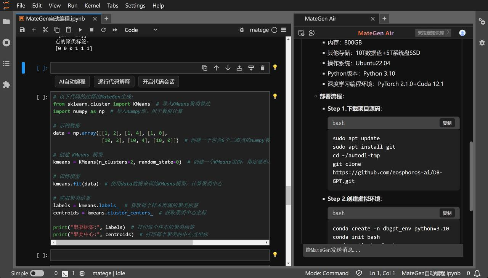

* MateGen API：拥有完整的MateGen各项功能，在Python环境中通过sdk进行调用，是旗舰款Agent API，需要MateGen API-KEY才能使用；


* MateGen pro：拥有完整的MateGen各项功能，且拥有企业级大模型项目前端UI，和MateGen API能力相同，同样也需要MateGen API-KEY才能使用。

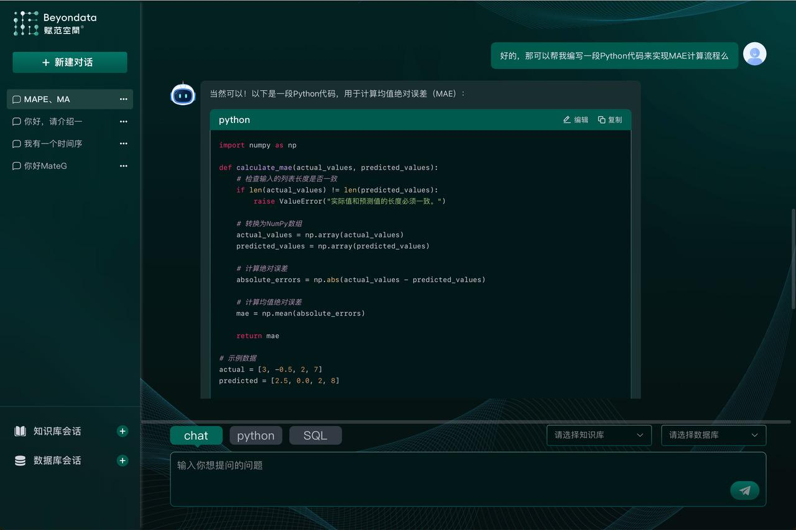

## MateGen Air安装和部署流程

### 1. **MateGen Air安装**

&#x20;       MateGen是一款基于JupyterLab的智能编程插件，只需pip即可安装使用，非常便捷：

```bash
conda create -n mategenair jupyterlab 
conda activate mategenair
pip install mategenair
jupyter lab
```

> 上述代码在命令行中运行，且需要提前安装好anaconda。

安装后即可打开Jupyter，可以借助Luncher登陆：

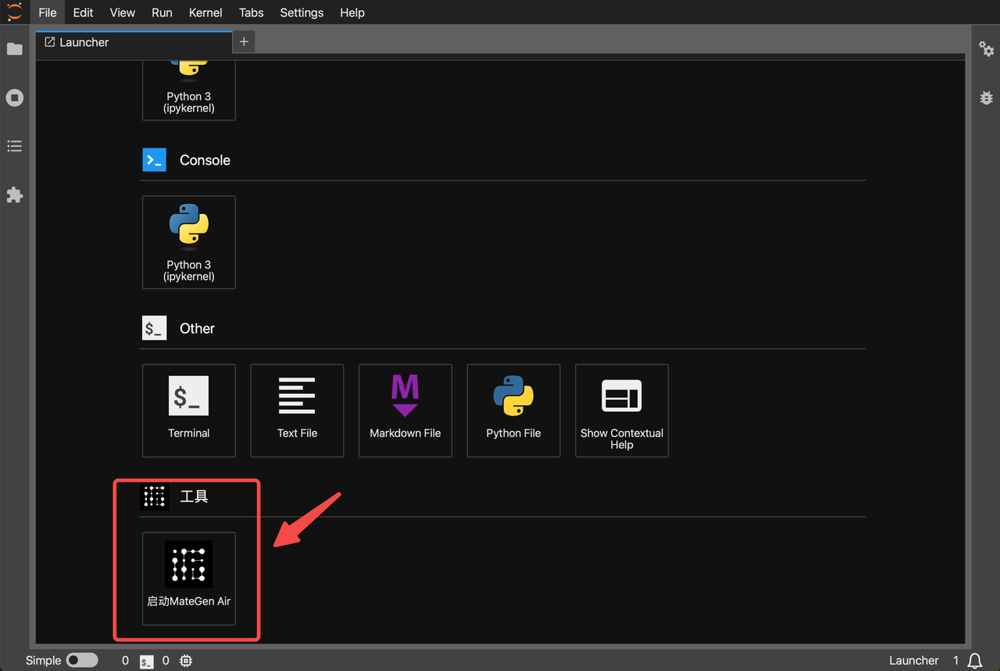

也可以使用命令进行登陆，按住control+shift+c：

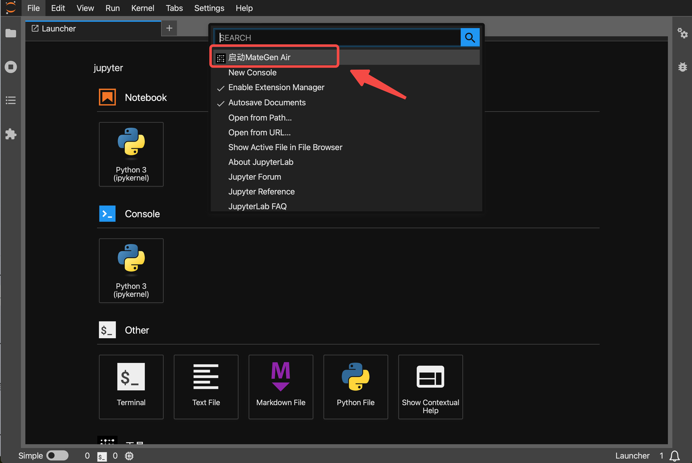

然后在弹出的页面登录即可：

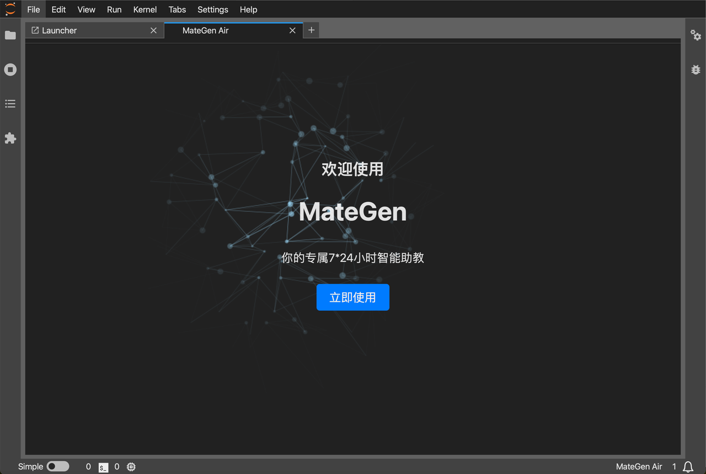

### 2. MateGen Air基础对话功能


其中也可以选择正式课程或公开课进行问答，从而实现智能助教功能。（目前只上线了少量知识库，更多知识库功能还在完善中...）


### 3. MateGen 智能编程功能

在登录MateGen Air的同时，打开Jupyter页面，点击左侧cell的小灯泡，即可开启智能编程相关功能：

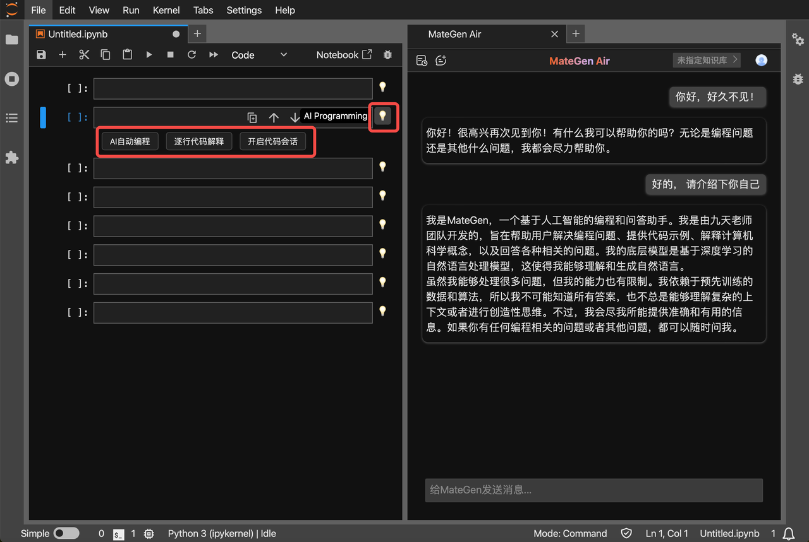

> 由于JupyterLab内核原因，第一行cell或最后一行cell使用该功能可能会导致响应报错，推荐创建多个cell，然后在中间的cell执行该功能。

此外，若遇到代码报错，则会自动弹出代码修复按钮，点击即可将代码和报错信息同步到右侧聊天框，并快速进行debug：


***

## MateGen Pro部署和使用流程


* **Step 1. 安装Docker Desktop**

Docker Desktop 支持最新的 Windows 10/11 和 MacOS 版本，访问 [Docker Desktop 官方下载页面](https://www.docker.com/products/docker-desktop/) , 根据操作系统下载相应版本的安装程序，双击下载的安装文件，并按提示操作完成安装。


* **Step 2. 启动并验证 Docker Desktop**

安装完成后，打开 Docker Desktop 应用程序，应用会提示登录，但登录不是必须的，可以选择跳过此步骤直接使用。


检查 Docker Desktop 主界面左下角，确认 Docker Engine 显示为“Running”状态。这表明 Docker Engine 已经成功启动并正在运行。如果 Docker Engine 状态不是“Running”，可手动开启或需要重新启动 Docker Desktop 。

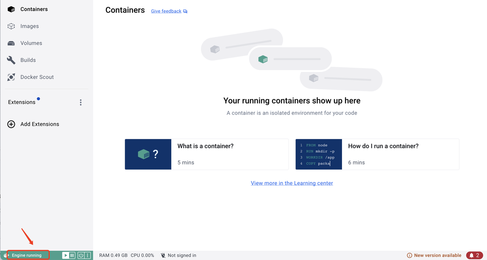


* **Step 3. 运行 MateGen Pro 项目**

如果是Windows系统，在这里打开命令行终端：

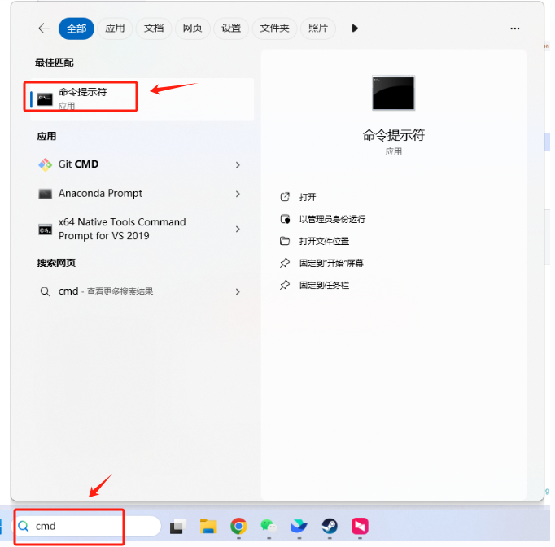

如果是Mac，在这里打开命令行终端：


首先下载 MateGen Pro 最新的项目镜像，执行命令如下：

注意：对于国内网络，Dokcer和Github类似，经常会访问不通导致拉取失败，如多次尝试仍然无法拉取镜像，请开启魔法上网环境

```bash
docker pull snowball1996/mategen:latest 
```

这一步将从 Docker Hub 中指定的镜像仓库下载最新的 MateGen Pro 镜像。


下载MateGen项目文件：

```bash
git clone https://github.com/fufankeji/MateGen.git
```


启动MateGen Pro项目，首次启动会拉取依赖的镜像文件

```bash
cd MateGen && docker compose up
```

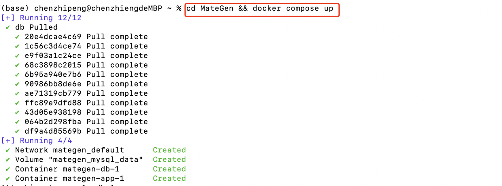

启动日志中看到如下信息，则说明服务启动成功。


此时，可在本机的浏览器上 通过 http://0.0.0.0:9000/ 进行访问

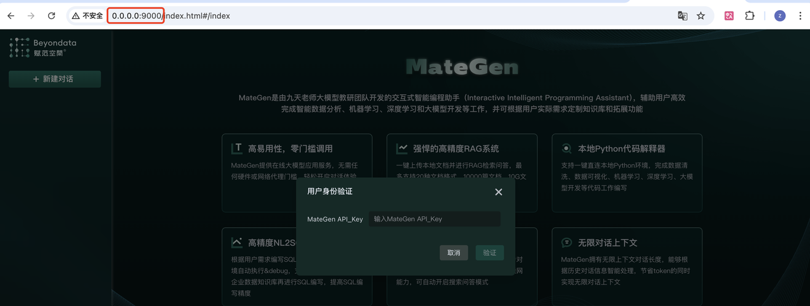

对话测试：

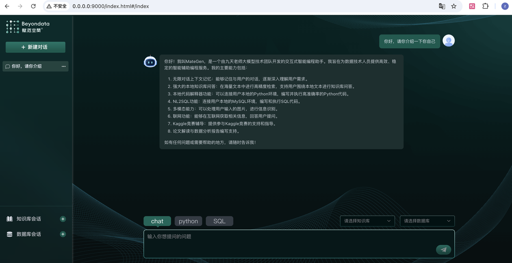


### 1. 关闭服务方法

进入命令行终端：


进入下载的MateGen项目文件目录下，执行代码：

```bash
cd MateGen  # 这里替换为自己实际目录位置

docker compose down
```

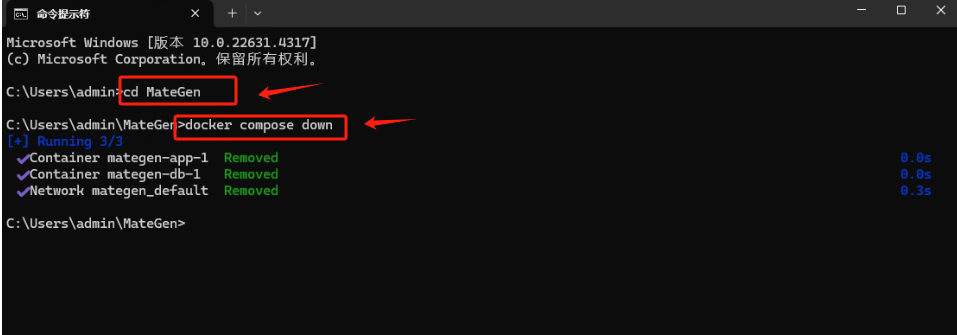

### 2. 开启服务方法

进入下载的MateGen项目文件目录下，执行代码：

```bash
cd MateGen  # 这里替换为自己实际目录位置

docker compose up
```

启动成功后，通过 localhost:9000 端口执行访问。

### 3. 特殊异常解决方案

如果成功部署启动后，首次对话出现生成失败情况，即如下：


请依次按照如下操作步骤：

1. 关闭 MateGen Pro 服务，在终端执行：

```plain&#x20;text
docker compose down
```


* 删除Mategen Pro 和 Mysql 的旧镜像，删除方法如下：

```plain&#x20;text
Docker images - a

docker rmi xxx  xxx   # 这里填写对应的镜像ID
```

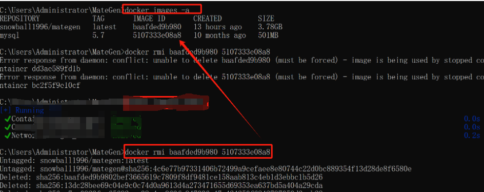

* 重新拉取最新版本的MateGen Pro 镜像

```bash
docker pull snowball1996/mategen:latest 
```


* 拉取镜像后，启动，通过 localhost:9000 端口执行访问（建议清空一下浏览器的缓存）


如果经过上述操作依然存在该问题，在服务启动的状态下在浏览器访问该地址进行数据库重置操作：

```bash
localhost:9000/api/delete_database
```


然后回到控制台，重新启动MateGen Pro 服务

```bash
# 先关闭
docker compose down

# 再启动
docker compose up
```

通过 localhost:9000 端口执行访问，注意：此时需要清空一下浏览器的缓存，将弹出重新输入 API\_Key的验证框。


***

## MateGen API-KEY获取

&#x20;       MateGen Air无需API-KEY即可使用，但是功能更加完整且性能强劲的MateGen API、MateGen Pro需要API才可使用。**API-KEY领取、加入技术交流群、其他任何问题，扫码添加产品助手花花，回复“MG”详询哦👇**


**欢迎课程学员和新老用户多多支持本项目，项目star超过10k即上线开源版及教学教程！**

## MateGen API使用效果演示

注：各项演示操作可参考《MateGen使用教程》中相关代码来实现。

[ MateGen使用教程.pdf](https://kq4b3vgg5b.feishu.cn/file/SRmnbGWKbo1Db2xSVoycmDfdnGf?from=from_copylink)

[ MateGen使用教程【代码文件】.ipynb](https://kq4b3vgg5b.feishu.cn/file/GyLCbtieHohV7Dxoa4OcqOaLnLc?from=from_copylink)

* **零门槛便捷调用**

&#x20;       只需三步即可在Jupyter中调用MateGen：**安装、导入、对话**！

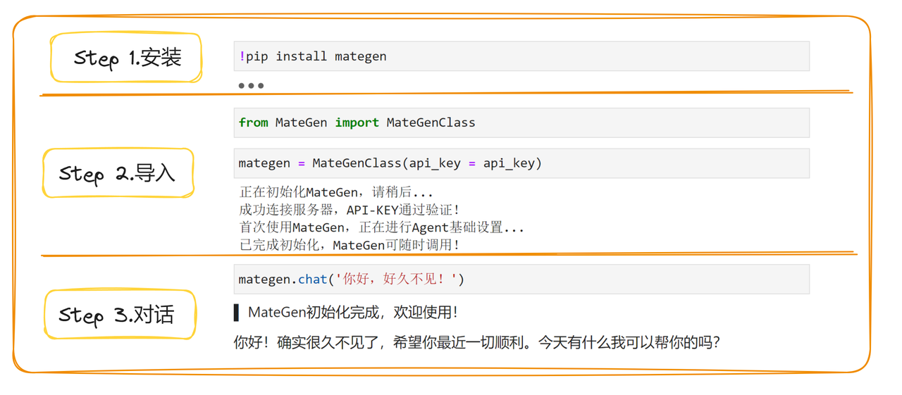

* **本地海量文本知识库问答**

* &#x20;       借助MateGen，可实现高精度本地知识库问答，MateGen在RAG系统最多**支持1000个文本+10G规模**文本检索！

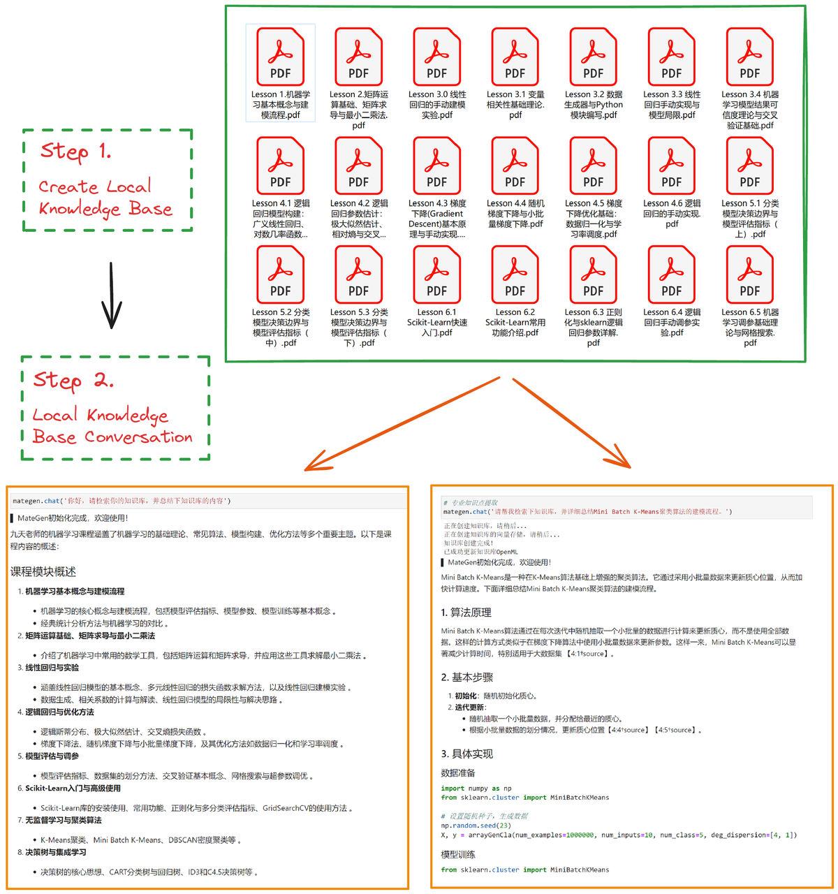

* **交互式可视化绘图**

* &#x20;       MateGen同时具备视觉能力和本地代码解释器功能，因此可以**根据用户输入的图片，模仿绘制**！

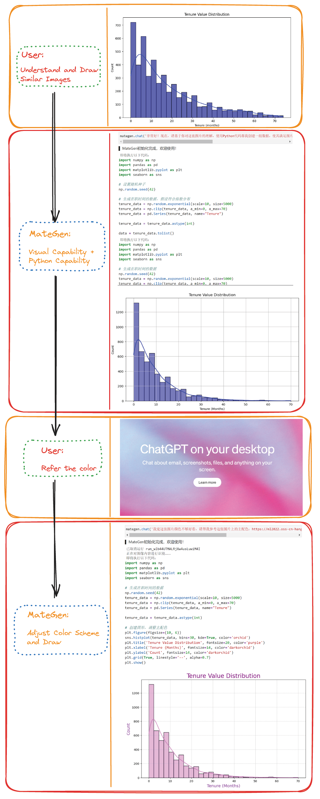

* **高精度NL2SQL**

* &#x20;       MateGen支持**全自动RAG+NL2SQL联合执行**，因此可以**先从知识库中了解数据集字段信息和业务信息然后再编写SQL，并且支持自动审查与自动debug**，从而大幅提高SQL准确率。

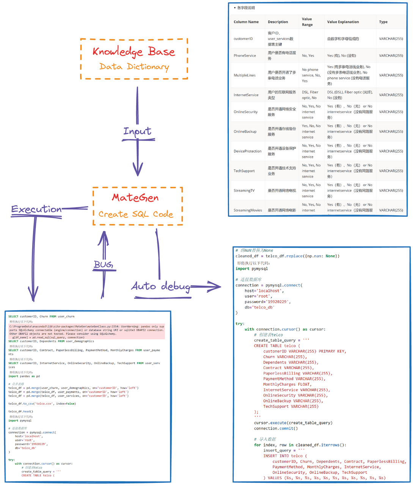

* **自动机器学习**

* &#x20;       MateGen支持**全自动RAG+代码解释器**联合执行，支持先阅读企业机器学习代码库再进行机器学习建模，通过**自然语言一键调用不同机器学习建模策略**，创建你的机器学习“贾维斯”。


* **前沿深度学习论文解读与架构复现**

* &#x20;       基于自身强大的RAG系统以及Multi-Function功能，MateGen能够进行深度**论文辅导**，可以**帮助用户逐段翻译和解读论文—>总结论文核心知识点—>一键编写百行代码代码复现论文架构并在本地代码环境直接运行验证**！

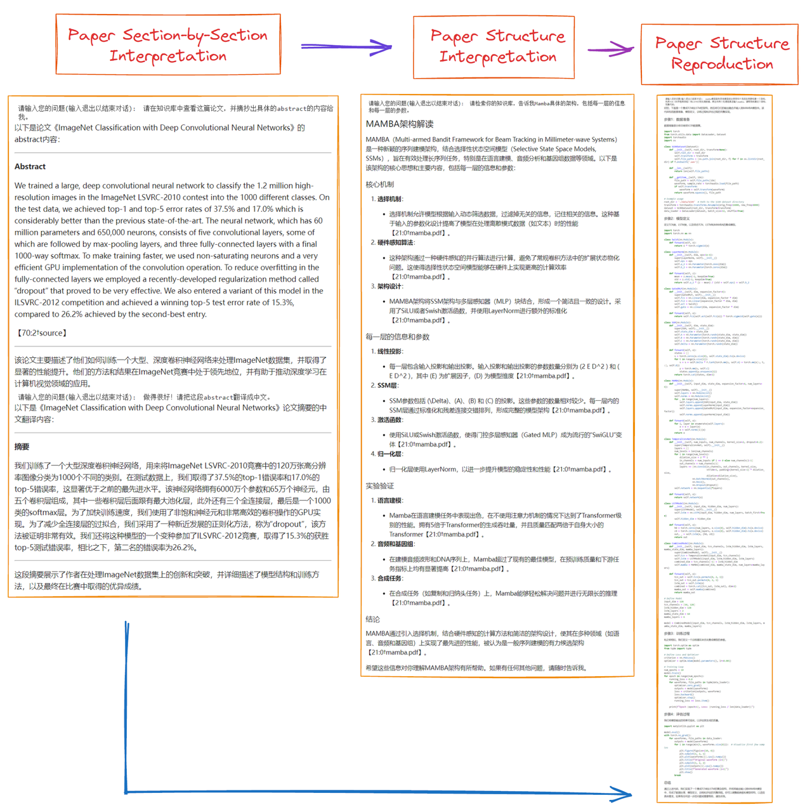

* **Kaggle竞赛辅导**

* &#x20;       借助MateGen的联网能力+知识库问答能力+NL2Python能力，MateGen还可**辅助用户参与Kaggle竞赛**。MateGen可以根据用户提供的赛题，**自动获取赛题解释与数据集解释信息，自动爬取赛题高分Kernel并组建竞赛知识库，然后辅助用户进行竞赛编程，并自动提交比赛结果至Kaggle平台，最终根据提交结果提示用户调整竞赛策略，从而冲击更高分数！**

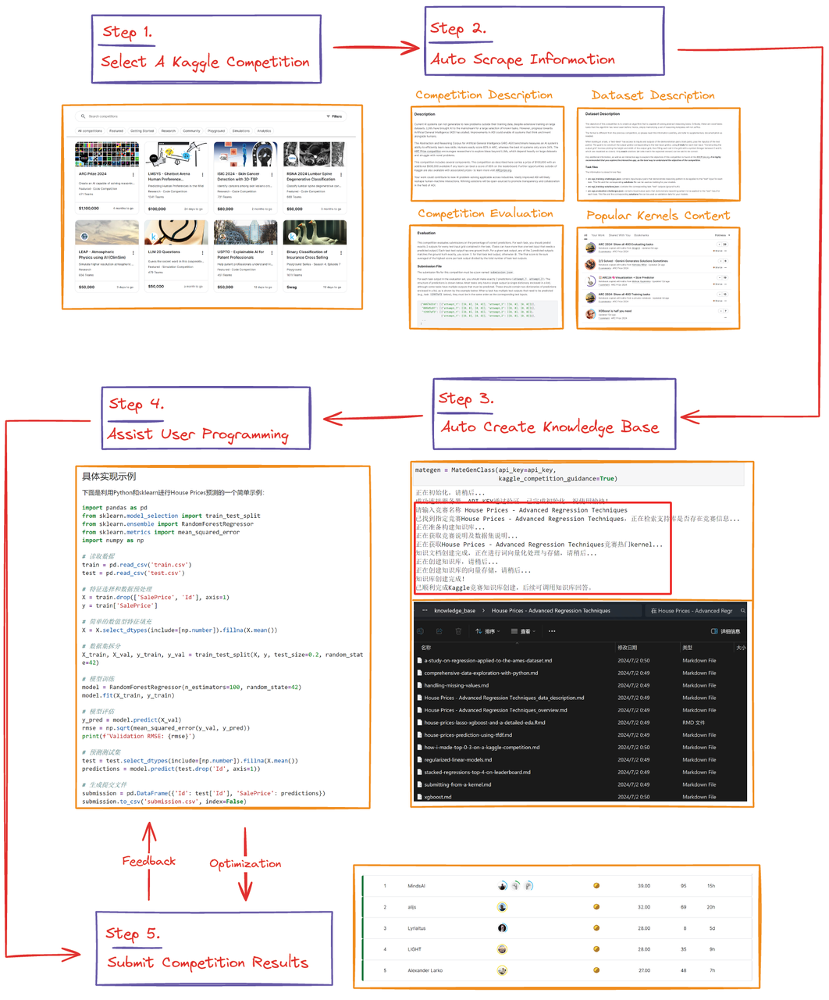

* **智能助教**

&#x20;基于MateGen强悍的海量文本检索问答能力以及代码能力，一个储备了课程课件知识库的MateGen完全可以作为一名智能助教，学习前可以辅助用户进行课前预习、指定学习计划，学习中可以7\*24小时实时答疑、随时辅助用户完成编程或其他代码任务，课后还可以根据用户课中提问来编写习题、分析用户薄弱知识点并将其总结为课后复习文档！


MateGen更多应用场景即将上线。

## MateGen安装部署流程

&#x20;       MateGen项目轻便、调用简单，可使用pip直接进行安装，同时调用风格类似于sklearn，实例化一个MateGen智能体即可直接开启对话！

* **MateGen下载方法**

&#x20;       MateGen现已在PyPI平台上线，可以直接通过`pip install mategen`进行安装，需要注意的是，MateGen运行所需依赖较多，因此推荐借助虚拟环境进行安装。首先创建一个名为`mategen`的虚拟环境：       &#x20;

conda create -n mategen python=3.8

然后使用如下指令激活虚拟环境：

conda activate mategen

接着在虚拟环境中安装MateGen：

pip install mategen

安装完成之后，考虑到需要在Jupyter中调用MateGen，我们还需要在虚拟环境中安装IPython Kernel：

pip install ipykernel

并且将这个虚拟环境添加到Jupyter的Kernel列表中：

python -m ipykernel install --user --name mategen --display-name "mategen"

然后开启Jupyter服务：    &#x20;

jupyter lab

然后在Jupyter的Kernel中选择mategen，即可进入到对应虚拟环境运行MateGen：

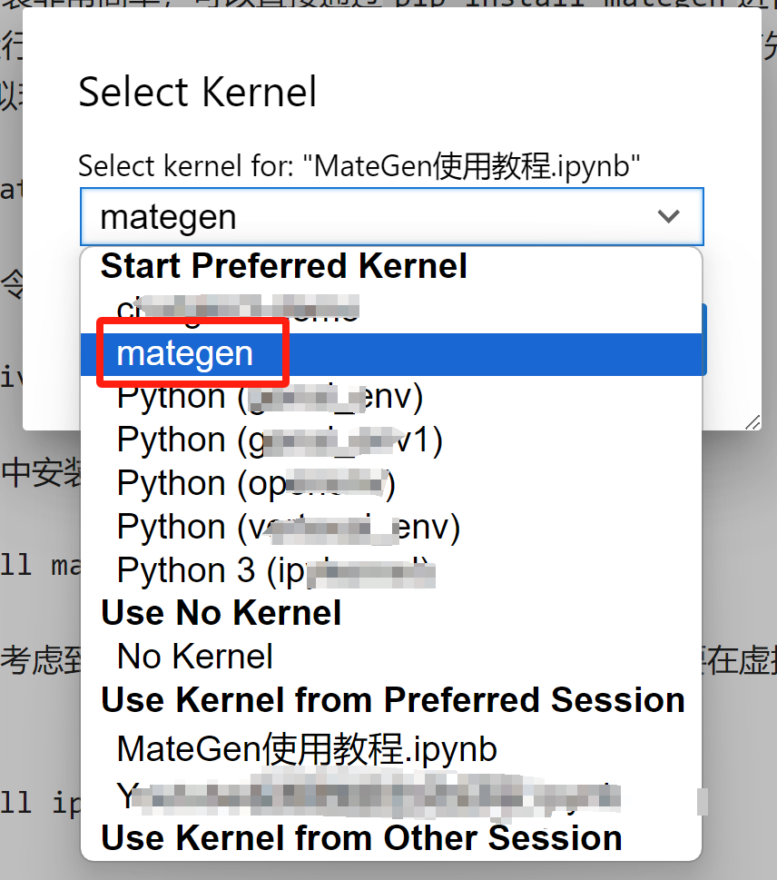

* **MateGen调用方法**

* &#x20;       MateGen调用过程非常简单，只需要在代码环境中导入并输入有效的API-KEY即可开启对话！

* mategen = MateGenClass(api\_key = 'YOUR\_API\_KEY')

* 然后即可使用chat功能进行单次对话或多轮对话：

* mategen.chat("你好，很高兴见到你！")

* ▌ MateGen初始化完成，欢迎使用！

  你好！很高兴见到你！有什么我可以帮助你的吗？

* 更多MateGen使用方法，详见《MateGen使用教程》。

* &#x20;       免费API获取👉MateGen目前正处于测试阶段，限量**免费开放3亿免费token额度，送完即止，API-KEY领取、加入技术交流群、其他任何问题，扫码添加客服小可爱(微信：littlelion\_1215)，回复“MG”详询哦👇**


## MateGen架构与应用说明

* MateGen基本架构

* &#x20;       MateGen采用了目前最先进的threads-runs架构，以更好的进行用户历史消息对话管理以及自动修复运行中遇到的各种问题，同时采用了client与server分离架构，以确保最大程度Agent运行稳定性，同时支持多种不同类型底层大模型，MateGen基本结构如下：

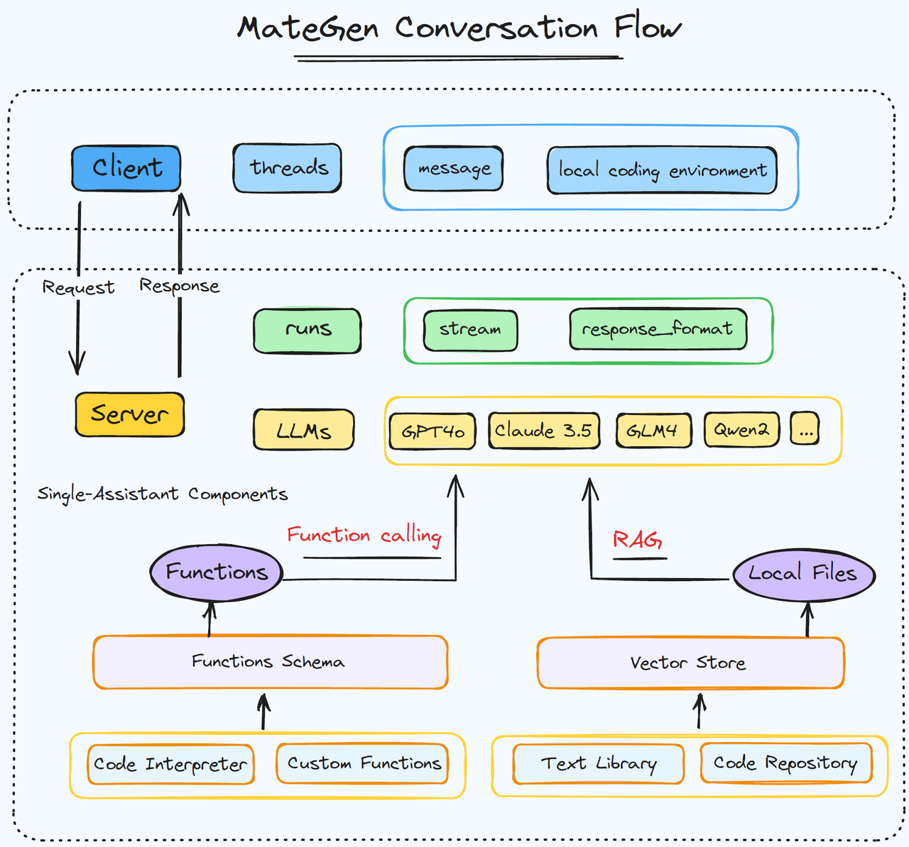

* MateGen用于智能助教

* &#x20;       MateGen同时可适用于多种不同类型具体业务场景，例如MateGen现已用于九天老师团队各门课程辅助教学环节，用于智能助教。MateGen充当智能助教的基本功能执行流程如下：


