目录：

* Llama.cpp基本信息介绍

* 安装部署办法

* GGUF量化格式模型调用方法

* API调用方法

* 以Qwen2VL为例进行模型量化并推理

***


## Llama.cpp基本信息介绍

* llama.cpp 使用的是 C 语言写的机器学习张量库 ggml -
  llama.cpp 提供了模型量化的工具

该项目的最大亮点在于 无需 GPU 也能运行 LLaMA 模型。与传统框架不同，llama.cpp 构建了一个独立的生态系统，秉持轻量化设计理念，追求最小的外部依赖、多平台兼容性和广泛的硬件适配。其核心特点包括：

1. 轻量化实现
   纯 C/C++ 实现：无任何外部依赖，运行高效且易于移植。

2. 硬件适配性强

支持各种主流硬件平台，实现真正的跨平台兼容：

* x86\_64 CPU：支持 AVX、AVX2 和 AVX512 指令集。

* Apple Silicon：通过 Metal 和 Accelerate 框架，支持 Apple 的 CPU 和 GPU。

* GPU 支持：
  NVIDIA GPU（通过 CUDA）
  AMD GPU（通过 hipBLAS）
  Intel GPU（通过 SYCL）
  昇腾 NPU（通过 CANN）
  摩尔线程 GPU（通过 MUSA）
  Vulkan 后端：提供跨平台 GPU 支持。

3. 优化推理性能

* 多种量化方案：降低内存占用，显著提升推理速度。

* CPU+GPU 混合推理：灵活利用 CPU 和 GPU 资源，即便模型大小超出显存容量，也能高效运行。

llama.cpp 的设计理念打破了对高端硬件的依赖，为轻量化、灵活性和跨平台兼容性设立了标杆，为在各种环境下运行大模型提供了全新可能。llama.cpp 可以将模型参数从 32 位浮点数转换为 16 位浮点数，甚至是 8、4 位整数。除此之外，llama.cpp 还提供了服务化组件，可以直接对外提供模型的 API 。

***

## Llama.cpp安装部署办法

* **Step 1. 创建conda虚拟环境**

  Conda创建虚拟环境的意义在于提供了一个隔离的、独立的环境，用于Python项目和其依赖包的管理。每个虚拟环境都有自己的Python运行时和一组库。这意味着我们可以在不同的环境中安装不同版本的库而互不影响。根据官方文档信息建议Python版本3.10以上。创建虚拟环境的办法可以通过使用以下命令创建：

```bash
# cpp 是你想要给环境的名称，python=3.11 指定了要安装的Python版本。你可以根据需要选择不同的名称和/或Python版本。

conda create -n cpp python=3.11
```


  创建虚拟环境后，需要激活它。使用以下命令来激活刚刚创建的环境。如果成功激活，可以看到在命令行的最前方的括号中，就标识了当前的虚拟环境。虚拟环境创建完成后接下来安装torch。

```plaintext
conda activate cpp
```


  如果忘记或者想要管理自己建立的虚拟环境，可以通过conda env list命令来查看所有已创建的环境名称。


  如果需要卸载指定的虚拟环境则通过以下指令实现：

```plaintext
conda env remove --name envname
```


* 需要注意的是无法卸载当前激活的环境，建议卸载时先切换到base环境中再执行操作。

* **Step 2. 查看当前驱动最高支持的CUDA版本**

  我们需要根据CUDA版本选择Pytorch框架，先看下当前的CUDA版本：

```plaintext
nvidia -smi
```


* **Step 3. 在虚拟环境中安装Pytorch**

  进入Pytorch官网：https://pytorch.org/get-started/previous-versions/


  当前的电脑CUDA的最高版本要求是12.2，所以需要找到不大于12.2版本的Pytorch。


  直接复制对应的命令，进入终端执行即可。这实际上安装的是为 CUDA 12.1 优化的 PyTorch 版本。这个 PyTorch 版本预编译并打包了与 CUDA 12.1 版本相对应的二进制文件和库。


通过 pip show 的方式可以检验是否正确安装。


* **Step 4. 安装必要的依赖**

Transfomers是大模型推理时所需要使用的框架，通过以下指令可以下载最新版本的Transfomers：

pip install transformers -U


pip install accelerate>=0.26.0


pip install CMake


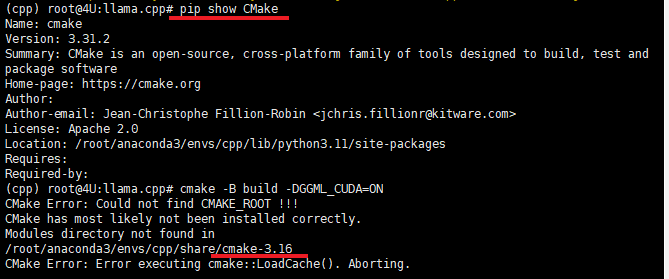

* **Step 5. 下载LlAMA.CPP**

创建并进入新的文件夹

```plaintext
mkdir llamacpp
cd llamacpp
```

在该文件夹中执行命令实现llama.cpp的下载

```plaintext
git clone https://github.com/ggerganov/llama.cpp.git
```


如果服务器网络不畅也可以使用手动方式在其他电脑下载，然后再传输到服务器中解压缩。GitHub上托管的网址如下： https://github.com/ggerganov/llama.cpp

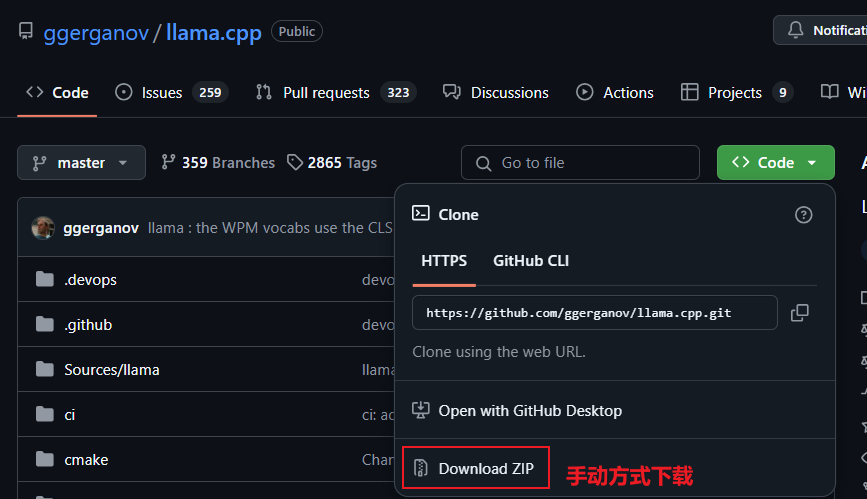

完成上述的下载操作后，需要解压缩，再进入到llama.cpp文件夹中。初始文件如下：


* 开启GPU加速

```plaintext
cmake -B build -DGGML_CUDA=ON  # 启用 GPU 加速
cmake --build build -- -j      # 编译
```


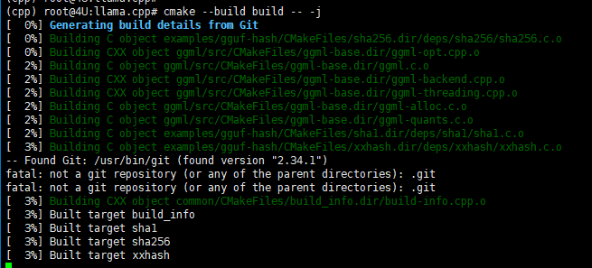

***

```plaintext
【赋范大模型技术社区】成立啦～海量硬核独家技术干货内容+无门槛技术交流，下图扫码加【助教老师】
即可入群，社区包含：
✅入门必备Python基础、账号注册与硬件配置方法；
✅20+主流开源&在线大模型部署与调用方法；
✅独家团队自研高品质技术教程&追更最新技术内容；
✅社区交流：活跃技术氛围，技术交流&答疑；
✅新知速递：大模型重大技术突破&最新技术信息通报；
✅干货分享：每月2-3场硬核干货&前沿技术公开课。
感兴趣的小伙伴抓紧时间扫码入群吧～
```


***

## 以Qwen2.5：14B为例实现量化推理

#### 量化模型部署

首先我们通过在魔搭社区进行Qwen2.5：14B的int4量化模型下载。

Llama.cpp支持推理GGUF格式量化的模型，如下图所示选择一个通义千问2.5-14B-Instruct-GGUF的量化模型进行下载。

https://www.modelscope.cn/models/Qwen/Qwen2.5-14B-Instruct-GGUF/files


如下图所示，该模型卡下挂载了多种不同量化参数的模型。其中，fp16表示半精度浮点模型，q2表示采用二阶整型量化的模型，而q3则是三阶整型量化的模型等等。只需下载对应某一种量化精度下的全部权重文件即可，本实例中选择下载q3精度的模型。

通过指令 `modelscope download --model Qwen/Qwen2.5-14B-Instruct-GGUF qwen2.5-14b-instruct-q3_k_m-00001-of-00002.gguf --local_dir ./dir` 进行下载，其中qwen2.5-14b-instruct-q3\_k\_m-00001-of-00002.gguf为具体的模型文件名称，./dir为下载到的文件夹路径。

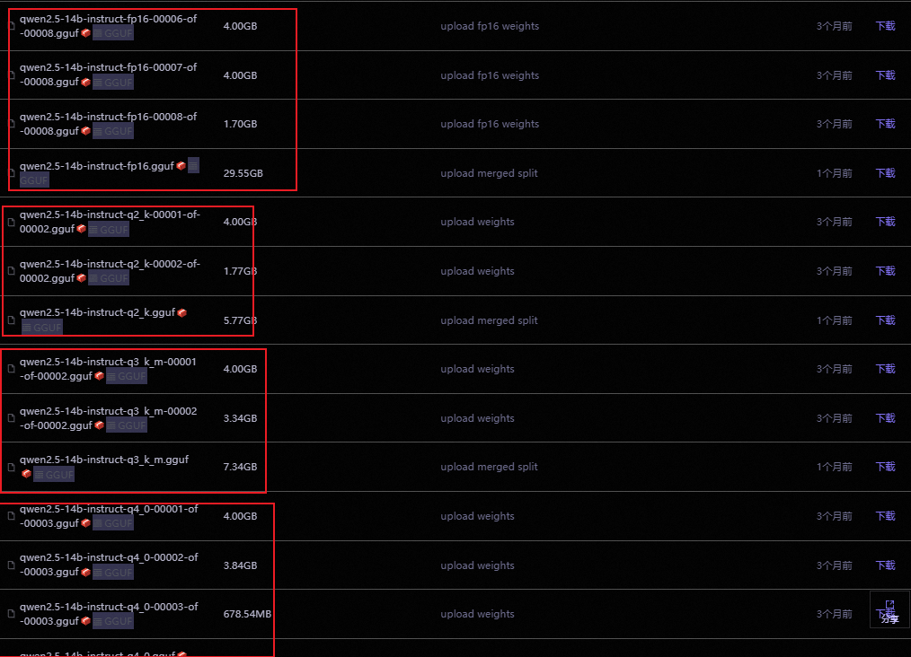

使用Llama.cpp开始调用之前，需要确保模型调用路径正确。可以选择将模型部署到 llama.cpp 的 models 文件夹中。

完成编译后通过以下指令实现量化模型的推理，以Qwen2.5 14B模型为例，与之进行单次推理交互：

```plaintext
cd /build/bin
./llama-cli -m /home/LLM/qwen2-5-14-gguf/qwen2.5-14b-instruct-q3_k_m.gguf -p "I believe the meaning of life is" -n 512
```

其中，`./llama-cli`为启动推理的项目文件； `-m`后接需要调用的模型地址，建议选择绝对路径；`-p`后接输入的提示词prompt，使用中英文输入均可；`-n`限制返回信息长度。

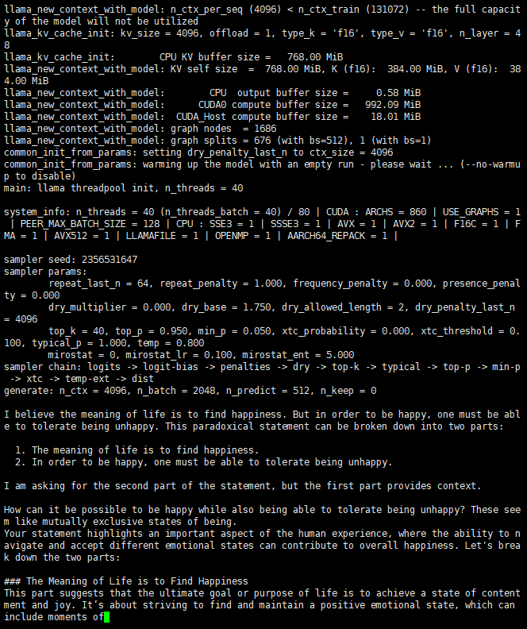

推理返回的结果如上图所示，进行模型加载之后开始流式返回推理结果。


正常推理14B参数大小的模型需要30G左右的显存，但是通过llama.cpp推理int 3 量化模型仅需要不到2G的显存，一般消费级显卡也可以使用。

完整对话内容如下：


中文能力测试：

```plaintext
./llama-cli -m /home/LLM/qwen2-5-14-gguf/qwen2.5-14b-instruct-q3_k_m.gguf -p "如何制作一个三明治" -n 512
```


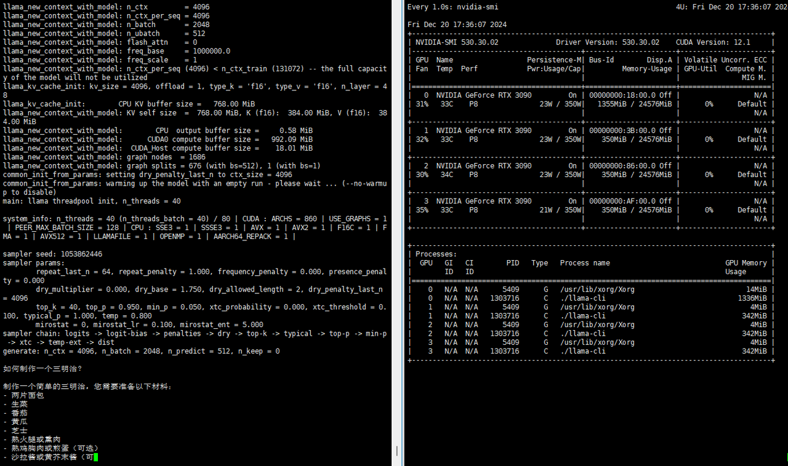

数学推理测试:


推理能力测试--数单词中的字母数量：

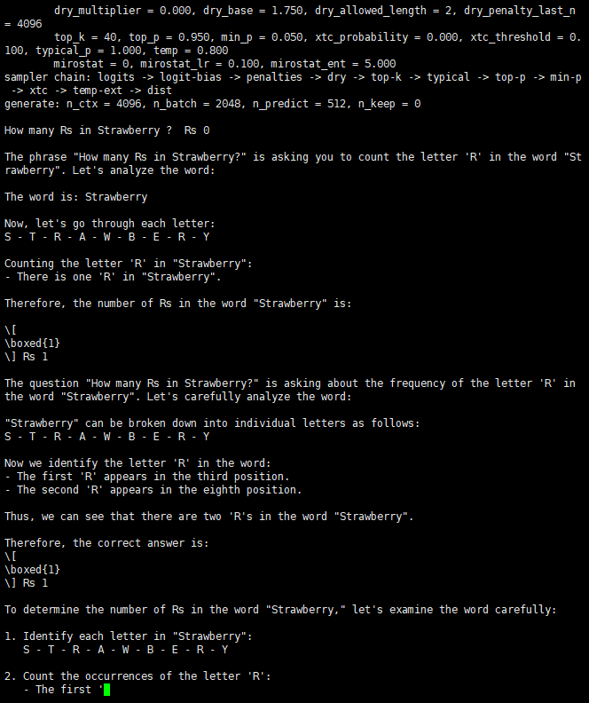

通过以下代码的格式实现持续交互对话：

```plaintext
./llama-cli -m /home/LLM/qwen2-5-14-gguf/qwen2.5-14b-instruct-q3_k_m.gguf -cnv --chat-template gemma
```

***

常用选项介绍：

-m FNAME， --model FNAME：指定 LLaMA 模型文件的路径（例如， models/gemma-1.1-7b-it.Q4\_K\_M.gguf 如果设置，则从 --model-url 推断）。

-mu MODEL\_URL --model-url MODEL\_URL ：指定远程 http url 以下载文件

-i， --interactive：以交互模式运行程序，允许您直接提供输入并接收实时响应。

-n N， --n-predict N：设置生成文本时要预测的标记数。调整此值会影响生成文本的长度。

-c N， --ctx-size N：设置提示上下文的大小。默认值为 4096，但如果 LLaMA 模型是使用较长的上下文构建的，则增加此值将为较长的输入/推理提供更好的结果。

-mli， --multiline-input：允许编写或粘贴多行代码输入，而不以单行对话输入的 '' 结尾。

-t N， --threads N：设置生成过程中要使用的线程数。为了获得最佳性能，建议将此值设置为系统具有的物理 CPU 内核数。

-ngl N， --n-gpu-layers N：当使用 GPU 支持进行编译时，此选项允许将一些层卸载到 GPU 进行计算。通常会导致性能提高。

***

#### **Llama-cli**

llama-cli 程序提供了几种使用输入提示与 LLaMA 模型交互的方法：

\--prompt PROMPT：直接将提示作为命令行选项提供。

\--file FNAME：提供包含一个或多个提示的文件。

\--interactive-first：以交互模式运行程序并立即等待输入。

llama-cli 程序提供了一种与 LLaMA 模型交互的无缝方式，允许用户进行实时对话或为特定任务提供说明。可以使用各种选项触发交互模式，包括 --interactive 和 --interactive-first。

在交互模式下，用户可以在此过程中通过注入其输入来参与文本生成。用户可以随时按 Ctrl+C 插入并键入他们的输入，然后按 Return 将其提交到 LLaMA 模型。要在不完成输入的情况下提交其他行，用户可以用反斜杠 （\） 结束当前行并继续键入。

-i， --interactive：以交互模式运行程序，允许用户参与实时对话或向模型提供具体指令。

\--interactive-first：以交互模式运行程序，并在开始文本生成之前立即等待用户输入。

-cnv， --conversation： 以对话模式运行程序（不打印特殊令牌和后缀/前缀，使用默认聊天模板）（默认：false）

\--color：启用彩色输出，以在视觉上区分提示、用户输入和生成的文本。

## Llama.cpp使用API调用方法

Llama.cpp支持使用API实习本地模型在域内网中进行调用，在相对路径下`/llama.cpp/build/bin`启动脚本`./llama-server`，通过以下代码即可启动API调用服务。

./llama-server -m /home/LLM/qwen2-5-14-gguf/qwen2.5-14b-instruct-q3\_k\_m.gguf -ngl 8

其中`-m`是调用的模型文件路径，这里选择qwen2.5-14b-instruct-q3\_k\_m.gguf量化模型进行推理，`-ngl`含义是指定使用 GPU 的数量。在表示模型推理过程中将利用 8 个 GPU 进行加速。这一参数适用于多 GPU 环境下的并行计算，可显著提升推理效率。
如果在单 GPU 或 CPU 环境中运行，则该参数可以设置为 1 或省略。

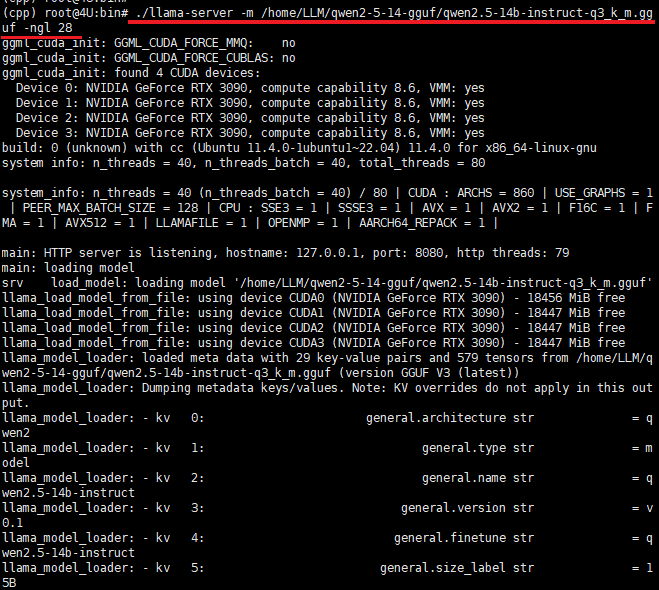

API服务启动之后，可以在局域网中任意主机中输入以下命令实现模型对话推理:

其含义是使用 curl 工具向本地运行的推理服务发送一个 POST 请求，目的是生成自然语言模型的输出结果。`curl`是一个命令行工具，用于向 HTTP 服务器发送请求。
`--url`指定目标服务器的 URL。
`--header`用于设置 HTTP 请求头部信息。请求体的数据格式是 JSON（JavaScript Object Notation），用于传递结构化数据。

`--data`指定 POST 请求的请求体数据。`prompt`：模型的输入提示语，这里是 "What color is the sun?"。模型将基于此生成后续内容。
`n_predict`：模型生成的最大 token 数，设置为 512，表示最多生成 512 个 token（包括单词、标点符号等）。

```plaintext
curl --request POST \
    --url http://localhost:8080/completion \
    --header "Content-Type: application/json" \
    --data '{"prompt": "What color is the sun?","n_predict": 512}'
```

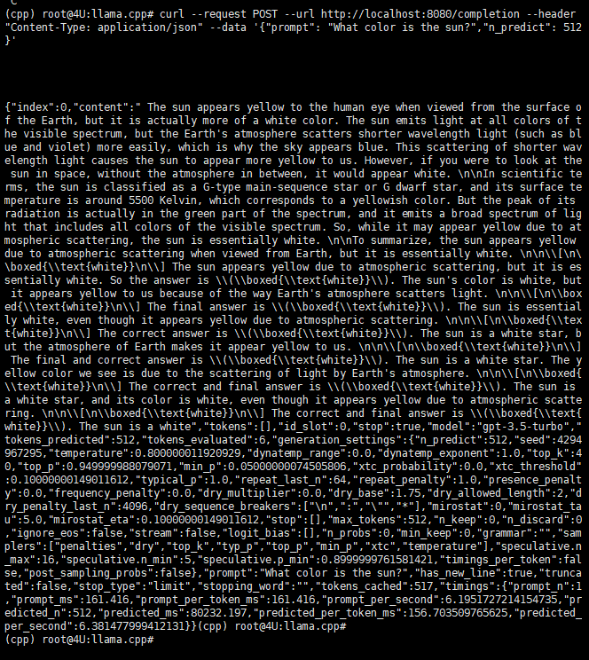

中文对话推理：牛肉汉堡的制作方法。


基本数字推理：9.11和9.8哪个更大。

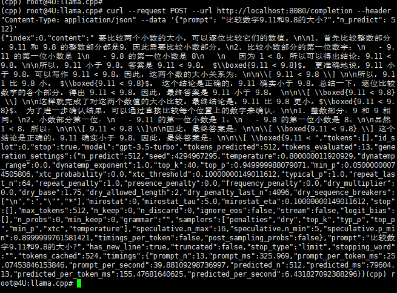

编程能力测试：用python编写一段冒泡排序算法。

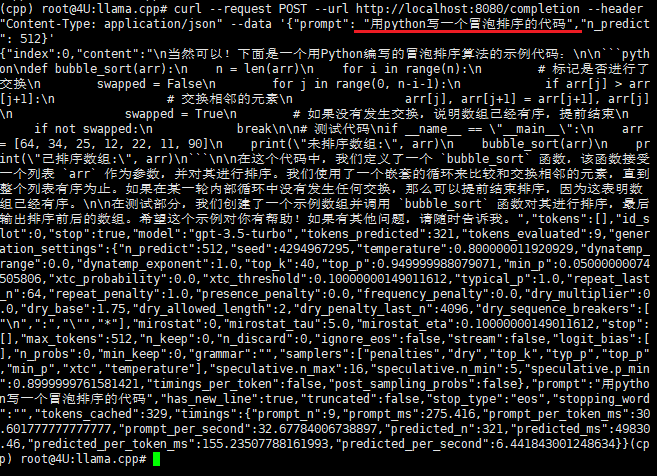

后台服务器会显示运行情况以及每秒推理token速度，其显存消耗大小是和正常本地进行推理所需要的GPU空间相同。

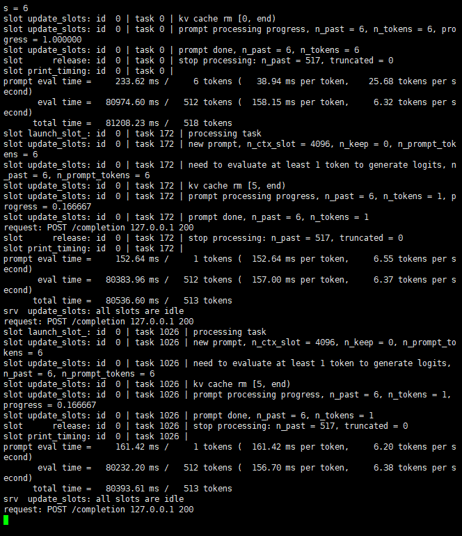


需要注意的是，使用这种方式是每次单轮的对话任务，所有模型是不会保存prompt记忆的。

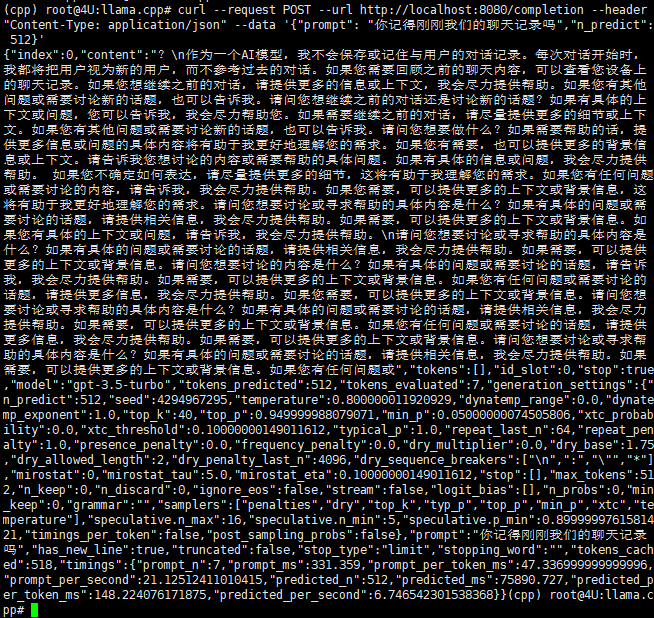

***

## 以Qwen2VL为例实现GGUF量化模型调用方法

通过对模型进行 GGUF 量化，可以显著降低推理过程中对显存的消耗。以下以 Qwen-2VL 这一视觉多模态大模型为例，展示模型量化的具体过程与效果。

进行本地模型量化的前提需要先在本地下载好正常参数的模型，可以通过modelscope活hugging face社区中挂载的模型进行Qwen2VL的部署安装。

* 下载参考代码如下：

modelscope download --model Qwen/Qwen2-VL-7B-Instruct --local\_dir ./dir

如下图所示，进去llama.cpp文件夹后使用内置的转化文件进行模型量化。

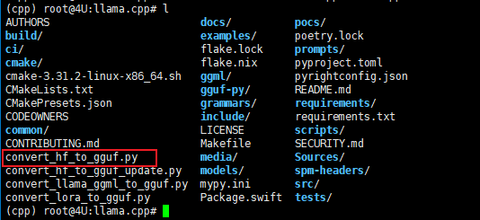

使用llama.cpp文件夹中的`convert_hf_to_gguf.py`脚本进行量化转换。

转化代码如下：

python3 convert\_hf\_to\_gguf.py /home/LLM/qwen2vl-2b/ --outfile /home/LLM/qwen2vl-gguf/qwen2vl2b.gguf

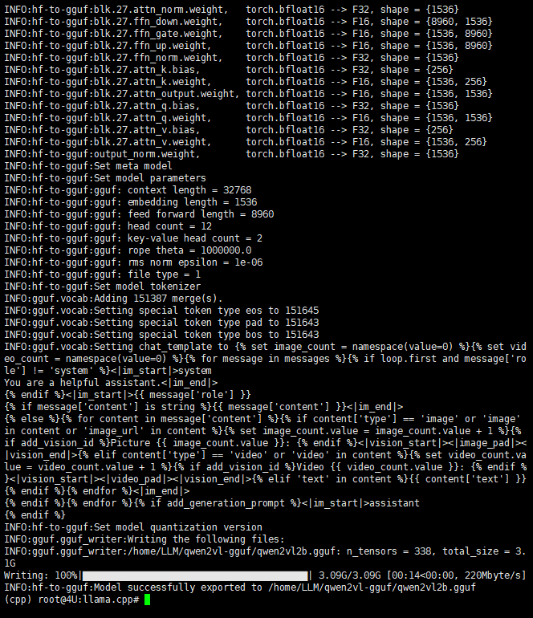

返回如下内容说明已经成功转化，路径可以在`home/LLM/qwen2vl-gguf/qwen2vl2b.gguf`中进行查找，这是有`outfile`参数决定的输出路径。

INF0:hf-to-gguf:Model successfully exported to /home/LLM/qwen2vl-gguf/qwen2vl2b.gguf


接下来需要使用 qwen2\_vl\_surgery.py 将视觉编码器转换为 GGUF 格式：

```plaintext
PYTHONPATH=$PYTHONPATH:$(pwd)/gguf-py python3 examples/llava/qwen2_vl_surgery.py "/path/to/Qwen2-VL-2B-Instruct/model-dir"
```

在llama.cpp文件路径下包含该脚本文件qwen2\_vl\_surgery.py进行视觉编码器转化，最后一个参数是转化所需权重模型文件路径。

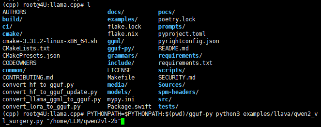

开始视觉编码器转化后会先加载qwen2vl模型checkpoints，根据转换脚本的超参数实现量化。

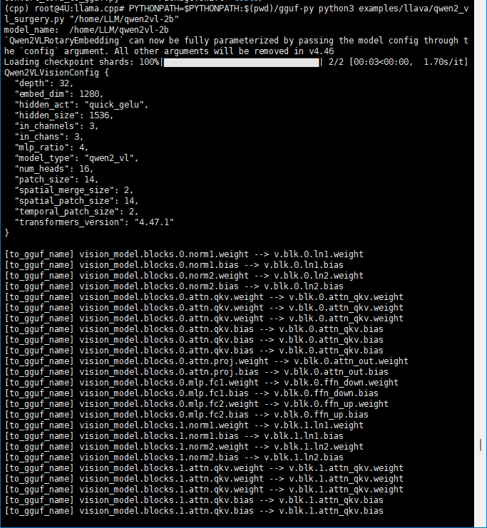

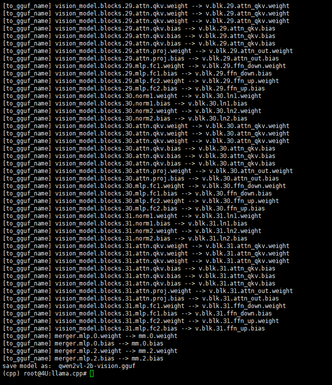

默认转化完成的模型输出路径在llama.cpp路径下，如下图显示，转化后的视觉编码器大小为2.48G，格式同样为GGUF文件。

* 启动本地量化qwen2vl模型实现多模态推理

要实现 Qwen2VL 的量化模型推理，需要通过对应的脚本进行操作，使用命令 `./llama-qwen2vl-cli`。该脚本的相对路径为：`/llama.cpp/build/bin`。

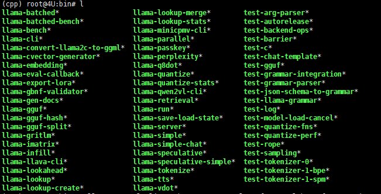

通过在命令行执行以下代码可以实现本地量化qwen2vl模型实现多模态推理，该操作在脚本所在文件夹下进行执行，其中`./llama-qwen2vl-cli`为启动量化模型的脚本， `-m`后接第一步进行量化得到的权重模型，`--mmproj`后接视觉编码模型的文件地址，`-p`后接需要输入的prompt文字信息，`--image`后输入图片信息的文件地址。

./llama-qwen2vl-cli -m /home/LLM/qwen2vl-gguf/qwen2vl2b.gguf --mmproj qwen2vl-vision.gguf -p "Describe this image in Chinese." --image "/home/LLM/llama3\_2\_v/PiKaQ.jpg"

* 世界知识认知测试


* OCR光学字符识别


本流程使用的是qwen2vl：2b量化后的模型，由以上的测试结果来看，虽然是小参数模型的量化版本，其视觉功能基本没有受到影响，运行起来消耗显存大约为1G，是轻量化部署模型（如端侧部署）的极佳选项。

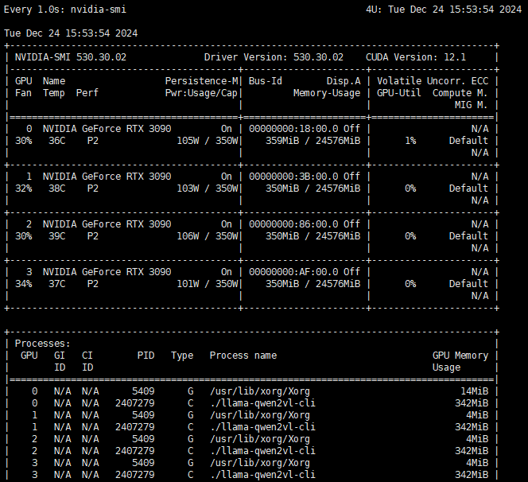

***

📍**更多大模型技术内容学习**

**扫码添加助理英英，回复“大模型”，了解更多大模型技术详情哦👇**


此外，**扫码回复“入群”**，即可加入**大模型技术社群：海量硬核独家技术`干货内容`+无门槛`技术交流`！**

***
