# 本地部署与线上API调用全流程

目录：

1.Windows环境启动Cursor调用本地QWQ

 1.1 Ollama的下载&安装

 1.2 Ollama下载模型路径修改

 1.3 使用Ollama实现推理大模型QWO安装.

 1.4 下载Cursor

 1.5 Cursor接入Ollama启动本地大模型QWQ

2.Windows环境启动Cursor调用线上QWQ

 2.1 注册SiliconFlow

 2.2 配置模型

 2.3 推理使用

完整的部署流程指南可通过扫描二维码添加小助手免费领取，更多进阶学习内容也欢迎随时向小助手咨询！


# 1. Windows环境启动Cursor调用本地QWQ

#### 1.1 Ollama的下载&安装

Ollama支持在Windows环境下进行部署下载，使用此方法下载意味着你可以无需调整任何硬件设备直接在你的电脑上实现QWQ模型的安装部署和推理使用。

首先要下载Windows版的Ollama文件，进入官网选择下图的内容进行下载：

https://ollama.com/download


当然，你也可以直接在浏览器中搜索关键词`ollama`,按照图中的实例点击进入官网亦可。

进入官网后点击正下方的Download按钮，进入下载页面。

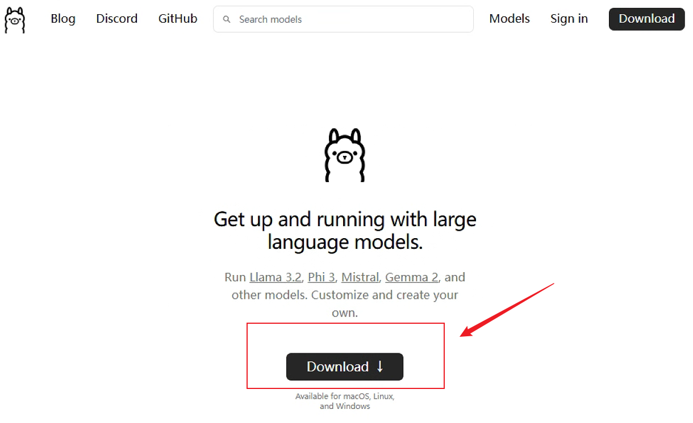

确保是在Windows环境的下载方式，即可点击Download for Windows开始下载。


开始下载后便会在右上角下载/安装栏出现下图图标，安装完成后可以在下载栏或下载文件夹（你的默认下载路径）找到该文件。


下载完成后在对应文件夹双击打开安装包完成安装流程。


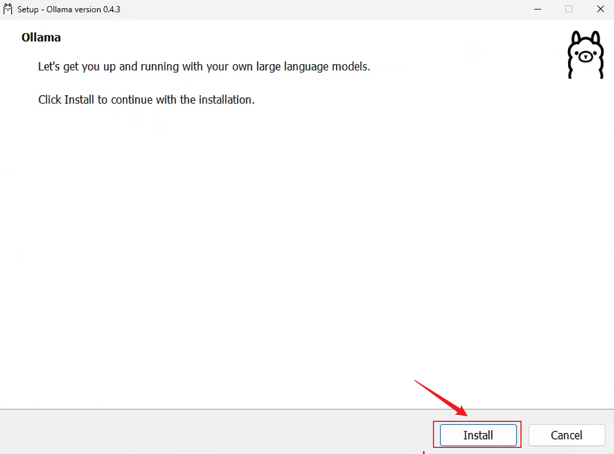


安装完成后会有如下提示：

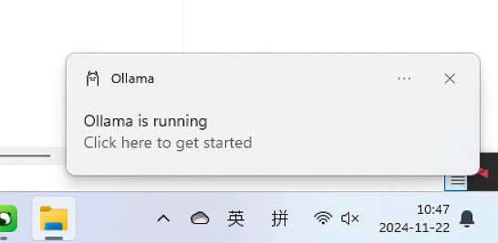

#### 1.2 Ollama下载模型路径修改

框架和模型默认路径都是C盘，为了主机内存管理方便，可以通过以下步骤来实现模型下载地址的切换。

1.在桌面下方搜索栏输入高级系统设置并进入。


在系统设置中找到`高级`的标签，点击下方的环境变量选项。

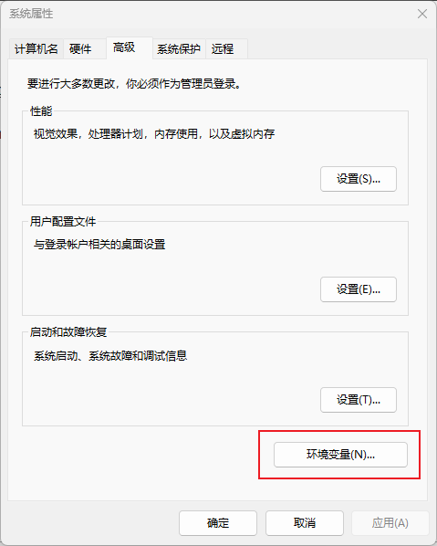

在系统变量栏点击新建，变量名设置为OLLAMA\_MODELS,变量值设置为你想要的路径位置，这里设置为D:\Ollama\models

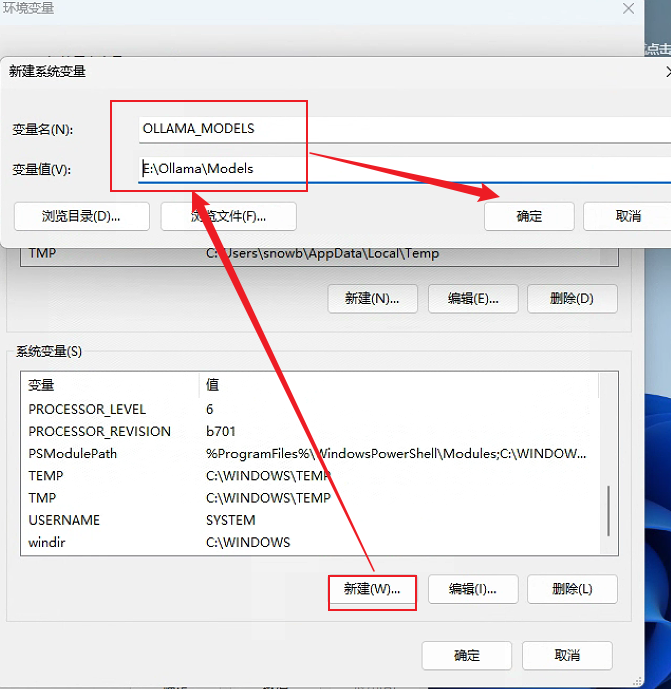

设置好路径之后可以在命令行中进行检查，通过以下命令实现：

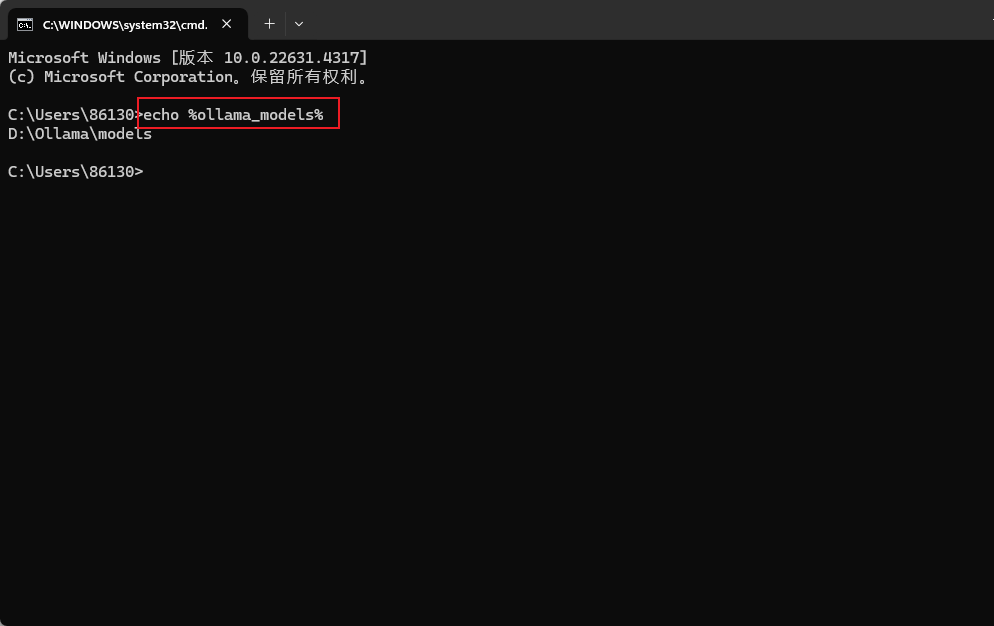

#### 1.3 使用Ollama实现推理大模型QWQ安装启动全流程

启动Ollama可以直接在Windows的命令行中实现，通过win+R键启动cmd命令，打开命令行终端。


可以通过输入指令`ollama -v`来检查是否成功部署，如果通过返回版本号信息则成功。Ollama支持以下的命令操作，关于这些指令的具体含义可以查看第一节Ollama快速入门的内容。

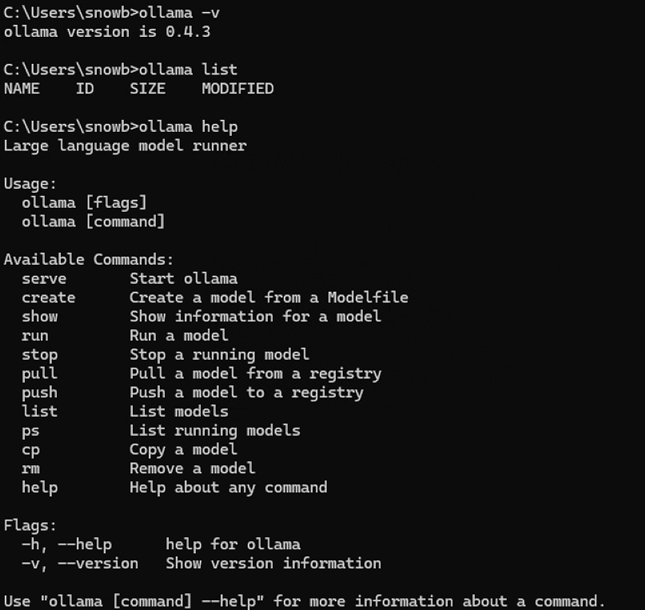

* QWQ推理大模型的部署和使用

首先还是回到Ollama的官网，搜索关键词`QWQ`可以找到对应模型。

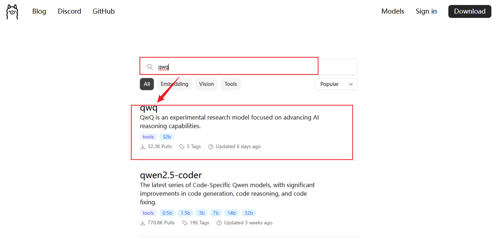

在终端中执行命令 `ollama run qwq` ，即可下载该模型。模型下载完成后，会自动启动大模型，进入命令行交互模式，直接输入指令，就可以和模型进行对话了对应参数的模型的下载方式可以通过在Ollama官网查看到下载指令。

模型挂载网址：https://ollama.com/library/qwq

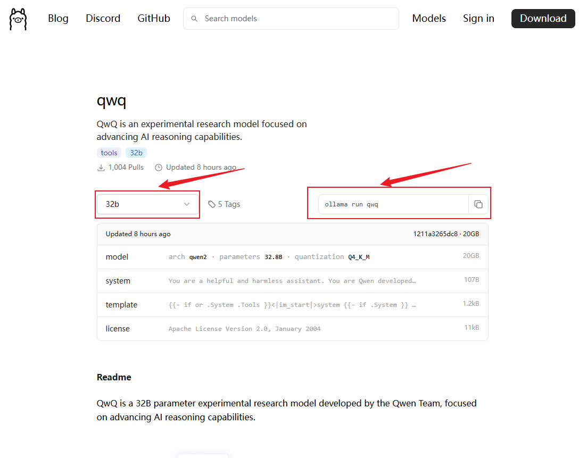

完成下载后会直接进入模型启动状态，如果退出或刷新界面，再次输入指令 ollama run qwq 即可启动对应模型。


当命令行中返回>>>即可进行对话,实测通过Ollama启动这种方式，Ollama默认搭载的是int4量化的模型版本，使用该版本运行推理的时候需要21G左右的显存，单张24G显卡（如RTX-XX90）即可满足使用要求。


### 1.4 下载Cursor

下载这个应用很简单，直接在官方网址点击`Download for Free`即可实现：

https://www.cursor.com/


下载好安装包直接点击运行即可，需要注意的是在下面的install'cursor'点击下载便可以以后在cmd命令行输入指令`cursor`即可快速启动该应用了。

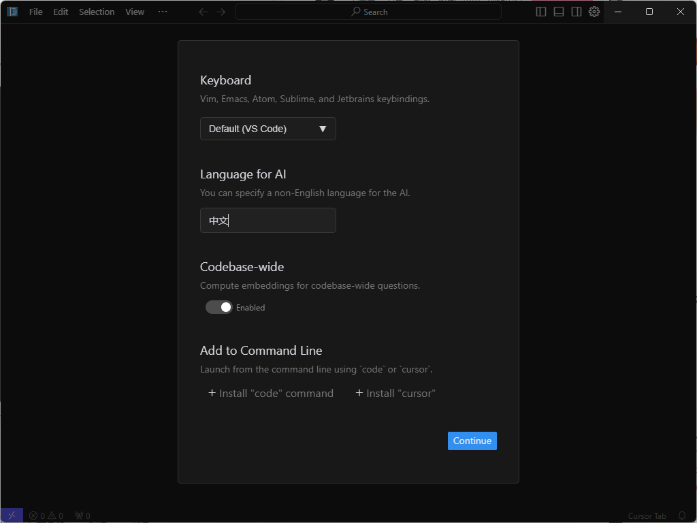

在这个界面，选择Use Extensions便可复制已有的VScode的配置，这样一步实现环境和插件的同步。


在完成配置后需要进行账号登录来实现最后的授权，支持Github和Goggle的账号登录。


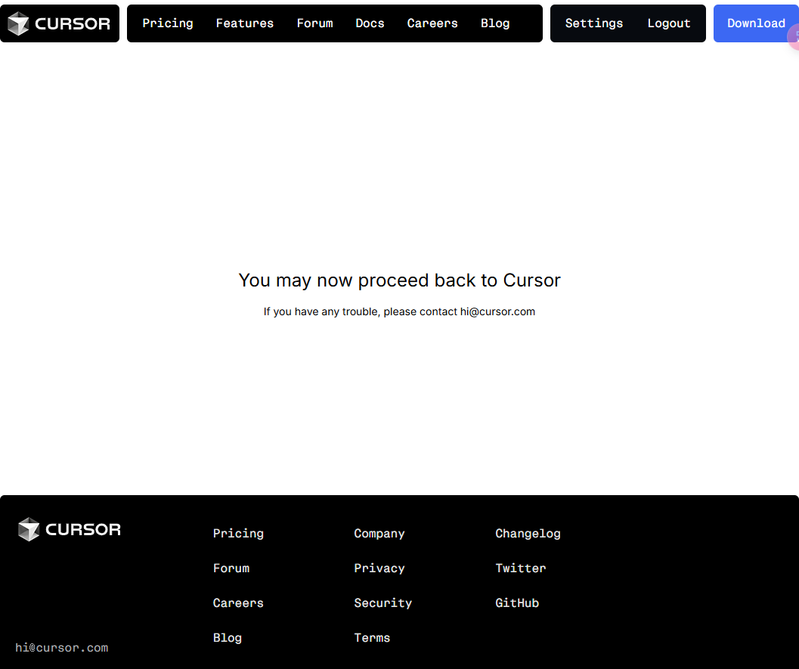

等看到上图的界面再返回Cursor便说明已经成功登录了，如有以下的界面说明可以顺利的使用Cursor了。

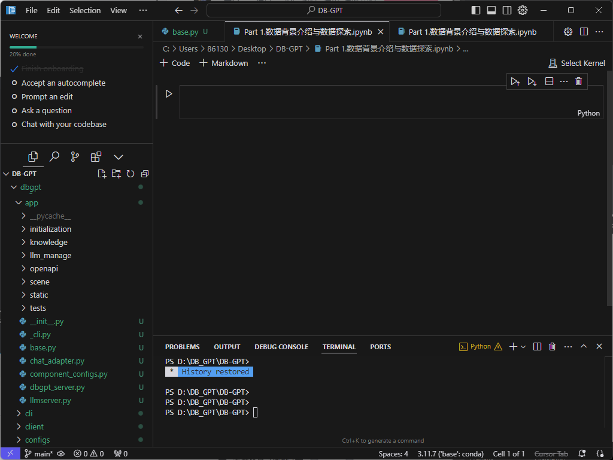

### 1.5 Cursor接入Ollama启动本地大模型QWQ

在左边栏如图位置点击插件栏，搜索`cline`.点击install进行下载。


下载完成后会出现下图图标（可以实现卸载意味着已经安装好了哈哈）

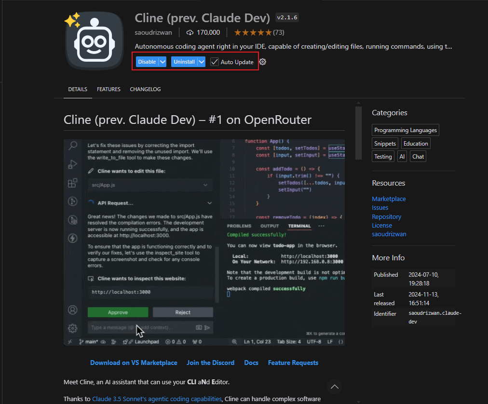

接下来我们继续在插件栏中找到已经下载好的cline，点击进入。


点开Cline插件，会看到以下的界面，我们需要先选择API Provider中的信息。

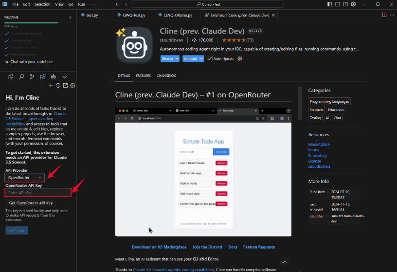

下拉界面选择Ollama


如果是本机调用Ollama直接使用默认的Base URL即可，同时下面会展示所有可以通过Ollama驱动的模型列表，点击选择确认在Model ID中展示后，点击Let's go实现激活。


激活使用：此时在工具栏最右边会出现cline的机器人图标头像，如下图点击右数第二个图标`Open in Editor`实现工具调用。


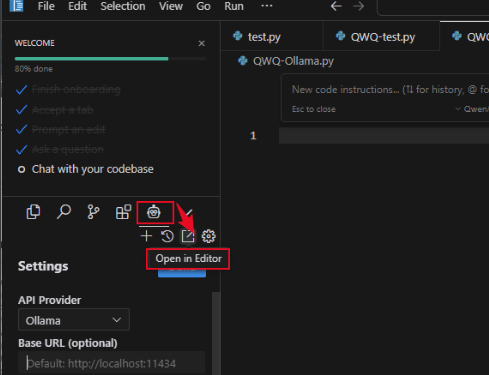

激活后在页面最右边出现页面可以进行对话，可以通过@+文件名的方式将对应代码文件交给大模型进行分析处理。


如下图所示，可以通过这种方式进行代码文件的查看。

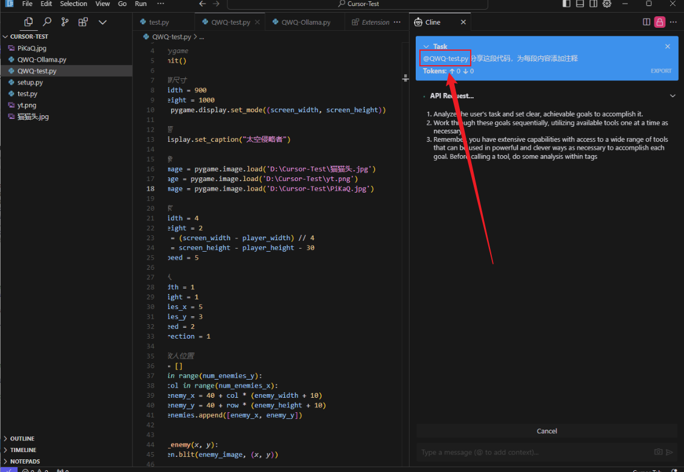

通过在右下角进行交互可以实现本地Ollama驱动QWQ推理了。

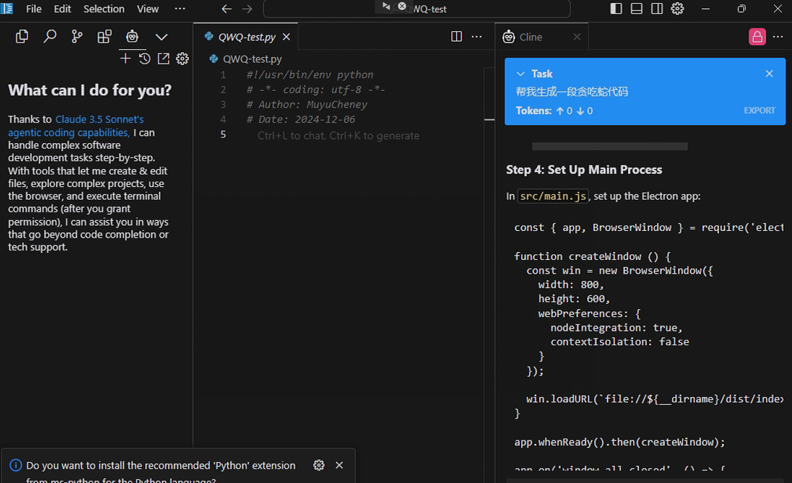

不过使用这个插件并不能很好的适应Cursor的全部功能，这是由于Cursor本身其实不支持调用本地模型，而主营业务是调用各种线上模型API的方式实现辅助编程，因而使用这种方式一定程度上限制了模型交互。

# 2. Windows环境启动Cursor调用线上QWQ

## 2.1 注册siliconFlow

本次课推荐给大家一个线上API调用大模型的方式--siliconFlow，推荐大家使用这个平台来实现大模型借入的理由是这个平台它的模型全、价格实惠、并且模型速度很快，更重要的是，siliconflow 注册即可白嫖2000万不限时token额度，足以让你度过新手开荒期。

siliconFlow注册官网：https://cloud.siliconflow.cn/account/ak

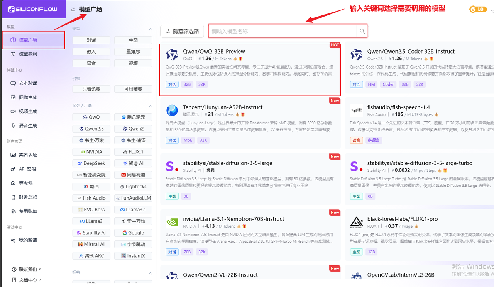

该平台支持诸多主流模型的线上API调用，在模型广场可以搜索对应模型名称复制对应的模型ID，这里选择Qwen/QwQ-32B-Preview来进行测试。

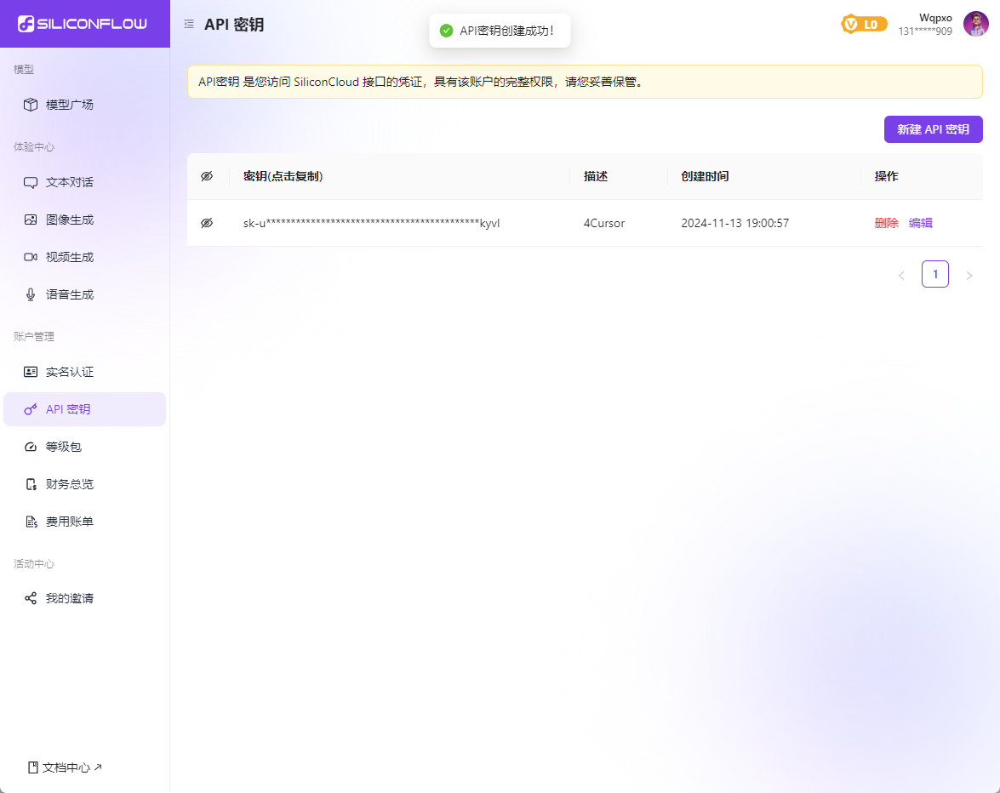

在siliconFlow完成注册后在`账户管理->APi密钥` 中创建密钥，点击复制保存好为接下来的流程备用。

## 2.2 配置模型

返回Cursor应用里，如图点击打开setting设置。

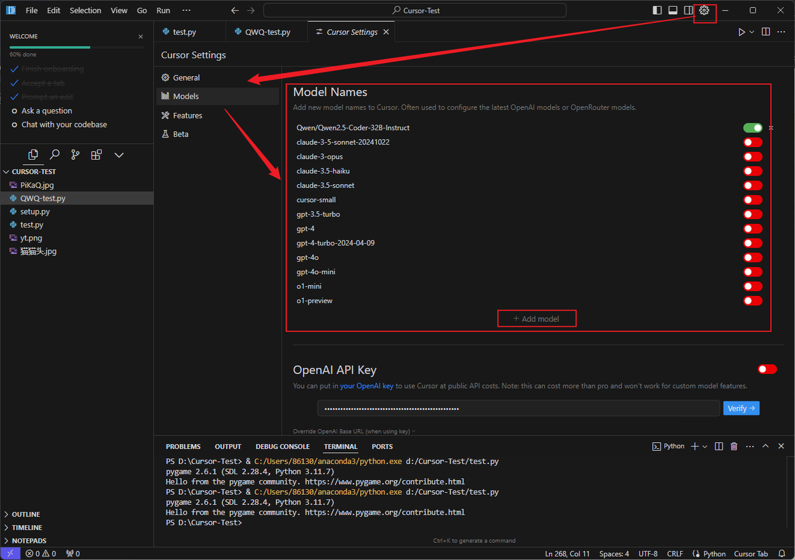

在Cursor Setting中点击Models栏，接下来要完成几个参数的设置，首先将所有已经激活的模型关闭，点击下面add model,输入`Qwen/QwQ-32B-Preview`, 添加完成后记得打开模型后面的开关并将Url从默认的修改为base Url : https://api.siliconflow.cn/v1

并且点击Verify，即可完成添加

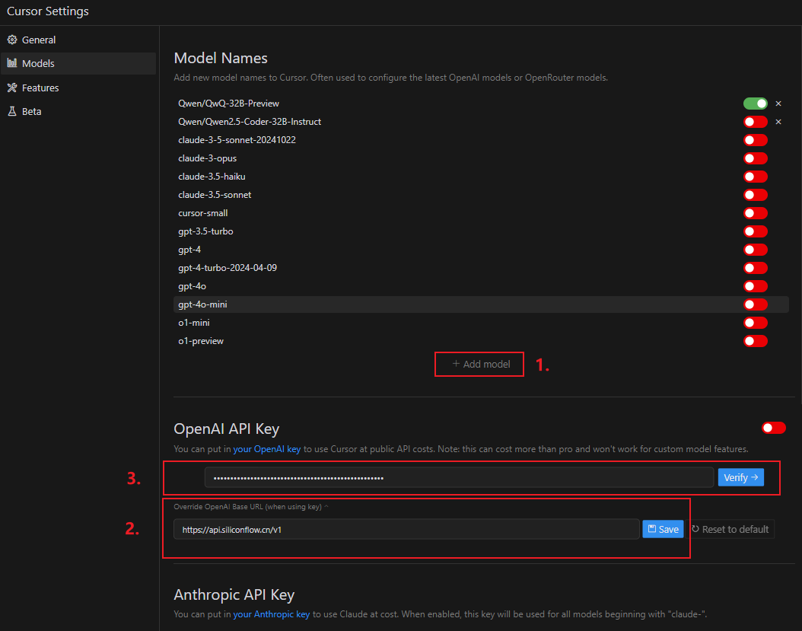

激活成功后效果如下图：


## 2.3 推理使用

此时便可以使用QwQ-32B-Preview模型进行辅助代码生成了，通过Ctrl+K键实现激活，然后输入任意指令便可实现对应大模型的代码推理。


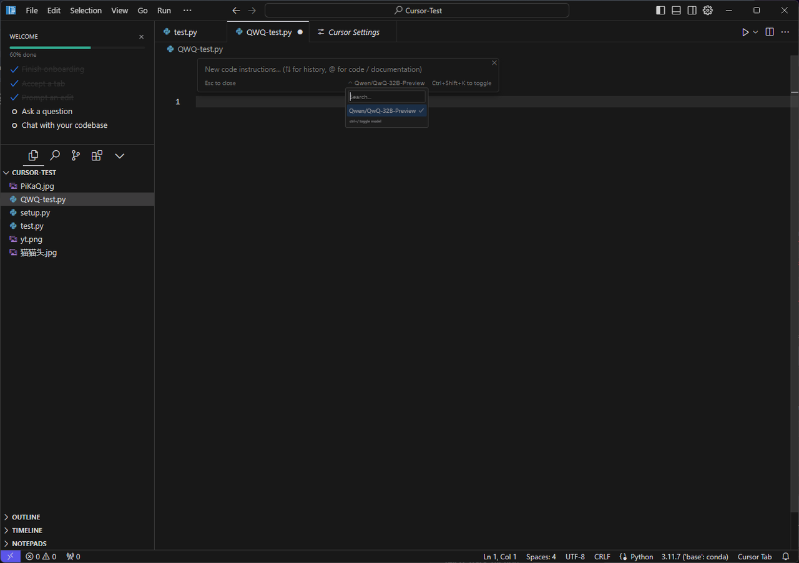


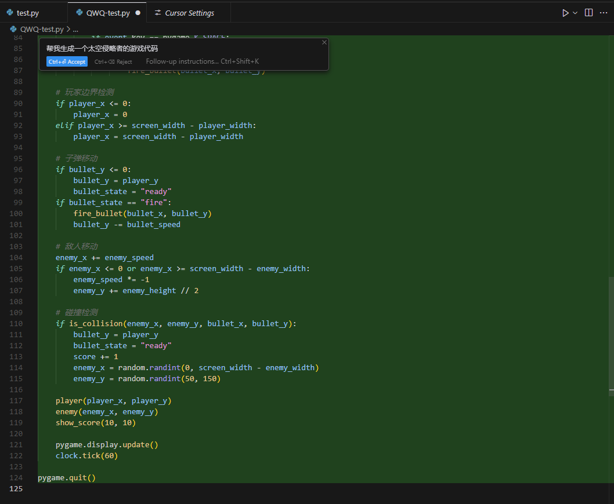

测试了让QWQ根据需求生成打砖块游戏，可以根据需求生成符合条件的代码块，改代码通过html语言实现：

```html
<!DOCTYPE html>
<html lang="en">
<head>
    <meta charset="UTF-8">
    <title>Breakout Game</title>
    <style>
        body {
            display: flex;
            justify-content: center;
            align-items: center;
            height: 100vh;
            margin: 0;
        }
        canvas {
            border: 1px solid #000;
        }
    </style>
</head>
<body>

<canvas id="gameCanvas" width="800" height="600"></canvas>

<script>
    const canvas = document.getElementById('gameCanvas');
    const ctx = canvas.getContext('2d');

    // Define colors
    const paddleColor = 'darkred';
    const ballColor = 'blue';
    const brickColor = 'orange';

    // Paddle settings
    const paddleWidth = 150;
    const paddleHeight = 20;
    let paddleX = (canvas.width - paddleWidth) / 2;

    // Ball settings
    const ballRadius = 10;
    let ballX = canvas.width / 2;
    let ballY = canvas.height - 30;
    let dx = 4;
    let dy = -4;

    // Brick settings
    const brickWidth = 80;
    const brickHeight = 20;
    const brickRowCount = 5;
    const brickColumnCount = 7;
    const bricks = [];
    for (let c = 0; c < brickColumnCount; c++) {
        bricks[c] = [];
        for (let r = 0; r < brickRowCount; r++) {
            bricks[c][r] = { x: 30 + c * (brickWidth + 10), y: 30 + r * (brickHeight + 
10), status: 1 };
        }
    }

    // Draw paddle
    function drawPaddle() {
        ctx.fillStyle = paddleColor;
        ctx.fillRect(paddleX, canvas.height - paddleHeight, paddleWidth, paddleHeight);
    }

    // Draw ball
    function drawBall() {
        ctx.fillStyle = ballColor;
        ctx.beginPath();
        ctx.arc(ballX, ballY, ballRadius, 0, Math.PI*2);
        ctx.fill();
    }

    // Draw bricks
    function drawBricks() {
        for (let c = 0; c < brickColumnCount; c++) {
            for (let r = 0; r < brickRowCount; r++) {
                if (bricks[c][r].status == 1) {
                    ctx.fillStyle = brickColor;
                    ctx.fillRect(bricks[c][r].x, bricks[c][r].y, brickWidth, 
brickHeight);
                }
            }
        }
    }

    // Move paddle
    document.addEventListener('keydown', function(event) {
        if (event.key === 'ArrowLeft') {
            paddleX -= 20;
        } else if (event.key === 'ArrowRight') {
            paddleX += 20;
        }
        // Prevent going off the canvas
        if (paddleX < 0) {
            paddleX = 0;
        } else if (paddleX > canvas.width - paddleWidth) {
            paddleX = canvas.width - paddleWidth;
        }
    });

    function draw() {
        ctx.clearRect(0, 0, canvas.width, canvas.height);

        // Draw bricks
        drawBricks();

        // Draw paddle
        drawPaddle();

        // Move and draw ball
        if (ballX + dx > canvas.width - ballRadius || ballX + dx < ballRadius) {
            dx = -dx;
        }
        if (ballY + dy < ballRadius) {
            dy = -dy;
        } else if (ballY + dy > canvas.height - ballRadius) {
            if (ballX > paddleX && ballX < paddleX + paddleWidth) {
                dy = -dy;
            } else {
                // Game over
                alert("Game Over");
                document.location.reload();
            }
        }

        for (let c = 0; c < brickColumnCount; c++) {
            for (let r = 0; r < brickRowCount; r++) {
                let b = bricks[c][r];
                if (b.status == 1) {
                    if (ballX > b.x && ballX < b.x + brickWidth && ballY > b.y && ballY < 
b.y + brickHeight) {
                        dy = -dy;
                        b.status = 0;
                    }
                }
            }
        }

        ballX += dx;
        ballY += dy;

        drawBall();

        requestAnimationFrame(draw);
    }

    // Start game loop
    draw();
</script>

</body>
</html>
```


以上就是全部的本地/线上在Cursor调用QWQ实现代码辅助的全流程了。

完整的使用信息和更高阶的使用方法可以扫描下方二维码，联系客服小助手领取\~


📍**更多大模型技术内容学习**

**扫码添加助理英英，回复“大模型”，了解更多大模型技术详情哦👇**


此外，**扫码回复“入群”**，即可加入**大模型技术社群：海量硬核独家技术`干货内容`+无门槛`技术交流`！**
