## 模型速递

QWQ模型相关链接信息：

* Blog: https://qwenlm.github.io/blog/qwq-32b-preview/

* HuggingFace: https://huggingface.co/Qwen/QwQ-32B-Preview

* 线上Demo: https://modelscope.cn/studios/Qwen/QwQ-32B-preview

就在今天凌晨（2024.11.28），Qwen团队发布了类o1推理大模型--QWQ。

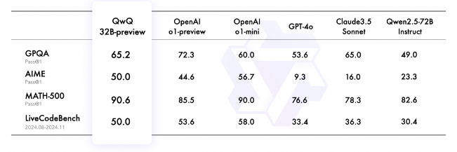

本次开源的是一款32B级别的模型，主要聚焦于提升AI的推理能力。该模型属于实验性研究阶段，目前仍处于预览版本，并且正在进行积极的迭代和优化。随着后续版本的发布，我们期待能看到更强大的模型开源，以满足更广泛的应用需求和提升AI系统的整体性能。这一版本的推出不仅展示了当前技术的最新进展，也为未来更高效、更强大的推理模型奠定了基础。


***

🍻现开设了**大模型学习交流群**，扫描下👇码，来遇见更多志同道合的小伙伴\~

海量硬核独家技&#x672F;**`干货内容`**+无门&#x69DB;**`技术交流`**\~


上图**扫码**👆即刻入群！

📍 社群**技术交流**氛围浓厚，不定期开&#x8BBE;**`硬核干货&前沿技术公开课`**&#x5662;\~

***

**线上测试**

线上demo网址：https://modelscope.cn/studios/Qwen/QwQ-32B-preview

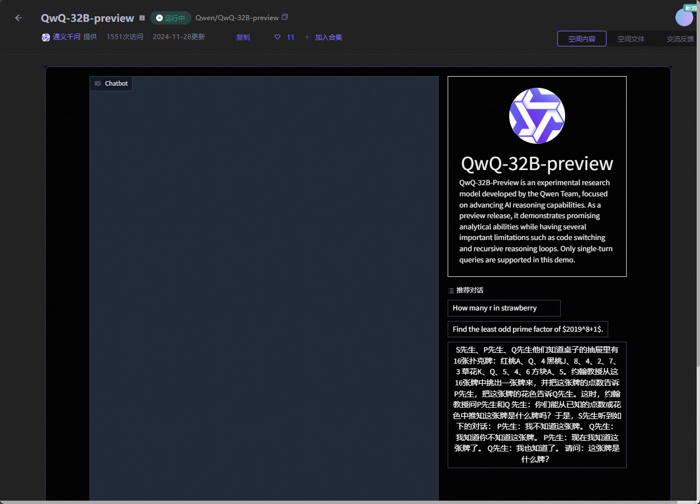

S先生、P先生、Q先生他们知道桌子的抽屉里有16张扑克牌：红桃A、Q、4 黑桃J、8、4、2、7、3 草花K、Q、5、4、6 方块A、5。约翰教授从这16张牌中挑出一张牌来，并把这张牌的点数告诉 P先生，把这张牌的花色告诉Q先生。这时，约翰教授问P先生和Q 先生：你们能从已知的点数或花色中推知这张牌是什么牌吗？于是，S先生听到如下的对话：

P先生：我不知道这张牌。

Q先生：我知道你不知道这张牌。

P先生：现在我知道这张牌了。

Q先生：我也知道了。

请问：这张牌是什么牌？


部分答案：

看看花色：

* 如果花色是红桃，可能的牌是红桃Q、红桃4

* 如果花色是方块，可能的牌是方块5

所以，如果Q先生的花色是红桃，还有两张牌；如果是方块，只有一张牌。

但是，Q先生现在能确定是哪张牌，说明花色是方块，因为只有方块5。

如果花色是红桃，还有红桃Q和红桃4两种可能性，Q先生不能确定是哪一张。

所以，只有当花色是方块时，Q先生才能确定是方块5。

因此，这张牌是方块5。

**最终答案**

\[ \boxed{\text{方块5}} ]

***

## 部署使用流程

### 本地部署硬件推荐

Linux系统：

1. 操作系统：推荐Ubuntu 22.04或更高版本，或其他支持的Linux发行版。

2. 显卡:推荐使用 NVIDIA GPU（如 T4、V100、A10 等），或 AMD GPU，在本流程中至少需要 22GB 的显存。

3. 内存：至少 16GB 的 RAM，在运行更大的模型的时候需要更多内存。 4. 硬盘空间：在每个模型的支持列表中会显示安装所需的空间大小，在本流程中最少20GB用于模型下载。

### 下载&更新Ollama

首先我们在命令行中输入以下信息实现进行Ollama的安装（如已经按照执行该命令会实现软件更新）。

下载Ollama的指令如下：

```plaintext
curl -fsSL https://ollama.com/install.sh | sh
```


下载完成后检测,如果返回版本号则说明成功下载：

```plaintext
ollama -v
```


### 下载模型QWQ

在终端中执行命令 `ollama run qwq` ，即可下载该模型。模型下载完成后，会自动启动大模型，进入命令行交互模式，直接输入指令，就可以和模型进行对话了对应参数的模型的下载方式可以通过在Ollama官网查看到下载指令。

模型挂载网址：https://ollama.com/library/qwq


完成下载后会直接进入模型启动状态，如果退出或刷新界面，再次输入指令 ollama run qwq 即可启动对应模型。


当命令行中返回>>>即可进行对话,实测通过Ollama启动这种方式，单张24G显卡即可满足使用要求。


## 模型效果测试

***

我从以下维度对模型进行了测试： 机器翻译、推理能力、数学能力、代码能力、开放式问题。

先上结论：

* QWEN--QWQ推理大模型在应对机器翻译类任务的时候表现优秀，可以做到很好理解语句的深层含义，并翻译成对应语言中符合语言文化的句子，故QWQ可以作为翻译类大模型应用于海外商务英语、字幕翻译等需要考虑文化背景和上下文信息的环境中。

* 另外，QWQ模型表现出了不错的推理能力，相较于同参数的大模型可以很好的解决推理问题（如数字母和比较数字），对于较复杂的推理问题，QWQ可以实现问题拆解后分步骤推理，并在完成一轮推理后检验结果，通过尝试使用多种方式去验证。展现出的MCTS和反思机制是QWQ这类LRM实现有效推理的关键。

* 在数学和代码任务中，本质上也要求LLM具有较强的推理能力才能更好的分析问题并灵活的给出答案，QWQ在这类问题上展现出了良好的问题拆分和按步骤做答的习惯，在解决问题的时候按照严谨的步骤去推结论，并尝试验证；对于代码生成，会较全面的去生成代码并解答每个模块的功能，同时具有良好的人类意图识别能力。

* 开放式问题是LRM比较擅长的领域，这类问题没有具体的答案，需要分析并适当推理然后向合适的方向进行思考，也就是说，如果一个模型能够实现创新，那它一定会擅长回答开放式问题。在这类任务中，QWQ分析问题时会先进行详细的问题理解，然后尝试使用各种工具辅助其解决问题（如有需要），然后会进行反思，通过多种可行的解决方案进行验证，最后得出答案，总的来说，QWQ在处理此类开放式问题的时候表现出不错的解决能力，具有一定的解决复杂的、未见过的问题的素质。

***

那么接下来我分别展示QWQ在不同领域下的测试结果：

### 机器翻译

帮我将这句话翻译成合适的英文：这双鞋踩起来有踩屎感。

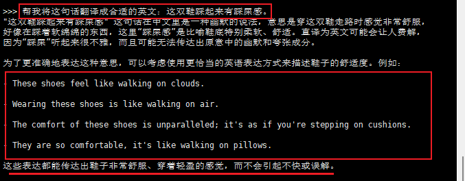

家人们谁懂啊，这个口红真的是绝绝子

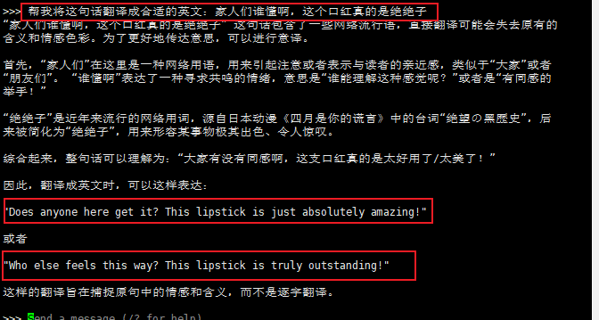

姐妹们，这个糯叽叽的真的很懂我们芋泥脑袋


识时务者为俊杰

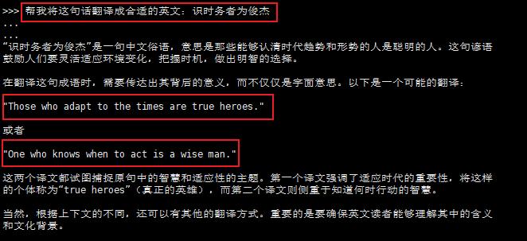

好风凭借力，送我上青云

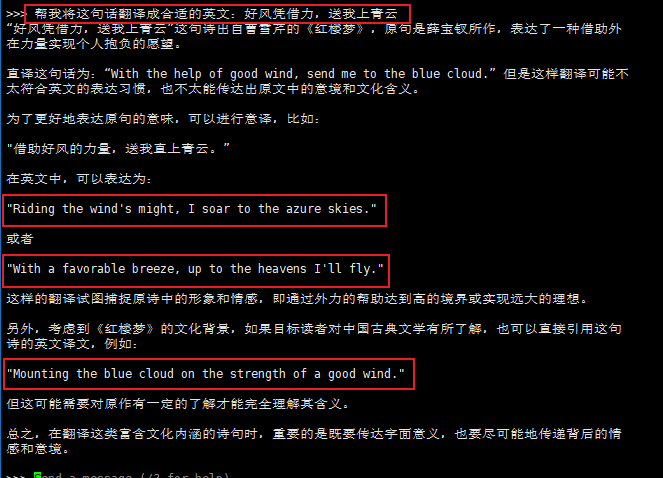

### 推理测试

***

在大模型领域一直有这样一个难题，那就是很难数清一个单词里面对应的字母，即“strawberry”难题。这是由于大模型本身的机制导致的：LLM在识别字词的时候都是以token的形式进行理解的，一个token所涵盖的往往不是一整个单词（如下图所示），因此通常的大模型不能很好的理解单词的本质，进而无法正确数出“strawberry”中r的数量。而QWQ在这个领域表现的就很好，这也是由于其推理能力的增强导致的。

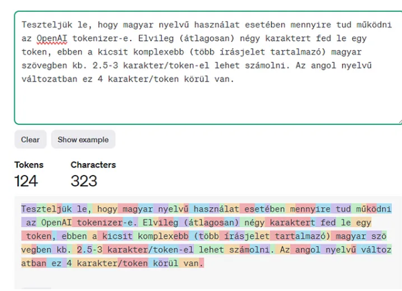

接下来进行一些简单的英语单词数字母测试：

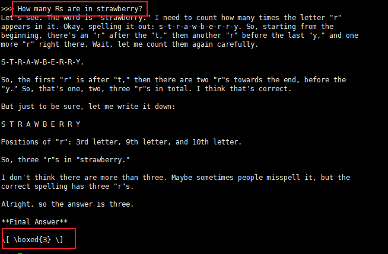


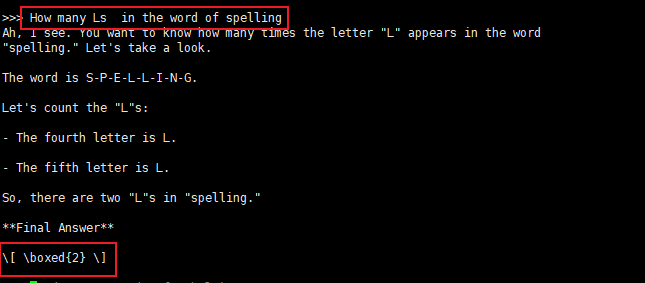

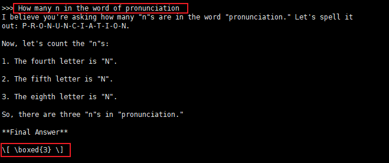

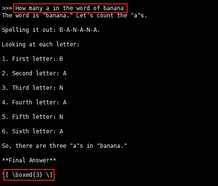

9.8和9.11比大小

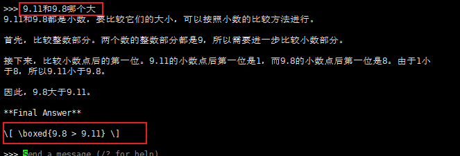

问题：Tatuya、Ivanna 和 Dorothy 一起参加了一个测验。 Tatuya 的得分是 Ivanna 的两倍，而 Ivanna 的得分是 Dorothy 的 3/5 倍。如果多萝西得了 90 分，计算这三个人的平均分。先仔细考虑，再做决定：


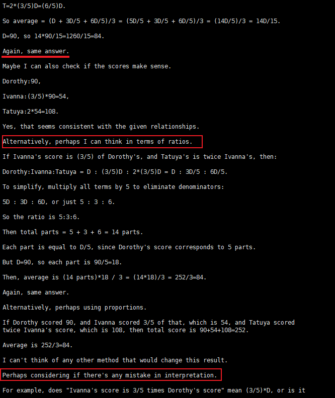

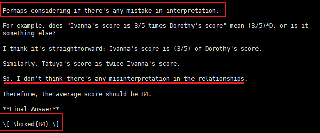

If I have 5 apples and give away 2, how many do I have left?

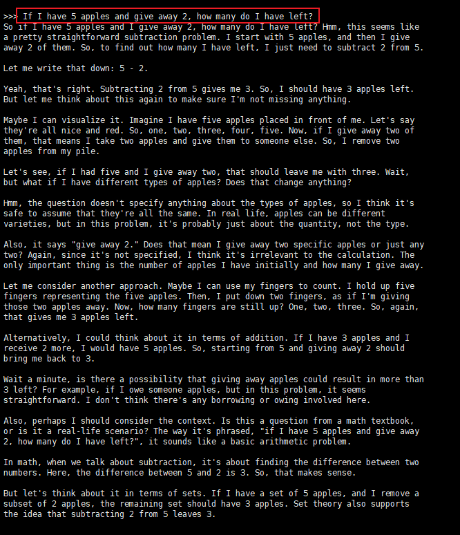


假设有 7 个海盗，他们需要分配一批金币。每个海盗都具有以下特点：

1. **绝对理性**：每个海盗都会尽量使自己的利益最大化。

2. **绝对自私**：他们只关心自己的得失，不关心他人的情况。

3. **暴力威胁**：如果一个提案无法被通过（投票否决），则提议者会被“扔下船”。

**分赃规则**

1. 按照从首领（编号为 1 的海盗）到最后一名海盗的顺序，依次由每个海盗提出分赃方案。

2. 每名海盗（包括提议者）对提案进行投票。提案若获得 **至少一半人数（包括自己）或以上** 的支持，则通过；否则，提议者被抛弃，剩下的海盗继续讨论。

3. 海盗之间按照逻辑进行投票，遵循理性自私的行为模式。

**目标**

首领（提议者）需要提出一个分赃方案，使：

1. 自己不会被扔下船（提案被通过）。

2. 自己分得的金币尽可能多。

问，他们应该如何分赃

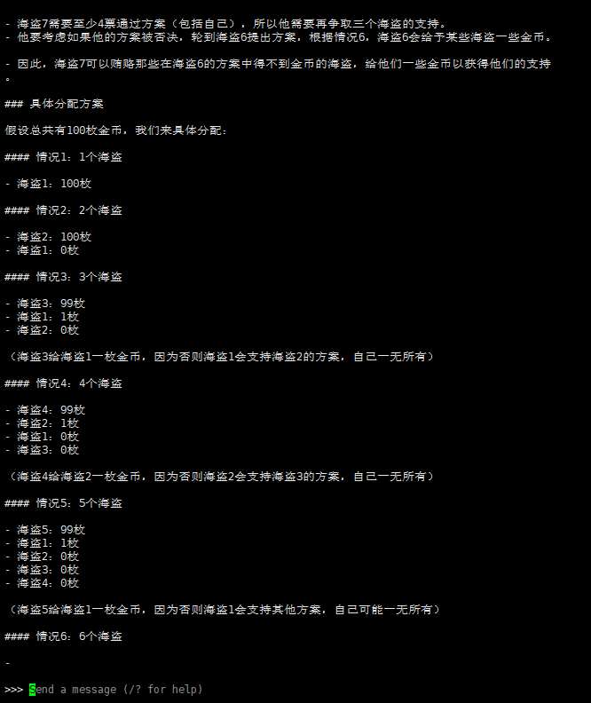


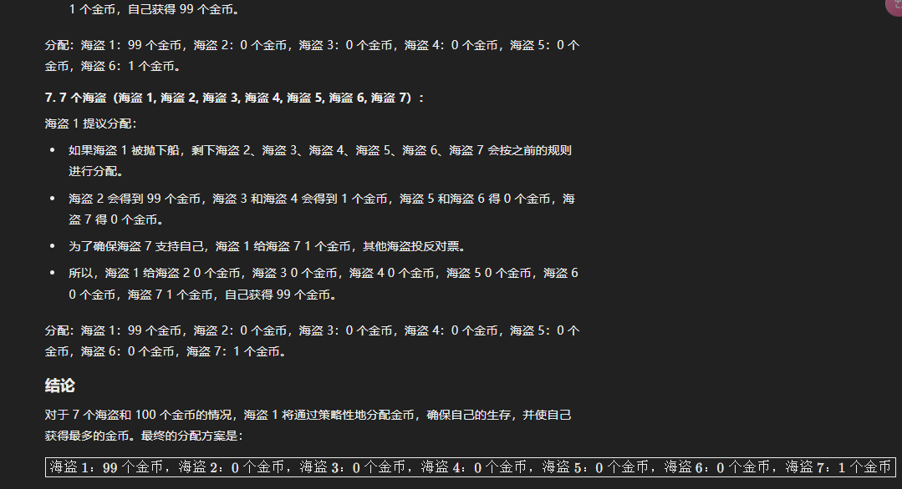

最优解应该是（7->1）：97，0，1，0， 1，1，0

不过这道题4o也没答对，确实可能有点难为QWQ了，它可能就QWQ了。

### 代码任务

* 为我用python写一段贪吃蛇代码，要求蛇是黄色的，食物是绿色的。

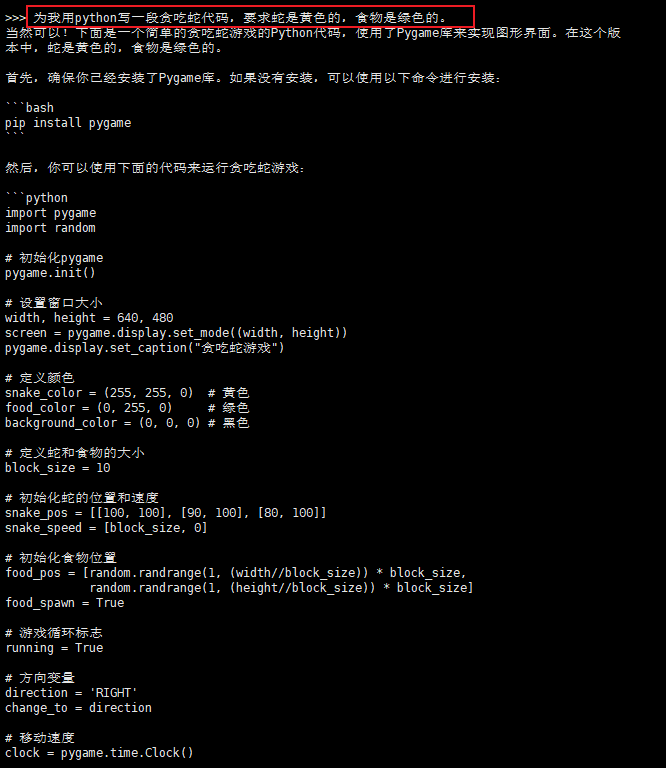

````python
import pygame
import random

# 初始化pygame
pygame.init()

# 设置窗口大小
width, height = 640, 480
screen = pygame.display.set_mode((width, height))
pygame.display.set_caption("贪吃蛇游戏")

# 定义颜色
snake_color = (255, 255, 0)  # 黄色
food_color = (0, 255, 0)     # 绿色
background_color = (0, 0, 0) # 黑色

# 定义蛇和食物的大小
block_size = 10

# 初始化蛇的位置和速度
snake_pos = [[100, 100], [90, 100], [80, 100]]
snake_speed = [block_size, 0]

# 初始化食物位置
food_pos = [random.randrange(1, (width//block_size)) * block_size,
            random.randrange(1, (height//block_size)) * block_size]
food_spawn = True

# 游戏循环标志
running = True

# 方向变量
direction = 'RIGHT'
change_to = direction

# 移动速度
clock = pygame.time.Clock()
snake_speed_clock = 10

# 得分
score = 0

# 显示得分的函数
def show_score(choice, color, font, size):
    score_font = pygame.font.SysFont(font, size)
    score_surface = score_font.render('Score : ' + str(score), True, color)
    score_rect = score_surface.get_rect()
    if choice == 1:
        score_rect.midtop = (width / 10, 15)
    else:
        score_rect.midtop = (width / 2, height / 1.25)
    screen.blit(score_surface, score_rect)

# 游戏结束的函数
def game_over():
    my_font = pygame.font.SysFont('times new roman', 50)
    game_over_surface = my_font.render(
        'Your Score is : ' + str(score), True, (255, 255, 255))
    game_over_rect = game_over_surface.get_rect()
    game_over_rect.midtop = (width / 2, height / 4)
    screen.blit(game_over_surface, game_over_rect)
    pygame.display.flip()
    pygame.time.wait(2000)
    pygame.quit()
    quit()

# 主循环
while running:
    for event in pygame.event.get():
        if event.type == pygame.QUIT:
            running = False
        # 检测按键事件
        elif event.type == pygame.KEYDOWN:
            if event.key == pygame.K_UP and direction != 'DOWN':
                change_to = 'UP'
            if event.key == pygame.K_DOWN and direction != 'UP':
                change_to = 'DOWN'
            if event.key == pygame.K_LEFT and direction != 'RIGHT':
                change_to = 'LEFT'
            if event.key == pygame.K_RIGHT and direction != 'LEFT':
                change_to = 'RIGHT'

    # 更新蛇的运动方向
    direction = change_to
    if direction == 'UP':
        snake_speed = [0, -block_size]
    if direction == 'DOWN':
        snake_speed = [0, block_size]
    if direction == 'LEFT':
        snake_speed = [-block_size, 0]
    if direction == 'RIGHT':
        snake_speed = [block_size, 0]

    # 更新蛇的位置
    snake_pos.insert(0, list(map(sum, zip(snake_pos[0], snake_speed))))

    # 检测是否吃到食物
    if snake_pos[0] == food_pos:
        score += 1
        food_spawn = False
    else:
        snake_pos.pop()

    # 重新生成食物
    if not food_spawn:
        food_pos = [random.randrange(1, (width//block_size)) * block_size,
                    random.randrange(1, (height//block_size)) * block_size]
    food_spawn = True

    # 绘制背景
    screen.fill(background_color)

    # 绘制蛇和食物
    for pos in snake_pos:
        pygame.draw.rect(screen, snake_color, pygame.Rect(
            pos[0], pos[1], block_size, block_size))
    pygame.draw.rect(screen, food_color, pygame.Rect(
        food_pos[0], food_pos[1], block_size, block_size))

    # 检测游戏结束条件
    # 超出边界
    if snake_pos[0][0] < 0 or snake_pos[0][0] >= width or snake_pos[0][1] < 0 or 
snake_pos[0][1] >= height:
        game_over()
    # 碰到自己
    for block in snake_pos[1:]:
        if snake_pos[0] == block:
            game_over()

    # 显示得分
    show_score(1, (255, 255, 255), 'times new roman', 20)

    # 更新显示
    pygame.display.update()

    # 控制游戏速度
    clock.tick(snake_speed_clock)

# 退出pygame
pygame.quit()
quit()
解释代码

这段代码是一个用Python编写的简单的贪吃蛇游戏，使用了Pygame库来处理图形和事件。下面是对代
码的详细解释：

### 导入必要的模块

```python
import pygame
import sys
from pygame.locals import *
````

* `pygame`: 用于游戏开发的库，包含绘制图形、处理事件等功能。

* `sys`: 用于系统特定的参数和功能，这里可能用于退出程序。

* `pygame.locals`: 包含了许多常量，如按键代码等。

### 初始化Pygame

```python
pygame.init()
```

* 初始化所有导入的Pygame模块。

### 设置游戏窗口

```python
window_size = (400, 300)
screen = pygame.display.set_mode(window_size)
pygame.display.set_caption('贪吃蛇游戏')
```

* 创建一个大小为400x300像素的游戏窗口。

* 设置窗口的标题为“贪吃蛇游戏”。

### 定义颜色

```python
black = (0, 0, 0)
white = (255, 255, 255)
red = (255, 0, 0)
```

* 定义了一些常用的颜色，用于绘制蛇、食物等。

### 创建蛇和食物

```python
snake_pos = [[100, 50], [90, 50], [80, 50]]
snake_speed = [10, 0]
food_pos = [random.randrange(1, (window_size[0]//10)) * 10,
            random.randrange(1, (window_size[1]//10)) * 10]
food_spawn = True
```

* `snake_pos`: 蛇的身体位置，初始为三个块。

* `snake_speed`: 蛇的移动速度，初始向右移动。

* `food_pos`: 食物的位置，随机生成。

* `food_spawn`: 标志食物是否需要重新生成。

### 游戏循环

```python
while True:
    for event in pygame.event.get():
        if event.type == QUIT:
            pygame.quit()
            sys.exit()
        elif event.type == KEYDOWN:
            if (event.key == K_UP or event.key == ord('w')
                    and snake_speed[1] != 10):
                snake_speed = [0, -10]
            elif (event.key == K_DOWN or event.key == ord('s')
                  and snake_speed[1] != -10):
                snake_speed = [0, 10]
            elif (event.key == K_LEFT or event.key == ord('a')
                  and snake_speed[0] != 10):
                snake_speed = [-10, 0]
            elif (event.key == K_RIGHT or event.key == ord('d')
                  and snake_speed[0] != -10):
                snake_speed = [10, 0]

    # 移动蛇
    snake_pos.insert(0, list(map(sum, zip(snake_pos[0], snake_speed))))
    if snake_pos[0] == food_pos:
        food_spawn = False
    else:
        snake_pos.pop()

    if not food_spawn:
        food_pos = [random.randrange(1, (window_size[0]//10)) * 10,
                    random.randrange(1, (window_size[1]//10)) * 10]
    food_spawn = True

    screen.fill(black)

    for pos in snake_pos:
        pygame.draw.rect(screen, white, pygame.Rect(
            pos[0], pos[1], 10, 10))

    pygame.draw.rect(screen, red, pygame.Rect(
        food_pos[0], food_pos[1], 10, 10))

    pygame.display.flip()
    pygame.time.Clock().tick(15)
```


运行实例如下：


写一个 Bash 脚本，将格式为 '\[1,2],\[3,4],\[5,6]' 的字符串表示的矩阵转置，并以相同格式输出。


要求只生成代码。


完整代码如下：

```bash
#!/bin/bash

input='[1,2],[3,4],[5,6]'

# 去掉最外层的方括号
input=${input#[}
input=${input%]}

# 按逗号分割子数组
IFS=',' read -ra rows <<< "$input"

# 读取 rows 数组的长度，即行数
m=${#rows[@]}

# 解析第一行以确定列数
parse_row() {
    local row=$1
    row=${row#[}
    row=${row%]}
    IFS=',' read -ra nums <<< "$row"
    echo "${nums[@]}"
}

cols=($(parse_row "${rows[0]}"))
n=${#cols[@]}

# 初始化矩阵元素数组
matrix=()
for row in "${rows[@]}"; do
    nums=($(parse_row "$row"))
    for num in "${nums[@]}"; do
        matrix+=("$num")
    done
done

# 进行转置
transposed=()
for ((i=0; i<n; i++)); do
    transposed_row=()
    for ((j=0; j<m; j++)); do
        # 计算原矩阵中的索引
        index=j*n + i
        transposed_row+=("${matrix[index]}")
    done
    # 将转置后的行添加到 transposed 数组中
    transposed+=("[$(IFS=,; echo "${transposed_row[*]}")]")
done

# 生成输出字符串
output="$(IFS=,; echo "${transposed[*]}")"

echo "$output"
```

***

### 数学任务


Prove that the limit of the sequence (a(n)) defined by a(n) = 1/(n^2) is 0

证明n趋于无穷时，1/(n^2)为0.


***

### 开放式问题

计算巴黎距离柏林之间的距离


指正

巴黎（France）和柏林（Germany）之间的直线距离大约为 878 公里（或 878 千米）。这个距离是指两座城市之间的最短直线距离，通常称为“大圆距离”。 你尝试重新计算查看是否有哪里出现了问题


***

我们如何让世界更快乐


过年发红包，怎样才会表现的我既大方又省钱


📍**更多大模型技术内容学习**

**扫码添加助理英英，回复“大模型”，了解更多大模型技术详情哦👇**


此外，**扫码回复“入群”**，即可加入**大模型技术社群：海量硬核独家技术`干货内容`+无门槛`技术交流`！**

