***

# Agentic RAG 架构的基本原理与应用入门

  在大模型领域技术的发展历程中，提高信息检索的效率和准确性是各行各业都在亟需解决的应用难题。在 `2023` 年占据主导技术地位的是检索增强生成 (RAG)技术，通过将大模型 ( LLMs ) 与外部数据检索相集成，彻底改变了人工智能系统，从而可以做出更明智、上下文更准确的响应。

然而，随着需求变得更加复杂，传统的 `RAG` 系统通常无法处理细致入微的查询、多步骤推理和动态变化的上下文。而随着2024年AI Agent在工作流程方面有了巨大进步，才有了现在我们正在提及的代理检索增强生成（Agentic RAG） —— RAG 范式的创新演变。

通过将智能、自主代理纳入检索过程，Agentic RAG 提升了传统系统的功能，使它们能够更有效地适应、推理和响应。这些代理不仅仅是被动的检索者，而且是主动的参与者，能够规划、决策并利用专门的工具来实现其目标。

  顾名思义，Agentic RAG 是结合了 RAG 和 AI Agent 两大技术领域而形成的新范式，接下来的内容，我们就针对这样的一个新范式展开详细的介绍和实践。为了帮助大家更好地理解 Agentic RAG，我将首先分别介绍 RAG 和 AI Agent 架构的独立工作原理，然后再将它们结合起来，展示如何最终形成 Agentic RAG。

# 1. 什么是RAG？

  **Retrieval-Augmented Generation (RAG) 是帮助大模型更好地回答问题的一种方式**。在大模型的应用场景中，一个非常常见的需求是：我们手里有一堆文档，当遇到一个问题时，希望通过其中的一段文本来找到答案。这时，RAG（检索增强生成）技术就能派上用场。它的作用就是从这些文档中找到最相关的信息，然后利用大模型生成精准的回答。简单来说，`RAG` 就是帮助大模型‘找到’并‘利用’最相关的信息来回答你的问题，就像一个聪明的助手快速翻阅资料给你最合适的答案。如下图所示：

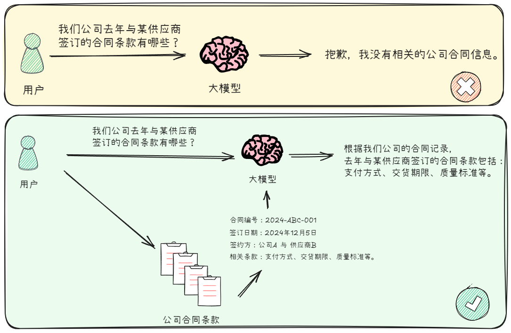

  能这样实现的原因在于已经有非常多的实验论文能够证明，当为大模型提供一定的上下文信息后，其输出会变得更稳定。那么，将知识库中的信息或掌握的信息先输送给大模型，再由大模型服务用户，就是大家普遍达成共识的一个结论和方法。传统的对话系统、搜索引擎等核心依赖于检索技术，如果将这一检索过程融入大模型应用的构建中，既可以充分利用大模型在内容生成上的能力，也能通过引入的上下文信息显著约束大模型的输出范围和结果，同时还实现了将私有数据融入大模型中的目的，达到了双赢的效果。

  从技术实现细节上看，`RAG`的实现是包括两个阶段的：检索阶段和生成阶段。在检索阶段，从知识库中找出与问题最相关的知识，为后续的答案生成提供素材。在生成阶段，RAG会将检索到的知识内容作为输入，与问题一起输入到语言模型中进行生成。这样，生成的答案不仅考虑了问题的语义信息，还考虑了相关私有数据的内容。如下图所示：


  为什么要搞得这个复杂呢？还是在于大模型本身的以下两个特性：

1. 如果用户提出的问题，其对应的答案出现在一篇文章中，去知识库中找到一篇与用户输入相关的文章是很容易的，但是我们将检索到的这整篇文章直接放入`Prompt`中并不是最优的选择，因为其中一定会包含非常多无关的信息，而无效信息越多，对大模型后续的推理影响越大。

2. 任何一个大模型都存在最大输入的Token限制，如果将一整个文本去全部传入大模型，无法容纳如此多的信息。

  而`RAG`构建的关键，则是由**检索组件（通常由`Embedding`模型和向量数据库组成）和生成组件（ 大模型 ）组成。在推理时，用户查询用于对索引文档运行相似性搜索，以检索与查询最相似的文档，并为大模型提供额外的上下文**。因此，我们在构建`RAG`的过程中，也往往是遵循着这种流程去做定制化的开发。那么每个环节中我们应该掌握哪些知识呢？我们来看下面的这个思维导图：

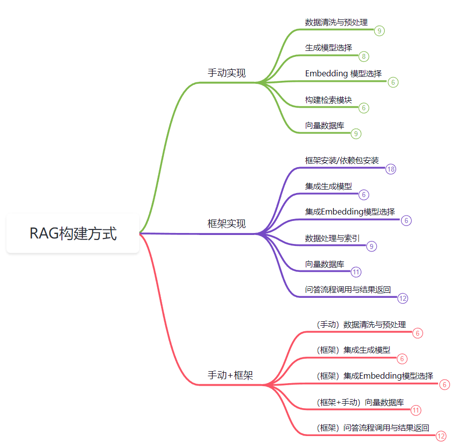

  在实现RAG系统时，主要有三种方式：手动实现、框架实现和手动+框架结合的方式。通常，企业中不会选择完全手动实现，因为这样不仅工作量大，而且维护复杂。而手动+框架结合的方式，因其灵活性和高效性，会是90%以上开发者的首选。

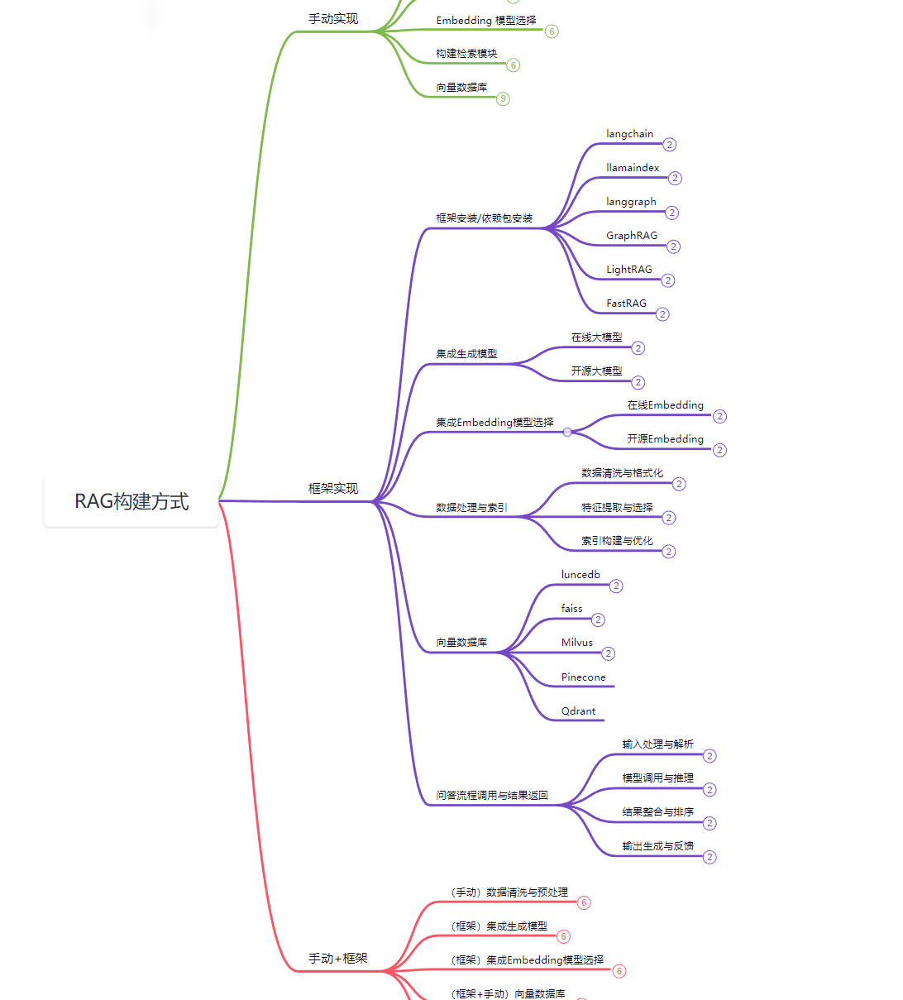

公主号【赋范空间】回【99】领取完整课件、思维导图，还有大模型开发体系大课，从0到1直通大模型算法工程师

# 2. 使用LangChain实现RAG问答

```python
# ! pip install PyPDF2==3.0.1 langchain==0.3.9 langchain-ollama==0.2.1 langchain_community==0.3.9 langchain_milvus==0.1.7 langgraph==0.2.56
```

  这里我们选择其中一个框架：Langchain，并结合手动实现的方式，来帮助大家一步步实现`RAG`的d过程，既能利用框架加速开发，又能定制化地满足特定需求。我们就严格按照如下流程图中的全流程进行一个快速的复现。


## 2.1 文档切分

  在构建 `RAG`系统的过程中，第一步是从文档中提取有用的信息。在这里，我们选择`.pdf`的文件类型进行实践。通过使用 `PyPDF2` 库的 `PdfReader` 类来实现从 `PDF` 文件中提取文本。

```python
from PyPDF2 import PdfReader

def pdf_read(pdf_doc):
    text = ""
    for pdf in pdf_doc:
        pdf_reader = PdfReader(pdf)
        for page in pdf_reader.pages:
            text += page.extract_text()
    return text
```

  然后， 将\['./01\_大模型应用发展及Agent前沿技术趋势.pdf'] 作为参数传递给 `pdf_read` 函数，读取并提取文件中的文本。

```python
content = pdf_read(['./01_大模型应用发展及Agent前沿技术趋势.pdf'])
```

  返回值 `content` 将包含该 `PDF` 文件的所有文本内容。

```python
content
```

```plaintext
'大模型  AI Agent 开发实战  \nCh.1 大模型应用发展及 Agent 前沿技术趋势  \n  自2023 年初开始，大模型在国内外引起了极大的关注。实际上，早在 2022 年底，国外已经对这一技\n术展开了非常激烈的讨论，而在国内对大模型的普及和认知很大程度上得益于 ChatGPT 的问世。这一现\n象级的对话式应用直接改变了人们对智能应用的既有看法。在此之前，我们已经习惯了 智能客服 的机械\n式回答和智能应用 的频繁出错，所以，当一个能够使用 自然语言 （即人类的交流语言）理解情感、解决\n问题并且能即问即答的应用系统出现时，人们很难相信它背后不是真实的人类，而是一个由人类设计的\n机器模型。\n  下图中的对话来源于基于 GPT-4.0 模型的对话式应用 ChatGPT👇\n  如上图所示，我们可以用最自然的对话方式让大模型帮助我们处理各种任务、解决问题、学习新知\n识，甚至在需要时提供安慰。它表现得像是一个无所不知、无所不能的朋友。每当你需要它扮演不同角\n色时，只需 新建一个对话窗口 ，它便能化身为全新的伙伴。在它出现之前，人工智能的技术领域中无论\n是机器学习模型还是深度学习模型，它们都需要特定的数据先进行训练才能去执行具体任务，比如机器\n学习中的分类任务或深度学习的实体识别等。而大模型以其接近人类的交互特性，跨越了这些界限，用\n独立的个体 直接去解决各种类型的问题，并且还表现得很好，直接把人工智能的热度推到了一个新的高\n度。\n  也正是这样的一种技术上的跨越，业内人会把 2023 年称为 大模型的元年 ，因为它标志着人工智能迈\n上了一个新的台阶，而且，属于大模型的时代也才刚刚开始。所以我们作为技术人，肯定不是仅仅做一\n个“ 吃瓜群众 ” ，看热闹的同时，更多的精力都在积极跟进大模型的发展，深入理解并掌握其背后的技术演\n进，以此来不断更新自身的技术视野。 当然，我们要研究的并不是表面的应用 ChatGPT ，而是其背后的\n强力基座模型 -GPT 。\n1. 大模型应用的快速迭代  \n  比较有意思的是，如果有在 2023 年起就开始使用 ChatGPT 类应用的 非技术岗位 的小伙伴，大概率都\n会有这样一些想法：大模型技术一年半以来的技术发展并未带来显著的产品变革，无非是界面美观了一\n些，功能增加了一些，例如现在支持上传图片、文件和构建插件等。但通过表象应用去看本质，会发现\n大模型技术的迭代速度是远远快于其他领域的。其快速发展的有两个核心方向：\n1. 大模型自身的能力在不断变强\n2. 大模型的对话效果在大幅提升\n  两个方向其背后的技术栈迭代，我们可以总结如下图所示  👇  ：大模型自身的能力在不断变强\n  大模型有两个关键概念：原生能力和涌现能力。\n  所谓 原生能力 ，指的是大模型基于特定的神经网络架构，在训练过程中通过不断摄入数据来学习，\n最终具备解答特定领域问题的能力。这种能力就像是印在大模型 “ 大脑 ” 中的知识，是其能够独立解答问题\n的基础。就如同我们在大学学习三年后能够解决高等数学问题一样，这种能力是通过学习得来的，我们\n称之为原生能力。大模型的这种能力的提升在于：随着能获取到的数据量增加，开发者可以基于先前性\n能表现为其构建更优质的学习数据，结合学习方法的不断迭代优化（技术上称之为预训练技术或微\n调），大模型的原生能力就可以持续进化。 这种进步的直观表现是模型的理解能力和回答质量的提升。\n  其次，我们还会重点关注大模型的 涌现能力 。这一能力指的是，尽管大模型可能没有直接学习过某\n些信息，但在与它对话时提供相关信息后，它能够类比和推理出解决方案。这类似于我们在准备高考时\n做过的 “ 五年高考三年模拟 ” 的题目，尽管高考题目不会与模拟题完全相同，但我们仍可以利用相同的思维\n模式解决考试试题。大模型的这部分能力提升主要体现在：我们通过给它构造各种函数调用、处理复杂\n问题的过程示例（ Agent 能力）等，在预训练或者微调阶段帮助它学习并强化这种能力。这样，大模型就\n能在其应用的第二个方向上 —— 即实际问题解决中发挥更加重要的作用。\n关于预训练和微调的原理和应用，我们将在本期视频的微调专栏中详细介绍。\n大模型的对话效果在大幅提升\n  大模型的能力毋庸置疑，它在对话过程中能够回答和解决多种不同类型的任务，但存在着两个主要\n问题： 知识库更新不及时和大模型幻觉问题 。\n  首先，关于知识库更新问题，正如我们上面刚刚提到的，大模型是在预训练或者微调阶段获取和学\n习知识。这意味着，如果某些最新的信息未在训练数据中包含，大模型就无法提供相关答案。例如，如\n果你问它 “ 今天的天气怎么样？ ” 由于缺乏实时更新的数据，大模型无法给出正确的当前天气状况。  比较有意思的是：大模型的原生能力在不断的提升，它的对话效果好了，回答质量高了，但是我们\n的需求也变得越来越复杂了。  单纯的对话应用已无法满足需求。这就促使我们进入了大模型应用的第一\n个阶段 —— 提示工程 。\nStage 1 ：  提示工程\n  虽然大语言模型非常强大，但要有效使用它们并非易事。在开发者急于探索如何像处理传统算法模\n型那样通过微调快速迭代更新大模型的内部知识时，一篇极具启发性的论文  👉  GPT-3 Language  \nModels are Few-Shot Learners  提出了  In-Context Learning 的概念。该方法通过向模型提供少量标\n注的 “ 输入 - 输出对 ” 示例，在不需要大规模微调的情况下即可显著改善大模型的输出质量。这一发现开启\n了使用大模型的新方式  👇\n  当提出问题后，大模型能够以自然语言返回响应，这是生成式人工智能的一大优点。有些任务确实\n可以通过这种提示工程的方式引导大模型在对话过程中生成正确的回复，但这个过程最大的问题就是需\n要人工介入，正如上面的例子中涉及到的北京的天气信息：\n{\n \xa0"location": {\n \xa0 \xa0"city": "Beijing",\n \xa0 \xa0"country": "CN",\n \xa0 \xa0"timezone": "Asia/Shanghai",\n \xa0 \xa0"coordinates": {\n \xa0 \xa0 \xa0"latitude": 39.9042,\n \xa0 \xa0 \xa0"longitude": 116.4074\n \xa0  }\n  },\n \xa0"current": {\n \xa0 \xa0"temperature": {\n \xa0 \xa0 \xa0"value": 34,\n \xa0 \xa0 \xa0"unit": "C"  对于试图将大模型的响应与其他应用程序连接起来的开发人员来说，这就是一场噩梦。开发人员通\n常使用正则表达式  (Regex) 或提示工程将输出转换为所需的格式，然后才能将其传递到另一个应用程\n序，也就是说，这个过程中如果不需要人工介入，还想让它自动拿到这些信息，怎么做？\n  搞过开发的小伙伴对这种 JSON 数据应该非常熟悉，我们可以调用某个天气平台的 API ，比如  👉  \nOpenWeather ，输入一个城市的关键词，  就能得到该城市当前的天气信息数据，也就是如上所示的\nJSON 形式，那么这样的信息，如何让大模型自动解析，就进入到了我们探索大模型应用的第二个阶段  - \n函数调用 。\nStage 2 ：函数调用\n  2023 年  7 月， OpenAI 为其  GPT 模型引入了函数调用功能。大模型发展到现在，所有热门的大模型\n均已不同的形式让自己具备函数调用能力。通过函数调用，我们可以提供一个用户定义的  JSON 字符\n串，其中包含 希望从大模型获取的响应结构 ，以及 想要向大模型提出的问题 。如下图所示，我们从概念\n上展示了其工作原理：\n  这里指的 可以调用的函数 ，我们通常称之为  工具  ，在这个阶段，我们要做的是描述该工具是用来做\n什么的，然后让大模型智能地选择输出包含调用这些函数的参数的  JSON 对象。简而言之，它允许：\n自主决策：大模型可以智能地选择工具来回答问题。\n可靠的解析：响应采用  JSON 格式，而不是更典型的类似对话的响应。\n  乍一看似乎没什么，但这就是大模型能够连接到外部系统的原因，比如通过具有结构化输入的 API ，\n本地的数据库，自己编写的 Python 代码函数等等。有了这个功能，大模型在应用方面就开启了无限的可\n能性。比如： \xa0  },\n \xa0 \xa0"humidity": 55,\n \xa0 \xa0"pressure": {\n \xa0 \xa0 \xa0"value": 1012,\n \xa0 \xa0 \xa0"u "024-08-28T05:45:00+08:00",\n \xa0 \xa0"sunset": "2024-08-28T19:18:00+08:00"\n  }\n}  当大模型被赋予函数调用的能力时，它会在每次回答问题之前先检查可以调用哪些工具，并评估用\n户的问题是否需要调用这些工具。如果需要，它便会调用相应的工具，并根据工具返回的结果来构筑答\n案。这整个过程都是大模型根据其自主判断的。所以在提升这一，阶段不仅极大地扩展了大模型的应用\n范围，还在一定程度上解决了知识库更新不及时、无法获取实时信息及其带来的优势。\n关于大模型的函数调用（ Funcation Calling ）功能，我们将在接下来的课程中详细介绍其理论并进\n行案例实践。\n  但是，在函数调用技术阶段趋于成熟的同时，我们仍然发现了另一个非常大的问题：大模型幻觉  👇\n  大模型直到现在依然普遍存在一个问题：当面对自己不了解的问题时，它们有时会产生不准确甚至\n荒谬的回答，这就是所谓的 大模型幻觉问题 。以上图中的例子为例，当大模型被询问关于公司制度的问\n题时，在没有任何技术手段介入的情况下，理想的回答应该是 “ 我不知道 ” 或 “ 请提供一下你所入职公司的\n具体制度 ” 等回答，而我们看到的却是大模型错误地从一个 HR 的角度进行了回复，这就会给用户带来混淆\n和误导。\n  在Stage 1：提示工程 中我们提到，大模型可以基于 in-context learning 的提示思想，利用提供\n的背景信息来回答特定问题，直接引发了第一轮大模型应用落地的热潮，主要集中在 本地知识库问答领\n域 。因为无论是个人还是企业，都希望大模型能够根据其私有数据 —— 如个人学习资料或公司规章制度\n等让大模型准确高效地回答问题，充当智能客服、智能助理这样的角色。然而，一个显著的挑战是数据\n量可能极大，从单个文件到数千 G 的文件系统不等，而大模型在对话处理上存在输入长度限制，无法将所\n有数据作为背景信息直接处理。\n  因此，面对本地知识库问答的挑战，并考虑到大模型的幻觉问题和长度限制问题，出现的解决方案\n就是： RAG （ Retrieval-Augmented Generation ），以此进入到了大模型应用的第三个阶段。\nStage 3. Retrieval-Augmented Generation\n  通过人们不断地对大模型领域的探索，非常多的实验论文能够证明，当为大模型提供一定的上下文\n信息后，其输出会变得更稳定。那么，将知识库中的信息或掌握的信息先输送给大模型，再由大模型服\n务用户，就是大家普遍达成共识的一个结论和方法。传统的对话系统、搜索引擎等核心依赖于检索技\n术，如果将这一检索过程融入大模型应用的构建中，既可以充分利用大模型在内容生成上的能力，也能\n通过引入的上下文信息显著约束大模型的输出范围和结果，同时还实现了将私有数据融入大模型中的目\n的，达到了双赢的效果。\n  所以我们才看到 RAG 的实现是包括两个阶段的：检索阶段和生成阶段。在检索阶段，从知识库中找\n出与问题最相关的知识，为后续的答案生成提供素材。在生成阶段， RAG 会将检索到的知识内容作为输\n入，与问题一起输入到语言模型中进行生成。这样，生成的答案不仅考虑了问题的语义信息，还考虑了\n相关私有数据的内容。比如我们《 RAG 企业级项目实战课》中实现的 RAG 流程  👇  RAG 技术解决的两个关键的问题是：\n1. 如果用户提出的问题，其对应的答案出现在一篇文章中，去知识库中找到一篇与用户输入相关的文\n章是很容易的，但是我们将检索到的这整篇文章直接放入 Prompt 中并不是最优的选择，因为其中\n一定会包含非常多无关的信息，而无效信息越多，对大模型后续的推理影响越大。\n2. 任何一个大模型都存在最大输入的 Token 限制，一个流程中可能涉及多次检索，每次检索都会产生\n相应的上下文，无法容纳如此多的信息。\n  但事实上，如上面的流程图所示，大模型在整个 RAG 架构中占据的比例实际上非常小。我们主要依\n赖大模型结合背景信息进行推理的能力。在 RAG 的多个优化阶段中，检索策略的作用更为重要。此外，\nRAG 的实际应用场景相对有限，无论是哪种形式的问答系统，都还未能达到我们所期望的通用人工智能\n（AGI ）的水平。因此， 现阶段进入到了AI Agent 的全面爆发，这项技术直接体现的是我们正在向期望\n的更复杂、更全面的技术方向发展。\n  那什么是通用人工智能？为什么 AI Agent 能够做到通用人工智呢？\n2. AI Agent 应用爆发  \n  人工智能技术领域 迄今为止唯一开发成功的人工智能类型是狭义人工智能（ Artificial Narrow  \nIntelligence ， ANI ），也称弱人工智能 。它指的是在执行特定任务或一组密切相关的任务的人工智能系\n统。  ANI 并不复制人类智能，而是在有限的参数和上下文范围内模拟人类行为。例如图像生成和识别、\n自然语言处理、计算机视觉等。自动驾驶汽车中的人工智能系统、推荐引擎、 Siri 、 Google Assistant 和 \nAlexa 都是狭义人工智能的形式。狭义人工智能取得了重大突破很大程度上归功于机器学习和深度学习的\n进步，由自然语言处理  (NLP) 提供支持，使其能够理解和处理人类语言。例如，人工智能系统现在在医\n学中用于高精度诊断癌症和其他疾病。\n  而我们现在期望做到的通用人工智能（ AGI ），是指 具有相当于或超越人类能力的人工智能。它涵盖\n跨不同领域学习、理解和应用知识的能力。 AGI 也被称为强人工智能。\n  所以能够感受到，我们现阶段做到的人工智能和通用人工智能之间存在根本区别。像 ChatGPT 这样\n的应用虽然掀起了新一轮的热潮，但本质上是它们也只是在做 “ 预测 ” ，通过大量数据的训练以达到生成准\n确响应的目的，但缺乏目标、身份或主动决策的概念。所以它们也只是复杂的文本生成器，没有目的或\n方向感。我们还没有完全做到 AGI ，因为现有的每个人工智能模型都只是模仿人类智能的某个方面。例\n如，大语言模型非常擅长理解和撰写文本，它们的能力常常超越人类在这些领域的表现。然而，当涉及\n到简单的算术任务时， LLMs 就会经常出现问题。\n  那么 让大模型能够自己解决更复杂的问题，现阶段提出的解决方案就是： AI Agent 。  早在  2016 年，强化学习代理就被炒得沸沸扬扬，人们试图创建不同类型的强化学习代理来玩游戏，\n从而去评判这类代理的智能性。当时还没有人工智能代理的概念。  OpenAI 进行了一系列研究，包括探\n索强化学习  (RL) 在不同领域的应用，比如游戏和网页导航。其中，有一个名为 “World of Bits” 的项目，\n就是在训练人工智能代理在复杂的网络环境中执行任务，例如订购商品或服务。这个项目是对强化学习\n技术在现实世界任务中应用潜力的探索之一。论文： 👉  World of Bits: An Open-Domain Platform for  \nWeb-Based Agents\n  如上图所示，这张论文中展示的多个网页界面中，每个界面都关联着一个特定的查询问题，用于展\n示不同类型的在线任务或服务。具体包括：\n1. 机票预订 ：从旧金山到纽约的航班预订。\n2. 餐馆搜索 ：寻找旧金山最好的韩国餐馆。\n3. 贷款计算器 ：计算 $2000 贷款两年期限的月付额。\n4. 产品价格查询 ：查询印第安纳州的 iPhone 7 Plus 价格。\n5. 单词搜索 ：使用字母 “sycopthat” 寻找 9 个字母的单词。\n6. 食谱搜索 ：寻找不含鸡肉但包含或执行相关的操作。\n  这些示例显示了人工智能如何帮助处理各种在线活动，从搜索信息到处理具体的请求，如购物或查\n询。这种技术的目的是通过自动化过程来简化用户的日常任务，提高效率，可能通过智能代理或特定的\n应用程序可以实现。此类系统通常会集成到网站或应用程序中，使用户可以通过自然语言查询来互动，\n系统则返回相关的答案或执行相关的操作。看似简单，但这并不像我们现在思考的那么简单。它就像自\n动驾驶汽车一样，很容易想到，很容易创建概念验证，但很难使其真正可用。\n  OpenAI 持续不断的研究一直得不到比较好的结果，我们认为主要的原因就是缺少了直到现在才出\n现的：大模型。\n  早在 2023 年中旬， OpenAI 作为在大模型整个行业的技术领航者，很早就推出了  GPT Plugins 商\n店，就是在借助大模型的力量，重新启动相关研究，并希望打造一个类似 APP Store 的生态系统，让每个\n人都能以极低的门槛创建自己的智能应用，无论是供个人使用还是为他人服务。然而，直到现在， GPT \nPlugins 并未实现其初衷，使用率也未达预期。主要原因在于，如果把强化学习的一套方案移植到大模\n型，这种做法似乎并未产生立竿见影的效果。这直接导致了 GPT Plugins 虽然能开发智能应用，但这些应\n用还远未能满足我们对复杂度和功能性的高要求，也未能达到我们对人工智能应用预期的高度。同时，\n我会认为 2023 年的大模型，自身能力不足也是造成这种现状的根本原因。\n  人类具有非凡的能力，能够不断吸收信息、做出决定、采取行动、观察变化，然后做出下一个决\n定。我们的整个生活是一个永无休止的观察、思想和行动的链条。通过将复杂的问题分解为更小的、可\n管理的部分，并不断地借鉴前几代人的知识，我们人类已经取得了长足的进步。 通用人工智能的最终形\n态就是：我们能够转移这个概念到大模型上，使其不断做出新的决策，从而逐步接近更复杂问题的解决\n方案。  至此，也就衍生出了  AI Agent （人工智能代理）的基本概念： 一个感知环境、处理信息并采取行动\n以实现特定目标的软件程序或系统。 现阶段我们会把单一的大模型作为 AI Agent 的核心，而不是全部。\n它应该是一个超级好的大语言模型，能够解释问题、观察环境并据此做出决策。如果在 AI Agent 构建流\n程中添加一些将语音转换为文本的模型、解释图像内容的模型，就可以构建自己的  Jarvis 所需的一\n切。（复仇者联盟电影中钢铁侠的私人虚拟助理）\n  如上图所示，描述了一个人工智能代理（ AGI ）如何处理用户询问的流程。用户通过语音向 AGI 提\n问， AGI 首先解析并理解这个问题，然后搜索相关的存储文档或在线信息。基于搜索到的信息， AGI 生成\n一个适当的回答，例如解释它无法找到与用户提问的问题相关的具体信息。最后， AGI 将生成的文本回答\n转化为语音输出，以向用户提供回应。整个过程显示了 AGI 如何利用现有资源来理解和回应复杂的人类询\n问。从这个过程中，就可以很好的理解， AGI 的实现过程中为什么要关注  AI Agents ，而不是单一的大\n模型。\n  很好解释，通过提示工程，  大模型可以生成更类似于人类的响应。但当我们应用代理的概念时，我\n们使用大模型不仅仅是回答问题，而是作为大脑处理它所看到的观察结果并决定下一步该做什么。人类\n处理问题就是这样：如果有一项任务需要解决，往往是去寻找能够帮助我们尽可能轻松地解决该任务的\n方法和工具。如果我们不给大模型配备足够的工具，即便它知道要做什么，但不具备调用工具的能力一\n切将会变为空谈。\n  从根本上讲，与严格遵守设定脚本或任务序列的传统自动化系统不同，人工智能代理具有感知、解\n释、学习和适应的能力。将它们视为数字助理，不仅执行任务，还不断评估周围环境，从不同的交互中\n学习，并做出决策以实现特定目标。它们可以采取多种形式，从执行单一任务的简单软件到管理复杂流\n程的复杂系统。人工智能代理在不可预测的环境中表现出色，其适应性和学习能力可以得到充分利用。\n从浏览互联网、与应用程序交互、处理大量数据到参与交易，这些任务都可以委托给人工智能代理。3. AI Agent 背后的理论  \n  人类的优势是能够吸收相对大量的信息，过滤掉不重要的细节，并根据关键信息做出决策。比如在\n处理一件事情之前，我们通常会先将大问题分解为一个个小的假设，然后尝试通过观察逐步支持或反驳\n这些假设。 从这个现实的观点出发，启发  AI Agent 早期范式的一篇论文  👉   REACT: SYNERGIZING  \nREASONING AND ACTING IN LANGUAGE MODELS   中使用 “ 思维链提示 ” 来模仿这个概念，它将多步\n骤问题分解为中间步骤 :\n发起一项行动，让大模型观察所选环境的反馈\n在流程中收集所有信息并使用它来决定下一步采取什么合适的行动\n迭代地执行此操作来解决更大、更复杂的任务，使用一种称为 “ 推理跟踪 ” 的方法，该方法涉及跟踪\n整个过程所经历的步骤或阶段以得出结论或解决方案\n  如下图所示，整个过程是一个动态循环。代理不断从环境中学习，通过其行动影响环境，然后根据\n环境的反馈继续调整其行动和策略。这种模式特别适用于那些需要理解和生成自然语言的应用场景，如\n聊天机器人、自动翻译系统或其他形式的自动化客户支持。\n  一个这是更加感官性的认知如下图所示：\n  如上图所示，展示了一个人工智能代理的基本架构，包括它与环境的互动、感知输入、大脑处理及\n其决策过程。具体来说：\n1. 环境（ Environment ） ： AI 代理接收来自其周围环境的信息。环境可以是一个网站、数据库或任\n何其他类型的系统。2. 感知（ Perception ） ： 即输入。 AI 代理通过多种方式感知环境，如视觉（图像）、听觉（声\n音）、文本（文字信息）和其他传感器输入（如位置、温度等）。这些输入帮助代理理解当前的环\n境状态。\n3. 大脑（ Brain ） ：\n存储（ Storage ） ：\n记忆（ Memory ） ：存储先前的经验和数据，类似于人类的记忆。\n知识（ Knowledge ） ：包括事实、信息和代理用于决策的程序。\n决策制定（ Decision Making ） ：\n总结（ Summary ） 、 回忆（ Recall ） 、 学习（ Learn ） 、 检索（ Retrieve ） ：这些功能\n帮助 AI 在需要时回顾和利用存储的知识。\n规划 / 推理（ Planning/Reasoning ） ：基于当前输入和存储的知识，制定行动计划。\n4. 行动（ Action ） ：代理基于其感知和决策过程产生响应或行动。这可以是物理动作、发送 API 请\n求、生成文本或其他形式的输出。\n  所以从这个过程中，我们就可以抽象出  AI Agent 的最经典，同时也是目前任何一套 Agent 框架的基\n本框架，如下图所示：\n图片来源： https://lilianweng.github.io/posts/2023-06-23-agent/  ， 强烈建议大家通篇阅读。\n  这套 智能代理架构是指自主代理的结构化设计 ，自主代理是能够独立感知环境、做出决策并采取行\n动以实现特定目标的系统或实体。该架构描述了代理的各个组件如何交互以促进智能行为。该架构包含\n四个关键组件：\n规划（ Planning ）：该组件将代理置于动态环境中，使其能够根据其目标和收集的信息制定策略并\n规划未来的行动。\n记忆（ Memory ）：该组件使智能体能够回忆过去的行为、经历和结果，这对于学习和适应至关重\n要。\n行动（ Action ）：该组件将智能体的决策转化为具体的行动，执行计划的任务以达到预期的结果。\n工具（ Tools ）：拥有一名仅拥有 LLM 的代理人就像使用一台没有任何额外设备的计算机一样。工具\n让代理能够使用互联网、获取特殊知识或与擅长特定事物的几种不同的人工智能模型一起工作，从\n而使代理变得更加有用。\n  人工智能代理的特点是其主动性和决策能力。与被动工具不同，它们主动参与环境，做出选择并采\n取行动来实现其指定目标。在企业环境中，人工智能代理通过自动化日常任务和分析复杂数据来提高效\n率，从而使员工能够专注于战略和创造性工作。这些代理补充而不是取代人类的努力，促进提高劳动力\n的生产力和效率。\n  让我们想象一个中国市场销售经理李华和他的人工智能助理的场景。  李华的工作日以检查电子邮件开始。他收到了来自潜在客户张伟的邮件，张伟对他公司提供的高效\n解决方案感兴趣。李华的人工智能助手直接连接到他的电子邮件系统，并且实时监控这些互动。根据李\n华过去的回复习惯和公司提供的信息库，人工智能助手草拟了一封详细的回复。邮件中不仅总结了公司\n的高效解决方案及其优势，还根据张伟的需求定制了相关建议。\n  李华审阅了这份草稿邮件，加入了一些个人化的语句，以显得更加友好和专业，然后发送给了张\n伟。随后，人工智能建议的后续步骤包括安排与张伟的电话会议、发送一份详细的产品介绍手册，或者\n如果一周内没有得到回复，提醒李华进行跟进。李华同意了这些建议，人工智能助手随即整理他的日\n程，通过电子邮件发送产品手册，并在他的电子日历中设置了跟进提醒。通过让人工智能处理这些日常\n但关键的任务，李华可以将更多精力投入到其他重要的业务拓展活动中。\n  这个过程中 AI Agent 展现出来的关键能力：\nAI Agent 利用大模型固有的语言理解能力来解释指令、上下文和目标。这使它们能够根据人类的提\n示自主或半自主地运作。\nAI Agent 可以使用各种工具（阅读邮件，计算器、搜索引擎等）来收集信息并采取行动来完成分配\n的任务。它们的能力超出了单纯的语言处理范围。\nAI Agent 能够展示复杂的推理技术，可以建立逻辑联系来得出结论和解决问题，而不仅仅是简单的\n文本理解。\nAI Agent 可以通过将上下文和目标集成到其语言生成能力中，生成用于特定目的的定制文本，例如\n电子邮件、报告和营销材料。\nAI Agent 代理可以完全自主或半自主运行，需要与用户进行不同级别的交互。\n  人工智能代理的好处不仅仅是效率。它们营造协作环境，降低人为错误的风险，并腾出宝贵的时间\n进行创造性和战略性思考。从本质上讲，人工智能代理不仅仅是工具，更是工具。他们是补充人类能力\n并推动创新的合作伙伴。\n4. Agent 背后的  Agent  \n  接下来需要明确的是， AI Agent 能够连续执行正确的工具，不断观察结果，然后决定下一步需要哪\n种工具。这种函数的迭代执行是由  AgentExecutor 执行的。  AgentExecutor 指的是代理运行时，整\n个过程一遍又一遍地重复，直到达到预定义的终止标准。随着企业认识到即将到来的人工智能代理革\n命，解决方案提供商纷纷涌现，它们会提供工具和框架，使构建这些人工智能代理变得容易。从无代\n码、低代码到完整的  Python 库等等。框架和工具的列表简直是令人眼花缭乱。但最根本的区别，无非是\n基于 Agent 经典框架的扩展及不同的 AgentExecutor 构建理念和流程。\n  每个AgentExecutor 都有自己的执行任务和制定决策的方法和方法。 AgentExecutor 的选择主要\n取决于手头任务的具体要求、决策过程的复杂性以及希望代理展现的自主性或智能水平，不同的\nAgentExecutor 也就形成了多个不同的产品和工具，这里我们提供一个对 AI Agent 工具总结整理较好的\n一个导航性网站： https://e2b.dev/ai-agents/open-source  👇  在上述框架中，我们的课程将会挑选热门且主流的 AutoGPT 、 CrewAI 、 LangGraph 等在后续的课程\n中详细的介绍其原理和应用技巧。同时，大家也可以根据导航网站中的项目列表选择最适合自己当前任\n务、工作需求的工具进行尝试。\n  人工智能代理代表了技术领域的变革力量。它们的能力，从简单的自动化到像  Devin 这样的系统所\n展示的独创性，都在迅速扩展。我们正在见证它们在客户服务和虚拟协助等日常任务中的成功，而这仅\n仅是开始。在日益复杂的大模型的支持下，新一代人工智能代理迎来了一个前所未有的效率和创新时\n代。而随着企业大规模采用人工智能代理，对熟练人员（能够设计、部署和管理这些系统的人员）的需\n求将会猛增。除了某些行业可能出现的工作岗位流失之外，人工智能还将创造令人兴奋的新职业。为了\n在这种不断变化的环境中蓬勃发展，我们必须具备适应能力和持续学习能力。  了解不同类型的人工智能代理、其核心工作流程步骤以及支持其创建的强大框架是关键。而我们的\n课程，也将按照这条稳扎稳打的技术路线逐步展开。'
```

  这里需要创建了一个 Document 对象，其属性 page\_content 被设置为之前从 PDF 文件中提取的文本 content。这种封装方式是为了将文本数据标准化为一个可以在 LangChain 框架中处理的格式。

```python
from langchain_core.documents import Document

documents = [Document(page_content=content)]

documents
```

```plaintext
[Document(metadata={}, page_content='大模型  AI Agent 开发实战  \nCh.1 大模型应用发展及 Agent 前沿技术趋势  \n  自2023 年初开始，大模型在国内外引起了极大的关注。实际上，早在 2022 年底，国外已经对这一技\n术展开了非常激烈的讨论，而在国内对大模型的普及和认知很大程度上得益于 ChatGPT 的问世。这一现\n象级的对话式应用直接改变了人们对智能应用的既有看法。在此之前，我们已经习惯了 智能客服 的机械\n式回答和智能应用 的频繁出错，所以，当一个能够使用 自然语言 （即人类的交流语言）理解情感、解决\n问题并且能即问即答的应用系统出现时，人们很难相信它背后不是真实的人类，而是一个由人类设计的\n机器模型。\n  下图中的对话来源于基于 GPT-4.0 模型的对话式应用 ChatGPT👇\n  如上图所示，我们可以用最自然的对话方式让大模型帮助我们处理各种任务、解决问题、学习新知\n识，甚至在需要时提供安慰。它表现得像是一个无所不知、无所不能的朋友。每当你需要它扮演不同角\n色时，只需 新建一个对话窗口 ，它便能化身为全新的伙伴。在它出现之前，人工智能的技术领域中无论\n是机器学习模型还是深度学习模型，它们都需要特定的数据先进行训练才能去执行具体任务，比如机器\n学习中的分类任务或深度学习的实体识别等。而大模型以其接近人类的交互特性，跨越了这些界限，用\n独立的个体 直接去解决各种类型的问题，并且还表现得很好，直接把人工智能的热度推到了一个新的高\n度。\n  也正是这样的一种技术上的跨越，业内人会把 2023 年称为 大模型的元年 ，因为它标志着人工智能迈\n上了一个新的台阶，而且，属于大模型的时代也才刚刚开始。所以我们作为技术人，肯定不是仅仅做一\n个“ 吃瓜群众 ” ，看热闹的同时，更多的精力都在积极跟进大模型的发展，深入理解并掌握其背后的技术演\n进，以此来不断更新自身的技术视野。 当然，我们要研究的并不是表面的应用 ChatGPT ，而是其背后的\n强力基座模型 -GPT 。\n1. 大模型应用的快速迭代  \n  比较有意思的是，如果有在 2023 年起就开始使用 ChatGPT 类应用的 非技术岗位 的小伙伴，大概率都\n会有这样一些想法：大模型技术一年半以来的技术发展并未带来显著的产品变革，无非是界面美观了一\n些，功能增加了一些，例如现在支持上传图片、文件和构建插件等。但通过表象应用去看本质，会发现\n大模型技术的迭代速度是远远快于其他领域的。其快速发展的有两个核心方向：\n1. 大模型自身的能力在不断变强\n2. 大模型的对话效果在大幅提升\n  两个方向其背后的技术栈迭代，我们可以总结如下图所示  👇  ：大模型自身的能力在不断变强\n  大模型有两个关键概念：原生能力和涌现能力。\n  所谓 原生能力 ，指的是大模型基于特定的神经网络架构，在训练过程中通过不断摄入数据来学习，\n最终具备解答特定领域问题的能力。这种能力就像是印在大模型 “ 大脑 ” 中的知识，是其能够独立解答问题\n的基础。就如同我们在大学学习三年后能够解决高等数学问题一样，这种能力是通过学习得来的，我们\n称之为原生能力。大模型的这种能力的提升在于：随着能获取到的数据量增加，开发者可以基于先前性\n能表现为其构建更优质的学习数据，结合学习方法的不断迭代优化（技术上称之为预训练技术或微\n调），大模型的原生能力就可以持续进化。 这种进步的直观表现是模型的理解能力和回答质量的提升。\n  其次，我们还会重点关注大模型的 涌现能力 。这一能力指的是，尽管大模型可能没有直接学习过某\n些信息，但在与它对话时提供相关信息后，它能够类比和推理出解决方案。这类似于我们在准备高考时\n做过的 “ 五年高考三年模拟 ” 的题目，尽管高考题目不会与模拟题完全相同，但我们仍可以利用相同的思维\n模式解决考试试题。大模型的这部分能力提升主要体现在：我们通过给它构造各种函数调用、处理复杂\n问题的过程示例（ Agent 能力）等，在预训练或者微调阶段帮助它学习并强化这种能力。这样，大模型就\n能在其应用的第二个方向上 —— 即实际问题解决中发挥更加重要的作用。\n关于预训练和微调的原理和应用，我们将在本期视频的微调专栏中详细介绍。\n大模型的对话效果在大幅提升\n  大模型的能力毋庸置疑，它在对话过程中能够回答和解决多种不同类型的任务，但存在着两个主要\n问题： 知识库更新不及时和大模型幻觉问题 。\n  首先，关于知识库更新问题，正如我们上面刚刚提到的，大模型是在预训练或者微调阶段获取和学\n习知识。这意味着，如果某些最新的信息未在训练数据中包含，大模型就无法提供相关答案。例如，如\n果你问它 “ 今天的天气怎么样？ ” 由于缺乏实时更新的数据，大模型无法给出正确的当前天气状况。  比较有意思的是：大模型的原生能力在不断的提升，它的对话效果好了，回答质量高了，但是我们\n的需求也变得越来越复杂了。  单纯的对话应用已无法满足需求。这就促使我们进入了大模型应用的第一\n个阶段 —— 提示工程 。\nStage 1 ：  提示工程\n  虽然大语言模型非常强大，但要有效使用它们并非易事。在开发者急于探索如何像处理传统算法模\n型那样通过微调快速迭代更新大模型的内部知识时，一篇极具启发性的论文  👉  GPT-3 Language  \nModels are Few-Shot Learners  提出了  In-Context Learning 的概念。该方法通过向模型提供少量标\n注的 “ 输入 - 输出对 ” 示例，在不需要大规模微调的情况下即可显著改善大模型的输出质量。这一发现开启\n了使用大模型的新方式  👇\n  当提出问题后，大模型能够以自然语言返回响应，这是生成式人工智能的一大优点。有些任务确实\n可以通过这种提示工程的方式引导大模型在对话过程中生成正确的回复，但这个过程最大的问题就是需\n要人工介入，正如上面的例子中涉及到的北京的天气信息：\n{\n \xa0"location": {\n \xa0 \xa0"city": "Beijing",\n \xa0 \xa0"country": "CN",\n \xa0 \xa0"timezone": "Asia/Shanghai",\n \xa0 \xa0"coordinates": {\n \xa0 \xa0 \xa0"latitude": 39.9042,\n \xa0 \xa0 \xa0"longitude": 116.4074\n \xa0  }\n  },\n \xa0"current": {\n \xa0 \xa0"temperature": {\n \xa0 \xa0 \xa0"value": 34,\n \xa0 \xa0 \xa0"unit": "C"  对于试图将大模型的响应与其他应用程序连接起来的开发人员来说，这就是一场噩梦。开发人员通\n常使用正则表达式  (Regex) 或提示工程将输出转换为所需的格式，然后才能将其传递到另一个应用程\n序，也就是说，这个过程中如果不需要人工介入，还想让它自动拿到这些信息，怎么做？\n  搞过开发的小伙伴对这种 JSON 数据应该非常熟悉，我们可以调用某个天气平台的 API ，比如  👉  \nOpenWeather ，输入一个城市的关键词，  就能得到该城市当前的天气信息数据，也就是如上所示的\nJSON 形式，那么这样的信息，如何让大模型自动解析，就进入到了我们探索大模型应用的第二个阶段  - \n函数调用 。\nStage 2 ：函数调用\n  2023 年  7 月， OpenAI 为其  GPT 模型引入了函数调用功能。大模型发展到现在，所有热门的大模型\n均已不同的形式让自己具备函数调用能力。通过函数调用，我们可以提供一个用户定义的  JSON 字符\n串，其中包含 希望从大模型获取的响应结构 ，以及 想要向大模型提出的问题 。如下图所示，我们从概念\n上展示了其工作原理：\n  这里指的 可以调用的函数 ，我们通常称之为  工具  ，在这个阶段，我们要做的是描述该工具是用来做\n什么的，然后让大模型智能地选择输出包含调用这些函数的参数的  JSON 对象。简而言之，它允许：\n自主决策：大模型可以智能地选择工具来回答问题。\n可靠的解析：响应采用  JSON 格式，而不是更典型的类似对话的响应。\n  乍一看似乎没什么，但这就是大模型能够连接到外部系统的原因，比如通过具有结构化输入的 API ，\n本地的数据库，自己编写的 Python 代码函数等等。有了这个功能，大模型在应用方面就开启了无限的可\n能性。比如： \xa0  },\n \xa0 \xa0"humidity": 55,\n \xa0 \xa0"pressure": {\n \xa0 \xa0 \xa0"value": 1012,\n \xa0 \xa0 \xa0"u "024-08-28T05:45:00+08:00",\n \xa0 \xa0"sunset": "2024-08-28T19:18:00+08:00"\n  }\n}  当大模型被赋予函数调用的能力时，它会在每次回答问题之前先检查可以调用哪些工具，并评估用\n户的问题是否需要调用这些工具。如果需要，它便会调用相应的工具，并根据工具返回的结果来构筑答\n案。这整个过程都是大模型根据其自主判断的。所以在提升这一，阶段不仅极大地扩展了大模型的应用\n范围，还在一定程度上解决了知识库更新不及时、无法获取实时信息及其带来的优势。\n关于大模型的函数调用（ Funcation Calling ）功能，我们将在接下来的课程中详细介绍其理论并进\n行案例实践。\n  但是，在函数调用技术阶段趋于成熟的同时，我们仍然发现了另一个非常大的问题：大模型幻觉  👇\n  大模型直到现在依然普遍存在一个问题：当面对自己不了解的问题时，它们有时会产生不准确甚至\n荒谬的回答，这就是所谓的 大模型幻觉问题 。以上图中的例子为例，当大模型被询问关于公司制度的问\n题时，在没有任何技术手段介入的情况下，理想的回答应该是 “ 我不知道 ” 或 “ 请提供一下你所入职公司的\n具体制度 ” 等回答，而我们看到的却是大模型错误地从一个 HR 的角度进行了回复，这就会给用户带来混淆\n和误导。\n  在Stage 1：提示工程 中我们提到，大模型可以基于 in-context learning 的提示思想，利用提供\n的背景信息来回答特定问题，直接引发了第一轮大模型应用落地的热潮，主要集中在 本地知识库问答领\n域 。因为无论是个人还是企业，都希望大模型能够根据其私有数据 —— 如个人学习资料或公司规章制度\n等让大模型准确高效地回答问题，充当智能客服、智能助理这样的角色。然而，一个显著的挑战是数据\n量可能极大，从单个文件到数千 G 的文件系统不等，而大模型在对话处理上存在输入长度限制，无法将所\n有数据作为背景信息直接处理。\n  因此，面对本地知识库问答的挑战，并考虑到大模型的幻觉问题和长度限制问题，出现的解决方案\n就是： RAG （ Retrieval-Augmented Generation ），以此进入到了大模型应用的第三个阶段。\nStage 3. Retrieval-Augmented Generation\n  通过人们不断地对大模型领域的探索，非常多的实验论文能够证明，当为大模型提供一定的上下文\n信息后，其输出会变得更稳定。那么，将知识库中的信息或掌握的信息先输送给大模型，再由大模型服\n务用户，就是大家普遍达成共识的一个结论和方法。传统的对话系统、搜索引擎等核心依赖于检索技\n术，如果将这一检索过程融入大模型应用的构建中，既可以充分利用大模型在内容生成上的能力，也能\n通过引入的上下文信息显著约束大模型的输出范围和结果，同时还实现了将私有数据融入大模型中的目\n的，达到了双赢的效果。\n  所以我们才看到 RAG 的实现是包括两个阶段的：检索阶段和生成阶段。在检索阶段，从知识库中找\n出与问题最相关的知识，为后续的答案生成提供素材。在生成阶段， RAG 会将检索到的知识内容作为输\n入，与问题一起输入到语言模型中进行生成。这样，生成的答案不仅考虑了问题的语义信息，还考虑了\n相关私有数据的内容。比如我们《 RAG 企业级项目实战课》中实现的 RAG 流程  👇  RAG 技术解决的两个关键的问题是：\n1. 如果用户提出的问题，其对应的答案出现在一篇文章中，去知识库中找到一篇与用户输入相关的文\n章是很容易的，但是我们将检索到的这整篇文章直接放入 Prompt 中并不是最优的选择，因为其中\n一定会包含非常多无关的信息，而无效信息越多，对大模型后续的推理影响越大。\n2. 任何一个大模型都存在最大输入的 Token 限制，一个流程中可能涉及多次检索，每次检索都会产生\n相应的上下文，无法容纳如此多的信息。\n  但事实上，如上面的流程图所示，大模型在整个 RAG 架构中占据的比例实际上非常小。我们主要依\n赖大模型结合背景信息进行推理的能力。在 RAG 的多个优化阶段中，检索策略的作用更为重要。此外，\nRAG 的实际应用场景相对有限，无论是哪种形式的问答系统，都还未能达到我们所期望的通用人工智能\n（AGI ）的水平。因此， 现阶段进入到了AI Agent 的全面爆发，这项技术直接体现的是我们正在向期望\n的更复杂、更全面的技术方向发展。\n  那什么是通用人工智能？为什么 AI Agent 能够做到通用人工智呢？\n2. AI Agent 应用爆发  \n  人工智能技术领域 迄今为止唯一开发成功的人工智能类型是狭义人工智能（ Artificial Narrow  \nIntelligence ， ANI ），也称弱人工智能 。它指的是在执行特定任务或一组密切相关的任务的人工智能系\n统。  ANI 并不复制人类智能，而是在有限的参数和上下文范围内模拟人类行为。例如图像生成和识别、\n自然语言处理、计算机视觉等。自动驾驶汽车中的人工智能系统、推荐引擎、 Siri 、 Google Assistant 和 \nAlexa 都是狭义人工智能的形式。狭义人工智能取得了重大突破很大程度上归功于机器学习和深度学习的\n进步，由自然语言处理  (NLP) 提供支持，使其能够理解和处理人类语言。例如，人工智能系统现在在医\n学中用于高精度诊断癌症和其他疾病。\n  而我们现在期望做到的通用人工智能（ AGI ），是指 具有相当于或超越人类能力的人工智能。它涵盖\n跨不同领域学习、理解和应用知识的能力。 AGI 也被称为强人工智能。\n  所以能够感受到，我们现阶段做到的人工智能和通用人工智能之间存在根本区别。像 ChatGPT 这样\n的应用虽然掀起了新一轮的热潮，但本质上是它们也只是在做 “ 预测 ” ，通过大量数据的训练以达到生成准\n确响应的目的，但缺乏目标、身份或主动决策的概念。所以它们也只是复杂的文本生成器，没有目的或\n方向感。我们还没有完全做到 AGI ，因为现有的每个人工智能模型都只是模仿人类智能的某个方面。例\n如，大语言模型非常擅长理解和撰写文本，它们的能力常常超越人类在这些领域的表现。然而，当涉及\n到简单的算术任务时， LLMs 就会经常出现问题。\n  那么 让大模型能够自己解决更复杂的问题，现阶段提出的解决方案就是： AI Agent 。  早在  2016 年，强化学习代理就被炒得沸沸扬扬，人们试图创建不同类型的强化学习代理来玩游戏，\n从而去评判这类代理的智能性。当时还没有人工智能代理的概念。  OpenAI 进行了一系列研究，包括探\n索强化学习  (RL) 在不同领域的应用，比如游戏和网页导航。其中，有一个名为 “World of Bits” 的项目，\n就是在训练人工智能代理在复杂的网络环境中执行任务，例如订购商品或服务。这个项目是对强化学习\n技术在现实世界任务中应用潜力的探索之一。论文： 👉  World of Bits: An Open-Domain Platform for  \nWeb-Based Agents\n  如上图所示，这张论文中展示的多个网页界面中，每个界面都关联着一个特定的查询问题，用于展\n示不同类型的在线任务或服务。具体包括：\n1. 机票预订 ：从旧金山到纽约的航班预订。\n2. 餐馆搜索 ：寻找旧金山最好的韩国餐馆。\n3. 贷款计算器 ：计算 $2000 贷款两年期限的月付额。\n4. 产品价格查询 ：查询印第安纳州的 iPhone 7 Plus 价格。\n5. 单词搜索 ：使用字母 “sycopthat” 寻找 9 个字母的单词。\n6. 食谱搜索 ：寻找不含鸡肉但包含或执行相关的操作。\n  这些示例显示了人工智能如何帮助处理各种在线活动，从搜索信息到处理具体的请求，如购物或查\n询。这种技术的目的是通过自动化过程来简化用户的日常任务，提高效率，可能通过智能代理或特定的\n应用程序可以实现。此类系统通常会集成到网站或应用程序中，使用户可以通过自然语言查询来互动，\n系统则返回相关的答案或执行相关的操作。看似简单，但这并不像我们现在思考的那么简单。它就像自\n动驾驶汽车一样，很容易想到，很容易创建概念验证，但很难使其真正可用。\n  OpenAI 持续不断的研究一直得不到比较好的结果，我们认为主要的原因就是缺少了直到现在才出\n现的：大模型。\n  早在 2023 年中旬， OpenAI 作为在大模型整个行业的技术领航者，很早就推出了  GPT Plugins 商\n店，就是在借助大模型的力量，重新启动相关研究，并希望打造一个类似 APP Store 的生态系统，让每个\n人都能以极低的门槛创建自己的智能应用，无论是供个人使用还是为他人服务。然而，直到现在， GPT \nPlugins 并未实现其初衷，使用率也未达预期。主要原因在于，如果把强化学习的一套方案移植到大模\n型，这种做法似乎并未产生立竿见影的效果。这直接导致了 GPT Plugins 虽然能开发智能应用，但这些应\n用还远未能满足我们对复杂度和功能性的高要求，也未能达到我们对人工智能应用预期的高度。同时，\n我会认为 2023 年的大模型，自身能力不足也是造成这种现状的根本原因。\n  人类具有非凡的能力，能够不断吸收信息、做出决定、采取行动、观察变化，然后做出下一个决\n定。我们的整个生活是一个永无休止的观察、思想和行动的链条。通过将复杂的问题分解为更小的、可\n管理的部分，并不断地借鉴前几代人的知识，我们人类已经取得了长足的进步。 通用人工智能的最终形\n态就是：我们能够转移这个概念到大模型上，使其不断做出新的决策，从而逐步接近更复杂问题的解决\n方案。  至此，也就衍生出了  AI Agent （人工智能代理）的基本概念： 一个感知环境、处理信息并采取行动\n以实现特定目标的软件程序或系统。 现阶段我们会把单一的大模型作为 AI Agent 的核心，而不是全部。\n它应该是一个超级好的大语言模型，能够解释问题、观察环境并据此做出决策。如果在 AI Agent 构建流\n程中添加一些将语音转换为文本的模型、解释图像内容的模型，就可以构建自己的  Jarvis 所需的一\n切。（复仇者联盟电影中钢铁侠的私人虚拟助理）\n  如上图所示，描述了一个人工智能代理（ AGI ）如何处理用户询问的流程。用户通过语音向 AGI 提\n问， AGI 首先解析并理解这个问题，然后搜索相关的存储文档或在线信息。基于搜索到的信息， AGI 生成\n一个适当的回答，例如解释它无法找到与用户提问的问题相关的具体信息。最后， AGI 将生成的文本回答\n转化为语音输出，以向用户提供回应。整个过程显示了 AGI 如何利用现有资源来理解和回应复杂的人类询\n问。从这个过程中，就可以很好的理解， AGI 的实现过程中为什么要关注  AI Agents ，而不是单一的大\n模型。\n  很好解释，通过提示工程，  大模型可以生成更类似于人类的响应。但当我们应用代理的概念时，我\n们使用大模型不仅仅是回答问题，而是作为大脑处理它所看到的观察结果并决定下一步该做什么。人类\n处理问题就是这样：如果有一项任务需要解决，往往是去寻找能够帮助我们尽可能轻松地解决该任务的\n方法和工具。如果我们不给大模型配备足够的工具，即便它知道要做什么，但不具备调用工具的能力一\n切将会变为空谈。\n  从根本上讲，与严格遵守设定脚本或任务序列的传统自动化系统不同，人工智能代理具有感知、解\n释、学习和适应的能力。将它们视为数字助理，不仅执行任务，还不断评估周围环境，从不同的交互中\n学习，并做出决策以实现特定目标。它们可以采取多种形式，从执行单一任务的简单软件到管理复杂流\n程的复杂系统。人工智能代理在不可预测的环境中表现出色，其适应性和学习能力可以得到充分利用。\n从浏览互联网、与应用程序交互、处理大量数据到参与交易，这些任务都可以委托给人工智能代理。3. AI Agent 背后的理论  \n  人类的优势是能够吸收相对大量的信息，过滤掉不重要的细节，并根据关键信息做出决策。比如在\n处理一件事情之前，我们通常会先将大问题分解为一个个小的假设，然后尝试通过观察逐步支持或反驳\n这些假设。 从这个现实的观点出发，启发  AI Agent 早期范式的一篇论文  👉   REACT: SYNERGIZING  \nREASONING AND ACTING IN LANGUAGE MODELS   中使用 “ 思维链提示 ” 来模仿这个概念，它将多步\n骤问题分解为中间步骤 :\n发起一项行动，让大模型观察所选环境的反馈\n在流程中收集所有信息并使用它来决定下一步采取什么合适的行动\n迭代地执行此操作来解决更大、更复杂的任务，使用一种称为 “ 推理跟踪 ” 的方法，该方法涉及跟踪\n整个过程所经历的步骤或阶段以得出结论或解决方案\n  如下图所示，整个过程是一个动态循环。代理不断从环境中学习，通过其行动影响环境，然后根据\n环境的反馈继续调整其行动和策略。这种模式特别适用于那些需要理解和生成自然语言的应用场景，如\n聊天机器人、自动翻译系统或其他形式的自动化客户支持。\n  一个这是更加感官性的认知如下图所示：\n  如上图所示，展示了一个人工智能代理的基本架构，包括它与环境的互动、感知输入、大脑处理及\n其决策过程。具体来说：\n1. 环境（ Environment ） ： AI 代理接收来自其周围环境的信息。环境可以是一个网站、数据库或任\n何其他类型的系统。2. 感知（ Perception ） ： 即输入。 AI 代理通过多种方式感知环境，如视觉（图像）、听觉（声\n音）、文本（文字信息）和其他传感器输入（如位置、温度等）。这些输入帮助代理理解当前的环\n境状态。\n3. 大脑（ Brain ） ：\n存储（ Storage ） ：\n记忆（ Memory ） ：存储先前的经验和数据，类似于人类的记忆。\n知识（ Knowledge ） ：包括事实、信息和代理用于决策的程序。\n决策制定（ Decision Making ） ：\n总结（ Summary ） 、 回忆（ Recall ） 、 学习（ Learn ） 、 检索（ Retrieve ） ：这些功能\n帮助 AI 在需要时回顾和利用存储的知识。\n规划 / 推理（ Planning/Reasoning ） ：基于当前输入和存储的知识，制定行动计划。\n4. 行动（ Action ） ：代理基于其感知和决策过程产生响应或行动。这可以是物理动作、发送 API 请\n求、生成文本或其他形式的输出。\n  所以从这个过程中，我们就可以抽象出  AI Agent 的最经典，同时也是目前任何一套 Agent 框架的基\n本框架，如下图所示：\n图片来源： https://lilianweng.github.io/posts/2023-06-23-agent/  ， 强烈建议大家通篇阅读。\n  这套 智能代理架构是指自主代理的结构化设计 ，自主代理是能够独立感知环境、做出决策并采取行\n动以实现特定目标的系统或实体。该架构描述了代理的各个组件如何交互以促进智能行为。该架构包含\n四个关键组件：\n规划（ Planning ）：该组件将代理置于动态环境中，使其能够根据其目标和收集的信息制定策略并\n规划未来的行动。\n记忆（ Memory ）：该组件使智能体能够回忆过去的行为、经历和结果，这对于学习和适应至关重\n要。\n行动（ Action ）：该组件将智能体的决策转化为具体的行动，执行计划的任务以达到预期的结果。\n工具（ Tools ）：拥有一名仅拥有 LLM 的代理人就像使用一台没有任何额外设备的计算机一样。工具\n让代理能够使用互联网、获取特殊知识或与擅长特定事物的几种不同的人工智能模型一起工作，从\n而使代理变得更加有用。\n  人工智能代理的特点是其主动性和决策能力。与被动工具不同，它们主动参与环境，做出选择并采\n取行动来实现其指定目标。在企业环境中，人工智能代理通过自动化日常任务和分析复杂数据来提高效\n率，从而使员工能够专注于战略和创造性工作。这些代理补充而不是取代人类的努力，促进提高劳动力\n的生产力和效率。\n  让我们想象一个中国市场销售经理李华和他的人工智能助理的场景。  李华的工作日以检查电子邮件开始。他收到了来自潜在客户张伟的邮件，张伟对他公司提供的高效\n解决方案感兴趣。李华的人工智能助手直接连接到他的电子邮件系统，并且实时监控这些互动。根据李\n华过去的回复习惯和公司提供的信息库，人工智能助手草拟了一封详细的回复。邮件中不仅总结了公司\n的高效解决方案及其优势，还根据张伟的需求定制了相关建议。\n  李华审阅了这份草稿邮件，加入了一些个人化的语句，以显得更加友好和专业，然后发送给了张\n伟。随后，人工智能建议的后续步骤包括安排与张伟的电话会议、发送一份详细的产品介绍手册，或者\n如果一周内没有得到回复，提醒李华进行跟进。李华同意了这些建议，人工智能助手随即整理他的日\n程，通过电子邮件发送产品手册，并在他的电子日历中设置了跟进提醒。通过让人工智能处理这些日常\n但关键的任务，李华可以将更多精力投入到其他重要的业务拓展活动中。\n  这个过程中 AI Agent 展现出来的关键能力：\nAI Agent 利用大模型固有的语言理解能力来解释指令、上下文和目标。这使它们能够根据人类的提\n示自主或半自主地运作。\nAI Agent 可以使用各种工具（阅读邮件，计算器、搜索引擎等）来收集信息并采取行动来完成分配\n的任务。它们的能力超出了单纯的语言处理范围。\nAI Agent 能够展示复杂的推理技术，可以建立逻辑联系来得出结论和解决问题，而不仅仅是简单的\n文本理解。\nAI Agent 可以通过将上下文和目标集成到其语言生成能力中，生成用于特定目的的定制文本，例如\n电子邮件、报告和营销材料。\nAI Agent 代理可以完全自主或半自主运行，需要与用户进行不同级别的交互。\n  人工智能代理的好处不仅仅是效率。它们营造协作环境，降低人为错误的风险，并腾出宝贵的时间\n进行创造性和战略性思考。从本质上讲，人工智能代理不仅仅是工具，更是工具。他们是补充人类能力\n并推动创新的合作伙伴。\n4. Agent 背后的  Agent  \n  接下来需要明确的是， AI Agent 能够连续执行正确的工具，不断观察结果，然后决定下一步需要哪\n种工具。这种函数的迭代执行是由  AgentExecutor 执行的。  AgentExecutor 指的是代理运行时，整\n个过程一遍又一遍地重复，直到达到预定义的终止标准。随着企业认识到即将到来的人工智能代理革\n命，解决方案提供商纷纷涌现，它们会提供工具和框架，使构建这些人工智能代理变得容易。从无代\n码、低代码到完整的  Python 库等等。框架和工具的列表简直是令人眼花缭乱。但最根本的区别，无非是\n基于 Agent 经典框架的扩展及不同的 AgentExecutor 构建理念和流程。\n  每个AgentExecutor 都有自己的执行任务和制定决策的方法和方法。 AgentExecutor 的选择主要\n取决于手头任务的具体要求、决策过程的复杂性以及希望代理展现的自主性或智能水平，不同的\nAgentExecutor 也就形成了多个不同的产品和工具，这里我们提供一个对 AI Agent 工具总结整理较好的\n一个导航性网站： https://e2b.dev/ai-agents/open-source  👇  在上述框架中，我们的课程将会挑选热门且主流的 AutoGPT 、 CrewAI 、 LangGraph 等在后续的课程\n中详细的介绍其原理和应用技巧。同时，大家也可以根据导航网站中的项目列表选择最适合自己当前任\n务、工作需求的工具进行尝试。\n  人工智能代理代表了技术领域的变革力量。它们的能力，从简单的自动化到像  Devin 这样的系统所\n展示的独创性，都在迅速扩展。我们正在见证它们在客户服务和虚拟协助等日常任务中的成功，而这仅\n仅是开始。在日益复杂的大模型的支持下，新一代人工智能代理迎来了一个前所未有的效率和创新时\n代。而随着企业大规模采用人工智能代理，对熟练人员（能够设计、部署和管理这些系统的人员）的需\n求将会猛增。除了某些行业可能出现的工作岗位流失之外，人工智能还将创造令人兴奋的新职业。为了\n在这种不断变化的环境中蓬勃发展，我们必须具备适应能力和持续学习能力。  了解不同类型的人工智能代理、其核心工作流程步骤以及支持其创建的强大框架是关键。而我们的\n课程，也将按照这条稳扎稳打的技术路线逐步展开。')]
```

  然后，使用 LangChain 的 RecursiveCharacterTextSplitter 模块可以根据指定的块大小和重叠部分将文档文本分割成多个较小的部分，完成文本切分。

```python
from langchain_text_splitters import RecursiveCharacterTextSplitter

chunk_size = 1000
chunk_overlap = 300

text_splitter = RecursiveCharacterTextSplitter(
    chunk_size=chunk_size, chunk_overlap=chunk_overlap
)

# 切分
splits = text_splitter.split_documents(documents)
splits
```

```plaintext
[Document(metadata={}, page_content='大模型  AI Agent 开发实战  \nCh.1 大模型应用发展及 Agent 前沿技术趋势  \n  自2023 年初开始，大模型在国内外引起了极大的关注。实际上，早在 2022 年底，国外已经对这一技\n术展开了非常激烈的讨论，而在国内对大模型的普及和认知很大程度上得益于 ChatGPT 的问世。这一现\n象级的对话式应用直接改变了人们对智能应用的既有看法。在此之前，我们已经习惯了 智能客服 的机械\n式回答和智能应用 的频繁出错，所以，当一个能够使用 自然语言 （即人类的交流语言）理解情感、解决\n问题并且能即问即答的应用系统出现时，人们很难相信它背后不是真实的人类，而是一个由人类设计的\n机器模型。\n  下图中的对话来源于基于 GPT-4.0 模型的对话式应用 ChatGPT👇\n  如上图所示，我们可以用最自然的对话方式让大模型帮助我们处理各种任务、解决问题、学习新知\n识，甚至在需要时提供安慰。它表现得像是一个无所不知、无所不能的朋友。每当你需要它扮演不同角\n色时，只需 新建一个对话窗口 ，它便能化身为全新的伙伴。在它出现之前，人工智能的技术领域中无论\n是机器学习模型还是深度学习模型，它们都需要特定的数据先进行训练才能去执行具体任务，比如机器\n学习中的分类任务或深度学习的实体识别等。而大模型以其接近人类的交互特性，跨越了这些界限，用\n独立的个体 直接去解决各种类型的问题，并且还表现得很好，直接把人工智能的热度推到了一个新的高\n度。\n  也正是这样的一种技术上的跨越，业内人会把 2023 年称为 大模型的元年 ，因为它标志着人工智能迈\n上了一个新的台阶，而且，属于大模型的时代也才刚刚开始。所以我们作为技术人，肯定不是仅仅做一\n个“ 吃瓜群众 ” ，看热闹的同时，更多的精力都在积极跟进大模型的发展，深入理解并掌握其背后的技术演\n进，以此来不断更新自身的技术视野。 当然，我们要研究的并不是表面的应用 ChatGPT ，而是其背后的\n强力基座模型 -GPT 。\n1. 大模型应用的快速迭代  \n  比较有意思的是，如果有在 2023 年起就开始使用 ChatGPT 类应用的 非技术岗位 的小伙伴，大概率都\n会有这样一些想法：大模型技术一年半以来的技术发展并未带来显著的产品变革，无非是界面美观了一'),
 Document(metadata={}, page_content='上了一个新的台阶，而且，属于大模型的时代也才刚刚开始。所以我们作为技术人，肯定不是仅仅做一\n个“ 吃瓜群众 ” ，看热闹的同时，更多的精力都在积极跟进大模型的发展，深入理解并掌握其背后的技术演\n进，以此来不断更新自身的技术视野。 当然，我们要研究的并不是表面的应用 ChatGPT ，而是其背后的\n强力基座模型 -GPT 。\n1. 大模型应用的快速迭代  \n  比较有意思的是，如果有在 2023 年起就开始使用 ChatGPT 类应用的 非技术岗位 的小伙伴，大概率都\n会有这样一些想法：大模型技术一年半以来的技术发展并未带来显著的产品变革，无非是界面美观了一\n些，功能增加了一些，例如现在支持上传图片、文件和构建插件等。但通过表象应用去看本质，会发现\n大模型技术的迭代速度是远远快于其他领域的。其快速发展的有两个核心方向：\n1. 大模型自身的能力在不断变强\n2. 大模型的对话效果在大幅提升\n  两个方向其背后的技术栈迭代，我们可以总结如下图所示  👇  ：大模型自身的能力在不断变强\n  大模型有两个关键概念：原生能力和涌现能力。\n  所谓 原生能力 ，指的是大模型基于特定的神经网络架构，在训练过程中通过不断摄入数据来学习，\n最终具备解答特定领域问题的能力。这种能力就像是印在大模型 “ 大脑 ” 中的知识，是其能够独立解答问题\n的基础。就如同我们在大学学习三年后能够解决高等数学问题一样，这种能力是通过学习得来的，我们\n称之为原生能力。大模型的这种能力的提升在于：随着能获取到的数据量增加，开发者可以基于先前性\n能表现为其构建更优质的学习数据，结合学习方法的不断迭代优化（技术上称之为预训练技术或微\n调），大模型的原生能力就可以持续进化。 这种进步的直观表现是模型的理解能力和回答质量的提升。\n  其次，我们还会重点关注大模型的 涌现能力 。这一能力指的是，尽管大模型可能没有直接学习过某\n些信息，但在与它对话时提供相关信息后，它能够类比和推理出解决方案。这类似于我们在准备高考时\n做过的 “ 五年高考三年模拟 ” 的题目，尽管高考题目不会与模拟题完全相同，但我们仍可以利用相同的思维\n模式解决考试试题。大模型的这部分能力提升主要体现在：我们通过给它构造各种函数调用、处理复杂\n问题的过程示例（ Agent 能力）等，在预训练或者微调阶段帮助它学习并强化这种能力。这样，大模型就'),
 Document(metadata={}, page_content='调），大模型的原生能力就可以持续进化。 这种进步的直观表现是模型的理解能力和回答质量的提升。\n  其次，我们还会重点关注大模型的 涌现能力 。这一能力指的是，尽管大模型可能没有直接学习过某\n些信息，但在与它对话时提供相关信息后，它能够类比和推理出解决方案。这类似于我们在准备高考时\n做过的 “ 五年高考三年模拟 ” 的题目，尽管高考题目不会与模拟题完全相同，但我们仍可以利用相同的思维\n模式解决考试试题。大模型的这部分能力提升主要体现在：我们通过给它构造各种函数调用、处理复杂\n问题的过程示例（ Agent 能力）等，在预训练或者微调阶段帮助它学习并强化这种能力。这样，大模型就\n能在其应用的第二个方向上 —— 即实际问题解决中发挥更加重要的作用。\n关于预训练和微调的原理和应用，我们将在本期视频的微调专栏中详细介绍。\n大模型的对话效果在大幅提升\n  大模型的能力毋庸置疑，它在对话过程中能够回答和解决多种不同类型的任务，但存在着两个主要\n问题： 知识库更新不及时和大模型幻觉问题 。\n  首先，关于知识库更新问题，正如我们上面刚刚提到的，大模型是在预训练或者微调阶段获取和学\n习知识。这意味着，如果某些最新的信息未在训练数据中包含，大模型就无法提供相关答案。例如，如\n果你问它 “ 今天的天气怎么样？ ” 由于缺乏实时更新的数据，大模型无法给出正确的当前天气状况。  比较有意思的是：大模型的原生能力在不断的提升，它的对话效果好了，回答质量高了，但是我们\n的需求也变得越来越复杂了。  单纯的对话应用已无法满足需求。这就促使我们进入了大模型应用的第一\n个阶段 —— 提示工程 。\nStage 1 ：  提示工程\n  虽然大语言模型非常强大，但要有效使用它们并非易事。在开发者急于探索如何像处理传统算法模\n型那样通过微调快速迭代更新大模型的内部知识时，一篇极具启发性的论文  👉  GPT-3 Language  \nModels are Few-Shot Learners  提出了  In-Context Learning 的概念。该方法通过向模型提供少量标\n注的 “ 输入 - 输出对 ” 示例，在不需要大规模微调的情况下即可显著改善大模型的输出质量。这一发现开启\n了使用大模型的新方式  👇\n  当提出问题后，大模型能够以自然语言返回响应，这是生成式人工智能的一大优点。有些任务确实'),
 Document(metadata={}, page_content='虽然大语言模型非常强大，但要有效使用它们并非易事。在开发者急于探索如何像处理传统算法模\n型那样通过微调快速迭代更新大模型的内部知识时，一篇极具启发性的论文  👉  GPT-3 Language  \nModels are Few-Shot Learners  提出了  In-Context Learning 的概念。该方法通过向模型提供少量标\n注的 “ 输入 - 输出对 ” 示例，在不需要大规模微调的情况下即可显著改善大模型的输出质量。这一发现开启\n了使用大模型的新方式  👇\n  当提出问题后，大模型能够以自然语言返回响应，这是生成式人工智能的一大优点。有些任务确实\n可以通过这种提示工程的方式引导大模型在对话过程中生成正确的回复，但这个过程最大的问题就是需\n要人工介入，正如上面的例子中涉及到的北京的天气信息：\n{\n \xa0"location": {\n \xa0 \xa0"city": "Beijing",\n \xa0 \xa0"country": "CN",\n \xa0 \xa0"timezone": "Asia/Shanghai",\n \xa0 \xa0"coordinates": {\n \xa0 \xa0 \xa0"latitude": 39.9042,\n \xa0 \xa0 \xa0"longitude": 116.4074\n \xa0  }\n  },\n \xa0"current": {\n \xa0 \xa0"temperature": {\n \xa0 \xa0 \xa0"value": 34,\n \xa0 \xa0 \xa0"unit": "C"  对于试图将大模型的响应与其他应用程序连接起来的开发人员来说，这就是一场噩梦。开发人员通\n常使用正则表达式  (Regex) 或提示工程将输出转换为所需的格式，然后才能将其传递到另一个应用程\n序，也就是说，这个过程中如果不需要人工介入，还想让它自动拿到这些信息，怎么做？\n  搞过开发的小伙伴对这种 JSON 数据应该非常熟悉，我们可以调用某个天气平台的 API ，比如  👉  \nOpenWeather ，输入一个城市的关键词，  就能得到该城市当前的天气信息数据，也就是如上所示的\nJSON 形式，那么这样的信息，如何让大模型自动解析，就进入到了我们探索大模型应用的第二个阶段  - \n函数调用 。\nStage 2 ：函数调用\n  2023 年  7 月， OpenAI 为其  GPT 模型引入了函数调用功能。大模型发展到现在，所有热门的大模型'),
 Document(metadata={}, page_content='序，也就是说，这个过程中如果不需要人工介入，还想让它自动拿到这些信息，怎么做？\n  搞过开发的小伙伴对这种 JSON 数据应该非常熟悉，我们可以调用某个天气平台的 API ，比如  👉  \nOpenWeather ，输入一个城市的关键词，  就能得到该城市当前的天气信息数据，也就是如上所示的\nJSON 形式，那么这样的信息，如何让大模型自动解析，就进入到了我们探索大模型应用的第二个阶段  - \n函数调用 。\nStage 2 ：函数调用\n  2023 年  7 月， OpenAI 为其  GPT 模型引入了函数调用功能。大模型发展到现在，所有热门的大模型\n均已不同的形式让自己具备函数调用能力。通过函数调用，我们可以提供一个用户定义的  JSON 字符\n串，其中包含 希望从大模型获取的响应结构 ，以及 想要向大模型提出的问题 。如下图所示，我们从概念\n上展示了其工作原理：\n  这里指的 可以调用的函数 ，我们通常称之为  工具  ，在这个阶段，我们要做的是描述该工具是用来做\n什么的，然后让大模型智能地选择输出包含调用这些函数的参数的  JSON 对象。简而言之，它允许：\n自主决策：大模型可以智能地选择工具来回答问题。\n可靠的解析：响应采用  JSON 格式，而不是更典型的类似对话的响应。\n  乍一看似乎没什么，但这就是大模型能够连接到外部系统的原因，比如通过具有结构化输入的 API ，\n本地的数据库，自己编写的 Python 代码函数等等。有了这个功能，大模型在应用方面就开启了无限的可\n能性。比如： \xa0  },\n \xa0 \xa0"humidity": 55,\n \xa0 \xa0"pressure": {\n \xa0 \xa0 \xa0"value": 1012,\n \xa0 \xa0 \xa0"u "024-08-28T05:45:00+08:00",\n \xa0 \xa0"sunset": "2024-08-28T19:18:00+08:00"\n  }\n}  当大模型被赋予函数调用的能力时，它会在每次回答问题之前先检查可以调用哪些工具，并评估用\n户的问题是否需要调用这些工具。如果需要，它便会调用相应的工具，并根据工具返回的结果来构筑答\n案。这整个过程都是大模型根据其自主判断的。所以在提升这一，阶段不仅极大地扩展了大模型的应用\n范围，还在一定程度上解决了知识库更新不及时、无法获取实时信息及其带来的优势。'),
 Document(metadata={}, page_content='"pressure": {\n \xa0 \xa0 \xa0"value": 1012,\n \xa0 \xa0 \xa0"u "024-08-28T05:45:00+08:00",\n \xa0 \xa0"sunset": "2024-08-28T19:18:00+08:00"\n  }\n}  当大模型被赋予函数调用的能力时，它会在每次回答问题之前先检查可以调用哪些工具，并评估用\n户的问题是否需要调用这些工具。如果需要，它便会调用相应的工具，并根据工具返回的结果来构筑答\n案。这整个过程都是大模型根据其自主判断的。所以在提升这一，阶段不仅极大地扩展了大模型的应用\n范围，还在一定程度上解决了知识库更新不及时、无法获取实时信息及其带来的优势。\n关于大模型的函数调用（ Funcation Calling ）功能，我们将在接下来的课程中详细介绍其理论并进\n行案例实践。\n  但是，在函数调用技术阶段趋于成熟的同时，我们仍然发现了另一个非常大的问题：大模型幻觉  👇\n  大模型直到现在依然普遍存在一个问题：当面对自己不了解的问题时，它们有时会产生不准确甚至\n荒谬的回答，这就是所谓的 大模型幻觉问题 。以上图中的例子为例，当大模型被询问关于公司制度的问\n题时，在没有任何技术手段介入的情况下，理想的回答应该是 “ 我不知道 ” 或 “ 请提供一下你所入职公司的\n具体制度 ” 等回答，而我们看到的却是大模型错误地从一个 HR 的角度进行了回复，这就会给用户带来混淆\n和误导。\n  在Stage 1：提示工程 中我们提到，大模型可以基于 in-context learning 的提示思想，利用提供\n的背景信息来回答特定问题，直接引发了第一轮大模型应用落地的热潮，主要集中在 本地知识库问答领\n域 。因为无论是个人还是企业，都希望大模型能够根据其私有数据 —— 如个人学习资料或公司规章制度\n等让大模型准确高效地回答问题，充当智能客服、智能助理这样的角色。然而，一个显著的挑战是数据\n量可能极大，从单个文件到数千 G 的文件系统不等，而大模型在对话处理上存在输入长度限制，无法将所\n有数据作为背景信息直接处理。\n  因此，面对本地知识库问答的挑战，并考虑到大模型的幻觉问题和长度限制问题，出现的解决方案\n就是： RAG （ Retrieval-Augmented Generation ），以此进入到了大模型应用的第三个阶段。'),
 Document(metadata={}, page_content='域 。因为无论是个人还是企业，都希望大模型能够根据其私有数据 —— 如个人学习资料或公司规章制度\n等让大模型准确高效地回答问题，充当智能客服、智能助理这样的角色。然而，一个显著的挑战是数据\n量可能极大，从单个文件到数千 G 的文件系统不等，而大模型在对话处理上存在输入长度限制，无法将所\n有数据作为背景信息直接处理。\n  因此，面对本地知识库问答的挑战，并考虑到大模型的幻觉问题和长度限制问题，出现的解决方案\n就是： RAG （ Retrieval-Augmented Generation ），以此进入到了大模型应用的第三个阶段。\nStage 3. Retrieval-Augmented Generation\n  通过人们不断地对大模型领域的探索，非常多的实验论文能够证明，当为大模型提供一定的上下文\n信息后，其输出会变得更稳定。那么，将知识库中的信息或掌握的信息先输送给大模型，再由大模型服\n务用户，就是大家普遍达成共识的一个结论和方法。传统的对话系统、搜索引擎等核心依赖于检索技\n术，如果将这一检索过程融入大模型应用的构建中，既可以充分利用大模型在内容生成上的能力，也能\n通过引入的上下文信息显著约束大模型的输出范围和结果，同时还实现了将私有数据融入大模型中的目\n的，达到了双赢的效果。\n  所以我们才看到 RAG 的实现是包括两个阶段的：检索阶段和生成阶段。在检索阶段，从知识库中找\n出与问题最相关的知识，为后续的答案生成提供素材。在生成阶段， RAG 会将检索到的知识内容作为输\n入，与问题一起输入到语言模型中进行生成。这样，生成的答案不仅考虑了问题的语义信息，还考虑了\n相关私有数据的内容。比如我们《 RAG 企业级项目实战课》中实现的 RAG 流程  👇  RAG 技术解决的两个关键的问题是：\n1. 如果用户提出的问题，其对应的答案出现在一篇文章中，去知识库中找到一篇与用户输入相关的文\n章是很容易的，但是我们将检索到的这整篇文章直接放入 Prompt 中并不是最优的选择，因为其中\n一定会包含非常多无关的信息，而无效信息越多，对大模型后续的推理影响越大。\n2. 任何一个大模型都存在最大输入的 Token 限制，一个流程中可能涉及多次检索，每次检索都会产生\n相应的上下文，无法容纳如此多的信息。'),
 Document(metadata={}, page_content='相关私有数据的内容。比如我们《 RAG 企业级项目实战课》中实现的 RAG 流程  👇  RAG 技术解决的两个关键的问题是：\n1. 如果用户提出的问题，其对应的答案出现在一篇文章中，去知识库中找到一篇与用户输入相关的文\n章是很容易的，但是我们将检索到的这整篇文章直接放入 Prompt 中并不是最优的选择，因为其中\n一定会包含非常多无关的信息，而无效信息越多，对大模型后续的推理影响越大。\n2. 任何一个大模型都存在最大输入的 Token 限制，一个流程中可能涉及多次检索，每次检索都会产生\n相应的上下文，无法容纳如此多的信息。\n  但事实上，如上面的流程图所示，大模型在整个 RAG 架构中占据的比例实际上非常小。我们主要依\n赖大模型结合背景信息进行推理的能力。在 RAG 的多个优化阶段中，检索策略的作用更为重要。此外，\nRAG 的实际应用场景相对有限，无论是哪种形式的问答系统，都还未能达到我们所期望的通用人工智能\n（AGI ）的水平。因此， 现阶段进入到了AI Agent 的全面爆发，这项技术直接体现的是我们正在向期望\n的更复杂、更全面的技术方向发展。\n  那什么是通用人工智能？为什么 AI Agent 能够做到通用人工智呢？\n2. AI Agent 应用爆发  \n  人工智能技术领域 迄今为止唯一开发成功的人工智能类型是狭义人工智能（ Artificial Narrow  \nIntelligence ， ANI ），也称弱人工智能 。它指的是在执行特定任务或一组密切相关的任务的人工智能系\n统。  ANI 并不复制人类智能，而是在有限的参数和上下文范围内模拟人类行为。例如图像生成和识别、\n自然语言处理、计算机视觉等。自动驾驶汽车中的人工智能系统、推荐引擎、 Siri 、 Google Assistant 和 \nAlexa 都是狭义人工智能的形式。狭义人工智能取得了重大突破很大程度上归功于机器学习和深度学习的\n进步，由自然语言处理  (NLP) 提供支持，使其能够理解和处理人类语言。例如，人工智能系统现在在医\n学中用于高精度诊断癌症和其他疾病。\n  而我们现在期望做到的通用人工智能（ AGI ），是指 具有相当于或超越人类能力的人工智能。它涵盖\n跨不同领域学习、理解和应用知识的能力。 AGI 也被称为强人工智能。'),
 Document(metadata={}, page_content='自然语言处理、计算机视觉等。自动驾驶汽车中的人工智能系统、推荐引擎、 Siri 、 Google Assistant 和 \nAlexa 都是狭义人工智能的形式。狭义人工智能取得了重大突破很大程度上归功于机器学习和深度学习的\n进步，由自然语言处理  (NLP) 提供支持，使其能够理解和处理人类语言。例如，人工智能系统现在在医\n学中用于高精度诊断癌症和其他疾病。\n  而我们现在期望做到的通用人工智能（ AGI ），是指 具有相当于或超越人类能力的人工智能。它涵盖\n跨不同领域学习、理解和应用知识的能力。 AGI 也被称为强人工智能。\n  所以能够感受到，我们现阶段做到的人工智能和通用人工智能之间存在根本区别。像 ChatGPT 这样\n的应用虽然掀起了新一轮的热潮，但本质上是它们也只是在做 “ 预测 ” ，通过大量数据的训练以达到生成准\n确响应的目的，但缺乏目标、身份或主动决策的概念。所以它们也只是复杂的文本生成器，没有目的或\n方向感。我们还没有完全做到 AGI ，因为现有的每个人工智能模型都只是模仿人类智能的某个方面。例\n如，大语言模型非常擅长理解和撰写文本，它们的能力常常超越人类在这些领域的表现。然而，当涉及\n到简单的算术任务时， LLMs 就会经常出现问题。\n  那么 让大模型能够自己解决更复杂的问题，现阶段提出的解决方案就是： AI Agent 。  早在  2016 年，强化学习代理就被炒得沸沸扬扬，人们试图创建不同类型的强化学习代理来玩游戏，\n从而去评判这类代理的智能性。当时还没有人工智能代理的概念。  OpenAI 进行了一系列研究，包括探\n索强化学习  (RL) 在不同领域的应用，比如游戏和网页导航。其中，有一个名为 “World of Bits” 的项目，\n就是在训练人工智能代理在复杂的网络环境中执行任务，例如订购商品或服务。这个项目是对强化学习\n技术在现实世界任务中应用潜力的探索之一。论文： 👉  World of Bits: An Open-Domain Platform for  \nWeb-Based Agents\n  如上图所示，这张论文中展示的多个网页界面中，每个界面都关联着一个特定的查询问题，用于展\n示不同类型的在线任务或服务。具体包括：\n1. 机票预订 ：从旧金山到纽约的航班预订。\n2. 餐馆搜索 ：寻找旧金山最好的韩国餐馆。'),
 Document(metadata={}, page_content='就是在训练人工智能代理在复杂的网络环境中执行任务，例如订购商品或服务。这个项目是对强化学习\n技术在现实世界任务中应用潜力的探索之一。论文： 👉  World of Bits: An Open-Domain Platform for  \nWeb-Based Agents\n  如上图所示，这张论文中展示的多个网页界面中，每个界面都关联着一个特定的查询问题，用于展\n示不同类型的在线任务或服务。具体包括：\n1. 机票预订 ：从旧金山到纽约的航班预订。\n2. 餐馆搜索 ：寻找旧金山最好的韩国餐馆。\n3. 贷款计算器 ：计算 $2000 贷款两年期限的月付额。\n4. 产品价格查询 ：查询印第安纳州的 iPhone 7 Plus 价格。\n5. 单词搜索 ：使用字母 “sycopthat” 寻找 9 个字母的单词。\n6. 食谱搜索 ：寻找不含鸡肉但包含或执行相关的操作。\n  这些示例显示了人工智能如何帮助处理各种在线活动，从搜索信息到处理具体的请求，如购物或查\n询。这种技术的目的是通过自动化过程来简化用户的日常任务，提高效率，可能通过智能代理或特定的\n应用程序可以实现。此类系统通常会集成到网站或应用程序中，使用户可以通过自然语言查询来互动，\n系统则返回相关的答案或执行相关的操作。看似简单，但这并不像我们现在思考的那么简单。它就像自\n动驾驶汽车一样，很容易想到，很容易创建概念验证，但很难使其真正可用。\n  OpenAI 持续不断的研究一直得不到比较好的结果，我们认为主要的原因就是缺少了直到现在才出\n现的：大模型。\n  早在 2023 年中旬， OpenAI 作为在大模型整个行业的技术领航者，很早就推出了  GPT Plugins 商\n店，就是在借助大模型的力量，重新启动相关研究，并希望打造一个类似 APP Store 的生态系统，让每个\n人都能以极低的门槛创建自己的智能应用，无论是供个人使用还是为他人服务。然而，直到现在， GPT \nPlugins 并未实现其初衷，使用率也未达预期。主要原因在于，如果把强化学习的一套方案移植到大模\n型，这种做法似乎并未产生立竿见影的效果。这直接导致了 GPT Plugins 虽然能开发智能应用，但这些应\n用还远未能满足我们对复杂度和功能性的高要求，也未能达到我们对人工智能应用预期的高度。同时，'),
 Document(metadata={}, page_content='店，就是在借助大模型的力量，重新启动相关研究，并希望打造一个类似 APP Store 的生态系统，让每个\n人都能以极低的门槛创建自己的智能应用，无论是供个人使用还是为他人服务。然而，直到现在， GPT \nPlugins 并未实现其初衷，使用率也未达预期。主要原因在于，如果把强化学习的一套方案移植到大模\n型，这种做法似乎并未产生立竿见影的效果。这直接导致了 GPT Plugins 虽然能开发智能应用，但这些应\n用还远未能满足我们对复杂度和功能性的高要求，也未能达到我们对人工智能应用预期的高度。同时，\n我会认为 2023 年的大模型，自身能力不足也是造成这种现状的根本原因。\n  人类具有非凡的能力，能够不断吸收信息、做出决定、采取行动、观察变化，然后做出下一个决\n定。我们的整个生活是一个永无休止的观察、思想和行动的链条。通过将复杂的问题分解为更小的、可\n管理的部分，并不断地借鉴前几代人的知识，我们人类已经取得了长足的进步。 通用人工智能的最终形\n态就是：我们能够转移这个概念到大模型上，使其不断做出新的决策，从而逐步接近更复杂问题的解决\n方案。  至此，也就衍生出了  AI Agent （人工智能代理）的基本概念： 一个感知环境、处理信息并采取行动\n以实现特定目标的软件程序或系统。 现阶段我们会把单一的大模型作为 AI Agent 的核心，而不是全部。\n它应该是一个超级好的大语言模型，能够解释问题、观察环境并据此做出决策。如果在 AI Agent 构建流\n程中添加一些将语音转换为文本的模型、解释图像内容的模型，就可以构建自己的  Jarvis 所需的一\n切。（复仇者联盟电影中钢铁侠的私人虚拟助理）\n  如上图所示，描述了一个人工智能代理（ AGI ）如何处理用户询问的流程。用户通过语音向 AGI 提\n问， AGI 首先解析并理解这个问题，然后搜索相关的存储文档或在线信息。基于搜索到的信息， AGI 生成\n一个适当的回答，例如解释它无法找到与用户提问的问题相关的具体信息。最后， AGI 将生成的文本回答\n转化为语音输出，以向用户提供回应。整个过程显示了 AGI 如何利用现有资源来理解和回应复杂的人类询\n问。从这个过程中，就可以很好的理解， AGI 的实现过程中为什么要关注  AI Agents ，而不是单一的大\n模型。'),
 Document(metadata={}, page_content='切。（复仇者联盟电影中钢铁侠的私人虚拟助理）\n  如上图所示，描述了一个人工智能代理（ AGI ）如何处理用户询问的流程。用户通过语音向 AGI 提\n问， AGI 首先解析并理解这个问题，然后搜索相关的存储文档或在线信息。基于搜索到的信息， AGI 生成\n一个适当的回答，例如解释它无法找到与用户提问的问题相关的具体信息。最后， AGI 将生成的文本回答\n转化为语音输出，以向用户提供回应。整个过程显示了 AGI 如何利用现有资源来理解和回应复杂的人类询\n问。从这个过程中，就可以很好的理解， AGI 的实现过程中为什么要关注  AI Agents ，而不是单一的大\n模型。\n  很好解释，通过提示工程，  大模型可以生成更类似于人类的响应。但当我们应用代理的概念时，我\n们使用大模型不仅仅是回答问题，而是作为大脑处理它所看到的观察结果并决定下一步该做什么。人类\n处理问题就是这样：如果有一项任务需要解决，往往是去寻找能够帮助我们尽可能轻松地解决该任务的\n方法和工具。如果我们不给大模型配备足够的工具，即便它知道要做什么，但不具备调用工具的能力一\n切将会变为空谈。\n  从根本上讲，与严格遵守设定脚本或任务序列的传统自动化系统不同，人工智能代理具有感知、解\n释、学习和适应的能力。将它们视为数字助理，不仅执行任务，还不断评估周围环境，从不同的交互中\n学习，并做出决策以实现特定目标。它们可以采取多种形式，从执行单一任务的简单软件到管理复杂流\n程的复杂系统。人工智能代理在不可预测的环境中表现出色，其适应性和学习能力可以得到充分利用。\n从浏览互联网、与应用程序交互、处理大量数据到参与交易，这些任务都可以委托给人工智能代理。3. AI Agent 背后的理论  \n  人类的优势是能够吸收相对大量的信息，过滤掉不重要的细节，并根据关键信息做出决策。比如在\n处理一件事情之前，我们通常会先将大问题分解为一个个小的假设，然后尝试通过观察逐步支持或反驳\n这些假设。 从这个现实的观点出发，启发  AI Agent 早期范式的一篇论文  👉   REACT: SYNERGIZING  \nREASONING AND ACTING IN LANGUAGE MODELS   中使用 “ 思维链提示 ” 来模仿这个概念，它将多步\n骤问题分解为中间步骤 :\n发起一项行动，让大模型观察所选环境的反馈'),
 Document(metadata={}, page_content='人类的优势是能够吸收相对大量的信息，过滤掉不重要的细节，并根据关键信息做出决策。比如在\n处理一件事情之前，我们通常会先将大问题分解为一个个小的假设，然后尝试通过观察逐步支持或反驳\n这些假设。 从这个现实的观点出发，启发  AI Agent 早期范式的一篇论文  👉   REACT: SYNERGIZING  \nREASONING AND ACTING IN LANGUAGE MODELS   中使用 “ 思维链提示 ” 来模仿这个概念，它将多步\n骤问题分解为中间步骤 :\n发起一项行动，让大模型观察所选环境的反馈\n在流程中收集所有信息并使用它来决定下一步采取什么合适的行动\n迭代地执行此操作来解决更大、更复杂的任务，使用一种称为 “ 推理跟踪 ” 的方法，该方法涉及跟踪\n整个过程所经历的步骤或阶段以得出结论或解决方案\n  如下图所示，整个过程是一个动态循环。代理不断从环境中学习，通过其行动影响环境，然后根据\n环境的反馈继续调整其行动和策略。这种模式特别适用于那些需要理解和生成自然语言的应用场景，如\n聊天机器人、自动翻译系统或其他形式的自动化客户支持。\n  一个这是更加感官性的认知如下图所示：\n  如上图所示，展示了一个人工智能代理的基本架构，包括它与环境的互动、感知输入、大脑处理及\n其决策过程。具体来说：\n1. 环境（ Environment ） ： AI 代理接收来自其周围环境的信息。环境可以是一个网站、数据库或任\n何其他类型的系统。2. 感知（ Perception ） ： 即输入。 AI 代理通过多种方式感知环境，如视觉（图像）、听觉（声\n音）、文本（文字信息）和其他传感器输入（如位置、温度等）。这些输入帮助代理理解当前的环\n境状态。\n3. 大脑（ Brain ） ：\n存储（ Storage ） ：\n记忆（ Memory ） ：存储先前的经验和数据，类似于人类的记忆。\n知识（ Knowledge ） ：包括事实、信息和代理用于决策的程序。\n决策制定（ Decision Making ） ：\n总结（ Summary ） 、 回忆（ Recall ） 、 学习（ Learn ） 、 检索（ Retrieve ） ：这些功能\n帮助 AI 在需要时回顾和利用存储的知识。'),
 Document(metadata={}, page_content='音）、文本（文字信息）和其他传感器输入（如位置、温度等）。这些输入帮助代理理解当前的环\n境状态。\n3. 大脑（ Brain ） ：\n存储（ Storage ） ：\n记忆（ Memory ） ：存储先前的经验和数据，类似于人类的记忆。\n知识（ Knowledge ） ：包括事实、信息和代理用于决策的程序。\n决策制定（ Decision Making ） ：\n总结（ Summary ） 、 回忆（ Recall ） 、 学习（ Learn ） 、 检索（ Retrieve ） ：这些功能\n帮助 AI 在需要时回顾和利用存储的知识。\n规划 / 推理（ Planning/Reasoning ） ：基于当前输入和存储的知识，制定行动计划。\n4. 行动（ Action ） ：代理基于其感知和决策过程产生响应或行动。这可以是物理动作、发送 API 请\n求、生成文本或其他形式的输出。\n  所以从这个过程中，我们就可以抽象出  AI Agent 的最经典，同时也是目前任何一套 Agent 框架的基\n本框架，如下图所示：\n图片来源： https://lilianweng.github.io/posts/2023-06-23-agent/  ， 强烈建议大家通篇阅读。\n  这套 智能代理架构是指自主代理的结构化设计 ，自主代理是能够独立感知环境、做出决策并采取行\n动以实现特定目标的系统或实体。该架构描述了代理的各个组件如何交互以促进智能行为。该架构包含\n四个关键组件：\n规划（ Planning ）：该组件将代理置于动态环境中，使其能够根据其目标和收集的信息制定策略并\n规划未来的行动。\n记忆（ Memory ）：该组件使智能体能够回忆过去的行为、经历和结果，这对于学习和适应至关重\n要。\n行动（ Action ）：该组件将智能体的决策转化为具体的行动，执行计划的任务以达到预期的结果。\n工具（ Tools ）：拥有一名仅拥有 LLM 的代理人就像使用一台没有任何额外设备的计算机一样。工具\n让代理能够使用互联网、获取特殊知识或与擅长特定事物的几种不同的人工智能模型一起工作，从\n而使代理变得更加有用。\n  人工智能代理的特点是其主动性和决策能力。与被动工具不同，它们主动参与环境，做出选择并采\n取行动来实现其指定目标。在企业环境中，人工智能代理通过自动化日常任务和分析复杂数据来提高效'),
 Document(metadata={}, page_content='记忆（ Memory ）：该组件使智能体能够回忆过去的行为、经历和结果，这对于学习和适应至关重\n要。\n行动（ Action ）：该组件将智能体的决策转化为具体的行动，执行计划的任务以达到预期的结果。\n工具（ Tools ）：拥有一名仅拥有 LLM 的代理人就像使用一台没有任何额外设备的计算机一样。工具\n让代理能够使用互联网、获取特殊知识或与擅长特定事物的几种不同的人工智能模型一起工作，从\n而使代理变得更加有用。\n  人工智能代理的特点是其主动性和决策能力。与被动工具不同，它们主动参与环境，做出选择并采\n取行动来实现其指定目标。在企业环境中，人工智能代理通过自动化日常任务和分析复杂数据来提高效\n率，从而使员工能够专注于战略和创造性工作。这些代理补充而不是取代人类的努力，促进提高劳动力\n的生产力和效率。\n  让我们想象一个中国市场销售经理李华和他的人工智能助理的场景。  李华的工作日以检查电子邮件开始。他收到了来自潜在客户张伟的邮件，张伟对他公司提供的高效\n解决方案感兴趣。李华的人工智能助手直接连接到他的电子邮件系统，并且实时监控这些互动。根据李\n华过去的回复习惯和公司提供的信息库，人工智能助手草拟了一封详细的回复。邮件中不仅总结了公司\n的高效解决方案及其优势，还根据张伟的需求定制了相关建议。\n  李华审阅了这份草稿邮件，加入了一些个人化的语句，以显得更加友好和专业，然后发送给了张\n伟。随后，人工智能建议的后续步骤包括安排与张伟的电话会议、发送一份详细的产品介绍手册，或者\n如果一周内没有得到回复，提醒李华进行跟进。李华同意了这些建议，人工智能助手随即整理他的日\n程，通过电子邮件发送产品手册，并在他的电子日历中设置了跟进提醒。通过让人工智能处理这些日常\n但关键的任务，李华可以将更多精力投入到其他重要的业务拓展活动中。\n  这个过程中 AI Agent 展现出来的关键能力：\nAI Agent 利用大模型固有的语言理解能力来解释指令、上下文和目标。这使它们能够根据人类的提\n示自主或半自主地运作。\nAI Agent 可以使用各种工具（阅读邮件，计算器、搜索引擎等）来收集信息并采取行动来完成分配\n的任务。它们的能力超出了单纯的语言处理范围。\nAI Agent 能够展示复杂的推理技术，可以建立逻辑联系来得出结论和解决问题，而不仅仅是简单的\n文本理解。'),
 Document(metadata={}, page_content='程，通过电子邮件发送产品手册，并在他的电子日历中设置了跟进提醒。通过让人工智能处理这些日常\n但关键的任务，李华可以将更多精力投入到其他重要的业务拓展活动中。\n  这个过程中 AI Agent 展现出来的关键能力：\nAI Agent 利用大模型固有的语言理解能力来解释指令、上下文和目标。这使它们能够根据人类的提\n示自主或半自主地运作。\nAI Agent 可以使用各种工具（阅读邮件，计算器、搜索引擎等）来收集信息并采取行动来完成分配\n的任务。它们的能力超出了单纯的语言处理范围。\nAI Agent 能够展示复杂的推理技术，可以建立逻辑联系来得出结论和解决问题，而不仅仅是简单的\n文本理解。\nAI Agent 可以通过将上下文和目标集成到其语言生成能力中，生成用于特定目的的定制文本，例如\n电子邮件、报告和营销材料。\nAI Agent 代理可以完全自主或半自主运行，需要与用户进行不同级别的交互。\n  人工智能代理的好处不仅仅是效率。它们营造协作环境，降低人为错误的风险，并腾出宝贵的时间\n进行创造性和战略性思考。从本质上讲，人工智能代理不仅仅是工具，更是工具。他们是补充人类能力\n并推动创新的合作伙伴。\n4. Agent 背后的  Agent  \n  接下来需要明确的是， AI Agent 能够连续执行正确的工具，不断观察结果，然后决定下一步需要哪\n种工具。这种函数的迭代执行是由  AgentExecutor 执行的。  AgentExecutor 指的是代理运行时，整\n个过程一遍又一遍地重复，直到达到预定义的终止标准。随着企业认识到即将到来的人工智能代理革\n命，解决方案提供商纷纷涌现，它们会提供工具和框架，使构建这些人工智能代理变得容易。从无代\n码、低代码到完整的  Python 库等等。框架和工具的列表简直是令人眼花缭乱。但最根本的区别，无非是\n基于 Agent 经典框架的扩展及不同的 AgentExecutor 构建理念和流程。\n  每个AgentExecutor 都有自己的执行任务和制定决策的方法和方法。 AgentExecutor 的选择主要\n取决于手头任务的具体要求、决策过程的复杂性以及希望代理展现的自主性或智能水平，不同的\nAgentExecutor 也就形成了多个不同的产品和工具，这里我们提供一个对 AI Agent 工具总结整理较好的'),
 Document(metadata={}, page_content='码、低代码到完整的  Python 库等等。框架和工具的列表简直是令人眼花缭乱。但最根本的区别，无非是\n基于 Agent 经典框架的扩展及不同的 AgentExecutor 构建理念和流程。\n  每个AgentExecutor 都有自己的执行任务和制定决策的方法和方法。 AgentExecutor 的选择主要\n取决于手头任务的具体要求、决策过程的复杂性以及希望代理展现的自主性或智能水平，不同的\nAgentExecutor 也就形成了多个不同的产品和工具，这里我们提供一个对 AI Agent 工具总结整理较好的\n一个导航性网站： https://e2b.dev/ai-agents/open-source  👇  在上述框架中，我们的课程将会挑选热门且主流的 AutoGPT 、 CrewAI 、 LangGraph 等在后续的课程\n中详细的介绍其原理和应用技巧。同时，大家也可以根据导航网站中的项目列表选择最适合自己当前任\n务、工作需求的工具进行尝试。\n  人工智能代理代表了技术领域的变革力量。它们的能力，从简单的自动化到像  Devin 这样的系统所\n展示的独创性，都在迅速扩展。我们正在见证它们在客户服务和虚拟协助等日常任务中的成功，而这仅\n仅是开始。在日益复杂的大模型的支持下，新一代人工智能代理迎来了一个前所未有的效率和创新时\n代。而随着企业大规模采用人工智能代理，对熟练人员（能够设计、部署和管理这些系统的人员）的需\n求将会猛增。除了某些行业可能出现的工作岗位流失之外，人工智能还将创造令人兴奋的新职业。为了\n在这种不断变化的环境中蓬勃发展，我们必须具备适应能力和持续学习能力。  了解不同类型的人工智能代理、其核心工作流程步骤以及支持其创建的强大框架是关键。而我们的\n课程，也将按照这条稳扎稳打的技术路线逐步展开。')]
```

## 2.2 加载Embedding模型

  LangChain 作为构建大语言模型应用的框架，提供了与不同Embedding的接入方式。这里通过使用 OllamaEmbeddings接入一个开源的 Embedding 模型 `bge-m3`。

```python
from langchain_ollama import OllamaEmbeddings

embeddings = OllamaEmbeddings(
    base_url = "http://192.168.110.131:11434",  # 注意：这里需要替换成自己本地启动的endpoint
    model="bge-m3",
)
```

```python
text = "大模型  AI Agent 开发实战  \nCh.1 大模型应用发展及 Agent 前沿技术趋势"

single_vector = embeddings.embed_query(text)
print(str(single_vector)[:100])  # 显示前100个 词向量的表示， Bge-m3 是 1024 维度
```

```plaintext
[-0.030400125, -0.006851768, -0.041059047, -0.0048820246, -0.019558325, -0.0026998182, -0.013847404,
```

```python
print(len(single_vector))
```

```plaintext
1024
```

## 2.3 存入向量数据库

  这里我们使用免费的在线`milvus`实例，地址如下：https://cloud.zilliz.com/login?redirect=/orgs ， 先注册登录：


  然后创建索引：

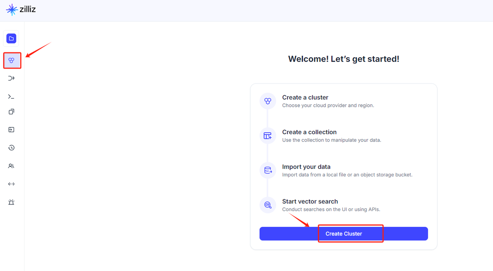

  选择免费实例：


  注意：这里需要保存好用户名和密码，用于接下来的远程连接。

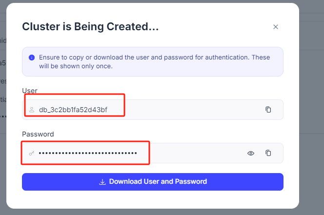

  等待创建完成后，注意关注如下信息：

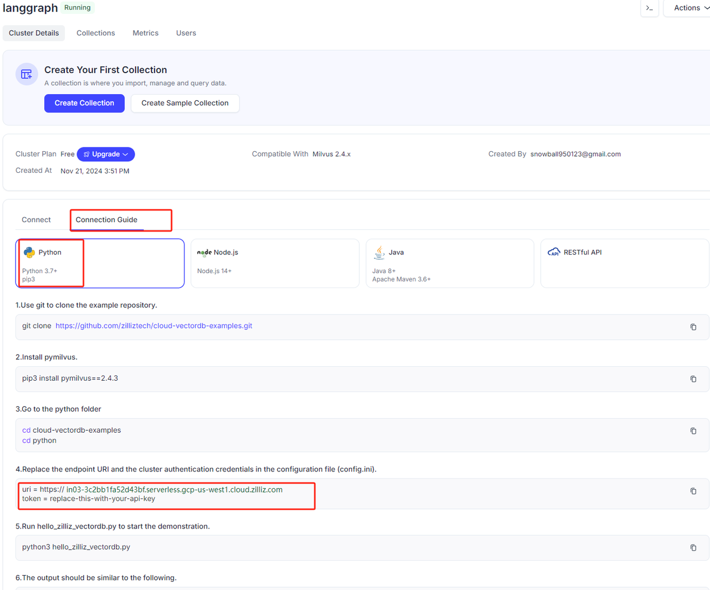

  通过如下代码构建向量索引，并存储到云端的`Milvus`向量数据库中。

```python
from langchain.text_splitter import RecursiveCharacterTextSplitter
from langchain_community.document_loaders import WebBaseLoader
from langchain_milvus import Milvus


# 添加到向量数据中
vectorstore = Milvus.from_documents(
    documents=splits,
    collection_name="fufan_rag_milvus",
    embedding=embeddings,
    connection_args={
        "uri": "https://in03-b9ed7b460b5d89f.serverless.gcp-us-west1.cloud.zilliz.com",
        "user": "db_b9ed7b460b5d89f",
        "password": "Ua3;qLNjSKWmGl6F",
    }
)
```

  同时可以登录网页端进行确认：

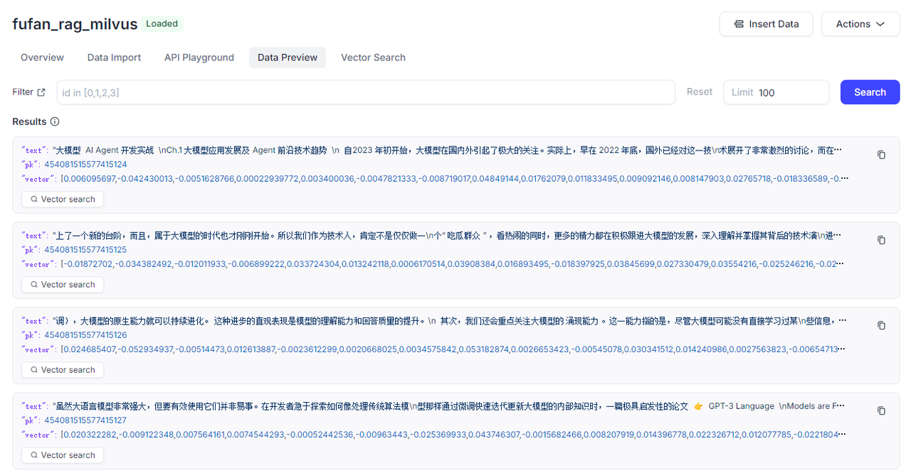

## 2.4 接入生成模型

  `LangChain`支持接入在线模型或者本地开源模型。这里我们使用`Ollama`接入通义千问最新推出的推理大模型`QWQ:32B`，当然大家也可以根据自己的实际使用情况进行灵活选择。

```python
# 如果用开源模型，可以用Ollama 接入
from langchain_ollama import ChatOllama

qwq_llm = ChatOllama(
    base_url = "http://192.168.110.131:11434",  # 注意：这里需要替换成自己本地启动的endpoint
    model="qwq:latest",
)
```

```python
print(qwq_llm.invoke("你好，请你详细的介绍一下你自己。").content)
```

```plaintext
作为阿里云开发的一款超大规模语言模型，我叫通义千问。我可以回答用户的问题、提供信息、创作文字内容等。

我是基于大量的文本数据训练出来的，具有丰富的知识和语言表达能力。我可以理解和生成自然语言，与人类进行交互。我的目标是帮助用户获得准确、有用的信息，解决他们的问题和困惑。

除了回答问题，我还可以进行创意写作，如写故事、诗歌、剧本等。我能够根据用户的指令，发挥创造力，生成独特的内容。

此外，我还具备一定的逻辑推理和 problem-solving 能力。我可以分析复杂的问题，提供合理的解决方案和建议。

总之，我是一个多功能的语言模型，致力于为用户提供优质的语言服务和帮助。
```

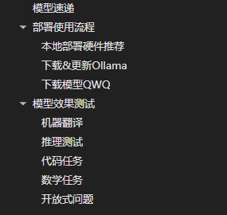

## 2.4 构建问答流程

  在完成`RAG`的`indexing`过程后，接下来我们就可以开始构建问答流程了。其中，`PromptTemplate` 是 `LangChain` 用来定义提示的类。我们定义了一个用于问答任务的提示模板。模板的内容规定了如何使用检索到的上下文回答用户的问题。{question} 和 {context} 是输入变量，分别代表用户提出的问题和检索到的相关文档内容。Answer则表示后面的部分是生成的答案，规定了返回简洁的三句话以内的回答。

```python
from langchain.prompts import PromptTemplate
from langchain import hub
from langchain_core.output_parsers import StrOutputParser

# 提示
prompt = PromptTemplate(
    template="""You are an assistant for question-answering tasks. 
    Use the following pieces of retrieved context to answer the question. If you don't know the answer, just say that you don't know. 
    Use three sentences maximum and keep the answer concise:
    Question: {question} 
    Context: {context} 
    Answer: 
    """,
    input_variables=["question", "document"],
)
```

  然后通过管道运算符 | 将 PromptTemplate、LLM 模型 (qwq\_llm) 和输出解析器 (StrOutputParser) 结合起来，构建了一个问答链。该链接收问题和文档内容，并生成简洁的回答。

```python
# 构建传统的RAG Chain
rag_chain = prompt | qwq_llm | StrOutputParser()
```

  接下来进行测试，提问了一个问题 "请问什么是 AI Agent？"，该问题将作为输入传递给链，作为问答任务的起点。vectorstore.as\_retriever() 方法会将当前的向量数据库（Milvus）转换为一个检索器，可以在给定的向量空间中执行检索操作。search\_kwargs={"k": 3} 设置检索器返回前 3 个最相关的文档。

```python
# 运行
question = "请问什么是 AI Agent？"

# 构建检索器
retriever = vectorstore.as_retriever(search_kwargs={"k": 3})

# 执行检索
docs = retriever.invoke("question")

docs
```

```plaintext
[Document(metadata={'pk': 454377259150482140}, page_content='人类的优势是能够吸收相对大量的信息，过滤掉不重要的细节，并根据关键信息做出决策。比如在\n处理一件事情之前，我们通常会先将大问题分解为一个个小的假设，然后尝试通过观察逐步支持或反驳\n这些假设。 从这个现实的观点出发，启发  AI Agent 早期范式的一篇论文  👉   REACT: SYNERGIZING  \nREASONING AND ACTING IN LANGUAGE MODELS   中使用 “ 思维链提示 ” 来模仿这个概念，它将多步\n骤问题分解为中间步骤 :\n发起一项行动，让大模型观察所选环境的反馈\n在流程中收集所有信息并使用它来决定下一步采取什么合适的行动\n迭代地执行此操作来解决更大、更复杂的任务，使用一种称为 “ 推理跟踪 ” 的方法，该方法涉及跟踪\n整个过程所经历的步骤或阶段以得出结论或解决方案\n  如下图所示，整个过程是一个动态循环。代理不断从环境中学习，通过其行动影响环境，然后根据\n环境的反馈继续调整其行动和策略。这种模式特别适用于那些需要理解和生成自然语言的应用场景，如\n聊天机器人、自动翻译系统或其他形式的自动化客户支持。\n  一个这是更加感官性的认知如下图所示：\n  如上图所示，展示了一个人工智能代理的基本架构，包括它与环境的互动、感知输入、大脑处理及\n其决策过程。具体来说：\n1. 环境（ Environment ） ： AI 代理接收来自其周围环境的信息。环境可以是一个网站、数据库或任\n何其他类型的系统。2. 感知（ Perception ） ： 即输入。 AI 代理通过多种方式感知环境，如视觉（图像）、听觉（声\n音）、文本（文字信息）和其他传感器输入（如位置、温度等）。这些输入帮助代理理解当前的环\n境状态。\n3. 大脑（ Brain ） ：\n存储（ Storage ） ：\n记忆（ Memory ） ：存储先前的经验和数据，类似于人类的记忆。\n知识（ Knowledge ） ：包括事实、信息和代理用于决策的程序。\n决策制定（ Decision Making ） ：\n总结（ Summary ） 、 回忆（ Recall ） 、 学习（ Learn ） 、 检索（ Retrieve ） ：这些功能\n帮助 AI 在需要时回顾和利用存储的知识。'),
 Document(metadata={'pk': 454377259150482131}, page_content='虽然大语言模型非常强大，但要有效使用它们并非易事。在开发者急于探索如何像处理传统算法模\n型那样通过微调快速迭代更新大模型的内部知识时，一篇极具启发性的论文  👉  GPT-3 Language  \nModels are Few-Shot Learners  提出了  In-Context Learning 的概念。该方法通过向模型提供少量标\n注的 “ 输入 - 输出对 ” 示例，在不需要大规模微调的情况下即可显著改善大模型的输出质量。这一发现开启\n了使用大模型的新方式  👇\n  当提出问题后，大模型能够以自然语言返回响应，这是生成式人工智能的一大优点。有些任务确实\n可以通过这种提示工程的方式引导大模型在对话过程中生成正确的回复，但这个过程最大的问题就是需\n要人工介入，正如上面的例子中涉及到的北京的天气信息：\n{\n \xa0"location": {\n \xa0 \xa0"city": "Beijing",\n \xa0 \xa0"country": "CN",\n \xa0 \xa0"timezone": "Asia/Shanghai",\n \xa0 \xa0"coordinates": {\n \xa0 \xa0 \xa0"latitude": 39.9042,\n \xa0 \xa0 \xa0"longitude": 116.4074\n \xa0  }\n  },\n \xa0"current": {\n \xa0 \xa0"temperature": {\n \xa0 \xa0 \xa0"value": 34,\n \xa0 \xa0 \xa0"unit": "C"  对于试图将大模型的响应与其他应用程序连接起来的开发人员来说，这就是一场噩梦。开发人员通\n常使用正则表达式  (Regex) 或提示工程将输出转换为所需的格式，然后才能将其传递到另一个应用程\n序，也就是说，这个过程中如果不需要人工介入，还想让它自动拿到这些信息，怎么做？\n  搞过开发的小伙伴对这种 JSON 数据应该非常熟悉，我们可以调用某个天气平台的 API ，比如  👉  \nOpenWeather ，输入一个城市的关键词，  就能得到该城市当前的天气信息数据，也就是如上所示的\nJSON 形式，那么这样的信息，如何让大模型自动解析，就进入到了我们探索大模型应用的第二个阶段  - \n函数调用 。\nStage 2 ：函数调用\n  2023 年  7 月， OpenAI 为其  GPT 模型引入了函数调用功能。大模型发展到现在，所有热门的大模型'),
 Document(metadata={'pk': 454377259150482136}, page_content='自然语言处理、计算机视觉等。自动驾驶汽车中的人工智能系统、推荐引擎、 Siri 、 Google Assistant 和 \nAlexa 都是狭义人工智能的形式。狭义人工智能取得了重大突破很大程度上归功于机器学习和深度学习的\n进步，由自然语言处理  (NLP) 提供支持，使其能够理解和处理人类语言。例如，人工智能系统现在在医\n学中用于高精度诊断癌症和其他疾病。\n  而我们现在期望做到的通用人工智能（ AGI ），是指 具有相当于或超越人类能力的人工智能。它涵盖\n跨不同领域学习、理解和应用知识的能力。 AGI 也被称为强人工智能。\n  所以能够感受到，我们现阶段做到的人工智能和通用人工智能之间存在根本区别。像 ChatGPT 这样\n的应用虽然掀起了新一轮的热潮，但本质上是它们也只是在做 “ 预测 ” ，通过大量数据的训练以达到生成准\n确响应的目的，但缺乏目标、身份或主动决策的概念。所以它们也只是复杂的文本生成器，没有目的或\n方向感。我们还没有完全做到 AGI ，因为现有的每个人工智能模型都只是模仿人类智能的某个方面。例\n如，大语言模型非常擅长理解和撰写文本，它们的能力常常超越人类在这些领域的表现。然而，当涉及\n到简单的算术任务时， LLMs 就会经常出现问题。\n  那么 让大模型能够自己解决更复杂的问题，现阶段提出的解决方案就是： AI Agent 。  早在  2016 年，强化学习代理就被炒得沸沸扬扬，人们试图创建不同类型的强化学习代理来玩游戏，\n从而去评判这类代理的智能性。当时还没有人工智能代理的概念。  OpenAI 进行了一系列研究，包括探\n索强化学习  (RL) 在不同领域的应用，比如游戏和网页导航。其中，有一个名为 “World of Bits” 的项目，\n就是在训练人工智能代理在复杂的网络环境中执行任务，例如订购商品或服务。这个项目是对强化学习\n技术在现实世界任务中应用潜力的探索之一。论文： 👉  World of Bits: An Open-Domain Platform for  \nWeb-Based Agents\n  如上图所示，这张论文中展示的多个网页界面中，每个界面都关联着一个特定的查询问题，用于展\n示不同类型的在线任务或服务。具体包括：\n1. 机票预订 ：从旧金山到纽约的航班预订。\n2. 餐馆搜索 ：寻找旧金山最好的韩国餐馆。')]
```

  运行 `RAG_chain`,生成最终的回复。

```python
generation = rag_chain.invoke({"context": docs, "question": question})
print(generation)
```

```plaintext
作为一个AI助手，我的目标是提供准确和有用的信息来回答用户的问题。在这个情况下，用户询问什么是“AI Agent”。通过分析提供的文档内容，我可以理解到“AI Agent”是指一种能够自主执行任务、与环境互动并根据反馈调整行为的人工智能系统。

从第一个文档中，提到“AI Agent早期范式”的论文和其中的“思维链提示”概念，可以看出AI Agent是通过分解问题、观察反馈和迭代决策来解决问题的。这表明AI Agent具有一定的自主性和适应性。

第二个文档讨论了大语言模型和In-Context Learning，以及函数调用的功能，这些似乎是实现AI Agent能力的技术手段。这说明AI Agent可能利用了先进的机器学习技术来提升其性能。

第三个文档区分了狭义人工智能和通用人工智能，并提到当前的人工智能模型，如大语言模型，虽然在某些任务上表现出色，但在其他方面仍有局限性。文档中提到的“AI Agent”可能是朝着实现更通用、更自主的人工智能方向的努力。

综合这些信息，可以得出结论：“AI Agent”是人工智能领域的一个概念，指的是能够自主执行任务、与环境互动并适应不同情况的智能体。它们可能结合了多种先进技术，如机器学习、深度学习和自然语言处理，以实现更高的智能化和自治能力。

然而，需要注意的是，尽管有这些进展，目前我们尚未达到完全的通用人工智能（AGI），现有的AI Agent仍然存在局限性，需要进一步的研究和发展。

**参考答案**

AI Agent，即人工智能代理，是指一种能够自主执行任务、与环境互动并根据反馈调整行为的人工智能系统。它们通过分解问题、观察反馈和迭代决策来解决问题，具有一定的自主性和适应性。AI Agent结合了多种先进技术，如机器学习、深度学习和自然语言处理，以实现更高的智能化和自治能力。尽管有这些进展，目前的AI Agent仍然存在局限性，需要进一步的研究和发展。
```

  以上就是通过手动 + 框架快速构建一个 RAG 问答流程的完整代码，大家也能够发现相较于全手动实现，其效率和便捷性对开发者是非常友好的。

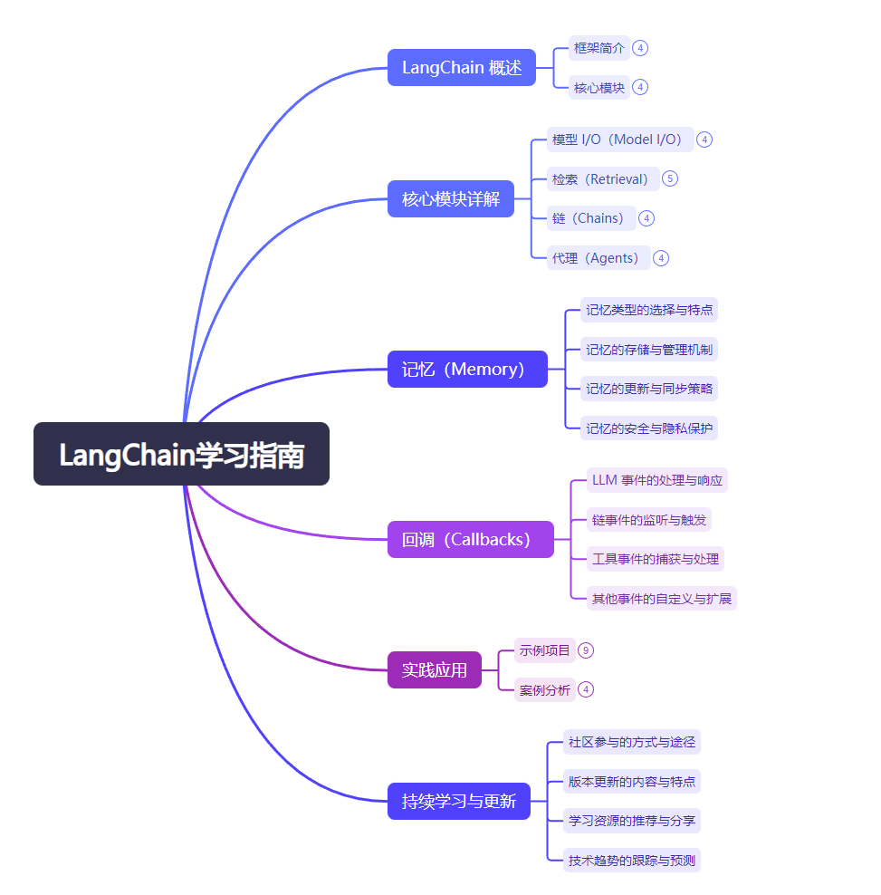

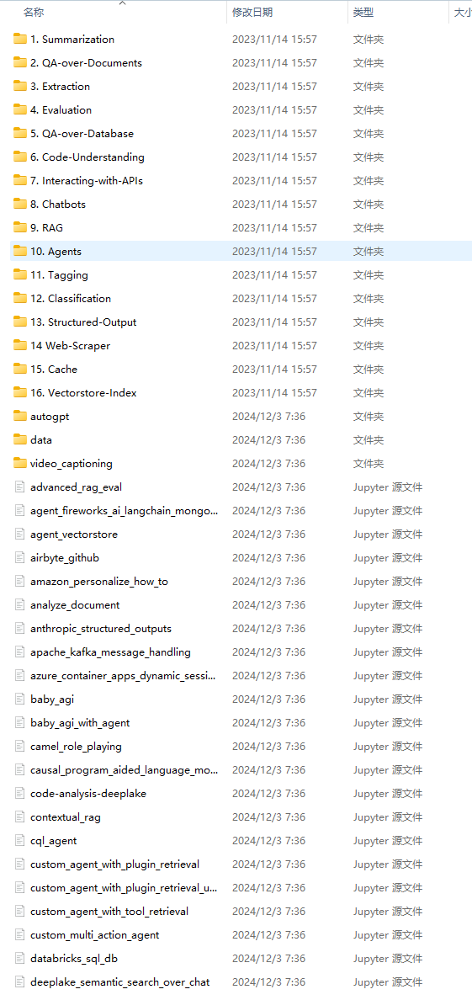

  这样的 `RAG` 应用有两个相当大的限制：

1. 仅考虑一个外部知识源。但是，某些解决方案可能需要两个外部知识源，而某些解决方案可能需要外部工具和 API，例如 Web 搜索。

2. 它们是一次性解决方案，这意味着上下文被检索一次。没有对检索到的上下文的质量进行推理或验证。

  而`AI Agent` 架构，则主要解决的就是如何集成外部的工具，自主规划完成任务所需的步骤并实际采取行动来完成任务。

# 3. 什么是 AI Agent

  AI Agent 整个过程是一个动态循环。代理不断从环境中学习，通过其行动影响环境，然后根据环境的反馈继续调整其行动和策略。这种模式特别适用于那些需要理解和生成自然语言的应用场景，如聊天机器人、自动翻译系统或其他形式的自动化客户支持。

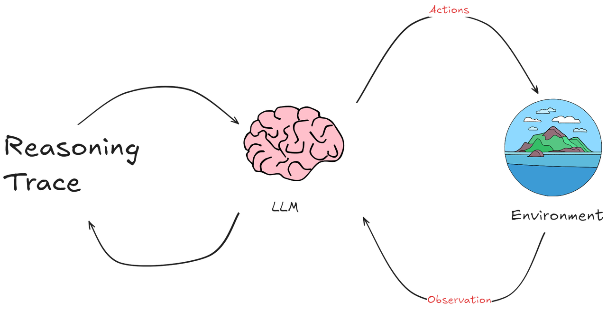

  一个这是更加感官性的认知如下图所示：


  如上图所示，展示了一个人工智能代理的基本架构，包括它与环境的互动、感知输入、大脑处理及其决策过程。具体来说：

1. **环境（Environment）**： AI代理接收来自其周围环境的信息。环境可以是一个网站、数据库或任何其他类型的系统。

2. **感知（Perception）**： 即输入。AI代理通过多种方式感知环境，如视觉（图像）、听觉（声音）、文本（文字信息）和其他传感器输入（如位置、温度等）。这些输入帮助代理理解当前的环境状态。

3. **大脑（Brain）**：

   * **存储（Storage）**：

     * **记忆（Memory）**：存储先前的经验和数据，类似于人类的记忆。

     * **知识（Knowledge）**：包括事实、信息和代理用于决策的程序。

   * **决策制定（Decision Making）**：

     * **总结（Summary）**、**回忆（Recall）**、**学习（Learn）**、**检索（Retrieve）**：这些功能帮助AI在需要时回顾和利用存储的知识。

     * **规划/推理（Planning/Reasoning）**：基于当前输入和存储的知识，制定行动计划。

4. **行动（Action）**：代理基于其感知和决策过程产生响应或行动。这可以是物理动作、发送API请求、生成文本或其他形式的输出。

  一种最流行的思想就是 `ReAct` 。 ReAct 代理可以处理顺序的多部分查询，同时通过将路由、查询规划和工具使用组合到单个实体中来维护状态（在内存中）。

  ReAct Agent 也称为 `ReAct`，是一个用于提示大语言模型的框架，它首次在 2022 年 10 月的论文[《ReAct：Synergizing Reasoning and Acting in Language Models》](https://arxiv.org/pdf/2210.03629)中引入，并于2023 年 3 月修订。该框架的开发是为了协同大语言模型中的推理和行动，使它们更加强大、通用和可解释。通过交叉推理和行动，**ReAct 使智能体能够动态地在产生想法和特定于任务的行动之间交替。**

  ReAct 框架有两个过程，由 `Reason` 和 `Act` 结合而来。从本质上讲，这种方法的灵感来自于人类如何通过和谐地结合思维和行动来执行任务，就像我们上面“我想去北京旅游”这个真实示例一样。

  首先第一部分 Reason，它基于一种推理技术——[思想链（CoT）](https://arxiv.org/pdf/2201.11903)， CoT是一种提示工程，通过将输入分解为多个逻辑思维步骤，帮助大语言模型执行推理并解决复杂问题。这使得大模型能够按顺序规划和解决任务的每个部分，从而更准确地获得最终结果，具体包括：

* 分解问题：当面对复杂的任务时，CoT 方法不是通过单个步骤解决它，而是将任务分解为更小的步骤，每个步骤解决不同方面的问题。

* 顺序思维：思维链中的每一步都建立在上一步的结果之上。这样，模型就能从头到尾构造出一条逻辑推理链。

  比如，一家商店以 100 元的价格出售产品。如果商店降价20%，然后加价10%，产品的最终价格是多少？

* 步骤 1 — 计算降价20%后的价格：如果原价是100元，商店降价20%，我们计算降价后的价格： 10 x (1–0.2) = 80.

* 步骤 2 — 计算上涨 10% 后的价格：降价后，产品价格为 80 元。现在商店涨价10%：80 x (1 + 0.1) = 88.

* 结论：先降价后加价后，产品最终售价为88元。

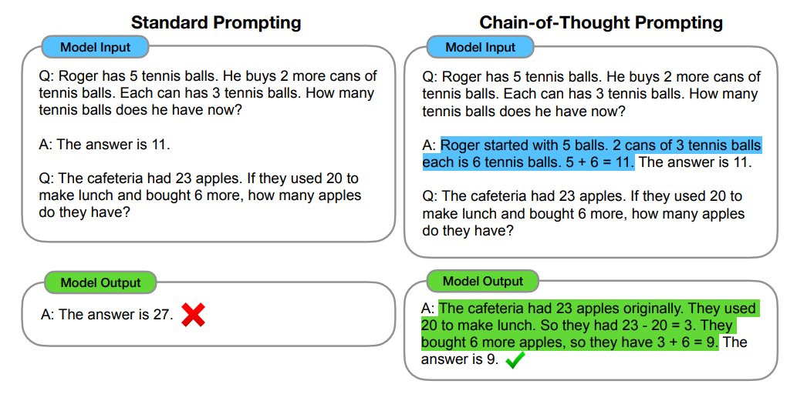

```python
# 如果用开源模型，可以用Ollama 接入
from langchain_ollama import ChatOllama

qwq_llm = ChatOllama(
    base_url = "http://192.168.110.131:11434",  # 注意：这里需要替换成自己本地启动的endpoint
    model="qwq:latest",
)
```

```python
print(qwq_llm.invoke("罗杰有5个网球，他又买了2罐网球，每罐有3个网球，他现在有多少个网球？").content)
```

```plaintext
罗杰原来有5个网球。然后他买了2罐网球，每罐里面有3个网球。我需要算一下他现在总共有多少个网球。

首先，我知道他原来有5个网球。接着，他买了2罐，每罐3个。所以，我需要先算一下这两罐里一共有多少个网球。

每罐有3个，买了2罐，所以是3乘以2，等于6个网球。

然后，把他原来的5个加上这新买的6个，总共就是5加6，等于11个网球。

所以，罗杰现在有11个网球。

不过，我再检查一下，确保没有算错。原来5个，再加上2罐，每罐3个。

第一罐是3个，第二罐也是3个，总共是6个从罐子里得到的网球。

然后，5加6确实等于11。

没错，应该是11个。

**最终答案**

\[ \boxed{11} \]
```

  但是，在 CoT 提示工程的限定下，大模型仍然会产生幻觉。因为经过长期的使用，大家发现在推理的中间阶段会产生不正确的答案或上下游的传播错误，所以，Google DeepMind 团队开发了`ReAct`的技术来弥补这一点。ReAct 采用的是 **思想-行动-观察循环**的思路，其中代理根据先前的观察进行推理以决定行动。这个迭代过程使其能够根据其行动的结果来调整和完善其方法。如下图所示：👇

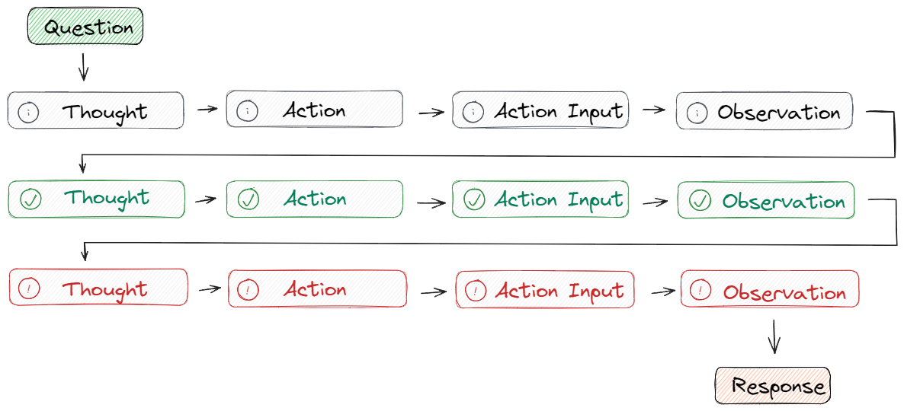

  在这个过程中，`Question`指的是用户请求的任务或需要解决的问题，`Thought`用来确定要采取的行动并向大模型展示如何创建/维护/调整行动计划，`Action Input`是用来让大模型与外部环境（例如搜索引擎、维基百科）的实时交互，包括具有预定义范围的API。而`Observation`阶段会观察执行操作结果的输出，重复此过程直至任务完成。

  与RAG的构建方法一样，目前AI Agent开发形式也可以从手动实现、框架实现和 手动+框架实现三种方式来选择，当然，手动 + 框架结合的方法依然是目前最高效的方法。

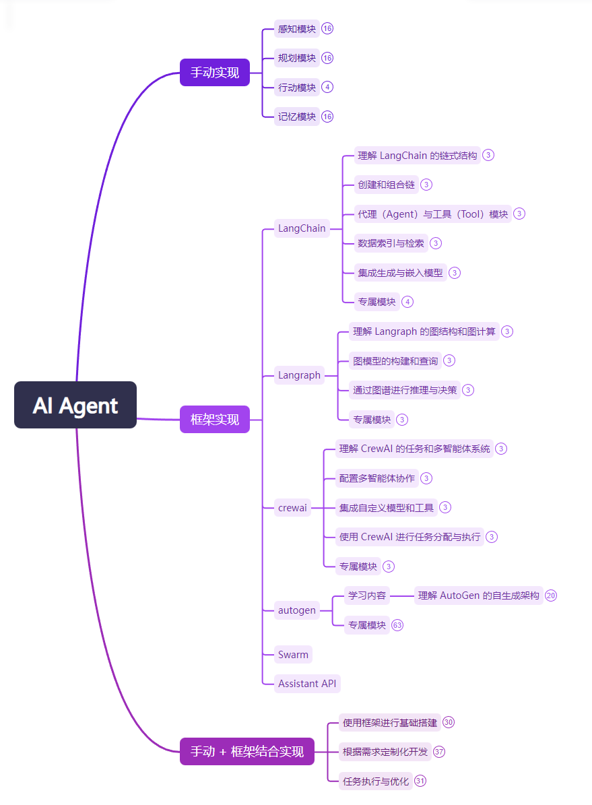

# 4. 使用LangGraph实现ReAct代理

  这里我们选择`LangGrah`从零开始实现 `ReAct` 代理。

  从名字上看，`LangGraph`应该是和`Langchain`有着非常紧密的关系，而事实也确实是这样。**因为`LangGraph` 就是以 `LangChain` 表达式语言为基础而构建起来的用于开发`AI Agent`的一个框架**。所以我们上面提到的关于`LangGragh`在大模型的支持、接入和`AI Agent`构建方面的优势，都可以非常自然的从`LangChain`中迁移过来。

```python
from typing import (
    Annotated,
    Sequence,
    TypedDict,
)
from langchain_core.messages import BaseMessage
from langgraph.graph.message import add_messages


class AgentState(TypedDict):
    """The state of the agent."""
    messages: Annotated[Sequence[BaseMessage], add_messages]
```

  然后，定义实时联网检索外部工具，通过该函数获取最新的网络数据信息。

```python
from langchain_core.tools import tool
from typing import Union, Optional
from pydantic import BaseModel, Field
import requests
import json


class SearchQuery(BaseModel):
    query: str = Field(description="Questions for networking queries")


@tool(args_schema = SearchQuery)
def fetch_real_time_info(query):
    """Get real-time Internet information"""
    url = "https://google.serper.dev/search"
    payload = json.dumps({
      "q": query,
      "num": 3,
    })
    headers = {
      'X-API-KEY': '63b0f2e139c8aef1cb3e76406d947e562e522241',   # 这里需要替换成自己的 Serper API Key
      'Content-Type': 'application/json'
    }
    
    response = requests.post(url, headers=headers, data=payload)
    data = json.loads(response.text)  # 将返回的JSON字符串转换为字典
    if 'organic' in data:
        return json.dumps(data['organic'],  ensure_ascii=False)  # 返回'organic'部分的JSON字符串
    else:
        return json.dumps({"error": "No organic results found"},  ensure_ascii=False)  # 如果没有'organic'键，返回错误信息
```

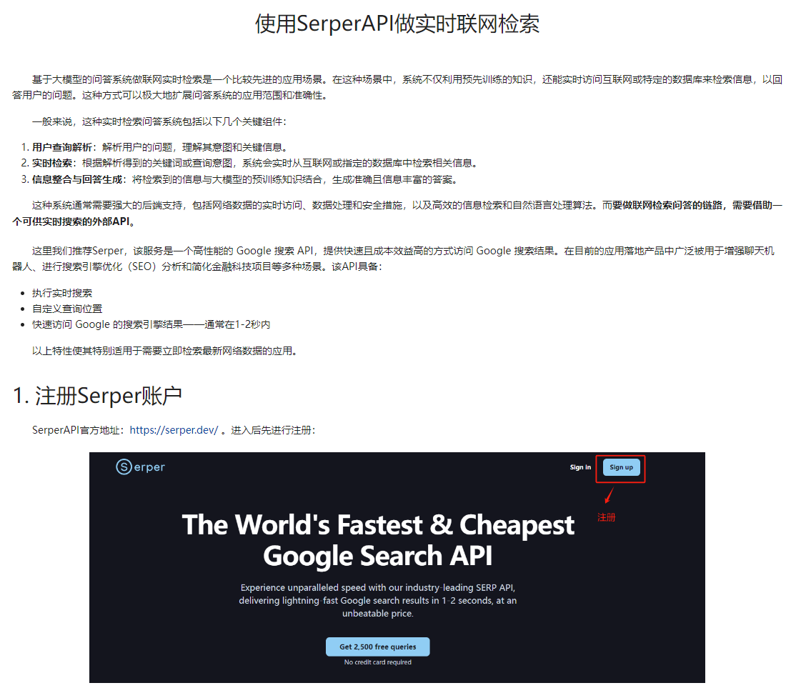

  测试一下`fetch_real_time_info`函数的有效性，正常情况下可以根据提出的问题返回相关网页的url。测试代码如下所示：

```python
fetch_real_time_info("什么是 AI Agent ？")
```

```plaintext
'[{"title": "一文读懂：AI Agent究竟是什么？-虎嗅网", "link": "https://m.huxiu.com/article/1935893.html", "snippet": "1.本文介绍了AIAgents的概念和定义，Agent是一种能够自主理解、规划决策、执行复杂任务的智能体。2.Agent的核心功能包括感知、规划和行动，类似于人类的 ...", "date": "Aug 17, 2023", "position": 1}, {"title": "OpenAI的CEO都在谈的AI Agent，到底是什么？ - 产品经理", "link": "https://www.woshipm.com/share/5911867.html", "snippet": "AI Agent是指人工智能代理（Artificial Intelligence Agent），是一种能够感知环境、进行决策和执行动作的智能实体。", "position": 2}, {"title": "万字长文解析AI Agent技术原理和应用 - 博客园", "link": "https://www.cnblogs.com/huaweiyun/p/18289995", "snippet": "AI Agent（人工智能代理）是一种能够感知环境、进行决策和执行动作的智能实体。 不同于传统的人工智能， AI Agent 具备通过独立思考、调用工具去逐步完成给定目标的能力。比如 ...", "position": 3}]'
```

```python
# 如果用开源模型，可以用Ollama 接入
from langchain_ollama import ChatOllama

qwq_llm = ChatOllama(
    base_url = "http://192.168.110.131:11434",  # 注意：这里需要替换成自己本地启动的endpoint
    model="qwq:latest",
)
```

```python
tools = [fetch_real_time_info]

model = qwq_llm.bind_tools(tools)
```

```python
import json
from langchain_core.messages import ToolMessage, SystemMessage, HumanMessage
from langchain_core.runnables import RunnableConfig

tools_by_name = {tool.name: tool for tool in tools}


# 定义工具节点
def tool_node(state: AgentState):
    outputs = []
    for tool_call in state["messages"][-1].tool_calls:
        tool_result = tools_by_name[tool_call["name"]].invoke(tool_call["args"])
        outputs.append(
            ToolMessage(
                content=json.dumps(tool_result),
                name=tool_call["name"],
                tool_call_id=tool_call["id"],
            )
        )
    return {"messages": outputs}


# 定义问答模型
def call_model(
    state: AgentState,
):
    system_prompt = SystemMessage(
        "You are a helpful AI assistant, please respond to the users query to the best of your ability!"
    )
    response = model.invoke([system_prompt] + state["messages"])
    return {"messages": [response]}


# 定义路由节点
def should_continue(state: AgentState):
    messages = state["messages"]
    last_message = messages[-1]

    if not last_message.tool_calls:
        return "end"
  
    else:
        return "continue"
```

```python
from langgraph.graph import StateGraph, END

# 定义一个图结构
workflow = StateGraph(AgentState)

# 在图结构中添加节点
workflow.add_node("agent", call_model)
workflow.add_node("tools", tool_node)

# 设置启动点是 agent
workflow.set_entry_point("agent")

# 添加路由边
workflow.add_conditional_edges(
    "agent",
    should_continue,
    {
        "continue": "tools",
        "end": END,
    },
)

# 添加返回边
workflow.add_edge("tools", "agent")

# 编译图
graph = workflow.compile()
```

```python
from IPython.display import Image, display

display(Image(graph.get_graph().draw_mermaid_png()))
```


```python
# 定义问答的流
def print_stream(stream):
    for s in stream:
        message = s["messages"][-1]
        if isinstance(message, tuple):
            print(message)
        else:
            message.pretty_print()
```

```python
inputs = {"messages": [("user", "你好，请你介绍一下你自己？")]}
print_stream(graph.stream(inputs, stream_mode="values"))
```

```plaintext
================================ Human Message =================================

你好，请你介绍一下你自己？
================================== Ai Message ==================================

作为一个AI助手，我的主要功能是帮助用户回答问题、提供信息和进行对话。我可以处理各种主题的问题，包括科技、生活建议、教育、娱乐等。我会尽力以清晰和简洁的方式提供准确的信息，并且尊重用户的隐私和提问的意图。如果你有任何问题或需要帮助，请随时告诉我！
```

```python
inputs = {"messages": [("user", "如何理解AI Agent？")]}
print_stream(graph.stream(inputs, stream_mode="values"))
```

```plaintext
================================ Human Message =================================

如何理解AI Agent？
================================== Ai Message ==================================

作为一个AI助手，我的目标是帮助用户获取信息、解决问题和提供有益的建议。我会尽力回答您的问题，并根据需要调用相应的工具来辅助处理任务。如果您有任何疑问或需要帮助，请随时告诉我！
```

```python
inputs = {"messages": [("user", "OpenAI 最近在互联网上有什么大动作？")]}
print_stream(graph.stream(inputs, stream_mode="values"))
```

```plaintext
================================ Human Message =================================

OpenAI 最近在互联网上有什么大动作？
================================== Ai Message ==================================
Tool Calls:
  fetch_real_time_info (0db3a4ae-c71f-4b97-ad2b-0b15ca1aed40)
 Call ID: 0db3a4ae-c71f-4b97-ad2b-0b15ca1aed40
  Args:
    query: What are the recent announcements and updates from OpenAI in the past month?
================================= Tool Message =================================
Name: fetch_real_time_info

"[{\"title\": \"News | OpenAI\", \"link\": \"https://openai.com/news/\", \"snippet\": \"Introducing canvas, a new way to write and code with ChatGPT. Canvas > cover image Product Oct 31, 2024 Introducing ChatGPT search Introducing search > Cover\", \"sitelinks\": [{\"title\": \"Research\", \"link\": \"https://openai.com/news/research/\"}, {\"title\": \"OpenAI and Hearst Content...\", \"link\": \"https://openai.com/index/hearst/\"}, {\"title\": \"Simplifying, stabilizing, and...\", \"link\": \"https://openai.com/index/simplifying-stabilizing-and-scaling-continuous-time-consistency-models/\"}, {\"title\": \"Product\", \"link\": \"https://openai.com/news/product/\"}], \"position\": 1}, {\"title\": \"Announcements - OpenAI Developer Forum\", \"link\": \"https://community.openai.com/c/announcements/6\", \"snippet\": \"New embedding models and API updates. 3, 10326, February 1, 2024. New AI classifier for indicating AI-written text. 10, 5365, January 27, 2024. New models and ...\", \"position\": 2}, {\"title\": \"Changelog - OpenAI API\", \"link\": \"https://platform.openai.com/docs/changelog\", \"snippet\": \"Update. Introduced a series of updates to the Assistants API , including a new file search tool allowing up to 10,000 files per assistant, new token controls ...\", \"position\": 3}]"
================================== Ai Message ==================================

看起来OpenAI最近在互联网上有不少动态。根据我调用的工具，获取了关于OpenAI的最新公告和更新的信息。从返回的结果来看，主要有以下几个方面的内容：

1. **新产品发布**：提到了“canvas”，这似乎是一个新的方式，可以用来编写和编码与ChatGPT的交互。此外，还提到了“Introducing ChatGPT search”，可能是在ChatGPT中集成了搜索功能。

2. **研究更新**：OpenAI在其新闻页面上有一个“Research”部分，可能发布了最新的研究成果或论文。

3. **合作伙伴关系**：提到“OpenAI and Hearst Content...”，这可能是OpenAI与Hearst公司的一些合作项目。

4. **技术改进**：如“Simplifying, stabilizing, and scaling continuous-time consistency models”，这表明OpenAI在模型的稳定性和扩展性方面进行了优化。

5. **API更新**：在OpenAI的开发者论坛和API变更日志中，提到了新的嵌入模型、API更新、新的AI分类器以及对Assistants API的改进，包括文件搜索工具和新的令牌控制等。

这些信息显示，OpenAI正在不断推进其产品和服务的发展，不仅在技术创新上有所突破，还在用户体验和合作伙伴关系方面进行了扩展。对于关注人工智能和机器学习的用户来说，这些都是值得关注的重要动态。
```

# 4. Agentic RAG

  `Agentic RAG（Agent-based Retrieval-Augmented Generation）`是指在传统的 RAG（Retrieval-Augmented Generation）框架中引入了 Agent（智能体）作为核心组件的变体。在标准的 RAG 系统中，主要是通过检索相关文档或信息来增强生成模型的能力，而 Agentic RAG 则通过集成一个智能体，帮助系统在搜索和生成过程中进行更智能的决策和交互。

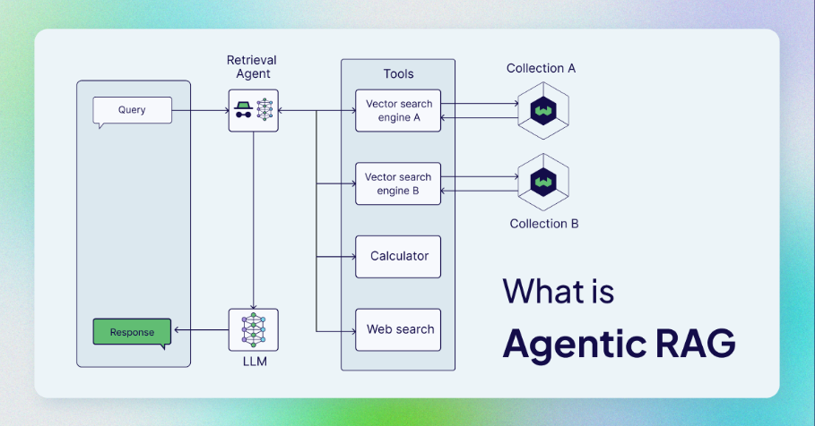

  具体来说：它将 AI 代理合并到 RAG 管道中，以编排其组件并执行简单信息检索和生成之外的其他操作，以克服非代理管道的限制。代理 RAG 最常见的是指在检索组件中使用代理。通过使用可访问不同检索器工具的检索代理而变得代理，例如：

* 矢量搜索引擎（也称为查询引擎），通过矢量索引执行矢量搜索（如典型的 RAG 管道）

* Web search 网页搜索

* 任何以编程方式访问软件的 API，例如电子邮件或聊天程序

  这里我们用 Agentic RAG 去整合 Web 搜索和传统的 RAG。首先 构建传统 `RAG` 的`Agent`节点:

```python
# 如果用开源模型，可以用Ollama 接入
from langchain_ollama import ChatOllama

qwq_llm = ChatOllama(
    base_url = "http://192.168.110.131:11434",  # 注意：这里需要替换成自己本地启动的endpoint
    model="qwq:latest",
)
```

```python
@tool
def vec_kg(question:str):

    """
    Personal knowledge base, which stores the interpretation of AI Agent project concepts
    """

    prompt = PromptTemplate(
        template="""You are an assistant for question-answering tasks. 
        Use the following pieces of retrieved context to answer the question. If you don't know the answer, just say that you don't know. 
        Use three sentences maximum and keep the answer concise:
        Question: {question} 
        Context: {context} 
        Answer: 
        """,
        input_variables=["question", "document"],
    )


    # 构建传统的RAG Chain
    rag_chain = prompt | qwq_llm | StrOutputParser()
    
    
    # 构建检索器
    retriever = vectorstore.as_retriever(search_kwargs={"k": 1})
    
    # 执行检索
    docs = retriever.invoke("question")
    generation = rag_chain.invoke({"context": docs, "question": question})
    
    return generation
```

```python
tools = [fetch_real_time_info, vec_kg]

model = qwq_llm.bind_tools(tools)
```

```python
tools
```

```plaintext
[StructuredTool(name='fetch_real_time_info', description='Get real-time Internet information', args_schema=<class '__main__.SearchQuery'>, func=<function fetch_real_time_info at 0x0000018BD9B96660>),
 StructuredTool(name='vec_kg', description='Personal knowledge base, which stores the interpretation of AI Agent project concepts', args_schema=<class 'langchain_core.utils.pydantic.vec_kg'>, func=<function vec_kg at 0x0000018BBDDE0A40>)]
```

```python
import json
from langchain_core.messages import ToolMessage, SystemMessage, HumanMessage
from langchain_core.runnables import RunnableConfig

tools_by_name = {tool.name: tool for tool in tools}


# 定义工具节点
def tool_node(state: AgentState):
    outputs = []
    for tool_call in state["messages"][-1].tool_calls:
        tool_result = tools_by_name[tool_call["name"]].invoke(tool_call["args"])
        outputs.append(
            ToolMessage(
                content=json.dumps(tool_result),
                name=tool_call["name"],
                tool_call_id=tool_call["id"],
            )
        )
    return {"messages": outputs}


# 定义问答模型
def call_model(
    state: AgentState,
):
    system_prompt = SystemMessage(
        "You are a helpful AI assistant, please respond to the users query to the best of your ability!"
    )
    response = model.invoke([system_prompt] + state["messages"])
    return {"messages": [response]}


# 定义路由节点
def should_continue(state: AgentState):
    messages = state["messages"]
    last_message = messages[-1]

    if not last_message.tool_calls:
        return "end"
  
    else:
        return "continue"
```

```python
from langgraph.graph import StateGraph, END

# 定义一个图结构
workflow = StateGraph(AgentState)

# 在图结构中添加节点
workflow.add_node("agent", call_model)
workflow.add_node("tools", tool_node)

# 设置启动点是 agent
workflow.set_entry_point("agent")

# 添加路由边
workflow.add_conditional_edges(
    "agent",
    should_continue,
    {
        "continue": "tools",
        "end": END,
    },
)

# 添加返回边
workflow.add_edge("tools", "agent")

# 编译图
graph = workflow.compile()
```

```python
from IPython.display import Image, display

display(Image(graph.get_graph().draw_mermaid_png()))
```

```python
# 定义问答的流
def print_stream(stream):
    for s in stream:
        message = s["messages"][-1]
        if isinstance(message, tuple):
            print(message)
        else:
            message.pretty_print()
```

```python
inputs = {"messages": [("user", "OpenAI 最近在互联网上有什么新闻？注意，请使用中文回复。")]}
print_stream(graph.stream(inputs, stream_mode="values"))
```

```python
inputs = {"messages": [("user", "请检索我的知识库并总结一下什么是 AI Agent， 注意，请使用中文回复。")]}
print_stream(graph.stream(inputs, stream_mode="values"))
```

```plaintext
================================ Human Message =================================

请检索我的知识库并总结一下什么是 AI Agent， 注意，请使用中文回复。
================================== Ai Message ==================================
Tool Calls:
  vec_kg (e9f93758-b690-47cd-952d-af9d4f6428f5)
 Call ID: e9f93758-b690-47cd-952d-af9d4f6428f5
  Args:
    question: 什么是AI Agent？
================================= Tool Message =================================
Name: vec_kg

"AI Agent\u662f\u4e00\u79cd\u4eba\u5de5\u667a\u80fd\u7cfb\u7edf\uff0c\u80fd\u591f\u4e0e\u73af\u5883\u4e92\u52a8\u3001\u611f\u77e5\u8f93\u5165\u5e76\u505a\u51fa\u51b3\u7b56\u3002\u5b83\u901a\u8fc7\u6536\u96c6\u4fe1\u606f\u3001\u5206\u6790\u548c\u5b66\u4e60\u6765\u9002\u5e94\u4e0d\u540c\u7684\u4efb\u52a1\u548c\u60c5\u5883\u3002\u8fd9\u79cd\u4ee3\u7406\u7279\u522b\u9002\u7528\u4e8e\u9700\u8981\u5904\u7406\u590d\u6742\u95ee\u9898\u548c\u81ea\u7136\u8bed\u8a00\u4ea4\u4e92\u7684\u573a\u666f\uff0c\u5982\u804a\u5929\u673a\u5668\u4eba\u548c\u81ea\u52a8\u7ffb\u8bd1\u7cfb\u7edf\u3002"
================================== Ai Message ==================================

根据知识库的回复，AI Agent是一种人工智能系统，能够与环境互动、感知输入并做出决策。它通过收集信息、分析和学习来适应不同的任务和情境。这种代理特别适用于需要处理复杂问题和自然语言交互的场景，比如聊天机器人和自动翻译系统。
```

```python
inputs = {"messages": [("user", "请检索我的知识库，并实时联网检索，结合两部分的信息帮我总结：什么是 AI Agent？注意，请使用中文回复。")]}
print_stream(graph.stream(inputs, stream_mode="values"))
```

```plaintext
================================ Human Message =================================

请检索我的知识库，并实时联网检索，结合两部分的信息帮我总结：什么是 AI Agent？注意，请使用中文回复。
================================== Ai Message ==================================
Tool Calls:
  vec_kg (a9ce85ae-10ac-4521-b3bd-de95c30b9480)
 Call ID: a9ce85ae-10ac-4521-b3bd-de95c30b9480
  Args:
    question: 什么是 AI Agent？
  fetch_real_time_info (ce5e7784-8d41-42ce-9851-985b24f124c6)
 Call ID: ce5e7784-8d41-42ce-9851-985b24f124c6
  Args:
    query: 什么是 AI Agent？
================================= Tool Message =================================
Name: fetch_real_time_info

"[{\"title\": \"\u4e00\u6587\u8bfb\u61c2\uff1aAI Agent\u7a76\u7adf\u662f\u4ec0\u4e48\uff1f-\u864e\u55c5\u7f51\", \"link\": \"https://m.huxiu.com/article/1935893.html\", \"snippet\": \"1.\u672c\u6587\u4ecb\u7ecd\u4e86AIAgents\u7684\u6982\u5ff5\u548c\u5b9a\u4e49\uff0cAgent\u662f\u4e00\u79cd\u80fd\u591f\u81ea\u4e3b\u7406\u89e3\u3001\u89c4\u5212\u51b3\u7b56\u3001\u6267\u884c\u590d\u6742\u4efb\u52a1\u7684\u667a\u80fd\u4f53\u30022.Agent\u7684\u6838\u5fc3\u529f\u80fd\u5305\u62ec\u611f\u77e5\u3001\u89c4\u5212\u548c\u884c\u52a8\uff0c\u7c7b\u4f3c\u4e8e\u4eba\u7c7b\u7684 ...\", \"date\": \"Aug 17, 2023\", \"position\": 1}, {\"title\": \"OpenAI\u7684CEO\u90fd\u5728\u8c08\u7684AI Agent\uff0c\u5230\u5e95\u662f\u4ec0\u4e48\uff1f - \u4ea7\u54c1\u7ecf\u7406\", \"link\": \"https://www.woshipm.com/share/5911867.html\", \"snippet\": \"AI Agent\u662f\u6307\u4eba\u5de5\u667a\u80fd\u4ee3\u7406\uff08Artificial Intelligence Agent\uff09\uff0c\u662f\u4e00\u79cd\u80fd\u591f\u611f\u77e5\u73af\u5883\u3001\u8fdb\u884c\u51b3\u7b56\u548c\u6267\u884c\u52a8\u4f5c\u7684\u667a\u80fd\u5b9e\u4f53\u3002\", \"position\": 2}, {\"title\": \"\u4e07\u5b57\u957f\u6587\u89e3\u6790AI Agent\u6280\u672f\u539f\u7406\u548c\u5e94\u7528 - \u535a\u5ba2\u56ed\", \"link\": \"https://www.cnblogs.com/huaweiyun/p/18289995\", \"snippet\": \"AI Agent\uff08\u4eba\u5de5\u667a\u80fd\u4ee3\u7406\uff09\u662f\u4e00\u79cd\u80fd\u591f\u611f\u77e5\u73af\u5883\u3001\u8fdb\u884c\u51b3\u7b56\u548c\u6267\u884c\u52a8\u4f5c\u7684\u667a\u80fd\u5b9e\u4f53\u3002 \u4e0d\u540c\u4e8e\u4f20\u7edf\u7684\u4eba\u5de5\u667a\u80fd\uff0c AI Agent \u5177\u5907\u901a\u8fc7\u72ec\u7acb\u601d\u8003\u3001\u8c03\u7528\u5de5\u5177\u53bb\u9010\u6b65\u5b8c\u6210\u7ed9\u5b9a\u76ee\u6807\u7684\u80fd\u529b\u3002\u6bd4\u5982 ...\", \"position\": 3}]"
================================== Ai Message ==================================

根据您提供的信息，AI Agent是一种人工智能系统，能够与环境交互并根据收到的反馈来做出决策和调整行为。这种代理通常具备感知、规划和行动的核心功能，类似于人类的思考过程。它们可以自主地理解环境，制定策略，并执行复杂的任务。

从技术角度来看，AI Agent结合了多种人工智能和技术，如机器学习、自然语言处理、计算机视觉等，以模拟人类的认知和决策过程。这些代理可以被设计来执行各种任务，从简单的自动化操作到复杂的 problem-solving 和战略规划。

在实际应用中，AI Agent已经在多个领域展现出巨大的潜力，包括但不限于：

1. **客户服务**：通过聊天机器人提供24/7的客户支持。
2. **智能家居**：控制家中的设备，如灯光、温度等，以提高生活便利性。
3. **金融服务**：用于自动化交易、风险评估和个性化投资建议。
4. **医疗健康**：辅助诊断疾病、管理患者数据和提供个性化的治疗方案。
5. **自动驾驶**：在汽车、无人机和其他交通工具中实现自主导航和决策。

随着技术的不断进步，AI Agent的能力将继续增强，它们将在更多的领域发挥重要作用，推动社会和经济的发展。同时，也需要关注相关的伦理和社会问题，确保这些技术的安全和公正使用。
```

  当然，也会存在一些问题，比如：推理模型仅做步骤拆解，但不会触发访问web检索或者RAG的操作，如下所示：

```python
inputs = {"messages": [("user", "请检索我的知识库，并实时联网检索，结合两部分的信息帮我总结：什么是 AI Agent。注意：请使用中文回答我")]}
print_stream(graph.stream(inputs, stream_mode="values"))
```

```plaintext
================================ Human Message =================================

请检索我的知识库，并实时联网检索，结合两部分的信息帮我总结：什么是 AI Agent。注意：请使用中文回答我
================================== Ai Message ==================================

作为一个人工智能助手，我能够理解并响应您的请求。您希望我从个人知识库中检索信息，并结合实时网络搜索的结果，来总结什么是“AI Agent”，并且要求用中文回答。

首先，我会调用“vec_kg”函数来查询我的知识库，以获取关于“AI Agent”的定义和相关概念。然后，我将使用“fetch_real_time_info”函数来进行实时的互联网搜索，以便获得最新的信息和不同的视角。最后，我将会综合这两个来源的信息，为您提供一个全面的总结。

请稍等，我将开始执行这些步骤。
```

  

  或者产生幻觉，直接说自己无法访问知识库。如下所示：

```python
inputs = {"messages": [("user", "请检索我的知识库，帮我总结一下什么是 AI Agent， 注意，请使用中文回复。")]}
print_stream(graph.stream(inputs, stream_mode="values"))
```

```plaintext
================================ Human Message =================================

请检索我的知识库，帮我总结一下什么是 AI Agent， 注意，请使用中文回复。
================================== Ai Message ==================================

很抱歉，作为一个AI助手，我无法直接访问您的个人知识库。不过，我可以尝试为您解释什么是AI Agent。

AI Agent，即人工智能代理，是一种能够自主执行任务、做出决策并适应环境变化的计算机程序或系统。它们通常具备一定的智能水平，可以模拟人类的认知和行为，以实现特定的目标或解决复杂的问题。

AI Agent的核心特点包括：

1. **自主性**：能够在没有人工干预的情况下独立运作。
2. **感知能力**：能够通过传感器或其他方式获取环境信息。
3. **决策能力**：根据接收到的信息做出合理的决策。
4. **适应性**：能够适应不断变化的环境和条件。
5. **学习能力**：能够从经验中学习并改进自己的性能。

AI Agent的应用非常广泛，涵盖了机器人、自动驾驶汽车、智能家居系统、虚拟助手等多个领域。它们通过模拟人类的智能行为，为人们的生活和工作带来了极大的便利。

如果您有其他关于AI Agent的问题，欢迎向我提问！
```

  以上存在的问题使我们在做AI Agent 开发过程中基本都会遇到的情况，同时也是根据实际业务做特定优化的主要工作。

  实践到这里，大家应该已经对大模型目前最前沿技术有了一个基本的认识，而接下来的这样一个大模型技术栈全景指南，一定能进一步的提升大家对大模型的理解，和指明学习的思路，涵盖在线模型的调用和参数详解，开源模型的部署和调用，RAG、AI Agent 的手动实现和各个热门框架的详解，以及四大企业级落地项目的从零到一构建。

公主号【赋范空间】回【99】领取完整课件，还有大模型开发体系大课，从0到1直通大模型算法工程师
