## 《大模型与Agent开发实战》（12月班）体验课

## GraphRAG+ollama本地部署流程实战

### 本节目录

1. GraphRAG项目回顾

   * 微软开源的GraphRAG项目简介

   * GraphRAG+ollama本地部署优势

2. Ollama项目介绍与核心功能速览

   * Ollama项目介绍

   * Ollama运行所需硬件支持

   * Ollama快速使用方法

   * 使用ModelScope平台上的GGUF格式的大模型

3. 创建适配GraphRAG的本地ollama+大模型运行环境

   * Step 1.使用pip安装graphrag

   * Step 2.创建检索项目文件夹

   * Step 3.上传数据集

   * Step 4.初始化项目文件

   * Step 5.修改项目配置

4. GraphRAG源码修改

5. 基于Ollama+GraphRAG的本地知识检索增强流程

### 一、GraphRAG项目回顾


* 微软开源的GraphRAG项目简介

  **检索增强生成（RAG）** 是一种通过结合真实世界的信息来提升大型语言模型（LLM）输出质量的技术。RAG 技术是大多数基于 LLM 的工具中的一个重要组成部分。大多数 RAG 方法使用 **向量相似性** 作为检索技术，我们将其称为 **基线 RAG（Baseline RAG）**。

**GraphRAG** 则使用 **知识图谱** 来在推理复杂信息时显著提升问答性能。当需要对复杂数据进行推理时，GraphRAG 展示了优于基线 RAG 的性能，特别是在 **知识图谱** 的帮助下。

  RAG 技术在帮助 LLM 推理私有数据集方面显示了很大的潜力——例如，LLM 没有在训练时接触过的、企业的专有研究、业务文档或通信数据。基线 RAG 技术最初是为了解决这个问题而提出的，但我们观察到，在某些情况下，基线 RAG 的表现并不理想。以下是几个典型的场景：

1. **基线 RAG 很难将信息串联起来**：当一个问题的答案需要通过多个不同的信息片段，并通过它们共享的属性来连接，进而提供新的综合见解时，基线 RAG 表现得很差。

2. 例如，在回答类似“如何通过现有的数据推断出新结论”这种问题时，基线 RAG 无法很好地处理这些散布在不同文档中的相关信息，它可能会遗漏一些关键联系点。

3. **基线 RAG 无法有效理解大型数据集或单一大文档的整体语义概念**：当被要求在大量数据或复杂文档中进行总结、提炼和理解时，基线 RAG 往往表现不佳。

4. 例如，如果问题要求对整个文档或多篇文档的主题进行总结和理解，基线 RAG 的简单向量检索方法可能无法处理文档间的复杂关系，导致对全局语义的理解不完整。

  为了应对这些挑战，技术社区正在努力开发扩展和增强 RAG 的方法。**微软研究院**（Microsoft Research）提出的 **GraphRAG** 方法，使用 **LLM** 基于输入语料库构建 **知识图谱**。这个图谱与社区总结和图谱机器学习输出结合，能够在查询时增强提示（prompt）。GraphRAG 在回答以上两类问题时，展示了 **显著的改进**，尤其是在 **复杂信息的推理能力** 和 **智能性** 上，超越了基线 RAG 之前应用于私有数据集的其他方法。

* GraphRAG+ollama本地部署优势

  接下来我们考虑将GraphRAG与Ollama本地部署结合使用，能够显著提升知识图谱构建与查询的效率，且具备多方面的优势：

1. **高效的数据处理与查询**：GraphRAG采用图神经网络和图计算技术，能够快速处理海量数据，并基于深度学习生成精确的知识图谱。结合Ollama的本地大语言模型，可以在无需依赖外部云服务的情况下，直接在本地环境中进行快速、精准的查询和推理，大大减少了网络延迟和外部API调用的依赖。

2. **数据隐私与安全性**：本地部署意味着数据无需上传至外部服务器，能够完全控制数据访问和处理流程。这对于需要严格数据隐私保护的企业和机构来说，是一个至关重要的优势，确保了敏感信息不会泄露或受到不必要的访问。

3. **可定制化与灵活性**：GraphRAG和Ollama都提供了高灵活性的API接口，用户可以根据自己的需求定制图谱构建流程和查询策略。同时，本地部署可以根据具体的硬件资源进行优化，提供更高的计算性能和可扩展性。

4. **减少云计算费用**：通过将GraphRAG与Ollama部署在本地服务器，企业可以减少对云计算资源的依赖，降低长期的运营成本，尤其是对需要频繁进行大规模图谱查询和处理的场景，能够显著节省云服务费用。

5. **实时响应与高吞吐量**：结合本地部署的硬件优势，GraphRAG与Ollama能够实现实时的知识图谱查询和生成，满足对高吞吐量和快速响应的需求。这对于实时数据分析、决策支持系统等应用场景尤为重要。

6. **无缝集成与扩展性**：GraphRAG与Ollama的本地部署不仅能无缝集成现有的IT基础设施，还能够随着业务需求的变化灵活扩展。用户可以根据自己的应用场景，进一步集成其他工具和框架，形成强大的知识处理与推理平台。

通过GraphRAG和Ollama的本地部署，企业和开发者能够在保证数据安全和隐私的前提下，实现高效、灵活、低成本的知识图谱构建与查询，推动智能决策和业务创新。

### 二、Ollama项目介绍与核心功能速览

#### 1.Ollama项目介绍

  Ollama 是一个**开源**的大语言模型服务工具，专注于简化本地模型的创建、管理和部署流程。它允许用户轻松部署和管理多种流行的**开源模型**，如 Llama、Mistral 和 Code Llama。以下是 Ollama 的一些主要特点和功能：

主要特点：

* 简化部署：
  Ollama 通过将模型权重、配置和数据捆绑到一个称为 Modelfile 的包中，简化了模型的安装和配置过程，使得用户可以更方便地管理和运行这些模型。

* 跨平台支持：
  Ollama 支持多种操作系统，包括 macOS、Linux 和 Windows。用户只需下载相应平台的安装包即可快速安装和使用。

* 命令行操作：
  用户可以通过简单的命令行指令来启动和运行模型。例如，运行一个模型只需执行类似 ollama run model\_name 的命令。

* 资源要求：
  相较于传统部署调用模型的方法，Ollama模型支持推理的均为量化后的模型，这种方式对硬件资源的需求更低，更适合开发者快速上手。

* API 接口：
  Ollama 提供了类似 OpenAI 的 API 接口，用户可以通过这些接口与模型进行交互，支持热加载模型文件，无需重新启动即可切换不同的模型。

Ollama 非常适合需要在本地运行大语言模型的开发者和企业，如：

* 开发和测试：在本地快速创建和测试新的语言模型。

* 隐私保护：在本地部署模型，适用于有严格隐私需求的企业。

* 多模型管理：轻松管理和部署多个模型，适合有大量模型管理需求的团队。

Ollama 适用于学术研究、个人项目开发以及企业知识库问答等多种场景，帮助用户在本地环境中快速实验和部署大型语言模型。

总的来说，Ollama 为希望在本地运行和实验大型语言模型的用户提供了一个方便且高效的解决方案。

#### 2.Ollama运行所需硬件支持

  下列表格是Ollama支持的全部显卡的列表，大家可以参考来确定自己的设备是否可以使用该推理框架。

Nvidia英伟达系列显卡：


AMD系列显卡：

* Linux环境：


* Windows环境：


#### 3.Ollama快速使用方法

本小节快速介绍如果上手使用Ollama并完成一次模型的部署、启动。

在搜索栏（Search models）中输入你想要的模型的名称，在下方界面便会显示平台上支持的模型列表：

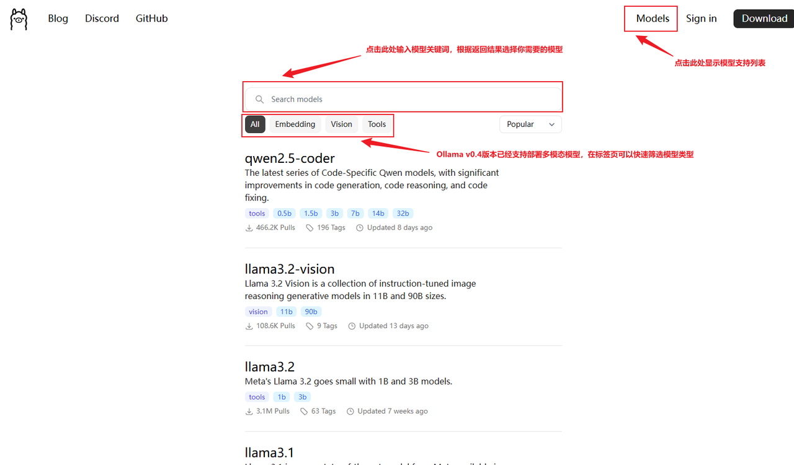

这里以qwen2.5为例进行部署演示：


每个模型下面有支持的功能和参数型号以及基本的模型描述，点击进入对应模型可以看到下载所需占用的内存大小。


点击左边下拉列表可以选择不同参数的模型，大家可以根据自己的硬件条件和使用需要来选择对应的模型，在右侧会显示对应模型的启动代码。

**使用7b模型需要6G左右的显存，14b模型需要12G左右的显存，72b模型需要60G的显存进行推理。**

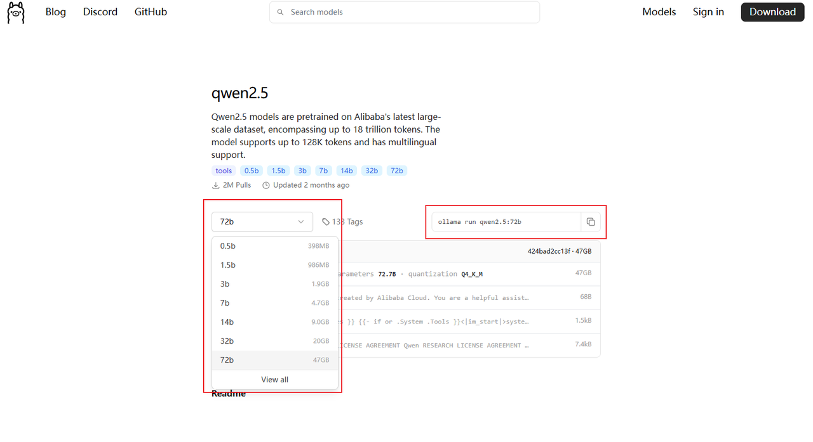

**下载模型**

在终端中执行命令 `ollama run qwen2.5：72b` ，即可下载 qwen2.5：72b 模型。模型下载完成后，会自动启动大模型，进入命令行交互模式，直接输入指令，就可以和模型进行对话了对应参数的模型的下载方式可以通过在Ollama官网查看到下载指令。当出现`success`字样的时候说明下载成功，当出现`>>>`图标的时候可以进行对话交互了。

```plaintext
ollama run qwen2.5:72b
```


完成下载后会直接进入模型启动状态，如果退出或刷新界面，再次输入指令`ollama run qwen2.5:72b`即可启动对应模型。
可以看到推理所需的计算资源相对均匀的分布在每张工作显卡上。

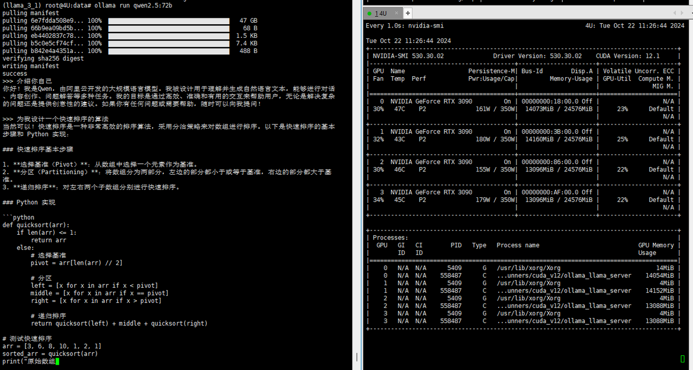

如果想结束对话，直接在对话栏中输入`/bye`即可结束进程。


#### 4.使用ModelScope平台上的GGUF格式的大模型

如果要使用的模型不在 Ollama 模型库，可以通过选择GGUF (GPT-Generated Unified Format)模型来实现部署、使用。
GGUF 是由 llama.cpp 定义的一种高效存储和交换大模型预训练结果的二进制格式。

Ollama 支持采用 Modelfile 文件中导入 GGUF 模型。

* Ollama 是一个基于开源推理引擎 llama.cpp 构建的大模型推理工具框架。借助底层引擎的高效推理能力以及对多种硬件的适配支持，Ollama 可以在包括 CPU 和 GPU 在内的多种硬件环境上运行各种精度的 GGUF 格式大模型。通过简单的命令行操作，即可快速启动 LLM 模型服务。

* ModelScope 社区托管了数千个高质量的 GGUF 格式大模型，并支持与 Ollama 框架和 ModelScope 平台的无缝对接。用户只需使用简单的 ollama run 命令，即可直接加载并运行 ModelScope 模型库中的 GGUF 模型。

ModelScope官网链接如下：https://www.modelscope.cn/models

使用Ollama下载和使用GGUF格式的模型在方法上没有变化，依旧是在命令行中输入以下命令即可实现：

```plaintext
ollama run modelscope.cn/{model-id}
```

其中model-id的具体格式为{username}/{model},这个信息可以在modelscope上每个模型自己的标签页上查看并复制。

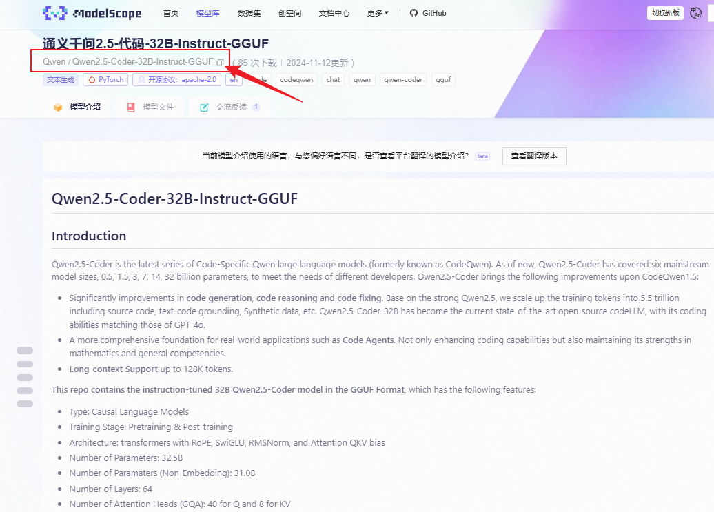

### 三、创建适配GraphRAG的本地ollama+大模型运行环境

#### Step 1.基础环境搭建

* **创建虚拟环境**

```bash
conda create --name graphrag-ollama python=3.10
conda init
source ~/.bashrc
conda activate graphrag-ollama
conda install jupyterlab
conda install ipykernel
python -m ipykernel install --user --name graphrag-ollama --display-name "Python (graphrag-ollama)"
```

* **安装魔搭社区**

```bash
pip install modelscope
```

```python
!pip install modelscope
```

```plaintext
Looking in indexes: http://mirrors.aliyun.com/pypi/simple
Requirement already satisfied: modelscope in /root/miniconda3/envs/graphrag/lib/python3.11/site-packages (1.20.1)
Requirement already satisfied: requests>=2.25 in /root/miniconda3/envs/graphrag/lib/python3.11/site-packages (from modelscope) (2.32.3)
Requirement already satisfied: tqdm>=4.64.0 in /root/miniconda3/envs/graphrag/lib/python3.11/site-packages (from modelscope) (4.67.1)
Requirement already satisfied: urllib3>=1.26 in /root/miniconda3/envs/graphrag/lib/python3.11/site-packages (from modelscope) (2.2.3)
Requirement already satisfied: charset-normalizer<4,>=2 in /root/miniconda3/envs/graphrag/lib/python3.11/site-packages (from requests>=2.25->modelscope) (3.3.2)
Requirement already satisfied: idna<4,>=2.5 in /root/miniconda3/envs/graphrag/lib/python3.11/site-packages (from requests>=2.25->modelscope) (3.7)
Requirement already satisfied: certifi>=2017.4.17 in /root/miniconda3/envs/graphrag/lib/python3.11/site-packages (from requests>=2.25->modelscope) (2024.8.30)
WARNING: Running pip as the 'root' user can result in broken permissions and conflicting behaviour with the system package manager, possibly rendering your system unusable.It is recommended to use a virtual environment instead: https://pip.pypa.io/warnings/venv. Use the --root-user-action option if you know what you are doing and want to suppress this warning.

```

https://www.modelscope.cn/

* **安装ollama**

https://ollama.com/

```python
!curl -fsSL https://ollama.com/install.sh | sh
```

```plaintext
>>> Installing ollama to /usr/local
^C
```


* **安装ollama Python SDK**

```python
!pip install ollama
```

```plaintext
Looking in indexes: http://mirrors.aliyun.com/pypi/simple
Requirement already satisfied: ollama in /root/miniconda3/envs/graphrag-ollama/lib/python3.10/site-packages (0.4.2)
Requirement already satisfied: httpx<0.28.0,>=0.27.0 in /root/miniconda3/envs/graphrag-ollama/lib/python3.10/site-packages (from ollama) (0.27.0)
Requirement already satisfied: pydantic<3.0.0,>=2.9.0 in /root/miniconda3/envs/graphrag-ollama/lib/python3.10/site-packages (from ollama) (2.10.2)
Requirement already satisfied: anyio in /root/miniconda3/envs/graphrag-ollama/lib/python3.10/site-packages (from httpx<0.28.0,>=0.27.0->ollama) (4.6.2)
Requirement already satisfied: certifi in /root/miniconda3/envs/graphrag-ollama/lib/python3.10/site-packages (from httpx<0.28.0,>=0.27.0->ollama) (2024.8.30)
Requirement already satisfied: httpcore==1.* in /root/miniconda3/envs/graphrag-ollama/lib/python3.10/site-packages (from httpx<0.28.0,>=0.27.0->ollama) (1.0.2)
Requirement already satisfied: idna in /root/miniconda3/envs/graphrag-ollama/lib/python3.10/site-packages (from httpx<0.28.0,>=0.27.0->ollama) (3.7)
Requirement already satisfied: sniffio in /root/miniconda3/envs/graphrag-ollama/lib/python3.10/site-packages (from httpx<0.28.0,>=0.27.0->ollama) (1.3.0)
Requirement already satisfied: h11<0.15,>=0.13 in /root/miniconda3/envs/graphrag-ollama/lib/python3.10/site-packages (from httpcore==1.*->httpx<0.28.0,>=0.27.0->ollama) (0.14.0)
Requirement already satisfied: annotated-types>=0.6.0 in /root/miniconda3/envs/graphrag-ollama/lib/python3.10/site-packages (from pydantic<3.0.0,>=2.9.0->ollama) (0.7.0)
Requirement already satisfied: pydantic-core==2.27.1 in /root/miniconda3/envs/graphrag-ollama/lib/python3.10/site-packages (from pydantic<3.0.0,>=2.9.0->ollama) (2.27.1)
Requirement already satisfied: typing-extensions>=4.12.2 in /root/miniconda3/envs/graphrag-ollama/lib/python3.10/site-packages (from pydantic<3.0.0,>=2.9.0->ollama) (4.12.2)
Requirement already satisfied: exceptiongroup>=1.0.2 in /root/miniconda3/envs/graphrag-ollama/lib/python3.10/site-packages (from anyio->httpx<0.28.0,>=0.27.0->ollama) (1.2.0)
WARNING: Running pip as the 'root' user can result in broken permissions and conflicting behaviour with the system package manager, possibly rendering your system unusable.It is recommended to use a virtual environment instead: https://pip.pypa.io/warnings/venv. Use the --root-user-action option if you know what you are doing and want to suppress this warning.

```

* **启动ollama**

```bash
ollama start
```


* **创建模存放型文件夹**

```bash
cd ~/auto-tmp
mkdir models
```

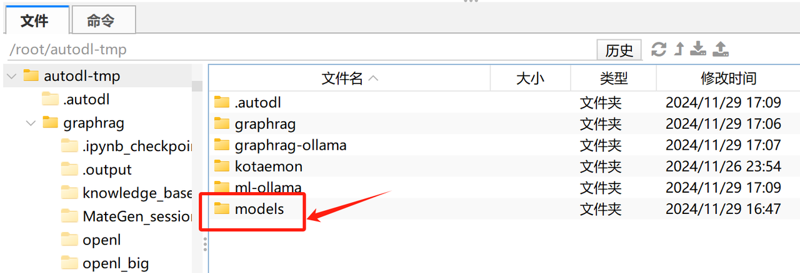

#### Step 2.模型文件下载

* **下载Embedding模型**

  首先找到合适的Embedding模型：

https://ollama.com/library/nomic-embed-text

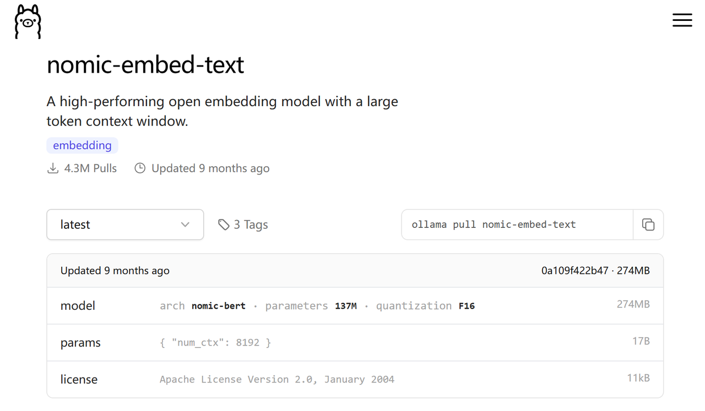

考虑到国内网络环境，推荐在魔搭社区下载GGUF模型文件以便直接调用：

https://www.modelscope.cn/models/Embedding-GGUF/nomic-embed-text-v1.5-GGUF

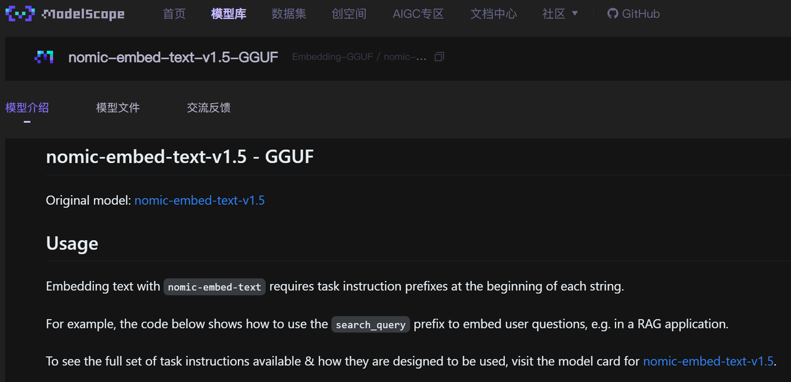

然后即可使用如下命令进行下载：

```bash
modelscope download --model Embedding-GGUF/nomic-embed-text-v1.5-GGUF nomic-embed-text-v1.5.f16.gguf --local_dir /root/autodl-tmp/models
```


下载完成后即可在对应文件夹内查看模型文件


* **下载Qwen 2.5模型**

https://www.modelscope.cn/models/Qwen/Qwen2.5-7B-Instruct-GGUF


使用如下命令进行模型下载：

```bash
modelscope download --model Qwen/Qwen2.5-7B-Instruct-GGUF qwen2.5-7b-instruct-q4_k_m.gguf --local_dir /root/autodl-tmp/models
```


下载完成后即可在文件中查看：

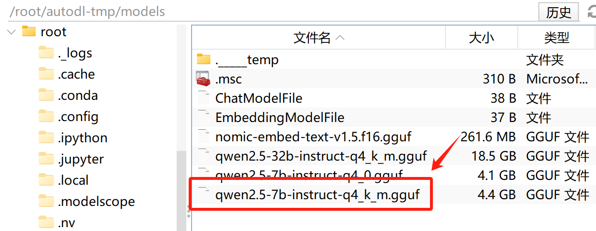

#### Step 3.借助Ollama调用本地大模型

* **ollama接入本地Embedding模型**

  首先需要编写File文件：

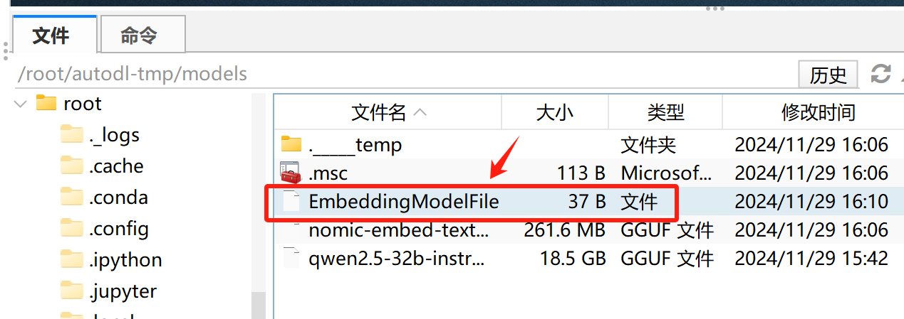

在创建的`EmbeddingModelFile`文件中，写入Embedding模型名称:`FROM ./nomic-embed-text-v1.5.f16.gguf`


然后将该模型加入Ollama本地模型列表：

```bash
ollama create nomic-embed-text -f EmbeddingModelFile
```


接下来即可查看是否已加入模型列表

```bash
ollama list
```


* **测试借助Ollama调用Embedding模型**

```python
import requests

# 设置API URL
url = 'http://localhost:11434/api/embeddings'

# 设置请求体数据
data = {
    "model": "nomic-embed-text",
    "prompt": "你好，好久不见！"
}

# 发送POST请求并获取响应
response = requests.post(url, json=data)

# 打印响应内容
if response.status_code == 200:
    print("Response:", response.json())
else:
    print(f"Request failed with status code {response.status_code}")
```

```plaintext
Response: {'embedding': [0.5030155181884766, 0.5766162872314453, -3.7013490200042725, -0.335124135017395, 0.19960707426071167, 0.5292040109634399, -1.295140266418457, 0.9638837575912476, -0.7146491408348083, -1.2640211582183838, -1.1092257499694824, 1.2582837343215942, -0.7344837188720703, -0.0645974725484848, -0.03351297974586487, -0.6603516340255737, 0.18097242712974548, -1.3903849124908447, -1.3223979473114014, 0.966265082359314, -1.3508286476135254, 1.7987627983093262, -0.44215893745422363, -1.063034176826477, 2.5026159286499023, 0.3557279706001282, 0.5653793811798096, 1.269382119178772, 0.5701422691345215, 0.37805813550949097, 0.24915452301502228, -0.8352833986282349, -0.21297705173492432, 0.00951287243515253, -0.9778848886489868, -0.8464807868003845, 0.3430193066596985, 0.16755202412605286, 0.8862990140914917, -0.5827988982200623, 0.28676384687423706, 1.2029043436050415, -0.03310413286089897, -0.3270547688007355, 1.9303107261657715, -0.5338603258132935, 0.16369764506816864, 0.6333567500114441, 0.7931520938873291, -0.7541064023971558, -2.0794403553009033, 0.2953717112541199, -0.09544339776039124, -0.7869447469711304, 1.2151222229003906, 1.8644295930862427, -0.4066644608974457, 0.2826476991176605, -0.31045058369636536, -0.383008748292923, 2.2383856773376465, 0.4884287416934967, -0.027995318174362183, 0.49492326378822327, 0.6812524795532227, -0.7521883249282837, 0.6075614094734192, 1.126321792602539, 0.028843363747000694, -0.46583983302116394, 0.27910536527633667, -0.350084513425827, -0.11055192351341248, 0.7808923125267029, -0.7316219210624695, -0.5697656273841858, -0.9932776093482971, 0.4652533531188965, -0.19964364171028137, -0.266091525554657, -0.31697309017181396, 0.0963641032576561, 2.7633252143859863, 0.9594886302947998, 0.404355525970459, 0.3807084560394287, -0.46225690841674805, 0.9236709475517273, 0.0006735324859619141, 1.558313250541687, 0.5272208452224731, -0.012162398546934128, 0.6303433179855347, 0.06785288453102112, -1.7631537914276123, -0.41500192880630493, 0.657379150390625, 1.1851352453231812, -0.53180992603302, -0.8718417882919312, -0.4464913606643677, 0.029592081904411316, -1.0824933052062988, 0.23153090476989746, 0.6653752326965332, 0.1289414018392563, -0.7908870577812195, 1.8008935451507568, -1.3261076211929321, -0.3140680491924286, 0.896865725517273, 1.3184020519256592, 0.40714502334594727, 0.6402151584625244, 0.3868490755558014, -0.07047116011381149, -0.1674484759569168, -0.44452622532844543, -0.8604117035865784, 0.47346752882003784, -0.8690305352210999, 0.2794378101825714, 0.9517558813095093, 0.9880949258804321, 0.6761890649795532, 0.7303520441055298, -0.7812688946723938, 1.3925845623016357, 0.6648522615432739, -1.2038217782974243, -0.8306519985198975, 0.6766155362129211, -0.1382993459701538, 0.26320353150367737, 0.29576122760772705, -0.13875755667686462, -1.220065712928772, 0.21852095425128937, 0.187504380941391, -0.0074964240193367004, -0.4490480422973633, -0.6788926124572754, 0.14474208652973175, -1.6394213438034058, -0.661054253578186, -0.4819876253604889, 0.11940008401870728, -0.8979319930076599, -1.040975570678711, 0.08487430214881897, 0.1623283326625824, -0.17226621508598328, 0.3379371762275696, 0.12136764824390411, 0.8818283081054688, -0.05727875605225563, 0.5129374265670776, 0.46075639128685, 1.4068270921707153, -0.4365572929382324, -0.11547070741653442, 0.9833958148956299, -0.022992372512817383, -0.6597012281417847, 1.2027531862258911, -0.9964978694915771, -1.3236502408981323, 1.530432105064392, 0.6527217030525208, 0.11031593382358551, -1.4934155941009521, -0.38936561346054077, -0.5874170064926147, 0.20713229477405548, -0.5894147157669067, -0.30154770612716675, 0.2828035056591034, -0.8054588437080383, 0.07382246851921082, -0.04146629944443703, 0.5125813484191895, -0.5210177898406982, 0.3195878863334656, 0.3438100814819336, -0.9655324220657349, -0.3924153745174408, -0.4337020516395569, 0.4407229721546173, -0.3546874523162842, -0.6103009581565857, -1.2962379455566406, 0.15651191771030426, -0.490395724773407, 0.21744230389595032, -0.3347201943397522, -0.6934791207313538, 0.1568143516778946, -0.12644624710083008, 0.49834373593330383, 0.182956725358963, -0.10993481427431107, -0.171905517578125, 0.44972577691078186, -0.3018589913845062, -0.33924734592437744, 0.5322362184524536, 0.12152183055877686, 0.8849823474884033, -0.40848541259765625, -0.23788441717624664, 1.0141658782958984, -0.47767841815948486, -0.5961735844612122, -0.0741133913397789, 0.8198844194412231, -0.8304308652877808, 0.3498041033744812, -0.8382187485694885, -1.4859105348587036, 0.10923713445663452, 0.4250703454017639, 0.578914999961853, 0.6767101883888245, -0.21125152707099915, 0.2883334159851074, 0.10701523721218109, -0.44745439291000366, 0.16334499418735504, -0.3399404287338257, -0.8509693145751953, -0.4749380350112915, -1.8723242282867432, 0.7449896931648254, 1.01506769657135, -0.1224319264292717, 1.5922449827194214, -0.360704243183136, 1.8605270385742188, -0.6400305032730103, 0.4632565379142761, -0.381875604391098, 0.8465956449508667, 0.6512719988822937, -0.378173291683197, -0.36881911754608154, 0.5500759482383728, -1.8241225481033325, -0.7561796307563782, -0.5186742544174194, 0.0718812644481659, -0.22252970933914185, -0.20114324986934662, 1.4486058950424194, 0.350197434425354, 1.1938363313674927, 0.36051836609840393, -1.0978666543960571, 0.14366866648197174, -0.07130328565835953, -0.977098822593689, 0.7565330266952515, -1.264866828918457, 0.68294757604599, -0.4595600366592407, -0.0358627624809742, -0.08750870823860168, -0.9336286187171936, 0.27484121918678284, -0.1609337478876114, -0.6071712970733643, 0.4068976044654846, 0.1568739116191864, 0.5799858570098877, 1.2237679958343506, 0.41691648960113525, -0.004176199436187744, 0.5362147092819214, 0.5202897787094116, -1.2519358396530151, 0.5762913823127747, -0.25519418716430664, 0.23807531595230103, -0.6714248061180115, 0.00991050899028778, -0.9284958839416504, 0.11034172773361206, 0.3505270183086395, 0.5755325555801392, 0.823313295841217, -0.8035579919815063, 0.3725201487541199, 0.20842847228050232, 0.27466076612472534, 1.8880571126937866, -1.4270648956298828, 0.791442334651947, 1.418575644493103, -0.6260051727294922, -0.32102012634277344, -0.255689412355423, 1.922835350036621, 0.21557405591011047, 0.37066811323165894, 0.10030987858772278, -0.7018635272979736, 0.2640904188156128, 1.5000501871109009, -0.8059607148170471, 0.6122104525566101, -1.1196531057357788, -0.5739046335220337, 1.3627464771270752, 0.2735885977745056, 0.44746696949005127, -1.890024185180664, -0.9255447387695312, 0.06044209003448486, 0.4495573937892914, 0.6287720203399658, -0.5779114961624146, 0.10139547288417816, -2.079667091369629, -0.36002692580223083, -0.5699114203453064, -0.1297096163034439, 0.781753420829773, -0.34343910217285156, 1.1344361305236816, 0.565563976764679, -0.7385990023612976, -0.7948824167251587, 1.7919706106185913, 0.8742200136184692, -0.9095770716667175, -0.6822004318237305, 0.9385193586349487, -1.3456541299819946, -0.4762156307697296, -0.4260348975658417, 2.1977310180664062, 0.5284144878387451, 0.4734780788421631, 1.3218077421188354, -0.35031574964523315, 1.2037383317947388, 1.2442198991775513, -0.4076915383338928, -0.45873939990997314, -0.4592089354991913, 0.3356609344482422, -0.06785215437412262, 0.01621592417359352, -0.7462717294692993, -0.16978514194488525, -0.7485285997390747, 0.40051528811454773, 0.17249621450901031, 1.341286063194275, 0.9970894455909729, -0.04468188434839249, 1.4367029666900635, 0.36665016412734985, -0.09901060163974762, 0.5829586386680603, -1.1883256435394287, 1.515159249305725, 1.2131431102752686, -0.18390831351280212, 0.3851194381713867, 0.769314169883728, -0.1783604919910431, -1.2780258655548096, -0.4779711067676544, -0.26493269205093384, -0.16520118713378906, 0.4728803038597107, -0.8811240792274475, -0.44496628642082214, 0.233504518866539, 0.08232717216014862, -0.4925227165222168, -0.9070545434951782, -0.11474171280860901, 0.1966269612312317, 0.7923592925071716, 0.04449385404586792, 1.1398504972457886, 0.1681278944015503, -0.024946361780166626, 1.5322011709213257, -0.6444401741027832, -1.5200175046920776, -1.472603440284729, -0.27975356578826904, -0.26002761721611023, -0.7265732884407043, 0.36502236127853394, 0.5638801455497742, 0.5082262754440308, -0.18578308820724487, -1.7458961009979248, -0.37115278840065, 0.09861156344413757, -0.35270947217941284, -0.37058189511299133, 0.8037777543067932, -0.02680998295545578, -0.6093921661376953, 2.7495758533477783, 0.37232527136802673, -0.284079909324646, 0.042607709765434265, -0.5947582721710205, -0.8571511507034302, 0.13048040866851807, 1.2252154350280762, 0.2000371217727661, -0.5023382306098938, 0.4061523377895355, -0.12292655557394028, 1.871940016746521, 0.9931501150131226, -0.5575183629989624, 0.8276843428611755, -0.3933553099632263, 0.6666101813316345, 1.2342119216918945, 0.500855028629303, 0.6913743019104004, -1.768007516860962, 0.1793481707572937, 0.7022168636322021, -0.010939717292785645, -0.09551223367452621, 0.37983059883117676, -0.5898646116256714, 0.7875058650970459, 0.5525990724563599, 0.1182946264743805, 0.4547750949859619, 0.2193506509065628, -1.0527141094207764, -0.6985371708869934, 0.4969986379146576, 0.3303636312484741, 1.2285046577453613, 1.492944598197937, -1.8726228475570679, 0.16584071516990662, -0.34652793407440186, 0.6967890858650208, 0.7971672415733337, -0.11879418790340424, 0.3835914134979248, 2.9736173152923584, -0.1504322737455368, -0.23165038228034973, -1.1637612581253052, 0.31683775782585144, 0.6635263562202454, 1.2760204076766968, 0.8823283314704895, -0.830947995185852, -0.21264922618865967, 0.20883670449256897, -1.1794649362564087, 0.2645607888698578, -0.0542217418551445, 0.6162258982658386, 0.725091278553009, -0.49312084913253784, 0.5401445627212524, 1.5277495384216309, -0.18729200959205627, 0.8791813850402832, -0.3937264084815979, -0.9197328090667725, 0.1713835448026657, -0.49099472165107727, 0.6734322309494019, 0.27252480387687683, -1.3503819704055786, 0.1444694697856903, -0.8934032320976257, -0.08267351984977722, 0.24778228998184204, 0.14629890024662018, 0.07950758934020996, -0.026364963501691818, 0.5295684933662415, 0.5754714608192444, -0.8817258477210999, 0.19070309400558472, -0.04672380909323692, 0.06956109404563904, 0.14326275885105133, -0.05479128658771515, 0.5989670753479004, -0.04908526688814163, 0.9901436567306519, -0.6511552929878235, -0.9779127836227417, -0.5410348773002625, 0.3943001329898834, 0.8437702655792236, -0.4972648024559021, 1.1921619176864624, -1.9543226957321167, -0.94593745470047, -0.6092044115066528, -1.3599470853805542, 0.6548841595649719, 0.3684276342391968, -0.9459508657455444, 0.680461049079895, -0.8270017504692078, 0.5129915475845337, 0.13175252079963684, -1.1508662700653076, 0.6539279222488403, 1.0763602256774902, -0.6157474517822266, -0.23096822202205658, 1.0535523891448975, -0.6582354307174683, 0.08849126845598221, -0.1511143296957016, -1.5038318634033203, 0.7000627517700195, 0.08407897502183914, 0.13112381100654602, -0.03636743873357773, -1.1834818124771118, -1.262599229812622, 0.16214358806610107, 0.3101198375225067, 1.6164360046386719, 0.20063315331935883, -0.10378678143024445, 0.6195053458213806, -0.5262821912765503, 1.225852131843567, -0.25685006380081177, 0.287779837846756, -0.183846578001976, 0.5118488073348999, -1.094374656677246, -0.10687573254108429, 0.5609338283538818, -0.0557711124420166, 0.7972105145454407, -0.7658674716949463, -0.09540335834026337, -0.06360990554094315, 0.01022176444530487, -1.3245409727096558, -0.4999214708805084, 0.6681820750236511, -1.0574214458465576, -1.198052167892456, 0.6353433728218079, 0.4630976617336273, -0.06892280280590057, -0.1693522334098816, 2.1348719596862793, -1.0606460571289062, 0.4603346586227417, 1.2862465381622314, 0.5036212801933289, -0.25750458240509033, -1.544715404510498, -1.2664257287979126, -0.8703944087028503, -0.7136809825897217, -0.28112998604774475, 0.08237340301275253, 0.42501750588417053, -0.3230800926685333, -2.0144903659820557, 0.5138172507286072, -0.12674710154533386, -0.26308879256248474, 0.19634249806404114, 0.6112330555915833, -0.9592097997665405, 0.9542784094810486, 0.43731439113616943, -0.9392215013504028, 1.5624850988388062, -0.30462881922721863, -0.435672402381897, 0.9970264434814453, -0.3333325982093811, 0.07651057839393616, -0.5369065403938293, 0.4852224290370941, -0.7734544277191162, -0.9837519526481628, -1.0727941989898682, 0.11373279243707657, 0.01469702273607254, 0.5223884582519531, 0.684454083442688, -1.4698327779769897, -1.5391490459442139, 1.203506350517273, -0.3971588909626007, 0.5718058347702026, 0.22575044631958008, -0.45633554458618164, 0.3032415509223938, 0.9929676055908203, 0.34513556957244873, -0.8208529353141785, 1.0068018436431885, -0.454091340303421, 1.125054121017456, -0.831908643245697, -0.6148259043693542, -0.13224934041500092, -0.20886681973934174, -0.21393224596977234, 0.825323224067688, -0.9151331186294556, 0.2539730668067932, 0.10240418463945389, -0.9838519096374512, 0.4603551924228668, -1.5391252040863037, 1.436201810836792, -0.7027348875999451, -0.3343997597694397, -0.581859827041626, -0.22468531131744385, -1.2771011590957642, 0.9514346718788147, -0.1977306604385376, -0.42085564136505127, -0.5985690355300903, -0.5158224701881409, 0.44361886382102966, 0.3991542458534241, 0.3268434405326843, 1.2960163354873657, 1.2882493734359741, -0.9945734739303589, 1.0732715129852295, 0.6672603487968445, 0.7896151542663574, -1.1176283359527588, 0.6364508271217346, 0.6672032475471497, 0.02828049659729004, 0.3814643621444702, -0.1674082726240158, -0.8188946843147278, 0.1617233008146286, -2.73663067817688, -0.9541912078857422, -0.7326268553733826, -0.11416646093130112, -0.48626837134361267, 0.04530510678887367, -1.1691280603408813, 0.2097804993391037, -0.4947543740272522, -0.6283475160598755, -0.8518832921981812, -2.264911413192749, -0.45738670229911804, 0.1590328812599182, -0.02566259726881981, -0.5004463195800781, -0.6707355976104736, 0.30260342359542847, 0.5876381993293762, 1.001715064048767, 0.5780003070831299, 0.3228062391281128, 0.9922370314598083, -0.47771409153938293, 0.44346684217453003, -0.08113697171211243, -0.5832905769348145, 0.30804064869880676, 0.4309738576412201, 0.6346299648284912, -1.0534240007400513, 0.19928716123104095, -1.0298309326171875, -1.0411708354949951, -0.2560960054397583, -0.7904869914054871, -1.0723985433578491, 0.17678675055503845, 0.5922502279281616, -0.5776921510696411, -0.17744994163513184, -1.098260521888733, 0.4449777901172638, -0.056756749749183655, 0.2587839663028717, 0.4894184470176697, 1.0680570602416992, 0.5496060848236084, -0.29422175884246826, -0.507429838180542, -0.04078765958547592, -0.4749203026294708, 0.05499899387359619, -0.7387706637382507, 0.09758669137954712, -0.856641948223114, 1.1027599573135376, 1.3601367473602295, -0.2740126848220825, -0.1461058109998703, -0.11742747575044632, 0.7891944646835327, 0.7545436024665833, 1.5026391744613647, -0.7694045305252075, -1.3946380615234375, -0.5907219648361206, -0.8002939224243164, -0.44692251086235046, 0.4616495668888092, -0.7975237369537354, -0.46680790185928345, 0.34545260667800903, 0.25793027877807617, 0.1501244157552719, -0.4961729943752289, 0.5261740684509277, 0.10385950654745102, -0.05644968897104263, -0.8083270788192749, 0.35397154092788696, -0.599587619304657, -0.8412600755691528, -1.4944343566894531, 0.3789310157299042, 0.1693175733089447, 1.0055012702941895, 0.20239704847335815, -0.5904006958007812, -1.2574397325515747, 2.0081756114959717, 1.1315696239471436, 0.017869573086500168, 0.530830442905426, 1.145524024963379, -0.04487039893865585, 0.5217338800430298, -0.4322240352630615, 0.6520392298698425, -1.1819384098052979, 0.6044440269470215, 1.2304617166519165, -0.018641889095306396, 0.043914832174777985, -0.3719466030597687, 0.43333664536476135, -0.16721095144748688, 0.45521482825279236, -0.12686431407928467, -0.7639789581298828, -0.658207356929779]}
```

```python
len(response.json()['embedding'])
```

```plaintext
768
```

在调用的过程中，Ollama start对话页面可以看到相关调用信息：

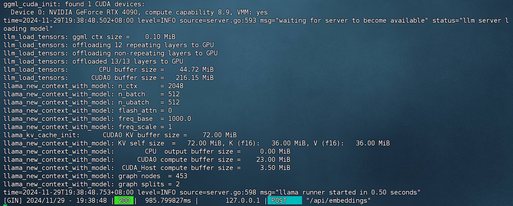

* **Ollama接入Qwen2.5-7B模型**

  接入LLM的流程和接入Embedding模型类似，首先都是需要编写File文件：


在创建的ChatModelFile文件中写入如下内容：

FROM ./qwen2.5-7b-instruct-q4\_k\_m.gguf

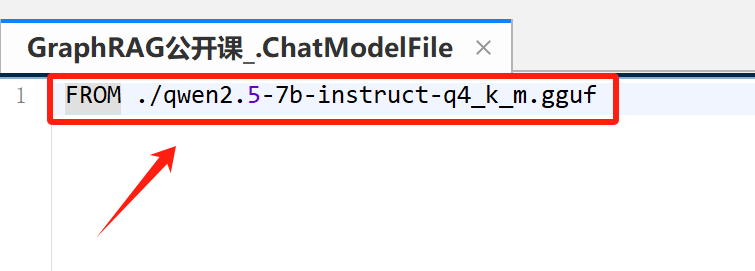

然后运行如下命令即可将本地模型加入ollama模型列表：

```bash
ollama create qwen2.5-7b-instruct -f ChatModelFile
```


查看是否已加入模型列表:ollama list


接下来即可测试使用Chat模型

```python
import requests

# 设置API URL
url = 'http://localhost:11434/api/chat'

# 设置请求体数据
data = {
    "model": "qwen2.5-7b-instruct",
    "messages": [
        {
            "role": "user",
            "content": "你好，好久不见！"
        }
    ],
    "stream": False
}

# 发送POST请求并获取响应
response = requests.post(url, json=data)

# 打印响应内容
if response.status_code == 200:
    print("Response:", response.json())  # 如果返回的是JSON格式的响应
else:
    print(f"Request failed with status code {response.status_code}")
```

```plaintext
Response: {'model': 'qwen2.5-7b-instruct', 'created_at': '2024-11-29T09:03:25.209042552Z', 'message': {'role': 'assistant', 'content': '很高兴见到你。 你好！我也很高兴见到你。最近怎么样？'}, 'done_reason': 'stop', 'done': True, 'total_duration': 203578629, 'load_duration': 39258147, 'prompt_eval_count': 5, 'prompt_eval_duration': 18000000, 'eval_count': 16, 'eval_duration': 145000000}
```

```python
response.json()
```

```plaintext
{'model': 'qwen2.5-7b-instruct',
 'created_at': '2024-11-29T09:03:25.209042552Z',
 'message': {'role': 'assistant', 'content': '很高兴见到你。 你好！我也很高兴见到你。最近怎么样？'},
 'done_reason': 'stop',
 'done': True,
 'total_duration': 203578629,
 'load_duration': 39258147,
 'prompt_eval_count': 5,
 'prompt_eval_duration': 18000000,
 'eval_count': 16,
 'eval_duration': 145000000}
```

至此，我们就完成了两个模型的下载与接入Ollama的相关准备工作

### 四、修改微软GraphRAG源码

#### **Step 1.graphrag快速安装**

```bash
pip install graphrag
```

```python
!pip install graphrag
```

```plaintext
Looking in indexes: http://mirrors.aliyun.com/pypi/simple
Requirement already satisfied: graphrag in /root/miniconda3/envs/graphrag/lib/python3.11/site-packages (0.5.0)
Requirement already satisfied: aiofiles<25.0.0,>=24.1.0 in /root/miniconda3/envs/graphrag/lib/python3.11/site-packages (from graphrag) (24.1.0)
Requirement already satisfied: aiolimiter<2.0.0,>=1.1.0 in /root/miniconda3/envs/graphrag/lib/python3.11/site-packages (from graphrag) (1.1.0)
Requirement already satisfied: azure-identity<2.0.0,>=1.17.1 in /root/miniconda3/envs/graphrag/lib/python3.11/site-packages (from graphrag) (1.19.0)
Requirement already satisfied: azure-search-documents<12.0.0,>=11.4.0 in /root/miniconda3/envs/graphrag/lib/python3.11/site-packages (from graphrag) (11.5.2)
Requirement already satisfied: azure-storage-blob<13.0.0,>=12.22.0 in /root/miniconda3/envs/graphrag/lib/python3.11/site-packages (from graphrag) (12.24.0)
Requirement already satisfied: datashaper<0.0.50,>=0.0.49 in /root/miniconda3/envs/graphrag/lib/python3.11/site-packages (from graphrag) (0.0.49)
Requirement already satisfied: devtools<0.13.0,>=0.12.2 in /root/miniconda3/envs/graphrag/lib/python3.11/site-packages (from graphrag) (0.12.2)
Requirement already satisfied: environs<12.0.0,>=11.0.0 in /root/miniconda3/envs/graphrag/lib/python3.11/site-packages (from graphrag) (11.2.1)
Requirement already satisfied: future<2.0.0,>=1.0.0 in /root/miniconda3/envs/graphrag/lib/python3.11/site-packages (from graphrag) (1.0.0)
Requirement already satisfied: graspologic<4.0.0,>=3.4.1 in /root/miniconda3/envs/graphrag/lib/python3.11/site-packages (from graphrag) (3.4.1)
Requirement already satisfied: json-repair<0.31.0,>=0.30.0 in /root/miniconda3/envs/graphrag/lib/python3.11/site-packages (from graphrag) (0.30.2)
Requirement already satisfied: lancedb<0.14.0,>=0.13.0 in /root/miniconda3/envs/graphrag/lib/python3.11/site-packages (from graphrag) (0.13.0)
Requirement already satisfied: matplotlib<4.0.0,>=3.9.0 in /root/miniconda3/envs/graphrag/lib/python3.11/site-packages (from graphrag) (3.9.2)
Requirement already satisfied: networkx<4,>=3 in /root/miniconda3/envs/graphrag/lib/python3.11/site-packages (from graphrag) (3.4.2)
Requirement already satisfied: nltk==3.9.1 in /root/miniconda3/envs/graphrag/lib/python3.11/site-packages (from graphrag) (3.9.1)
Requirement already satisfied: numpy<2.0.0,>=1.25.2 in /root/miniconda3/envs/graphrag/lib/python3.11/site-packages (from graphrag) (1.26.4)
Requirement already satisfied: openai<2.0.0,>=1.51.2 in /root/miniconda3/envs/graphrag/lib/python3.11/site-packages (from graphrag) (1.55.1)
Requirement already satisfied: pandas<3.0.0,>=2.2.3 in /root/miniconda3/envs/graphrag/lib/python3.11/site-packages (from graphrag) (2.2.3)
Requirement already satisfied: pyaml-env<2.0.0,>=1.2.1 in /root/miniconda3/envs/graphrag/lib/python3.11/site-packages (from graphrag) (1.2.1)
Requirement already satisfied: pyarrow<16.0.0,>=15.0.0 in /root/miniconda3/envs/graphrag/lib/python3.11/site-packages (from graphrag) (15.0.2)
Requirement already satisfied: pydantic<3.0.0,>=2.9.2 in /root/miniconda3/envs/graphrag/lib/python3.11/site-packages (from graphrag) (2.10.1)
Requirement already satisfied: python-dotenv<2.0.0,>=1.0.0 in /root/miniconda3/envs/graphrag/lib/python3.11/site-packages (from graphrag) (1.0.1)
Requirement already satisfied: pyyaml<7.0.0,>=6.0.2 in /root/miniconda3/envs/graphrag/lib/python3.11/site-packages (from graphrag) (6.0.2)
Requirement already satisfied: rich<14.0.0,>=13.6.0 in /root/miniconda3/envs/graphrag/lib/python3.11/site-packages (from graphrag) (13.9.4)
Requirement already satisfied: tenacity<10.0.0,>=9.0.0 in /root/miniconda3/envs/graphrag/lib/python3.11/site-packages (from graphrag) (9.0.0)
Requirement already satisfied: tiktoken<0.8.0,>=0.7.0 in /root/miniconda3/envs/graphrag/lib/python3.11/site-packages (from graphrag) (0.7.0)
Requirement already satisfied: typer<0.13.0,>=0.12.5 in /root/miniconda3/envs/graphrag/lib/python3.11/site-packages (from graphrag) (0.12.5)
Requirement already satisfied: typing-extensions<5.0.0,>=4.12.2 in /root/miniconda3/envs/graphrag/lib/python3.11/site-packages (from graphrag) (4.12.2)
Requirement already satisfied: umap-learn<0.6.0,>=0.5.6 in /root/miniconda3/envs/graphrag/lib/python3.11/site-packages (from graphrag) (0.5.7)
Requirement already satisfied: click in /root/miniconda3/envs/graphrag/lib/python3.11/site-packages (from nltk==3.9.1->graphrag) (8.1.7)
Requirement already satisfied: joblib in /root/miniconda3/envs/graphrag/lib/python3.11/site-packages (from nltk==3.9.1->graphrag) (1.4.2)
Requirement already satisfied: regex>=2021.8.3 in /root/miniconda3/envs/graphrag/lib/python3.11/site-packages (from nltk==3.9.1->graphrag) (2024.11.6)
Requirement already satisfied: tqdm in /root/miniconda3/envs/graphrag/lib/python3.11/site-packages (from nltk==3.9.1->graphrag) (4.67.1)
Requirement already satisfied: azure-core>=1.31.0 in /root/miniconda3/envs/graphrag/lib/python3.11/site-packages (from azure-identity<2.0.0,>=1.17.1->graphrag) (1.32.0)
Requirement already satisfied: cryptography>=2.5 in /root/miniconda3/envs/graphrag/lib/python3.11/site-packages (from azure-identity<2.0.0,>=1.17.1->graphrag) (43.0.3)
Requirement already satisfied: msal>=1.30.0 in /root/miniconda3/envs/graphrag/lib/python3.11/site-packages (from azure-identity<2.0.0,>=1.17.1->graphrag) (1.31.1)
Requirement already satisfied: msal-extensions>=1.2.0 in /root/miniconda3/envs/graphrag/lib/python3.11/site-packages (from azure-identity<2.0.0,>=1.17.1->graphrag) (1.2.0)
Requirement already satisfied: azure-common>=1.1 in /root/miniconda3/envs/graphrag/lib/python3.11/site-packages (from azure-search-documents<12.0.0,>=11.4.0->graphrag) (1.1.28)
Requirement already satisfied: isodate>=0.6.0 in /root/miniconda3/envs/graphrag/lib/python3.11/site-packages (from azure-search-documents<12.0.0,>=11.4.0->graphrag) (0.7.2)
Requirement already satisfied: diskcache<6.0.0,>=5.6.3 in /root/miniconda3/envs/graphrag/lib/python3.11/site-packages (from datashaper<0.0.50,>=0.0.49->graphrag) (5.6.3)
Requirement already satisfied: jsonschema<5.0.0,>=4.21.1 in /root/miniconda3/envs/graphrag/lib/python3.11/site-packages (from datashaper<0.0.50,>=0.0.49->graphrag) (4.23.0)
Requirement already satisfied: asttokens<3.0.0,>=2.0.0 in /root/miniconda3/envs/graphrag/lib/python3.11/site-packages (from devtools<0.13.0,>=0.12.2->graphrag) (2.0.5)
Requirement already satisfied: executing>=1.1.1 in /root/miniconda3/envs/graphrag/lib/python3.11/site-packages (from devtools<0.13.0,>=0.12.2->graphrag) (2.1.0)
Requirement already satisfied: pygments>=2.15.0 in /root/miniconda3/envs/graphrag/lib/python3.11/site-packages (from devtools<0.13.0,>=0.12.2->graphrag) (2.15.1)
Requirement already satisfied: marshmallow>=3.13.0 in /root/miniconda3/envs/graphrag/lib/python3.11/site-packages (from environs<12.0.0,>=11.0.0->graphrag) (3.23.1)
Requirement already satisfied: POT<0.10,>=0.9 in /root/miniconda3/envs/graphrag/lib/python3.11/site-packages (from graspologic<4.0.0,>=3.4.1->graphrag) (0.9.5)
Requirement already satisfied: anytree<3.0.0,>=2.12.1 in /root/miniconda3/envs/graphrag/lib/python3.11/site-packages (from graspologic<4.0.0,>=3.4.1->graphrag) (2.12.1)
Requirement already satisfied: beartype<0.19.0,>=0.18.5 in /root/miniconda3/envs/graphrag/lib/python3.11/site-packages (from graspologic<4.0.0,>=3.4.1->graphrag) (0.18.5)
Requirement already satisfied: gensim<5.0.0,>=4.3.2 in /root/miniconda3/envs/graphrag/lib/python3.11/site-packages (from graspologic<4.0.0,>=3.4.1->graphrag) (4.3.3)
Requirement already satisfied: graspologic-native<2.0.0,>=1.2.1 in /root/miniconda3/envs/graphrag/lib/python3.11/site-packages (from graspologic<4.0.0,>=3.4.1->graphrag) (1.2.1)
Requirement already satisfied: hyppo<0.5.0,>=0.4.0 in /root/miniconda3/envs/graphrag/lib/python3.11/site-packages (from graspologic<4.0.0,>=3.4.1->graphrag) (0.4.0)
Requirement already satisfied: scikit-learn<2.0.0,>=1.4.2 in /root/miniconda3/envs/graphrag/lib/python3.11/site-packages (from graspologic<4.0.0,>=3.4.1->graphrag) (1.5.2)
Requirement already satisfied: scipy==1.12.0 in /root/miniconda3/envs/graphrag/lib/python3.11/site-packages (from graspologic<4.0.0,>=3.4.1->graphrag) (1.12.0)
Requirement already satisfied: seaborn<0.14.0,>=0.13.2 in /root/miniconda3/envs/graphrag/lib/python3.11/site-packages (from graspologic<4.0.0,>=3.4.1->graphrag) (0.13.2)
Requirement already satisfied: statsmodels<0.15.0,>=0.14.2 in /root/miniconda3/envs/graphrag/lib/python3.11/site-packages (from graspologic<4.0.0,>=3.4.1->graphrag) (0.14.4)
Requirement already satisfied: deprecation in /root/miniconda3/envs/graphrag/lib/python3.11/site-packages (from lancedb<0.14.0,>=0.13.0->graphrag) (2.1.0)
Requirement already satisfied: pylance==0.17.0 in /root/miniconda3/envs/graphrag/lib/python3.11/site-packages (from lancedb<0.14.0,>=0.13.0->graphrag) (0.17.0)
Requirement already satisfied: requests>=2.31.0 in /root/miniconda3/envs/graphrag/lib/python3.11/site-packages (from lancedb<0.14.0,>=0.13.0->graphrag) (2.32.3)
Requirement already satisfied: retry>=0.9.2 in /root/miniconda3/envs/graphrag/lib/python3.11/site-packages (from lancedb<0.14.0,>=0.13.0->graphrag) (0.9.2)
Requirement already satisfied: attrs>=21.3.0 in /root/miniconda3/envs/graphrag/lib/python3.11/site-packages (from lancedb<0.14.0,>=0.13.0->graphrag) (24.2.0)
Requirement already satisfied: packaging in /root/miniconda3/envs/graphrag/lib/python3.11/site-packages (from lancedb<0.14.0,>=0.13.0->graphrag) (24.1)
Requirement already satisfied: cachetools in /root/miniconda3/envs/graphrag/lib/python3.11/site-packages (from lancedb<0.14.0,>=0.13.0->graphrag) (5.5.0)
Requirement already satisfied: overrides>=0.7 in /root/miniconda3/envs/graphrag/lib/python3.11/site-packages (from lancedb<0.14.0,>=0.13.0->graphrag) (7.4.0)
Requirement already satisfied: contourpy>=1.0.1 in /root/miniconda3/envs/graphrag/lib/python3.11/site-packages (from matplotlib<4.0.0,>=3.9.0->graphrag) (1.3.1)
Requirement already satisfied: cycler>=0.10 in /root/miniconda3/envs/graphrag/lib/python3.11/site-packages (from matplotlib<4.0.0,>=3.9.0->graphrag) (0.12.1)
Requirement already satisfied: fonttools>=4.22.0 in /root/miniconda3/envs/graphrag/lib/python3.11/site-packages (from matplotlib<4.0.0,>=3.9.0->graphrag) (4.55.0)
Requirement already satisfied: kiwisolver>=1.3.1 in /root/miniconda3/envs/graphrag/lib/python3.11/site-packages (from matplotlib<4.0.0,>=3.9.0->graphrag) (1.4.7)
Requirement already satisfied: pillow>=8 in /root/miniconda3/envs/graphrag/lib/python3.11/site-packages (from matplotlib<4.0.0,>=3.9.0->graphrag) (11.0.0)
Requirement already satisfied: pyparsing>=2.3.1 in /root/miniconda3/envs/graphrag/lib/python3.11/site-packages (from matplotlib<4.0.0,>=3.9.0->graphrag) (3.2.0)
Requirement already satisfied: python-dateutil>=2.7 in /root/miniconda3/envs/graphrag/lib/python3.11/site-packages (from matplotlib<4.0.0,>=3.9.0->graphrag) (2.9.0.post0)
Requirement already satisfied: anyio<5,>=3.5.0 in /root/miniconda3/envs/graphrag/lib/python3.11/site-packages (from openai<2.0.0,>=1.51.2->graphrag) (4.6.2)
Requirement already satisfied: distro<2,>=1.7.0 in /root/miniconda3/envs/graphrag/lib/python3.11/site-packages (from openai<2.0.0,>=1.51.2->graphrag) (1.9.0)
Requirement already satisfied: httpx<1,>=0.23.0 in /root/miniconda3/envs/graphrag/lib/python3.11/site-packages (from openai<2.0.0,>=1.51.2->graphrag) (0.27.0)
Requirement already satisfied: jiter<1,>=0.4.0 in /root/miniconda3/envs/graphrag/lib/python3.11/site-packages (from openai<2.0.0,>=1.51.2->graphrag) (0.7.1)
Requirement already satisfied: sniffio in /root/miniconda3/envs/graphrag/lib/python3.11/site-packages (from openai<2.0.0,>=1.51.2->graphrag) (1.3.0)
Requirement already satisfied: pytz>=2020.1 in /root/miniconda3/envs/graphrag/lib/python3.11/site-packages (from pandas<3.0.0,>=2.2.3->graphrag) (2024.1)
Requirement already satisfied: tzdata>=2022.7 in /root/miniconda3/envs/graphrag/lib/python3.11/site-packages (from pandas<3.0.0,>=2.2.3->graphrag) (2024.2)
Requirement already satisfied: annotated-types>=0.6.0 in /root/miniconda3/envs/graphrag/lib/python3.11/site-packages (from pydantic<3.0.0,>=2.9.2->graphrag) (0.7.0)
Requirement already satisfied: pydantic-core==2.27.1 in /root/miniconda3/envs/graphrag/lib/python3.11/site-packages (from pydantic<3.0.0,>=2.9.2->graphrag) (2.27.1)
Requirement already satisfied: markdown-it-py>=2.2.0 in /root/miniconda3/envs/graphrag/lib/python3.11/site-packages (from rich<14.0.0,>=13.6.0->graphrag) (3.0.0)
Requirement already satisfied: shellingham>=1.3.0 in /root/miniconda3/envs/graphrag/lib/python3.11/site-packages (from typer<0.13.0,>=0.12.5->graphrag) (1.5.4)
Requirement already satisfied: numba>=0.51.2 in /root/miniconda3/envs/graphrag/lib/python3.11/site-packages (from umap-learn<0.6.0,>=0.5.6->graphrag) (0.60.0)
Requirement already satisfied: pynndescent>=0.5 in /root/miniconda3/envs/graphrag/lib/python3.11/site-packages (from umap-learn<0.6.0,>=0.5.6->graphrag) (0.5.13)
Requirement already satisfied: idna>=2.8 in /root/miniconda3/envs/graphrag/lib/python3.11/site-packages (from anyio<5,>=3.5.0->openai<2.0.0,>=1.51.2->graphrag) (3.7)
Requirement already satisfied: six in /root/miniconda3/envs/graphrag/lib/python3.11/site-packages (from anytree<3.0.0,>=2.12.1->graspologic<4.0.0,>=3.4.1->graphrag) (1.16.0)
Requirement already satisfied: cffi>=1.12 in /root/miniconda3/envs/graphrag/lib/python3.11/site-packages (from cryptography>=2.5->azure-identity<2.0.0,>=1.17.1->graphrag) (1.17.1)
Requirement already satisfied: smart-open>=1.8.1 in /root/miniconda3/envs/graphrag/lib/python3.11/site-packages (from gensim<5.0.0,>=4.3.2->graspologic<4.0.0,>=3.4.1->graphrag) (7.0.5)
Requirement already satisfied: certifi in /root/miniconda3/envs/graphrag/lib/python3.11/site-packages (from httpx<1,>=0.23.0->openai<2.0.0,>=1.51.2->graphrag) (2024.8.30)
Requirement already satisfied: httpcore==1.* in /root/miniconda3/envs/graphrag/lib/python3.11/site-packages (from httpx<1,>=0.23.0->openai<2.0.0,>=1.51.2->graphrag) (1.0.2)
Requirement already satisfied: h11<0.15,>=0.13 in /root/miniconda3/envs/graphrag/lib/python3.11/site-packages (from httpcore==1.*->httpx<1,>=0.23.0->openai<2.0.0,>=1.51.2->graphrag) (0.14.0)
Requirement already satisfied: autograd>=1.3 in /root/miniconda3/envs/graphrag/lib/python3.11/site-packages (from hyppo<0.5.0,>=0.4.0->graspologic<4.0.0,>=3.4.1->graphrag) (1.7.0)
Requirement already satisfied: jsonschema-specifications>=2023.03.6 in /root/miniconda3/envs/graphrag/lib/python3.11/site-packages (from jsonschema<5.0.0,>=4.21.1->datashaper<0.0.50,>=0.0.49->graphrag) (2023.7.1)
Requirement already satisfied: referencing>=0.28.4 in /root/miniconda3/envs/graphrag/lib/python3.11/site-packages (from jsonschema<5.0.0,>=4.21.1->datashaper<0.0.50,>=0.0.49->graphrag) (0.30.2)
Requirement already satisfied: rpds-py>=0.7.1 in /root/miniconda3/envs/graphrag/lib/python3.11/site-packages (from jsonschema<5.0.0,>=4.21.1->datashaper<0.0.50,>=0.0.49->graphrag) (0.10.6)
Requirement already satisfied: mdurl~=0.1 in /root/miniconda3/envs/graphrag/lib/python3.11/site-packages (from markdown-it-py>=2.2.0->rich<14.0.0,>=13.6.0->graphrag) (0.1.2)
Requirement already satisfied: PyJWT<3,>=1.0.0 in /root/miniconda3/envs/graphrag/lib/python3.11/site-packages (from PyJWT[crypto]<3,>=1.0.0->msal>=1.30.0->azure-identity<2.0.0,>=1.17.1->graphrag) (2.10.0)
Requirement already satisfied: portalocker<3,>=1.4 in /root/miniconda3/envs/graphrag/lib/python3.11/site-packages (from msal-extensions>=1.2.0->azure-identity<2.0.0,>=1.17.1->graphrag) (2.10.1)
Requirement already satisfied: llvmlite<0.44,>=0.43.0dev0 in /root/miniconda3/envs/graphrag/lib/python3.11/site-packages (from numba>=0.51.2->umap-learn<0.6.0,>=0.5.6->graphrag) (0.43.0)
Requirement already satisfied: charset-normalizer<4,>=2 in /root/miniconda3/envs/graphrag/lib/python3.11/site-packages (from requests>=2.31.0->lancedb<0.14.0,>=0.13.0->graphrag) (3.3.2)
Requirement already satisfied: urllib3<3,>=1.21.1 in /root/miniconda3/envs/graphrag/lib/python3.11/site-packages (from requests>=2.31.0->lancedb<0.14.0,>=0.13.0->graphrag) (2.2.3)
Requirement already satisfied: decorator>=3.4.2 in /root/miniconda3/envs/graphrag/lib/python3.11/site-packages (from retry>=0.9.2->lancedb<0.14.0,>=0.13.0->graphrag) (5.1.1)
Requirement already satisfied: py<2.0.0,>=1.4.26 in /root/miniconda3/envs/graphrag/lib/python3.11/site-packages (from retry>=0.9.2->lancedb<0.14.0,>=0.13.0->graphrag) (1.11.0)
Requirement already satisfied: threadpoolctl>=3.1.0 in /root/miniconda3/envs/graphrag/lib/python3.11/site-packages (from scikit-learn<2.0.0,>=1.4.2->graspologic<4.0.0,>=3.4.1->graphrag) (3.5.0)
Requirement already satisfied: patsy>=0.5.6 in /root/miniconda3/envs/graphrag/lib/python3.11/site-packages (from statsmodels<0.15.0,>=0.14.2->graspologic<4.0.0,>=3.4.1->graphrag) (1.0.1)
Requirement already satisfied: pycparser in /root/miniconda3/envs/graphrag/lib/python3.11/site-packages (from cffi>=1.12->cryptography>=2.5->azure-identity<2.0.0,>=1.17.1->graphrag) (2.21)
Requirement already satisfied: wrapt in /root/miniconda3/envs/graphrag/lib/python3.11/site-packages (from smart-open>=1.8.1->gensim<5.0.0,>=4.3.2->graspologic<4.0.0,>=3.4.1->graphrag) (1.17.0)
WARNING: Running pip as the 'root' user can result in broken permissions and conflicting behaviour with the system package manager, possibly rendering your system unusable.It is recommended to use a virtual environment instead: https://pip.pypa.io/warnings/venv. Use the --root-user-action option if you know what you are doing and want to suppress this warning.

```

#### **Step 2.创建检索项目文件夹**

```bash
cd /root/autodl-tmp/graphrag-ollama
mkdir -p ./ml-ollama/input
```


#### **Step 3.上传数据集**


&#x20;


#### **Step 4.初始化项目文件**

```bash
graphrag init --root /root/autodl-tmp/graphrag-ollama/ml-ollama
```

#### **Step 5.修改项目配置**

* 修改.env文件：

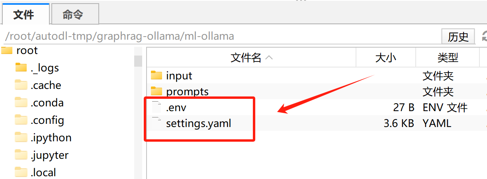

将API-KEY设置为ollama：GRAPHRAG\_API\_KEY=ollama

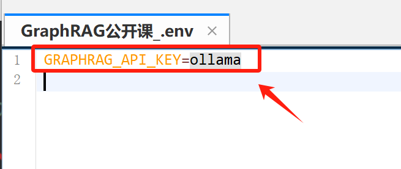

* 修改setting.yaml文件

model: qwen2.5-7b-instruct

api\_base: http://localhost:11434/v1


model:nomic-embed-text

api\_base: http://localhost:11434/api

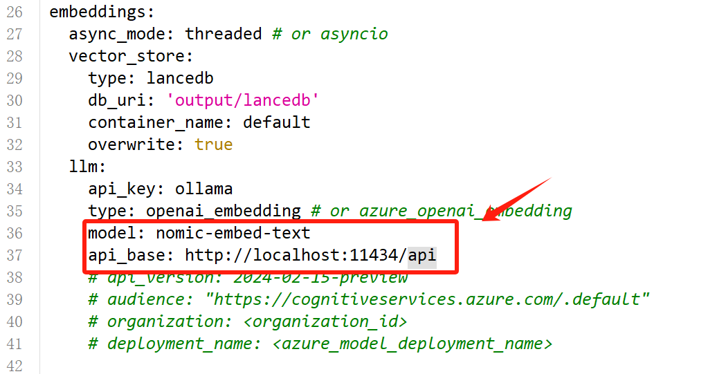

#### **Step 6.修改项目源码**

  首先，找到pip安装库的地址：`/root/miniconda3/envs/graphrag-ollama/lib/python3.10/site-packages/graphrag`


* 修改一：`llm/openai/openai_embeddings_llm.py`


修改为如下内容：

```python
# Copyright (c) 2024 Microsoft Corporation.
# Licensed under the MIT License

"""The EmbeddingsLLM class."""

from typing_extensions import Unpack

from graphrag.llm.base import BaseLLM
from graphrag.llm.types import (
    EmbeddingInput,
    EmbeddingOutput,
    LLMInput,
)

from .openai_configuration import OpenAIConfiguration
from .types import OpenAIClientTypes

import ollama


class OpenAIEmbeddingsLLM(BaseLLM[EmbeddingInput, EmbeddingOutput]):
    """A text-embedding generator LLM."""

    _client: OpenAIClientTypes
    _configuration: OpenAIConfiguration

    def __init__(self, client: OpenAIClientTypes, configuration: OpenAIConfiguration):
        self.client = client
        self.configuration = configuration

    async def _execute_llm(
        self, input: EmbeddingInput, **kwargs: Unpack[LLMInput]
    ) -> EmbeddingOutput | None:
        args = {
            "model": self.configuration.model,
            **(kwargs.get("model_parameters") or {}),
        }
        # embedding = await self.client.embeddings.create(
        #     input=input,
        #     **args,
        # )
        embedding_list = []
        for inp in input:
            embedding = ollama.embeddings(model='nomic-embed-text', prompt=inp)
            embedding_list.append(embedding["embedding"])
        return embedding_list
```

* 修改二：`query/llm/oai/embedding.py`

  修改后内容如下：

```python
# Copyright (c) 2024 Microsoft Corporation.
# Licensed under the MIT License

"""OpenAI Embedding model implementation."""

import asyncio
from collections.abc import Callable
from typing import Any

import numpy as np
import tiktoken
from tenacity import (
    AsyncRetrying,
    RetryError,
    Retrying,
    retry_if_exception_type,
    stop_after_attempt,
    wait_exponential_jitter,
)

from graphrag.logging.base import StatusLogger
from graphrag.query.llm.base import BaseTextEmbedding
from graphrag.query.llm.oai.base import OpenAILLMImpl
from graphrag.query.llm.oai.typing import (
    OPENAI_RETRY_ERROR_TYPES,
    OpenaiApiType,
)
from graphrag.query.llm.text_utils import chunk_text

import ollama

class OpenAIEmbedding(BaseTextEmbedding, OpenAILLMImpl):
    """Wrapper for OpenAI Embedding models."""

    def __init__(
        self,
        api_key: str | None = None,
        azure_ad_token_provider: Callable | None = None,
        model: str = "text-embedding-3-small",
        deployment_name: str | None = None,
        api_base: str | None = None,
        api_version: str | None = None,
        api_type: OpenaiApiType = OpenaiApiType.OpenAI,
        organization: str | None = None,
        encoding_name: str = "cl100k_base",
        max_tokens: int = 8191,
        max_retries: int = 10,
        request_timeout: float = 180.0,
        retry_error_types: tuple[type[BaseException]] = OPENAI_RETRY_ERROR_TYPES,  # type: ignore
        reporter: StatusLogger | None = None,
    ):
        OpenAILLMImpl.__init__(
            self=self,
            api_key=api_key,
            azure_ad_token_provider=azure_ad_token_provider,
            deployment_name=deployment_name,
            api_base=api_base,
            api_version=api_version,
            api_type=api_type,  # type: ignore
            organization=organization,
            max_retries=max_retries,
            request_timeout=request_timeout,
            reporter=reporter,
        )

        self.model = model
        self.encoding_name = encoding_name
        self.max_tokens = max_tokens
        self.token_encoder = tiktoken.get_encoding(self.encoding_name)
        self.retry_error_types = retry_error_types

    def embed(self, text: str, **kwargs: Any) -> list[float]:
        """
        Embed text using OpenAI Embedding's sync function.

        For text longer than max_tokens, chunk texts into max_tokens, embed each chunk, then combine using weighted average.
        Please refer to: https://github.com/openai/openai-cookbook/blob/main/examples/Embedding_long_inputs.ipynb
        """
        token_chunks = chunk_text(
            text=text, token_encoder=self.token_encoder, max_tokens=self.max_tokens
        )
        chunk_embeddings = []
        chunk_lens = []
        for chunk in token_chunks:
            try:
                # embedding, chunk_len = self._embed_with_retry(chunk, **kwargs)
                embedding = ollama.embeddings(model='nomic-embed-text', prompt=chunk)['embedding']
                chunk_len = len(chunk)
                chunk_embeddings.append(embedding)
                chunk_lens.append(chunk_len)
            # TODO: catch a more specific exception
            except Exception as e:  # noqa BLE001
                self._reporter.error(
                    message="Error embedding chunk",
                    details={self.__class__.__name__: str(e)},
                )

                continue
        # chunk_embeddings = np.average(chunk_embeddings, axis=0, weights=chunk_lens)
        # chunk_embeddings = chunk_embeddings / np.linalg.norm(chunk_embeddings)
        # return chunk_embeddings.tolist()
        return chunk_embeddings

    async def aembed(self, text: str, **kwargs: Any) -> list[float]:
        """
        Embed text using OpenAI Embedding's async function.

        For text longer than max_tokens, chunk texts into max_tokens, embed each chunk, then combine using weighted average.
        """
        token_chunks = chunk_text(
            text=text, token_encoder=self.token_encoder, max_tokens=self.max_tokens
        )
        chunk_embeddings = []
        chunk_lens = []
        embedding_results = await asyncio.gather(*[
            self._aembed_with_retry(chunk, **kwargs) for chunk in token_chunks
        ])
        embedding_results = [result for result in embedding_results if result[0]]
        chunk_embeddings = [result[0] for result in embedding_results]
        chunk_lens = [result[1] for result in embedding_results]
        chunk_embeddings = np.average(chunk_embeddings, axis=0, weights=chunk_lens)  # type: ignore
        chunk_embeddings = chunk_embeddings / np.linalg.norm(chunk_embeddings)
        return chunk_embeddings.tolist()

    def _embed_with_retry(
        self, text: str | tuple, **kwargs: Any
    ) -> tuple[list[float], int]:
        try:
            retryer = Retrying(
                stop=stop_after_attempt(self.max_retries),
                wait=wait_exponential_jitter(max=10),
                reraise=True,
                retry=retry_if_exception_type(self.retry_error_types),
            )
            for attempt in retryer:
                with attempt:
                    embedding = (
                        self.sync_client.embeddings.create(  # type: ignore
                            input=text,
                            model=self.model,
                            **kwargs,  # type: ignore
                        )
                        .data[0]
                        .embedding
                        or []
                    )
                    return (embedding, len(text))
        except RetryError as e:
            self._reporter.error(
                message="Error at embed_with_retry()",
                details={self.__class__.__name__: str(e)},
            )
            return ([], 0)
        else:
            # TODO: why not just throw in this case?
            return ([], 0)

    async def _aembed_with_retry(
        self, text: str | tuple, **kwargs: Any
    ) -> tuple[list[float], int]:
        try:
            retryer = AsyncRetrying(
                stop=stop_after_attempt(self.max_retries),
                wait=wait_exponential_jitter(max=10),
                reraise=True,
                retry=retry_if_exception_type(self.retry_error_types),
            )
            async for attempt in retryer:
                with attempt:
                    embedding = (
                        await self.async_client.embeddings.create(  # type: ignore
                            input=text,
                            model=self.model,
                            **kwargs,  # type: ignore
                        )
                    ).data[0].embedding or []
                    return (embedding, len(text))
        except RetryError as e:
            self._reporter.error(
                message="Error at embed_with_retry()",
                details={self.__class__.__name__: str(e)},
            )
            return ([], 0)
        else:
            # TODO: why not just throw in this case?
            return ([], 0)
```

* 修改三：`/query/llm/text_utils.py`

  修改内容如下：

```python
# Copyright (c) 2024 Microsoft Corporation.
# Licensed under the MIT License

"""Text Utilities for LLM."""

from collections.abc import Iterator
from itertools import islice

import tiktoken


def num_tokens(text: str, token_encoder: tiktoken.Encoding | None = None) -> int:
    """Return the number of tokens in the given text."""
    if token_encoder is None:
        token_encoder = tiktoken.get_encoding("cl100k_base")
    return len(token_encoder.encode(text))  # type: ignore


def batched(iterable: Iterator, n: int):
    """
    Batch data into tuples of length n. The last batch may be shorter.

    Taken from Python's cookbook: https://docs.python.org/3/library/itertools.html#itertools.batched
    """
    # batched('ABCDEFG', 3) --> ABC DEF G
    if n < 1:
        value_error = "n must be at least one"
        raise ValueError(value_error)
    it = iter(iterable)
    while batch := tuple(islice(it, n)):
        yield batch


def chunk_text(
    text: str, max_tokens: int, token_encoder: tiktoken.Encoding | None = None
):
    """Chunk text by token length."""
    if token_encoder is None:
        token_encoder = tiktoken.get_encoding("cl100k_base")
    tokens = token_encoder.encode(text)  # type: ignore
    tokens = token_encoder.decode(tokens)
    
    chunk_iterator = batched(iter(tokens), max_tokens)
    # yield from (token_encoder.decode(list(chunk)) for chunk in chunk_iterator)
    yield from chunk_iterator
```

### 五、将Ollama接入微软GraphRAG

  在进行了一系列准备工作之后，接下来即可开始运行GraphRAG了，此时GraphRAG就已经切换到了本地运行模式。和之前一样，可以采用类似的方法进行index和Query。

#### 1.基于本地Ollama的GraphRAG Index过程

```bash
graphrag index --root /root/autodl-tmp/graphrag-ollama/ml-ollama
```

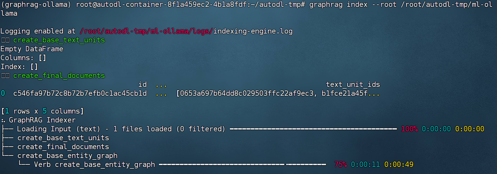

伴随着执行的过程，ollama对话页面也能看到具体模型调用过程：


#### 2.基于本地Ollama的GraphRAG query过程

##### 2.1 命令行对话过程

```python
!graphrag query --root /root/autodl-tmp/graphrag-ollama/ml-ollama --method local --query "请帮我介绍下ID3算法"
```

```plaintext
INFO: Vector Store Args: {
    "type": "lancedb",
    "db_uri": "/root/autodl-tmp/graphrag-ollama/ml-ollama/output/lancedb",
    "container_name": "==== REDACTED ====",
    "overwrite": true
}
creating llm client with {'api_key': 'REDACTED,len=6', 'type': "openai_chat", 'model': 'qwen2.5-7b-instruct', 'max_tokens': 4000, 'temperature': 0.0, 'top_p': 1.0, 'n': 1, 'request_timeout': 180.0, 'api_base': 'http://localhost:11434/v1', 'api_version': None, 'organization': None, 'proxy': None, 'audience': None, 'deployment_name': None, 'model_supports_json': True, 'tokens_per_minute': 0, 'requests_per_minute': 0, 'max_retries': 10, 'max_retry_wait': 10.0, 'sleep_on_rate_limit_recommendation': True, 'concurrent_requests': 25}
creating embedding llm client with {'api_key': 'REDACTED,len=6', 'type': "openai_embedding", 'model': 'nomic-embed-text', 'max_tokens': 4000, 'temperature': 0, 'top_p': 1, 'n': 1, 'request_timeout': 180.0, 'api_base': 'http://localhost:11434/api', 'api_version': None, 'organization': None, 'proxy': None, 'audience': None, 'deployment_name': None, 'model_supports_json': None, 'tokens_per_minute': 0, 'requests_per_minute': 0, 'max_retries': 10, 'max_retry_wait': 10.0, 'sleep_on_rate_limit_recommendation': True, 'concurrent_requests': 25}
Error embedding chunk {'OpenAIEmbedding': "1 validation error for EmbeddingsRequest\nprompt\n  Input should be a valid string [type=string_type, input_value=('请', '帮', '我', '... 'D', '3', '算', '法'), input_type=tuple]\n    For further information visit https://errors.pydantic.dev/2.10/v/string_type"}

SUCCESS: Local Search Response:

当然可以！ID3（Iterative Dichotomizer 3）是一种经典的决策树学习算法，由Ross Quinlan在1986年提出。它主要用于分类问题，并且是后续更复杂的C4.5和C5.0算法的基础。

### 基本概念

- **决策树**：一种树形结构，每个内部节点表示一个属性上的测试，每个分支代表一个测试结果，每个叶节点代表一个类别。
- **信息熵（Entropy）**：衡量数据集的不确定性或混乱程度。对于分类问题，信息熵越小，说明数据集中的样本分布越均匀，分类效果越好。
- **信息增益（Information Gain）**：表示通过某个属性划分数据集后，数据集的信息熵减少的程度。

### 算法步骤

1. **选择根节点**：
   - 从所有可用的特征中选择一个能够最大化信息增益的特征作为决策树的根节点。
   
2. **递归构建子树**：
   - 对于每个可能的属性值，创建一个新的分支，并将数据集按照该属性值进行划分。
   - 计算每个子数据集的信息熵，并计算当前属性的信息增益。
   - 选择信息增益最大的属性作为当前节点的分裂标准。
   
3. **停止条件**：
   - 当所有样本属于同一类别时，创建一个叶节点并结束该分支。
   - 如果没有更多的特征可以使用（即所有特征都已用完），则创建一个叶节点并将当前子数据集中的多数类作为分类结果。

### 优点

- 简单易懂：算法基于信息论的基本原理，易于理解和实现。
- 计算效率高：通过选择具有最大信息增益的属性进行划分，可以快速构建决策树模型。

### 缺点

- **过拟合**：当数据集中的噪声较大或特征过多时，ID3容易产生过于复杂的决策树，导致过拟合问题。
- **处理连续值**：对于连续型变量，需要先将其离散化，这可能会引入额外的误差。
- **偏向于多分类属性**：如果某个属性有较多的取值，则该属性的信息增益会相对较高，从而可能导致决策树偏向于选择这种属性。

### 总结

ID3算法是构建决策树的一种经典方法，它通过信息熵和信息增益来指导特征的选择。尽管存在一些局限性，但其简单性和高效性使其在许多实际应用中仍然具有很高的价值。随着后续版本C4.5和C5.0的发展，解决了部分问题并提高了模型的泛化能力。如果你对机器学习感兴趣，了解这些算法的基本原理是非常有帮助的。希望这个介绍对你有所帮助！如果有任何其他问题或需要进一步解释，请随时告诉我。
```

##### 2.2 基于Python SDK的对话过程

* Step 1.导入相关的库

```python
import os

import pandas as pd
import tiktoken

from graphrag.query.context_builder.entity_extraction import EntityVectorStoreKey
from graphrag.query.indexer_adapters import (
    read_indexer_covariates,
    read_indexer_entities,
    read_indexer_relationships,
    read_indexer_reports,
    read_indexer_text_units,
)
from graphrag.query.input.loaders.dfs import (
    store_entity_semantic_embeddings,
)
from graphrag.query.llm.oai.chat_openai import ChatOpenAI
from graphrag.query.llm.oai.embedding import OpenAIEmbedding
from graphrag.query.llm.oai.typing import OpenaiApiType
from graphrag.query.question_gen.local_gen import LocalQuestionGen
from graphrag.query.structured_search.local_search.mixed_context import (
    LocalSearchMixedContext,
)
from graphrag.query.structured_search.local_search.search import LocalSearch
from graphrag.vector_stores.lancedb import LanceDBVectorStore
```

```plaintext
/root/miniconda3/envs/graphrag-ollama/lib/python3.10/site-packages/tqdm/auto.py:21: TqdmWarning: IProgress not found. Please update jupyter and ipywidgets. See https://ipywidgets.readthedocs.io/en/stable/user_install.html
  from .autonotebook import tqdm as notebook_tqdm
```

* Step 2.导入图谱

```python
INPUT_DIR = "/root/autodl-tmp/graphrag-ollama/ml-ollama/output"
LANCEDB_URI = f"{INPUT_DIR}/lancedb"

COMMUNITY_REPORT_TABLE = "create_final_community_reports"
ENTITY_TABLE = "create_final_nodes"
ENTITY_EMBEDDING_TABLE = "create_final_entities"
RELATIONSHIP_TABLE = "create_final_relationships"
TEXT_UNIT_TABLE = "create_final_text_units"
COMMUNITY_LEVEL = 2
```

```python
entity_df = pd.read_parquet(f"{INPUT_DIR}/{ENTITY_TABLE}.parquet")
entity_embedding_df = pd.read_parquet(f"{INPUT_DIR}/{ENTITY_EMBEDDING_TABLE}.parquet")

entities = read_indexer_entities(entity_df, entity_embedding_df, COMMUNITY_LEVEL)

description_embedding_store = LanceDBVectorStore(
    collection_name="default-entity-description",
)
description_embedding_store.connect(db_uri=LANCEDB_URI)
entity_description_embeddings = store_entity_semantic_embeddings(
    entities=entities, vectorstore=description_embedding_store
)

print(f"Entity count: {len(entity_df)}")
entity_df.head()
```

```plaintext
Entity count: 10
```


|   | id                               | human\_readable\_id | title     | community | level | degree | x | y |
| - | -------------------------------- | ------------------- | --------- | --------- | ----- | ------ | - | - |
| 0 | 2aad028bd7264c52994beea0e6b9fdfc | 0                   | ID3       | 0         | 0     | 9      | 0 | 0 |
| 1 | 40dfc4d13cb1480e94422d82c5677d36 | 1                   | C4.5      | 1         | 0     | 3      | 0 | 0 |
| 2 | 4c0ab8b2e26243e99a54c12f040ddc8a | 2                   | CART TREE | 0         | 0     | 1      | 0 | 0 |
| 3 | 1d244ee69c7c49aab28deaf33174efc8 | 3                   | AGE       | 0         | 0     | 1      | 0 | 0 |
| 4 | 7af451867ef64cc1b3abc109098d3530 | 4                   | INCOME    | 0         | 0     | 1      | 0 | 0 |

```python
relationship_df = pd.read_parquet(f"{INPUT_DIR}/{RELATIONSHIP_TABLE}.parquet")
relationships = read_indexer_relationships(relationship_df)

print(f"Relationship count: {len(relationship_df)}")
relationship_df.head()
```

```plaintext
Relationship count: 11
```


|   | id                               | human\_readable\_id | source | target    | description                                       | weight | combined\_degree | text\_unit\_ids                                    |
| - | -------------------------------- | ------------------- | ------ | --------- | ------------------------------------------------- | ------ | ---------------- | -------------------------------------------------- |
| 0 | 0b76f33339064d0db05755b5fd464a0d | 0                   | ID3    | C4.5      | C4.5 is an improved version of the ID3 algorit... | 16.0   | 12               | \[0653a697b64dd8c029503ffc22af9ec3, b1fce21a45f... |
| 1 | 03882ac8ccbb4df59ff7c91bd0de53d7 | 1                   | ID3    | CART TREE | ID3 and CART Tree both aim to reduce dataset i... | 7.0    | 10               | \[0653a697b64dd8c029503ffc22af9ec3]                |
| 2 | 2a77965ec2fb4359a94c674d1e0f357b | 2                   | ID3    | AGE       | The ID3 algorithm utilizes "Age" as a feature ... | 13.0   | 10               | \[0653a697b64dd8c029503ffc22af9ec3, b1fce21a45f... |
| 3 | a3bf392c8c434aca910f1c4f562602d4 | 3                   | ID3    | INCOME    | In the ID3 decision tree algorithm, income is ... | 7.0    | 10               | \[0653a697b64dd8c029503ffc22af9ec3, b1fce21a45f... |
| 4 | 3cceba910be44544845344f5f59e5c5b | 4                   | ID3    | SKLEARN   | ID3 is not supported by the Sklearn library fo... | 5.0    | 11               | \[0653a697b64dd8c029503ffc22af9ec3]                |

```python
report_df = pd.read_parquet(f"{INPUT_DIR}/{COMMUNITY_REPORT_TABLE}.parquet")
reports = read_indexer_reports(report_df, entity_df, COMMUNITY_LEVEL)

print(f"Report records: {len(report_df)}")
report_df.head()
```

```plaintext
Report records: 2
```


|   | id                                   | human\_readable\_id | community | level | title                                 | summary                                           | full\_content                                     | rank | rank\_explanation                                 | findings                                           | full\_content\_json                            | period     | size |
| - | ------------------------------------ | ------------------- | --------- | ----- | ------------------------------------- | ------------------------------------------------- | ------------------------------------------------- | ---- | ------------------------------------------------- | -------------------------------------------------- | ---------------------------------------------- | ---------- | ---- |
| 0 | afe0851a-ab46-416d-bc40-74690bea65c4 | 0                   | 0         | 0     | ID3 Decision Tree Algorithm Community | The community centers around the ID3 decision ... | # ID3 Decision Tree Algorithm Community\n\nThe... | 6.5  | The impact severity rating is moderate to high... | \[{'explanation': 'The ID3 algorithm is a centr... | {\n "title": "ID3 Decision Tree Algorithm C... | 2024-11-26 | 8    |
| 1 | 782d2194-aa11-4bd7-ad02-c8dcc527a1d2 | 1                   | 1         | 0     | C4.5 and Sklearn Integration          | The community is centered around the C4.5 deci... | # C4.5 and Sklearn Integration\n\nThe communit... | 4.5  | The impact severity rating is moderate due to ... | \[{'explanation': 'C4.5 is an improved version ... | {\n "title": "C4.5 and Sklearn Integration"... | 2024-11-26 | 2    |

```python
text_unit_df = pd.read_parquet(f"{INPUT_DIR}/{TEXT_UNIT_TABLE}.parquet")
text_units = read_indexer_text_units(text_unit_df)

print(f"Text unit records: {len(text_unit_df)}")
text_unit_df.head()
```

```plaintext
Text unit records: 4
```


|   | id                               | human\_readable\_id | text                                              | n\_tokens | document\_ids                       | entity\_ids                                        | relationship\_ids                                  |
| - | -------------------------------- | ------------------- | ------------------------------------------------- | --------- | ----------------------------------- | -------------------------------------------------- | -------------------------------------------------- |
| 0 | 0653a697b64dd8c029503ffc22af9ec3 | 1                   | Lesson 8.3 ID3、C4.5决策树的建模流程\nID3和C4.5作为的经典决策树算... | 1200      | \[c546fa97b72c8b72b7efb0c1ac45cb1d] | \[2aad028bd7264c52994beea0e6b9fdfc, 40dfc4d13cb... | \[0b76f33339064d0db05755b5fd464a0d, 03882ac8ccb... |
| 1 | b1fce21a45f01c5ef14bafc9fe3bab1d | 2                   | 8961919\n然后即可算出按照如此规则进行数据集划分，最终能够减少的不纯度数值：\n# ... | 1200      | \[c546fa97b72c8b72b7efb0c1ac45cb1d] | \[2aad028bd7264c52994beea0e6b9fdfc, 40dfc4d13cb... | \[0b76f33339064d0db05755b5fd464a0d, 2a77965ec2f... |
| 2 | 08530861b09098077a0ebcd53ab3ae62 | 3                   | 4.5决策树的基本建模流程\n作为ID3的改进版算法，C4.5在ID3的基础上进行了三个方面... | 1200      | \[c546fa97b72c8b72b7efb0c1ac45cb1d] | None                                               | None                                               |
| 3 | e97cc7c63047f6471b4beac2f375eae0 | 4                   | 集划分。\n\nC4.5的连续变量处理方法\nC4.5允许带入连续变量进行建模，并且围绕连续... | 558       | \[c546fa97b72c8b72b7efb0c1ac45cb1d] | None                                               | None                                               |

* **Step 3.创建模型**

```python
llm = ChatOpenAI(
    api_key='ollama',
    model='qwen2.5-7b-instruct',
    api_base="http://localhost:11434/v1",
    api_type=OpenaiApiType.OpenAI,  
    max_retries=20,
)

token_encoder = tiktoken.get_encoding("cl100k_base")

text_embedder = OpenAIEmbedding(
    api_key='ollama',
    api_base="http://localhost:11434/api",
    api_type=OpenaiApiType.OpenAI,
    model='nomic-embed-text',
    max_retries=20,
)
```

* **Step 4.创建上下文构建器**

```python
context_builder = LocalSearchMixedContext(
    community_reports=reports,
    text_units=text_units,
    entities=entities,
    relationships=relationships,
    covariates=None,
    entity_text_embeddings=description_embedding_store,
    embedding_vectorstore_key=EntityVectorStoreKey.ID,  
    text_embedder=text_embedder,
    token_encoder=token_encoder,
)
```

* **Step 5.设置搜索引擎参数**

```python
local_context_params = {
    "text_unit_prop": 0.5,
    "community_prop": 0.1,
    "conversation_history_max_turns": 5,
    "conversation_history_user_turns_only": True,
    "top_k_mapped_entities": 10,
    "top_k_relationships": 10,
    "include_entity_rank": True,
    "include_relationship_weight": True,
    "include_community_rank": True,
    "return_candidate_context": True,
    "embedding_vectorstore_key": EntityVectorStoreKey.ID,  
    "max_tokens": 12_000, 
}

llm_params = {
    "max_tokens": 2_000, 
    "temperature": 0.0,
}
```

* **Step 6.创建搜索引擎**

```python
search_engine = LocalSearch(
    llm=llm,
    context_builder=context_builder,
    token_encoder=token_encoder,
    llm_params=llm_params,
    context_builder_params=local_context_params,
    response_type="multiple paragraphs", 
)
```

```python
result = await search_engine.asearch("请帮我介绍下ID3决策树算法")
```

```plaintext
Error embedding chunk {'OpenAIEmbedding': "1 validation error for EmbeddingsRequest\nprompt\n  Input should be a valid string [type=string_type, input_value=('请', '帮', '我', '...', '树', '算', '法'), input_type=tuple]\n    For further information visit https://errors.pydantic.dev/2.10/v/string_type"}
```

```python
result
```

````plaintext
SearchResult(response='\n当然可以！ID3（Iterative Dichotomiser 3）是一种经典的分类和回归树（CART）算法，主要用于构建决策树。它由Ross Quinlan在1986年提出，并且是最早使用信息增益作为特征选择标准的算法之一。\n\n### 基本概念\n\n- **决策树**：一种树形结构，每个内部节点表示一个属性上的测试，每个分支代表一个测试结果，每个叶节点代表一个类别或值。\n- **信息熵（Entropy）**：衡量数据集不确定性的度量。对于二分类问题，信息熵的计算公式为：\n  \\[\n  H(S) = -\\sum_{i=1}^{n} p_i \\log_2(p_i)\n  \\]\n  其中 \\(p_i\\) 是第 \\(i\\) 类别的概率。\n- **信息增益（Information Gain）**：衡量一个特征对数据集分类能力的度量。计算公式为：\n  \\[\n  IG(S, A) = H(S) - H(S|A)\n  \\]\n  其中 \\(H(S)\\) 是原始数据集的信息熵，\\(H(S|A)\\) 是在特征 \\(A\\) 下的数据集条件信息熵。\n\n### 算法步骤\n\n1. **选择最佳划分属性**：计算每个特征的信息增益，并选择具有最大信息增益的特征作为当前节点的分裂标准。\n2. **创建子树**：根据选定的特征将数据集划分为若干个子集，为每个子集递归地构建决策树。\n3. **停止条件**：\n   - 当所有样本属于同一类别时，该节点成为叶节点。\n   - 当没有更多的特征可以用于划分时，该节点也成为叶节点。\n\n### 优点\n\n- 简单易懂：信息增益的计算直观且易于理解。\n- 计算效率高：相比于其他一些更复杂的算法（如C4.5），ID3的计算速度更快。\n\n### 缺点\n\n- **倾向选择具有较多取值的特征**：因为信息增益倾向于选择具有更多分裂选项的特征，这可能导致过拟合。\n- **无法处理连续型数据**：ID3只能处理离散型数据，对于连续型数据需要进行离散化处理。\n\n### 实现示例\n\n假设有一个包含三个属性（A1, A2, A3）和一个目标变量（Class）的数据集。我们可以通过以下步骤来构建决策树：\n\n```python\nfrom collections import Counter\n\ndef entropy(data):\n    labels = [row[-1] for row in data]\n    counts = Counter(labels)\n    ent = 0.0\n    for lbl in counts:\n        prob_of_lbl = counts[lbl] / float(len(labels))\n        ent -= prob_of_lbl * np.log2(prob_of_lbl)\n    return ent\n\ndef information_gain(data, feature):\n    total_entropy = entropy(data)\n    vals, counts = np.unique([row[feature] for row in data], return_counts=True)\n    weighted_avg_entropy = sum([(counts[i] / float(len(data))) * entropy([row for row in data if row[feature] == vals[i]]) for i in range(len(vals))])\n    return total_entropy - weighted_avg_entropy\n\ndef id3(data, features):\n    labels = [row[-1] for row in data]\n    most_common_label = Counter(labels).most_common(1)[0][0]\n\n    # 如果所有样本属于同一类别，返回该类别的节点\n    if len(set(labels)) == 1:\n        return most_common_label\n\n    # 如果没有特征可以用于划分，返回多数类的节点\n    if not features:\n        return most_common_label\n\n    best_feature = max(features, key=lambda f: information_gain(data, f))\n    tree = {best_feature: {}}\n\n    for val in np.unique([row[best_feature] for row in data]):\n        sub_data = [row for row in data if row[best_feature] == val]\n        remaining_features = list(features)\n        remaining_features.remove(best_feature)\n\n        subtree = id3(sub_data, remaining_features)\n        tree[best_feature][val] = subtree\n\n    return tree\n```\n\n这个示例展示了如何使用ID3算法构建决策树。实际应用中，可以进一步优化和扩展该算法以处理更复杂的数据集。\n\n希望这些信息对你有所帮助！如果你有任何其他问题或需要更多细节，请随时告诉我。', context_data={}, context_text='', completion_time=9.82521939277649, llm_calls=1, prompt_tokens=599, output_tokens=1204, llm_calls_categories={'build_context': 0, 'response': 1}, prompt_tokens_categories={'build_context': 0, 'response': 599}, output_tokens_categories={'build_context': 0, 'response': 1204})
````

```python
from IPython.display import Markdown, display
```

```python
display(Markdown(result.response))
```

当然可以！ID3（Iterative Dichotomiser 3）是一种经典的分类和回归树（CART）算法，主要用于构建决策树。它由Ross Quinlan在1986年提出，并且是最早使用信息增益作为特征选择标准的算法之一。

### 基本概念

* **决策树**：一种树形结构，每个内部节点表示一个属性上的测试，每个分支代表一个测试结果，每个叶节点代表一个类别或值。

* **信息熵（Entropy）**：衡量数据集不确定性的度量。对于二分类问题，信息熵的计算公式为：
  \[
  H(S) = -\sum\_{i=1}^{n} p\_i \log\_2(p\_i)
  ]
  其中 (p\_i) 是第 (i) 类别的概率。

* **信息增益（Information Gain）**：衡量一个特征对数据集分类能力的度量。计算公式为：
  \[
  IG(S, A) = H(S) - H(S|A)
  ]
  其中 (H(S)) 是原始数据集的信息熵，(H(S|A)) 是在特征 (A) 下的数据集条件信息熵。

### 算法步骤

1. **选择最佳划分属性**：计算每个特征的信息增益，并选择具有最大信息增益的特征作为当前节点的分裂标准。

2. **创建子树**：根据选定的特征将数据集划分为若干个子集，为每个子集递归地构建决策树。

3. **停止条件**：

   * 当所有样本属于同一类别时，该节点成为叶节点。

   * 当没有更多的特征可以用于划分时，该节点也成为叶节点。

### 优点

* 简单易懂：信息增益的计算直观且易于理解。

* 计算效率高：相比于其他一些更复杂的算法（如C4.5），ID3的计算速度更快。

### 缺点

* **倾向选择具有较多取值的特征**：因为信息增益倾向于选择具有更多分裂选项的特征，这可能导致过拟合。

* **无法处理连续型数据**：ID3只能处理离散型数据，对于连续型数据需要进行离散化处理。

### 实现示例

假设有一个包含三个属性（A1, A2, A3）和一个目标变量（Class）的数据集。我们可以通过以下步骤来构建决策树：

```python
from collections import Counter

def entropy(data):
    labels = [row[-1] for row in data]
    counts = Counter(labels)
    ent = 0.0
    for lbl in counts:
        prob_of_lbl = counts[lbl] / float(len(labels))
        ent -= prob_of_lbl * np.log2(prob_of_lbl)
    return ent

def information_gain(data, feature):
    total_entropy = entropy(data)
    vals, counts = np.unique([row[feature] for row in data], return_counts=True)
    weighted_avg_entropy = sum([(counts[i] / float(len(data))) * entropy([row for row in data if row[feature] == vals[i]]) for i in range(len(vals))])
    return total_entropy - weighted_avg_entropy

def id3(data, features):
    labels = [row[-1] for row in data]
    most_common_label = Counter(labels).most_common(1)[0][0]

    # 如果所有样本属于同一类别，返回该类别的节点
    if len(set(labels)) == 1:
        return most_common_label

    # 如果没有特征可以用于划分，返回多数类的节点
    if not features:
        return most_common_label

    best_feature = max(features, key=lambda f: information_gain(data, f))
    tree = {best_feature: {}}

    for val in np.unique([row[best_feature] for row in data]):
        sub_data = [row for row in data if row[best_feature] == val]
        remaining_features = list(features)
        remaining_features.remove(best_feature)

        subtree = id3(sub_data, remaining_features)
        tree[best_feature][val] = subtree

    return tree
```

这个示例展示了如何使用ID3算法构建决策树。实际应用中，可以进一步优化和扩展该算法以处理更复杂的数据集。

希望这些信息对你有所帮助！如果你有任何其他问题或需要更多细节，请随时告诉我。

```python
result = await search_engine.asearch("ID3和C4.5之间是什么关系")
display(Markdown(result.response))
```

```plaintext
Error embedding chunk {'OpenAIEmbedding': "1 validation error for EmbeddingsRequest\nprompt\n  Input should be a valid string [type=string_type, input_value=('I', 'D', '3', '和', 'C...', '么', '关', '系'), input_type=tuple]\n    For further information visit https://errors.pydantic.dev/2.10/v/string_type"}
```

？ ID3（Iterative Dichotomiser 3）和C4.5是两个紧密相关的机器学习算法，它们都属于决策树分类器。具体来说：

1. **起源**：ID3是由J. Ross Quinlan在1979年开发的最早的决策树算法之一。

2. **发展**：

   * ID3 是 C4.5 的前身。

   * C4.5 是对 ID3 进行改进和扩展的结果，由 J. Ross Quinlan 在 1993 年发布。

3. **主要区别**：

   * **处理缺失值**：C4.5 能够处理数据中的缺失值，而原始的 ID3 不能。

   * **剪枝技术**：C4.5 引入了预剪枝和后剪枝的技术来减少过拟合的风险。ID3 只有简单的剪枝方法。

   * **增益比率**：C4.5 使用增益比率作为特征选择的标准，而 ID3 仅使用信息增益。

4. **算法流程**：

   * **ID3**：基于信息熵和信息增益进行决策树的构建。它通过递归地将数据集划分为更小的子集来生成决策树。

   * **C4.5**：在 ID3 的基础上增加了处理缺失值、剪枝技术以及使用增益比率等改进。

总结来说，C4.5 是对 ID3 进行了多项改进和扩展后的版本。可以说 C4.5 继承并发展了 ID3 的核心思想和技术，并在此基础上添加了许多新的功能和优化措施。因此，可以将它们视为同一系列算法中的不同阶段或版本。在实际应用中，C4.5 通常被认为是一个更强大、更灵活的决策树分类器。

希望这个解释对你有所帮助！如果你有更多问题，请随时提问。

***

**更多大模型技术内容学习**

**扫码添加助理英英，回复“大模型”，了解更多大模型技术详情哦👇**


此外，**扫码回复“入群”**，即可加入**大模型技术社群：海量硬核独家技术`干货内容`+无门槛`技术交流`！**
