***

## 《大模型与Agent开发实战》（12月班）

## Agent智能体开发实战体验课 - 从零搭建智能客服系统

  本期公开课（连载三天）我们将实现这样一个智能客服系统：

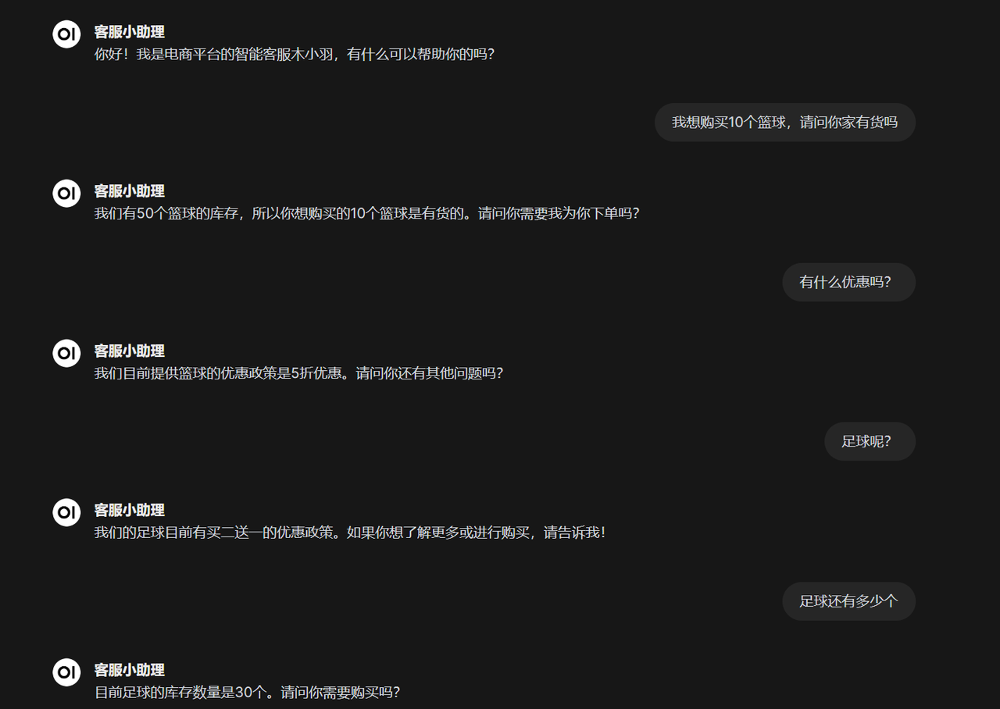

  在这三天中我给大家准备了非常丰富的资料，在 【完课】后可以找助教老师领取\~


## Day 3. 二次开发Open WebUI项目构建专属智能客服系统

# 课程目录

1. Open WebUI项目回顾

   * Open WebUI 项目概览

   * Open WebUI 项目的个性化定制方法

2. Ollama项目介绍与核心功能速览

   * Ollama项目介绍

   * Ollama运行所需硬件支持

   * Ollama快速使用方法

   * 如何使用Ollama启动Qwen2.5并接入Open WebUI项目

3. 基于Open WebUI 定制化私有智能客服

   * Step 1.不同大模型的接入方法

   * Step 2.通过 System Message设定身份背景

   * Step 3.构建私有工具库

   * Step 4.工具的绑定方法

   * Step 5.问答效果测试

4. 大模型与Agent学习路径规划

   * 多样化的大模型怎么选择

   * Single-Agent的局限

   * 学习Multi-Agent的关键

   * Agent开发的不同方式

   * 热门Agent开发框架的分类

# 1. Open WebUI项目回顾

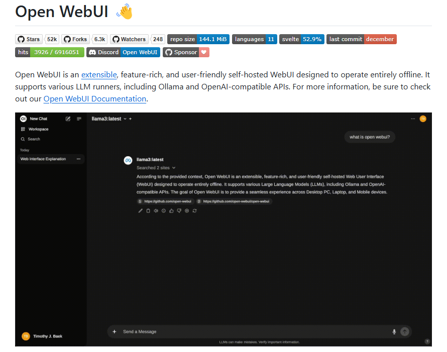

🚀 **轻松安装**：通过 Docker 或 Kubernetes（kubectl、kustomize 或 helm）实现无缝安装，支持 :ollama 和 :cuda 标签镜像，带来无忧体验。

🤝 **Ollama/OpenAI API 集成**：轻松集成与 OpenAI 兼容的 API，支持与 Ollama 模型的多样化对话。自定义 OpenAI API URL，可与 LMStudio、GroqCloud、Mistral、OpenRouter 等平台对接。

🛡️ **细粒度权限和用户组**：管理员可以创建详细的用户角色和权限，确保用户环境的安全性。这种细粒度管理不仅增强了安全性，还允许定制化的用户体验，培养用户的责任感与归属感。

📱 **响应式设计**：在桌面PC、笔记本和移动设备上都能享受无缝的使用体验。

✒️🔢 **完整的 Markdown 和 LaTeX 支持**：通过全面的 Markdown 和 LaTeX 支持，提升 LLM（大语言模型）体验，让交互更为丰富。

🎤📹 **免提语音/视频通话**：享受无缝的语音和视频通话功能，提供更为动态和互动的聊天环境。

🛠️ **模型构建器**：通过 Web UI 轻松创建 Ollama 模型。创建并添加自定义角色/代理，定制聊天元素，并通过 Open WebUI 社区集成轻松导入模型。

🐍 **原生 Python 函数调用工具**：通过内置代码编辑器支持，增强 LLM 功能。通过“Bring Your Own Function” (BYOF) 轻松集成自己的 Python 函数，与 LLM 无缝对接。

📚 **本地 RAG 集成**：体验未来的聊天互动，开创性的检索增强生成（RAG）支持，让文档互动无缝融入聊天体验。您可以直接将文档加载到聊天中，或通过 # 命令将文件添加到文档库，方便在查询时访问。

🔍 **Web 搜索集成 RAG**：通过 SearXNG、Google PSE、Brave Search、serpstack、serper、Serply、DuckDuckGo、TavilySearch、SearchApi 和 Bing 等搜索引擎提供商执行 Web 搜索，并将结果直接注入到您的聊天体验中。

🌐 **Web 浏览功能**：通过 # 命令加 URL，无缝集成网站内容到聊天体验中，增强互动的丰富性和深度。

🎨 **图像生成集成**：通过 AUTOMATIC1111 API 或 ComfyUI（本地）以及 OpenAI 的 DALL-E（外部）等选项，轻松集成图像生成功能，为聊天体验增添动态视觉内容。

⚙️ **多模型对话**：轻松与多种模型同时互动，利用各自的优势提供最优回应。通过并行利用多种模型，提升聊天效果。

🔐 **基于角色的访问控制（RBAC）**：确保安全的访问控制，只有授权用户才能访问 Ollama，模型创建/拉取权限仅限管理员。

🌐🌍 **多语言支持**：体验您喜欢的语言版本的 Open WebUI，我们提供国际化（i18n）支持，积极拓展更多语言！欢迎加入我们成为贡献者！

🧩 **管道与 Open WebUI 插件支持**：通过管道插件框架，无缝集成自定义逻辑和 Python 库到 Open WebUI。启动您的管道实例，设置 OpenAI URL 为管道 URL，探索无限可能性。功能示例包括函数调用、用户速率限制、使用监控（如 Langfuse）、实时翻译（如 LibreTranslate 多语言支持）、有害信息过滤等。

🌟 **持续更新**：我们承诺定期更新 Open WebUI，提供修复和新增功能，不断优化用户体验。

  这里我们是可以关注到，**`Open WebUI`项目支持接入在线大模型和开源大模型，比如 OpenAI、GLM4、Qwen2.5等等，均可以通过`Open WebUI`的 `Functions` 功能来灵活的接入，支持一键导入配置**，比如：

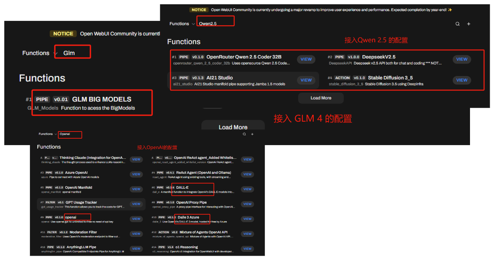

  在 Open WebUI 项目中，Functions（功能）通常是指该项目提供的可以执行特定任务或操作的模块或方法。这些功能可以帮助用户与大模型进行交互、配置模型参数、获取输出结果等。具体来说，这些 Functions 包括文本生成、模型参数调节、会话管理功能、API 接口、模型选择和管理等实现细节。


  相较在线模型，开源大模型的部署和使用则会更加复杂，会涉及大模型的私有化部署，再通过命令行、网页端访问和API调用等多种不同的方式与部署的大模型进行交互。但实际上，无论是基于大模型去做任何形式的应用开发过程，仅停留在这个阶段肯定无法满足实际的需求。关于主流的开闭源大模型，在我们的正式课程《大模型与Agent 开发实战课》中均有非常详细的讲解，如果有系统性学习大模型技术需求的小伙伴，可以扫码咨询正式课程。

**《大模型与Agent开发实战课》课程原价5999，今天双十二返场秒杀最后4小时，立减2000，木羽老师直播间专属优惠券1000，仅需2999即可入学，【仅限前10名】详细信息扫码添加助教，回复“大模型”，即可领取课程大纲&查看课程详情👇**


  这里我们就借助`Functions`功能给大家在`Open WebUI`项目中接入了一个免费可调用的大模型，其`Functions` 详细代码如下图所示：

```python
import os
import json
from pydantic import BaseModel, Field
from openai import OpenAI
from typing import List, Union, Iterator

# Set DEBUG to True to enable detailed logging
DEBUG = False


class Pipe:
    class Valves(BaseModel):
        openai_API_KEY: str = Field(default="")  # Optional API key if needed
        DEFAULT_MODEL: str = Field(default="openai")  # Default model identifier

    def __init__(self):
        self.id = "openai"
        self.type = "manifold"
        self.name = "openai: "
        self.valves = self.Valves(
            **{
                "openai_API_KEY": os.getenv("openai_API_KEY", ""),
                "DEFAULT_MODEL": os.getenv("openai_DEFAULT_MODEL", "openai"),
            }
        )
        self._init_client()

    def _init_client(self):
        """Initialize OpenAI client with openai.ai endpoint"""
        self.client = OpenAI(
            api_key=self.valves.openai_API_KEY
            or "dummy-key",  # Some clients require a non-empty API key
            base_url="https://text.pollinations.ai/openai",
        )

    def get_openai_models(self):
        """Return available models - for openai we'll return a fixed list"""
        return [{"id": "openai", "name": "openai AI"}]

    def pipes(self) -> List[dict]:
        return self.get_openai_models()

    def pipe(self, body: dict) -> Union[str, Iterator[str]]:
        try:
            # Use default model ID since openai has a single endpoint
            model_id = self.valves.DEFAULT_MODEL

            messages = []

            # Process messages including system, user, and assistant messages
            for message in body["messages"]:
                if isinstance(message.get("content"), list):
                    # For openai, we'll join multiple content parts into a single text
                    text_parts = []
                    for content in message["content"]:
                        if content["type"] == "text":
                            text_parts.append(content["text"])
                        elif content["type"] == "image_url":
                            # openai might not support image inputs - add a note about the image
                            text_parts.append(f"[Image: {content['image_url']['url']}]")
                    messages.append(
                        {"role": message["role"], "content": " ".join(text_parts)}
                    )
                else:
                    # Handle simple text messages
                    messages.append(
                        {"role": message["role"], "content": message["content"]}
                    )

            if DEBUG:
                print("openai API request:")
                print("  Model:", model_id)
                print("  Messages:", json.dumps(messages, indent=2))

            # Prepare the API call parameters
            kwargs = {
                "model": model_id,
                "messages": messages,
                "temperature": body.get("temperature", 0.7),
                "top_p": body.get("top_p", 0.9),
                "max_tokens": body.get("max_tokens", 8192),
                "stream": body.get("stream", True),
            }

            # Add stop sequences if provided
            if body.get("stop"):
                kwargs["stop"] = body["stop"]

            if body.get("stream", False):

                def stream_generator():
                    try:
                        response = self.client.chat.completions.create(**kwargs)
                        for chunk in response:
                            if chunk.choices[0].delta.content:
                                yield chunk.choices[0].delta.content
                    except Exception as e:
                        if DEBUG:
                            print(f"Streaming error: {e}")
                        yield f"Error during streaming: {str(e)}"

                return stream_generator()
            else:
                response = self.client.chat.completions.create(**kwargs)
                return response.choices[0].message.content

        except Exception as e:
            if DEBUG:
                print(f"Error in pipe method: {e}")
            return f"Error: {e}"

    def health_check(self) -> bool:
        """Check if the openai API is accessible"""
        try:
            # Simple health check with a basic prompt
            response = self.client.chat.completions.create(
                model=self.valves.DEFAULT_MODEL,
                messages=[{"role": "user", "content": "Hello"}],
                max_tokens=5,
            )
            return True
        except Exception as e:
            if DEBUG:
                print(f"Health check failed: {e}")
            return False
```

  接入的方法按照如下步骤进行操作。首先在首页中点击账户，找到管理员面板：


  找到函数，点击加号新增：


  将默认生成的代码删除后，将上面免费接入模型的全部代码粘贴进去，并填写函数名和函数的描述，点击保存即可。如下图所示：


  接下来弹出的警告框，点击确认即可完成创建。

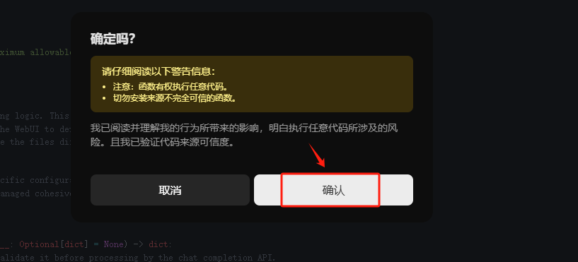

  创建完成后，回到函数页面则可以看到刚刚创建的函数，需要点击最右侧的激活，才可以进行加载。如下图所示：


  激活成功后，回到主页面，就能够看到 `openai:openai AI` 这个函数名称，选择该模型就可以开启无线轮次的免费对话了。


  至此，就完成了在`Open WebUI`项目中的一次 `Functions` 的配置，对于后续自定义其他 `Functions` 的使用方法也是一致，大家可以自行进行尝试。

# 2. Open WebUI接入开源大模型

  除了`Functions`的形式，`Open WebUI`项目原生集成了 OpenAI 兼容的 API，支持与 Ollama 模型的多样化对话，如下图所示：


  因此，要想接入开源模型，我们首先需要在本地电脑安装Ollama并下载模型的权重。

## 2.1 什么是 Ollama

  Ollama 是一个**开源**的大语言模型服务工具，专注于简化本地模型的创建、管理和部署流程。它允许用户轻松部署和管理多种流行的**开源模型**，如 Llama、Mistral 和 Code Llama。以下是 Ollama 的一些主要特点和功能：

  这个工具的主要特点：

* 简化部署：
  Ollama 通过将模型权重、配置和数据捆绑到一个称为 Modelfile 的包中，简化了模型的安装和配置过程，使得用户可以更方便地管理和运行这些模型。

* 跨平台支持：
  Ollama 支持多种操作系统，包括 macOS、Linux 和 Windows。用户只需下载相应平台的安装包即可快速安装和使用。

* 命令行操作：
  用户可以通过简单的命令行指令来启动和运行模型。例如，运行一个模型只需执行类似 ollama run model\_name 的命令。

* 资源要求：
  相较于传统部署调用模型的方法，Ollama模型支持推理的均为量化后的模型，这种方式对硬件资源的需求更低，更适合开发者快速上手。

* API 接口：
  Ollama 提供了类似 OpenAI 的 API 接口，用户可以通过这些接口与模型进行交互，支持热加载模型文件，无需重新启动即可切换不同的模型。

  Ollama 非常适合需要在本地运行大语言模型的开发者和企业，比如在本地快速创建和测试新的语言模型，Ollama 适用于学术研究、个人项目开发以及企业知识库问答等多种场景，帮助用户在本地环境中快速实验和部署大型语言模型。总的来说，Ollama 为希望在本地运行和实验大型语言模型的用户提供了一个方便且高效的解决方案。

## 2.2 Ollama运行所需硬件支持

  下列表格是Ollama支持的全部显卡的列表，大家可以参考来确定自己的设备是否可以使用该推理框架。首先是Nvidia英伟达系列显卡：


  其次是AMD系列显卡：

* Linux环境：


* Windows环境：


## 2.3 Ollama快速使用方法

  Ollama在国内网络环境下就可以便捷登录，在官网可以看到Ollama支持的模型列表： https://ollama.com/library ， 在搜索栏（Search models）中输入你想要的模型的名称，在下方界面便会显示平台上支持的模型列表：


  这里以qwen2.5为例进行部署演示：


  每个模型下面有支持的功能和参数型号以及基本的模型描述，点击进入对应模型可以看到下载所需占用的内存大小。


  点击左边下拉列表可以选择不同参数的模型，大家可以根据自己的硬件条件和使用需要来选择对应的模型，在右侧会显示对应模型的启动代码。使用7b模型需要6G左右的显存，14b模型需要12G左右的显存，72b模型需要60G的显存进行推理。

  如果本地电脑没有GPU资源，可以选择租赁云平台服务器，一张3090,24G显存配置的服务器约1.3元一小时。详细的在线服务器租赁教程与Anaconda环境配置，大家可以添加专属助理领取：


  Ollama同样支持在Windows环境下进行部署下载，首先要下载Windows版的Ollama文件，进入官网选择下图的内容进行下载：https://ollama.com/download

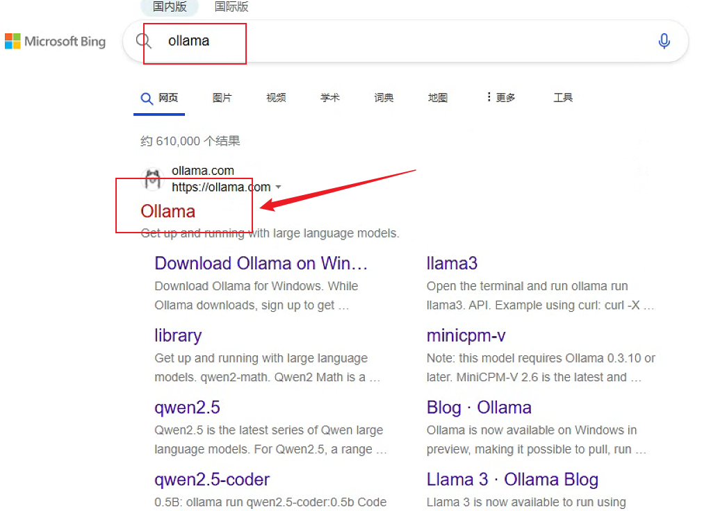

  当然，你也可以直接在浏览器中搜索关键词`ollama`,按照图中的实例点击进入官网亦可。进入官网后点击正下方的Download按钮，进入下载页面。


  确保是在Windows环境的下载方式，即可点击Download for Windows开始下载。


  开始下载后便会在右上角下载/安装栏出现下图图标，安装完成后可以在下载栏或下载文件夹（你的默认下载路径）找到该文件。


  下载完成后在对应文件夹双击打开安装包完成安装流程。

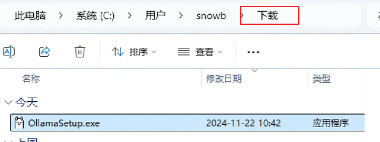

  下载完成后在对应文件夹双击打开安装包完成安装流程。


  等待安装完成即可。

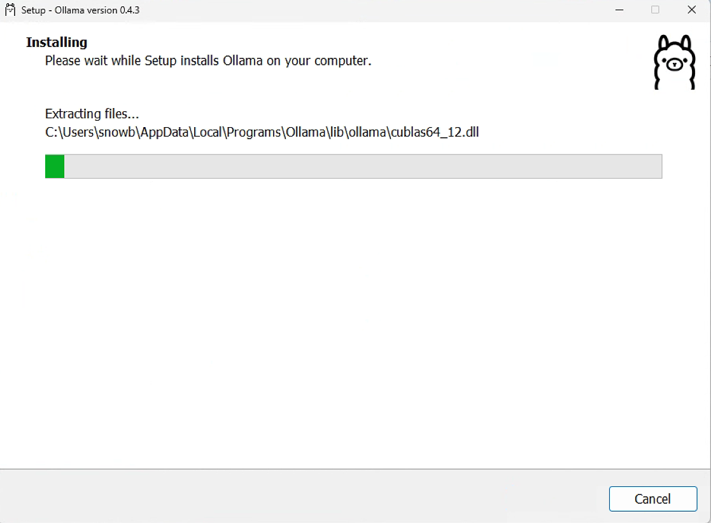

  安装完成后会有如下提示：


  启动Ollama可以直接在Windows的命令行中实现，通过win+R键启动cmd命令，打开命令行终端。

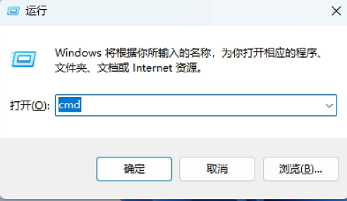

  进入命令行：

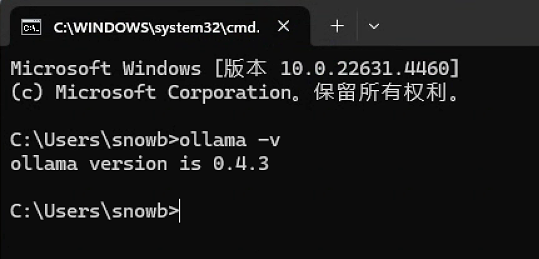

  在终端中执行命令 `ollama run qwen2.5：72b` ，即可下载 qwen2.5：72b 模型。模型下载完成后，会自动启动大模型，进入命令行交互模式，直接输入指令，就可以和模型进行对话了对应参数的模型的下载方式可以通过在Ollama官网查看到下载指令。当出现`success`字样的时候说明下载成功，当出现`>>>`图标的时候可以进行对话交互了。

```plaintext
ollama run qwen2.5:72b
```


  完成下载后会直接进入模型启动状态，如果退出或刷新界面，再次输入指令`ollama run qwen2.5:72b`即可启动对应模型。
可以看到推理所需的计算资源相对均匀的分布在每张工作显卡上。


  如果想结束对话，直接在对话栏中输入`/bye`即可结束进程。

## 2.5 接入Qwen2.5 模型

  Ollama 是支持 API 调用的，默认访问的 API 端点是：`http://localhost:11434`，所以当我们本地启动模型服务后，在`Open WebUI` 可以直接显示已经加载在本地的模型：


  所以当我们本地启动模型服务后，在`Open WebUI` 可以直接显示已经加载在本地的模型：

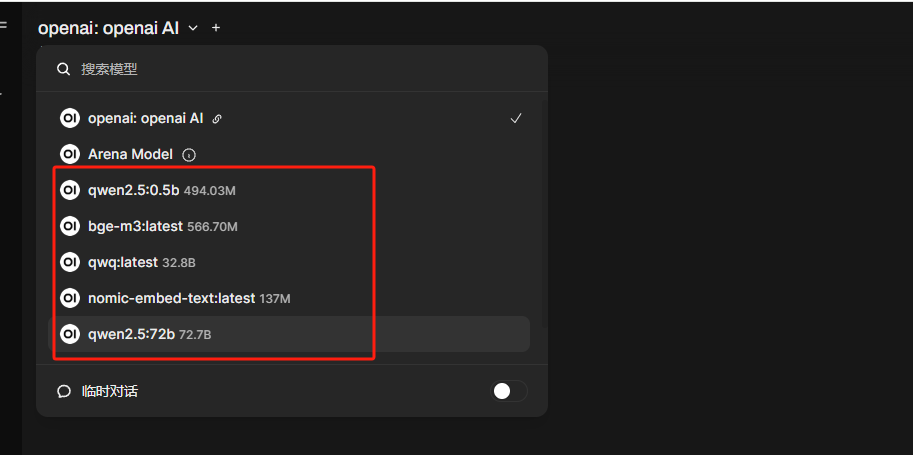

  接下来，就可以正常进行对话了。

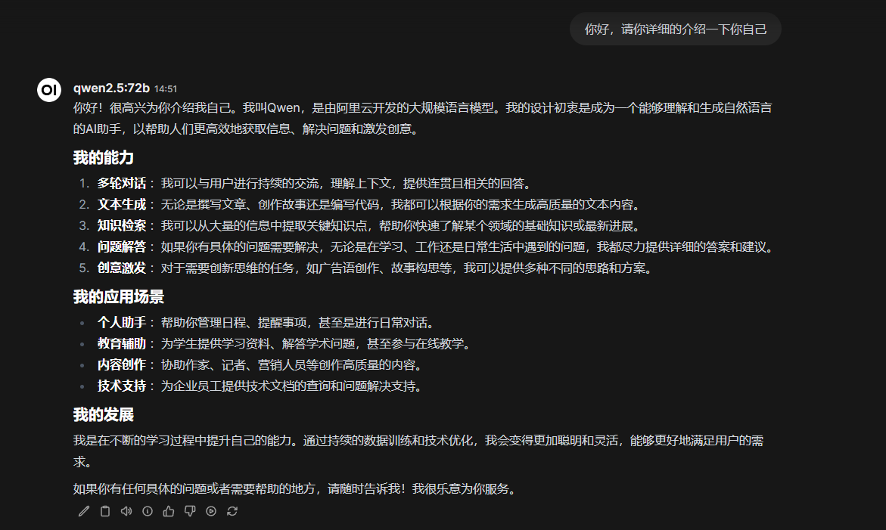

# 3. 个性化定制智能客服

  有了这样一个系统，我们怎么去定制化成一个私有领域的智能客服呢？按照前两天的思路，我们要给该系统配置身份设定和可以使用的工具。具体的配置方法如下：

## 3.1 通过 System Message 设置身份背景信息

  首先点击账户，打开管理员面板，找到模型选项：


  依次修改对话的称呼以及给智能客服设定的身份信息。


  回到主页后刷新一下页面重新加载数据，则可以看到新的名称：

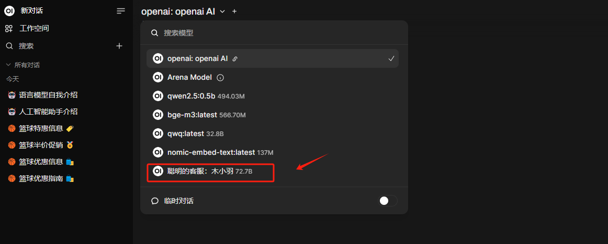

  进行问答测试，可以发现已经生效：


## 3.2 给智能客服添加私有工具

  添加工具的思路和方法就和我们体验课第二天介绍的流程是完全一致的，只不过我们需要按照`Open WebUI`的规范来进行适配，方法如下：

* **添加查询商品后台数据的工具**

  对于电商智能客服这个场景，如果我们希望它能够在回答用户的问题之前，先去查询上述创建的商品后台数据库，那么就需要出创建一个函数来做这件事。比如用户输入：`你们家都有什么球在卖`？ 那么理想的状态是这个函数可以根据 `球` 这个关键字向后台数据库执行查询操作。所以我们构建了如下所示的`query_by_product_name`函数：

```python
import pymysql


class Tools:
    def __init__(self):
        pass

    # Add your custom tools using pure Python code here, make sure to add type hints
    # Use Sphinx-style docstrings to document your tools, they will be used for generating tools specifications
    # Please refer to function_calling_filter_pipeline.py file from pipelines project for an example

    def query_by_product_name(self, product_name: str) -> str:
        """
        The name of the product to search for in the database. The function returns the promotional details if found.
        """
        print(f"开始查询产品：{product_name}")  # 打印正在查询的产品名称

        # 连接 MySQL 数据库
        try:
            print("尝试连接到 MySQL 数据库...")
            conn_mysql = pymysql.connect(
                host="localhost",  # 这里替换成你自己的 MySQL 主机地址
                user="root",  # 这里替换成你自己的用户名
                password="snowball2019",  # 这里替换成你自己的密码
                database="sports_db",  # 这里替换成你的数据库名称
                charset="utf8mb4",  # 字符集
            )
            print("成功连接到数据库")
        except Exception as e:
            print(f"连接数据库失败：{e}")
            return str(e)

        cursor_mysql = conn_mysql.cursor()

        # 使用 SQL 查询按产品名称查找优惠信息。'%'符号允许部分匹配。
        try:
            query = "SELECT * FROM products WHERE product_name LIKE %s"
            print(
                f"执行查询：{query}，参数：{('%' + product_name + '%',)}"
            )  # 打印查询和参数
            cursor_mysql.execute(query, ("%" + product_name + "%",))
        except Exception as e:
            print(f"查询执行失败：{e}")
            return str(e)

        # 获取所有查询到的数据
        try:
            rows = cursor_mysql.fetchall()
            print(f"查询结果：{rows}")  # 打印查询结果
        except Exception as e:
            print(f"获取查询结果失败：{e}")
            return str(e)

        # 关闭连接
        conn_mysql.close()
        print("数据库连接已关闭")

        if not rows:
            print("未找到相关优惠信息")

        return f"Current promotional details = {product_name}, {rows}"
```

   在`Open WebUI`中的配置方法如下：


* **添加查询商品折扣信息的数据**

  同理，如果用户问相关的折扣信息，也需要先查询后台的数据库再进行回复。

```python
import pymysql


class Tools:
    def __init__(self):
        pass

    # Add your custom tools using pure Python code here, make sure to add type hints
    # Use Sphinx-style docstrings to document your tools, they will be used for generating tools specifications
    # Please refer to function_calling_filter_pipeline.py file from pipelines project for an example

    def query_discount_by_product_name(self, product_name: str) -> str:
        """
        The name of the product to search for in the database. The function returns the promotional details if found.
        """
        print(f"开始查询产品：{product_name}")  # 打印正在查询的产品名称

        # 连接 MySQL 数据库
        try:
            print("尝试连接到 MySQL 数据库...")
            conn_mysql = pymysql.connect(
                host="localhost",  # 这里替换成你自己的 MySQL 主机地址
                user="root",  # 这里替换成你自己的用户名
                password="snowball2019",  # 这里替换成你自己的密码
                database="sports_db",  # 这里替换成你的数据库名称
                charset="utf8mb4",  # 字符集
            )
            print("成功连接到数据库")
        except Exception as e:
            print(f"连接数据库失败：{e}")
            return str(e)

        cursor_mysql = conn_mysql.cursor()

        # 使用 SQL 查询按产品名称查找优惠信息。'%'符号允许部分匹配。
        try:
            query = "SELECT * FROM discounts WHERE product_id LIKE %s"
            print(
                f"执行查询：{query}，参数：{('%' + product_name + '%',)}"
            )  # 打印查询和参数
            cursor_mysql.execute(query, ("%" + product_name + "%",))
        except Exception as e:
            print(f"查询执行失败：{e}")
            return str(e)

        # 获取所有查询到的数据
        try:
            rows = cursor_mysql.fetchall()
            print(f"查询结果：{rows}")  # 打印查询结果
        except Exception as e:
            print(f"获取查询结果失败：{e}")
            return str(e)

        # 关闭连接
        conn_mysql.close()
        print("数据库连接已关闭")

        if not rows:
            print("未找到相关优惠信息")

        return f"Current promotional details = {product_name}, {rows}"
```

   在`Open WebUI`中的配置方法如下：

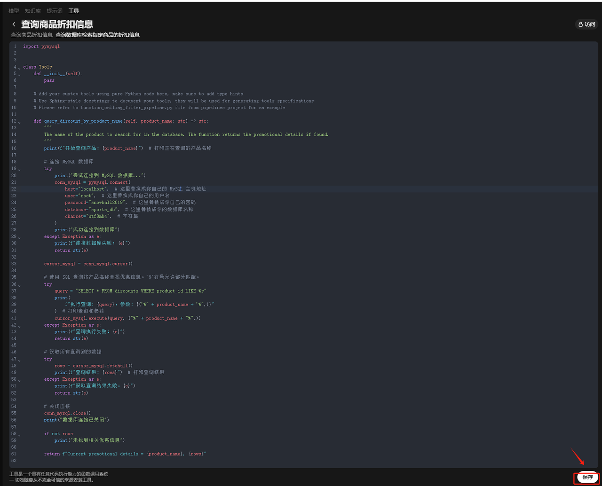

  配置完成后如下图所示：


## 3.3 给智能客服绑定工具

  在完成工具的创建后，我们需要将工具绑定到指定的智能客服中，具体的操作方法仍然是首先点击账户，打开管理员面板，找到模型选项：


  勾选创建的工具并保存，即可在下次对话时自动加载工具。

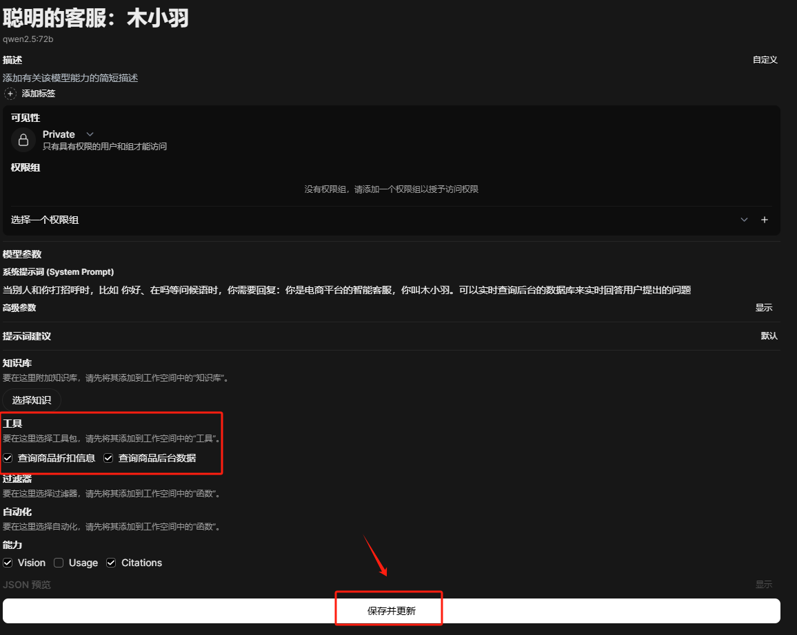

  至此，智能客服就配置好了，可以正常进行对话交互了。

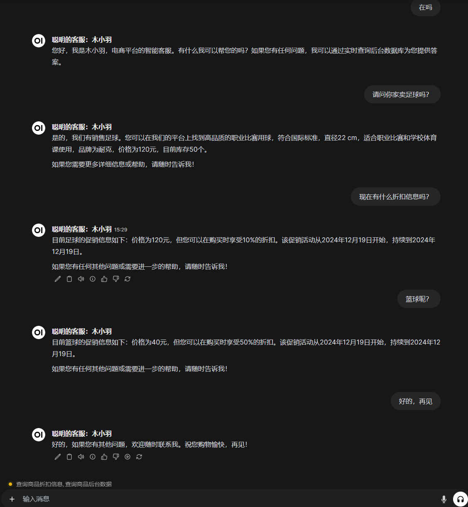

  所以大家也能够看到，即使这样的开源项目开放了在前端配置的控制面板，如果我们不理解大模型的底层应用原理的话，也很难在可视化页面灵活的配置出特定的场景，并不用提源码层面的二次开发了。所以掌握大模型在 部署调用、RAG以及Agent能力，是非常有必要的。

**[《大模型与Agent开发实战课》](https://whakv.xetslk.com/s/432wPY)为【100+小时】体系大课，总共20大模块精讲精析，零基础直达大模型企业级应用！**

🍻现开设了**大模型学习交流群**，扫描下👇码，来遇见更多志同道合的小伙伴\~

海量硬核独家技&#x672F;**`干货内容`**+无门&#x69DB;**`技术交流`**\~


上图**扫码**👆即刻入群！

📍 社群技术**交流氛围浓厚**，不定期开&#x8BBE;**`硬核干货&前沿技术公开课`**&#x5662;\~

&#x20;

# 4. 大模型与Agent学习路径

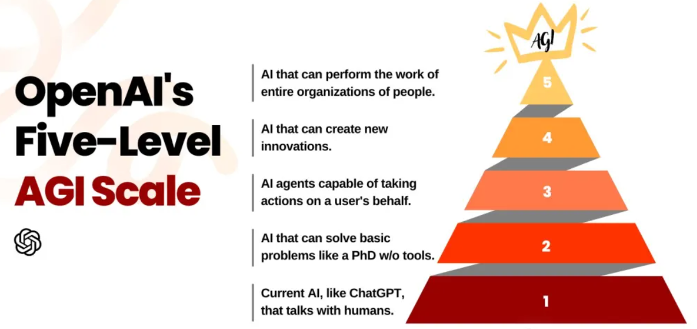

  在我们谈论的`Stage 5：Organizations` 阶段特别强调的`AI`是一个组织，**组织的概念大家应该都比较清楚，它大到一个国家，小到两个人的团队，但它绝不仅仅是一个个体**。但我们之前所学习的，强如完全自主循环代理`ReAct`，它其实做的都是在尝试去打造更强的独立个体，我们通过给它传递更多工具（Tool Calling），赋予上下文的记忆（Memory）等等多种方式让其能够处理越来越发展的任务需求。但随着需求越来越复杂，能够预想到的以下几个非常关键的问题是：

* **`Agent` 有太多工具可供使用，会导致对下一步调用哪个工具做出了混乱的决定。**

* **上下文变得过于复杂，无法清晰的跟踪并传递有效信息。**

* **系统中需要多个专业领域（例如规划师、研究人员、数学专家等），单一的角色背景设定没有办法匹配不同的需求。**

  上面这三个问题很现实的摆在我们面前，行之有效的解决的办法就是：**调整 `Agent` 的架构**。变成如下图所示的一样：

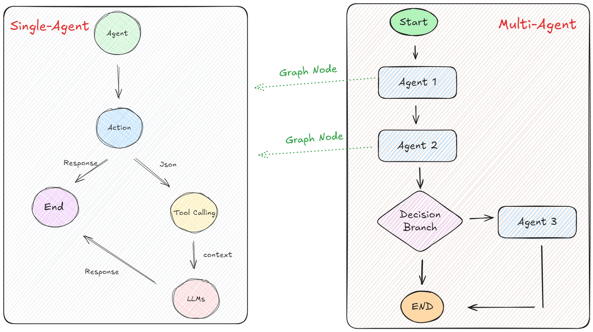

  多代理系统其实就可以非常简单的理解为：**将原本的应用程序拆分成多个较小的独立代理，从而组合而成的系统。这些小的独立代理可以是简单的大模型交互代理，也可以是复杂的 `ReAct` 代理**。举个比较热门的案例，假设我们需要建立一个用于数据分析的`Agent`，则可以设计代理配置：`Agent 1`作为用户意图识别代理，集成大模型用来解析用户的查询和指令，理解其意图和需求，并将用户输入转化为具体的任务。`Agent 2`作为数据分析代理，集成大模型并绑定若干个处理不同数据和需求的工具，提供统计分析、趋势预测和数据可视化服务。当任务涉及到代码生成时，`Agent 3`，即代码执行代理，会接收用户输入的代码，在安全的Python环境中执行这些代码，并返回运行结果，用于代码测试、执行特定算法或自动化任务。

  由此能感受到的是多智能体系统 （MAS） 是通过多个单代理之间的协作来解决复杂的任务，其中多代理系统中集成的每个单代理，都有特定的背景身份和独有的技能。其显著的优势则包含如下三个方面：

* **专业化：当一个系统中可以创建多个专注于特定领域的专家代理，能实现处理更复杂的应用的`AI`系统**。

* **模块化：单独的代理开发模式对于开发、测试和维护完整代理系统是更加容易的**。

* **控制度：显式地控制代理的通信方式，而不仅仅是依赖函数调用**。

  **单代理到多代理的过渡，需要重点关注的就是如何去建立起不同`Agent`之间的通信连接。** 在多代理架构中，对于子代理的数量以及应如何连接它们时，没有严格的规则或准则，可以完全依赖开发者的思路和实际的业务场景进行自定义编排。我们要做的是：在功能设计上将较大的目标分解为较小的任务，并创建单独的代理来处理这些任务中的每一个。每个代理都拥有自己的系统提示和身份设定、大模型的接入支持、工具和自定义代码，从而形成多智能实体的协作交互

  继续深入探讨 `Multi-Agent`概念。`LangGraph`利用基于图的结构来定义代理并在它们之间建立连接。在此框架中，每个代理都表示为图中的一个节点，并通过边链接到其它代理。每个代理通过接收来自其他代理的输入并将控制权传递给下一个代理来执行其指定的操作。在`LangGraph` 框架的设计中，主要通过如下几种方法来建立各个子代理之间的通信连接：

* NetWork（网络）：每个代理都可以与其他每个代理通信。任何代理都可以决定接下来要呼叫哪个其他代理。

* Supervisor（主管）：每个代理都与一个 `Supervisor` 代理通信。由 `Supervisor` 代理决定接下来应调用哪个代理。

* Supervisor （tool-calling）： `Supervisor` 架构的一个特例。每个代理都是一个工具。由`Supervisor`代理通过工具调用的方式来决定调用哪些子代理执行任务，以及要传递给这些代理程序的参数

* Hierarchical（分层）：定义具有 `supervisor` 嵌套 `supervisor`多代理系统。这是 `Supervisor` 架构的一种泛化，允许更复杂的控制流。

  各个多代理架构的通信方式如下图所示 👇 ：


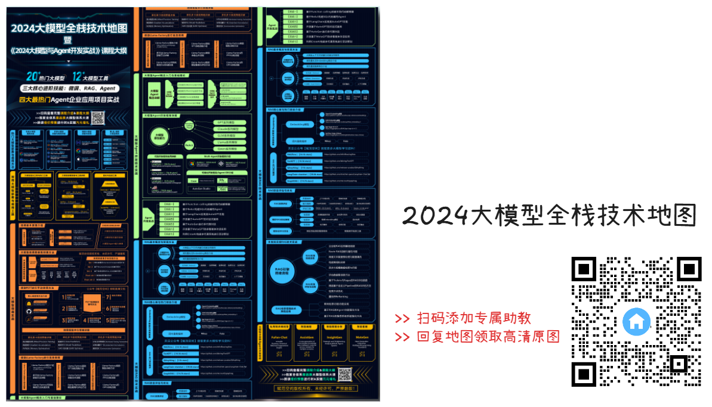

# 课程说明：

* 体验课内容节选自《大模型与Agent开发》完整版付费课程

  体验课时间有限，若想深度学习大模型技术，欢迎大家报名由我主讲的[《大模型与Agent开发实战课》](https://whakv.xetslk.com/s/432wPY)：

**[《大模型与Agent开发实战课》](https://whakv.xetslk.com/s/432wPY)为【100+小时】体系大课，总共20大模块精讲精析，零基础直达大模型企业级应用！**

**《大模型与Agent开发实战课》课程原价5999，立减2000，木羽老师直播间专属优惠券1000，仅需2999即可入学，【仅限前10名】详细信息扫码添加助教，回复“大模型”，即可领取课程大纲&查看课程详情👇**


