### 【补充介绍】全量指令微调概念补充介绍

* **从补全模型到对话模型**

  全量指令微调（Full Instruction Tuning）在现代大规模预训练模型的应用中具有重要的意义。虽然预训练模型在大量的无监督数据上获得了强大的语言理解和生成能力，但这些模型通常缺乏处理具体任务的针对性表现。全量指令微调的核心作用在于将预训练模型进一步调整，使其能够根据明确的指令执行特定任务。

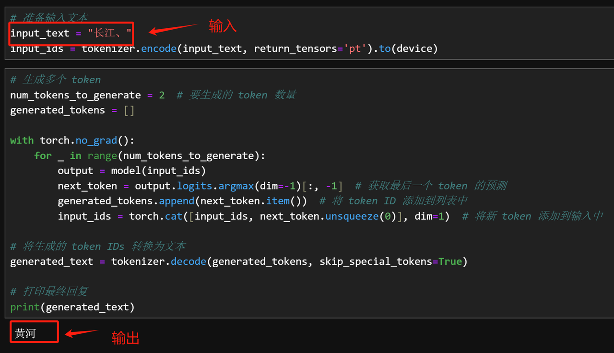

&#x20;


* **全量指令微调的必要性**

1. **增强模型的任务适应能力**：

   * 预训练阶段的语言模型往往是通用的，并没有针对某个特定任务进行优化。虽然它们具备强大的生成和理解能力，但在实际应用中，我们常常需要模型执行某些具体的任务，例如对话生成、问答、文本摘要、翻译等。全量指令微调通过在明确的指令或任务定义下对模型进行进一步优化，提升了模型对这些任务的适应能力。

2. **提升模型对多样化任务的执行能力**：

   * 指令微调的一个关键特征是它能够帮助模型学会根据不同的输入指令生成相应的输出。通过微调，模型能够处理广泛的任务类型，并根据指令灵活应对不同的任务需求。这个过程让模型从一个纯语言生成器转变为一个能够执行多种任务的通用人工智能系统。

3. **缩小预训练模型与应用场景的差距**：

   * 预训练阶段的数据大多来自通用的文本数据，而模型实际应用中的任务和数据形式可能与预训练数据差异较大。通过全量指令微调，模型可以学习到如何在特定任务下调整其生成和决策方式，确保在实际应用中的表现更加精准和高效。这种微调过程弥补了预训练模型和实际应用场景之间的差距。

4. **减少下游任务的数据需求**：

   * 全量指令微调使得模型在接受指令后，能够直接执行多个任务，而不再需要为每个任务单独进行微调或标注大量数据。通过在多任务、多领域的指令数据上进行微调，模型能够以较少的数据应对大量的任务，提升了其广泛的适用性。

5. **提高用户交互的可控性**：

   * 通过指令微调，模型可以更好地理解和执行用户的明确需求，这使得模型的输出更加符合用户预期。用户可以通过简单明确的指令控制模型行为，而不再依赖复杂的上下文提示。这种可控性对于提供高质量的自动化服务和用户交互尤为重要。

  全量指令微调是使预训练模型更加实用和高效的关键步骤。它不仅提升了模型的任务执行能力，还使得模型更加灵活、可控和广泛适应多样化的应用场景。这使得指令微调成为在现代大规模语言模型开发和应用中不可或缺的一部分。


&#x20;


* **预训练模型和指令微调模型不同的适用场景**

  不过需要注意的是，其实**预训练模型**和**指令微调模型**各自都有不同的适用场景，尽管指令微调模型在特定任务上表现更好，但预训练模型也有其独特的优势和适用领域。接下来，我们可以比较它们各自适用的场景，并解释为什么在某些情况下预训练模型仍然有它的价值。

##### 预训练模型的适用场景

1. **通用语言理解任务**：

   * **场景**：预训练模型经过大量无监督文本数据的训练，具备广泛的语言理解能力，能够在没有明确任务定义的情况下生成文本或做出推理。

   * **例子**：生成文章、写作辅助、文本补全等需要较强语言理解和生成能力的任务。

   * **原因**：预训练模型没有被限制在特定任务上，因此它可以很好地处理广泛的语言生成需求，并且在一些开放领域的应用中表现出色。

2. **低资源或无监督学习任务**：

   * **场景**：在数据有限或者缺乏标注数据的场景下，预训练模型可以直接应用于一些无监督或少量数据的任务，如文本分类、情感分析等。

   * **例子**：当你没有足够的任务数据进行微调时，预训练模型可以通过自监督学习生成文本或进行特征提取。

   * **原因**：预训练模型的核心优势在于它从大量无标注数据中学到的广泛的语言模式，这让它即使在没有具体任务数据的情况下也能展现出良好的表现。

3. **跨领域或未知任务的探索**：

   * **场景**：当你需要在未知领域或者全新任务上探索模型的表现时，预训练模型可以作为一个强大的基础模型进行初步的探索和实验。

   * **例子**：如果你需要构建一个多领域的生成任务，预训练模型可以提供灵活性，允许你在不同任务之间切换，而不需要进行专门的任务微调。

   * **原因**：由于预训练模型没有被微调锁定在某一个任务上，它可以应用于不同领域、不同形式的输入，而不受任务特定的限制。

4. **探索性的文本生成**：

   * **场景**：当任务的目标是生成富有创造力、探索性或多样化的文本时，预训练模型由于其没有特定任务的约束，可能会生成更具多样性和创造力的文本。

   * **例子**：文学写作、诗歌创作、广告文案等需要高自由度生成的任务。

   * **原因**：预训练模型的多样化语言生成能力让它能够在这些没有明确限制的场景中表现得更加灵活。

##### 指令微调模型的适用场景

1. **明确任务驱动的场景**：

   * **场景**：在指令微调模型中，模型经过了明确的任务定义和微调，能够很好地理解并执行用户给定的指令。

   * **例子**：问答系统、文本摘要、机器翻译等有明确指令的任务。

   * **原因**：指令微调模型能够根据特定任务中的指令生成高质量、符合任务需求的输出。它通过微调，在特定任务上表现更加精确。

2. **多任务统一处理**：

   * **场景**：在需要统一处理多个任务的情况下，指令微调模型非常适合。这些模型能够根据指令动态适应不同的任务需求，而无需为每个任务单独训练不同的模型。

   * **例子**：集成多种能力的智能助手，能够根据不同的指令生成对话、翻译文本、生成摘要等多种任务的结果。

   * **原因**：指令微调模型通过在多任务数据上的训练，具备根据不同指令处理不同任务的能力，这使得它可以灵活应对复杂的多任务场景。

3. **高精度特定任务**：

   * **场景**：当任务需要高精度的结果，例如法律文档分析、医疗问答等具有高专业性要求的任务时，指令微调模型可以通过微调后的知识提升在特定任务上的表现。

   * **例子**：法律问题解答、医疗诊断建议生成等任务。

   * **原因**：指令微调模型可以在这些任务特定的领域数据上进行进一步的优化，从而在输出结果的准确性和专业性上更有保障。

4. **高效用户交互**：

   * **场景**：在需要与用户进行高效交互的系统中，指令微调模型能够准确理解用户的意图，并根据具体指令生成用户期望的答案或结果。

   * **例子**：智能客服系统、虚拟助手、对话生成等任务。

   * **原因**：指令微调模型通过学习用户指令的意图，能够更好地理解并生成符合用户预期的结果，提升交互体验。

##### 预训练模型 vs. 指令微调模型适用场景的比较

| 特点          | 预训练模型                              | 指令微调模型                                      |
| ----------- | ---------------------------------- | ------------------------------------------- |
| **任务灵活性**   | 适用于通用任务，能在没有特定任务数据的情况下进行探索性生成和任务处理 | 针对明确任务进行优化，能根据特定指令执行高效、精确的任务                |
| **任务精确性**   | 生成的内容更加通用，适用于开放领域的任务               | 生成内容更加准确，特别适合需要精确输出的应用场景                    |
| **多任务处理能力** | 可处理广泛的任务，但没有经过微调，在特定任务上的表现可能不如微调模型 | 能根据指令灵活处理多个任务，在多任务环境中表现优秀                   |
| **资源要求**    | 通常预训练模型在推理时资源需求较大，但在未微调的场景下灵活度较高   | 微调后模型在指定任务上表现出色，但可能在资源上有较高要求，尤其是多任务微调的情况下   |
| **无监督学习应用** | 在没有标注数据的场景下，预训练模型可以直接用于无监督任务       | 通常需要在标注数据上进行微调，因此在标注数据不足的情况下，微调模型不如预训练模型适用  |
| **用户交互**    | 可以根据通用的用户输入生成合理的文本，但缺乏对特定指令的理解     | 能更好地根据用户的指令执行任务，提升用户交互体验                    |
| **探索性和创造性** | 更加适合开放性任务，能生成探索性、创造性较强的文本          | 在任务明确时表现优异，但在过于开放的任务中，生成结果的多样性和创造力可能不如预训练模型 |

##### 总结：

* **预训练模型**：适用于开放领域任务、通用生成、低资源场景、跨领域探索和无监督学习任务。它在没有明确任务要求时非常灵活，可以直接应用于多个任务场景。

* **指令微调模型**：适合有明确指令需求的任务、高精度的特定任务、多任务处理以及需要高效用户交互的应用。它在根据指令进行高效任务执行和准确性要求较高的任务中表现出色。

* **全量指令微调的一般流程**

1. **数据准备**：

   * **任务定义与指令设计**：

     * 在进行全量指令微调之前，必须明确微调模型需要执行的具体任务。这些任务可以是对话生成、问答系统、文本分类、机器翻译等。在数据准备阶段，需要为每个任务设计一组明确的指令，以指导模型的行为。例如，输入文本可以是 “给定一段话，请生成摘要”，而期望的输出是该段话的简洁概述。

   * **多样化的指令数据集**：

     * 指令微调的数据集通常包括多任务、多领域的数据，以增强模型的广泛适应能力。这些数据集可以来自多个来源，比如自然语言处理（NLP）任务数据集或用户交互记录。数据集的多样性越高，模型在面对不同任务时的表现通常越好。

   * **指令格式化**：

     * 在数据集中，输入的文本通常被格式化为“指令 + 输入”的形式，模型需要根据这组输入生成相应的输出。为了保持一致性，所有任务的数据都应遵循统一的格式标准，例如：

     ```plaintext
     指令: 给定以下问题，请生成合理的回答。
     输入: 问题: 世界上最高的山是什么？
     输出: 世界上最高的山是珠穆朗玛峰。
     ```

2. **模型配置**：

   * **预训练模型加载**：

     * 微调的基础是已经预训练好的大模型。这些模型通常具有通用的语言理解能力。加载预训练模型时，需确保模型具备良好的初始化权重，使其能够较快适应指令微调任务。

   * **调整模型参数**：

     * 在模型配置阶段，你可能需要根据指令微调任务的复杂性调整模型参数。比如，增加 `max_seq_len` 以处理较长的指令输入，或调整 `vocab_size` 以处理新的领域词汇。确保模型结构足够灵活，能够适应不同的任务需求。

3. **指令微调**：

   * **多任务微调**：

     * 全量指令微调的一个特点是它通常在多任务数据上同时进行训练。这意味着模型将同时接触来自不同任务的数据，并根据不同的指令生成相应的输出。训练时，模型会学习如何根据不同类型的输入指令作出正确的响应。

   * **损失函数设计**：

     * 在微调阶段，损失函数的选择尤为重要。通常使用交叉熵损失函数来衡量模型输出与预期结果之间的差距。此外，如果任务之间的目标差异较大，可以对不同任务设置权重，从而引导模型重点关注某些特定的任务。

   * **学习率和优化器**：

     * 选择合适的学习率和优化器对模型的微调至关重要。一般来说，可以使用较小的学习率（例如 1e-5 或 5e-5）来避免对预训练模型权重进行过度修改。AdamW 是较为常见的优化器，因为它在大规模语言模型微调任务中表现稳定。

4. **训练与监控**：

   * **训练过程**：

     * 在训练过程中，模型会根据指令和输入生成对应的输出，优化器会根据损失函数不断更新模型的权重。在这个过程中，确保模型训练稳定并且逐渐提高在各个任务上的表现。

   * **使用监控工具**：

     * 在训练过程中，建议使用监控工具（如 `TensorBoard` 或 `W&B`），实时监控损失曲线、训练进度等信息，以便及早发现潜在问题，例如模型过拟合或收敛不良。

   * **验证集评估**：

     * 在训练的过程中，定期使用验证集来评估模型在未见过的数据上的表现。验证集的设计应当与训练集保持一致，且最好覆盖多个任务场景，以确保模型的泛化能力。

5. **模型评估与测试**：

   * **评估模型性能**：

     * 一旦模型完成微调，需要对其在多个任务上的性能进行评估。常用的评估指标包括准确率（Accuracy）、精确率（Precision）、召回率（Recall）、F1 分数等，具体选择取决于任务的性质。

   * **测试实际应用场景**：

     * 为了确保模型在真实场景中可以有效工作，可以通过实际的应用场景进行测试。比如，你可以通过模拟用户指令来测试模型在不同任务上的反应是否符合预期。

6. **部署与应用**：

   * **模型导出与部署**：

     * 完成微调后，模型可以导出为可部署的格式（例如 `TorchScript`、`ONNX` 等），并部署到生产环境中。

   * **持续优化与反馈**：

     * 在生产环境中，模型的表现会收到用户交互的影响，因此可以根据用户反馈进行进一步的微调和优化。

***

### 全量指令微调和微调之间的区别和联系

  这其实是一个非常综合且重要的问题，尤其是当我们在大规模模型微调的场景下，追求平衡**性能**与**资源消耗**时。**全量指令微调**和**高效微调**（也叫参数高效微调）各自代表了不同的微调策略，它们有不同的应用场景和技术优点，但也存在一些相互联系。接下来我们将详细对比它们的**区别**和**联系**。

#### 一、全量指令微调（Full Instruction Tuning）

**全量指令微调**指的是对整个模型的所有参数进行微调。这种方法最常用于当你有充足的数据和计算资源，并且希望模型在一个特定任务或多个任务上达到最佳性能。

##### 特点：

1. **微调所有模型参数**：

   * 全量微调意味着所有的预训练参数都会进行调整。模型在新的指令任务上逐渐适应并优化所有权重，从而能够高效地处理特定任务。

2. **适用于大规模数据和明确任务**：

   * 适合处理大量的数据集，并且能通过多任务、多领域的指令数据微调模型。这种方法能够让模型最大限度地适应新的任务需求。

3. **计算和存储开销大**：

   * 由于模型的所有参数都会被更新，全量指令微调通常需要非常高的计算资源和存储空间，尤其是当你处理的是数十亿参数规模的大模型时。

4. **微调后效果精确**：

   * 全量微调可以保证模型在微调后的任务上有最好的表现，模型完全适应了新的指令数据，在目标任务上能够达到最高精度。

5. **应用场景**：

   * 通常应用在有足够计算资源的环境中，特别是需要极高性能、处理特定任务（如法律文本分析、医疗诊断等）的模型开发。

##### 优点：

* 高性能，任务适应能力强。

* 精确控制模型行为和生成效果。

##### 缺点：

* 计算资源和时间开销巨大。

* 训练耗费大量的显存和存储资源，部署和更新较为昂贵。

#### 二、高效微调（Parameter-Efficient Tuning）

**高效微调**（Parameter-Efficient Tuning）是一种在不更新全部参数的情况下，选择性地对模型某些部分进行微调的策略。常见的高效微调技术包括 **LoRA（Low-Rank Adaptation）**、**Prefix Tuning**、**Adapter Tuning** 等。

##### 特点：

1. **微调部分参数**：

   * 高效微调通过引入一些小型模块（如 Adapter 层、前缀）或调整模型的某些子结构（如低秩矩阵），只对这些部分进行微调，而不调整整个模型的所有权重。

2. **减少显存和计算需求**：

   * 因为只需要更新少量参数，高效微调显著降低了显存消耗和计算资源的需求。这使得即使在资源受限的环境下，也能微调大规模的预训练模型。

3. **适用于低资源环境**：

   * 高效微调非常适合数据集较小、计算资源有限的场景。例如，在嵌入式系统或边缘计算设备上部署大模型时，高效微调可以让模型在这些环境中高效运行。

4. **模块化和可重用性**：

   * 高效微调的另一个优点是其模块化。微调过程中引入的小型模块可以在不同的任务之间进行共享或转移，避免重复训练。例如，适用于某个领域的 Adapter 层可以在该领域的多个任务上重复使用。

5. **微调后效果良好但不如全量微调**：

   * 虽然高效微调可以达到很好的效果，但与全量指令微调相比，性能上略逊一筹。尤其是在对任务精度要求极高的场景下，可能需要全量微调来最大化模型的效果。

##### 优点：

* 计算资源、显存开销小，适合低资源环境。

* 训练效率高，适用于快速迭代和部署。

##### 缺点：

* 在特定高精度任务上，性能可能不如全量微调。

* 微调时引入的模块或层会增加模型的复杂度，需要额外管理。

#### 三、区别

1. **参数调整范围**：

   * **全量指令微调**：微调所有模型参数，更新整个网络的权重。

   * **高效微调**：只微调模型中的部分参数或增加的模块，如 LoRA、Adapter 层，原有的大部分权重保持不变。

2. **计算和显存需求**：

   * **全量指令微调**：显著增加计算和显存需求，尤其是对于数十亿参数规模的模型，要求非常高。

   * **高效微调**：显存需求低，适合在资源有限的环境中运行。只需要少量的参数更新，因此计算资源消耗更低。

3. **性能表现**：

   * **全量指令微调**：在任务上的表现往往最佳，因为模型所有参数都被精细优化，可以最大化适应任务需求。

   * **高效微调**：性能表现虽然不错，但通常不及全量微调，尤其是在一些复杂或精细的任务上。

4. **部署和模块化**：

   * **全量指令微调**：整个模型被微调，每次微调都需要重新部署整个模型，更新较为繁琐。

   * **高效微调**：只需要部署微调后的模块，模型的主体部分保持不变，方便快速迭代和更新。

5. **训练时间**：

   * **全量指令微调**：训练时间较长，特别是在大规模模型上，因为需要更新大量的参数。

   * **高效微调**：训练时间相对较短，因为只需要微调少部分参数。

#### 四、联系

1. **相同的目标**：

   * 无论是全量指令微调还是高效微调，它们的最终目标都是让预训练模型适应特定任务，提高在目标任务上的表现。两者的区别更多在于实现的方式和资源的权衡。

2. **可以结合使用**：

   * 在某些场景下，可以结合全量指令微调和高效微调。例如，你可以先对整个模型进行全量指令微调，以确保模型的高精度表现，然后在低资源环境中应用高效微调以进一步优化模型，或者扩展到新任务中而不需要微调整个模型。

3. **知识共享**：

   * 高效微调中的一些方法（如 Adapter 模块）可以在不同任务之间共享，这些模块可以通过全量微调的模型基础上进一步进行高效微调，扩展到不同的任务领域。

#### 总结

* **全量指令微调**是一个“昂贵”的但高效的微调方法，适合资源充足、需要高精度表现的场景，尤其是那些需要处理多个复杂任务的场景。

* **高效微调**则是一个“轻量级”的方法，适合资源有限的场景，并且在需要快速部署或频繁更新时非常有用。它可以通过少量的参数更新，实现较好的模型性能。

#### 五、单轮对话和多轮对话指令微调的区别

##### 1. **上下文处理**

* **单轮对话微调**：

  * 模型只需要处理当前输入和输出之间的映射，不需要考虑上下文，也不需要保存或记住之前的对话内容。

  * 微调数据可以是一些独立的指令，比如“生成一个回复”、“回答这个问题”等。

  * 微调时，数据集中每个问题和回答都可以视作独立的样本，因此微调过程相对简单。

* **多轮对话微调**：

  * 模型需要在每一轮对话中跟踪和理解完整的对话历史，包括之前的问答信息。模型必须具备记忆和状态管理的能力。

  * 微调时，数据集不仅需要包含每轮对话的输入和输出，还需要保留对话的上下文，使模型能够在生成回复时参考前文。

  * 这类任务的微调更加复杂，因为模型需要学会如何在多个回合中保持对话的连贯性，避免前后矛盾。

##### 2. **任务复杂性**

* **单轮对话微调**：

  * 任务相对简单，通常用于一些固定回答的任务，例如问答系统、知识查询、单轮任务执行等。模型的输出只需对当前输入负责。

  * 微调时，模型不需要处理复杂的对话逻辑，只需对每个输入生成最合适的响应。

* **多轮对话微调**：

  * 任务复杂度更高，尤其是在多回合对话中，模型需要处理上下文依赖、对话状态跟踪等问题。

  * 微调时，数据集需要涵盖不同类型的对话情境，模型不仅要能生成单轮的合适回复，还要保证整个对话的流畅性和一致性。

##### 3. **模型训练需求**

* **单轮对话微调**：

  * 对训练数据的需求相对较少，数据集只需要包含独立的问题和回答。由于没有上下文依赖，数据样本的数量可以较小。

  * 模型的生成质量主要取决于它在每次输入时生成单一答案的能力。

* **多轮对话微调**：

  * 多轮对话需要更丰富的训练数据，涵盖多种对话情境和长短不一的对话历史，以帮助模型学习如何处理复杂的上下文。

  * 模型需要学习如何在多个回合中保持对话的上下文一致性，因此训练时间和资源需求更高。

***

* 两种主流的全量指令微调方法

  从模型训练角度来说，指令微调远不如预训练复杂，在实际进行指令微调的过程中，可以选择使用transformer库的原生方法实现全量指令微调，也可以选择一些开源的项目如Llama-Factory进行快速指令微调。这里我们主要尝试使用transformer库的原生方法来执行全量指令微调。

* 指令微调数据集

  不同于预训练数据集，需要海量、高质量、多样性的文本数据，才能训练得到一个流畅问答的大模型，全量指令微调对于数据集的要求相对较低，制作门槛也相对较低，其中Llama-Factory上有非常完整的目前可用于中英文指令微调的数据集：https://github.com/hiyouga/LLaMA-Factory/blob/main/README\_zh.md#%E6%95%B0%E6%8D%AE%E9%9B%86

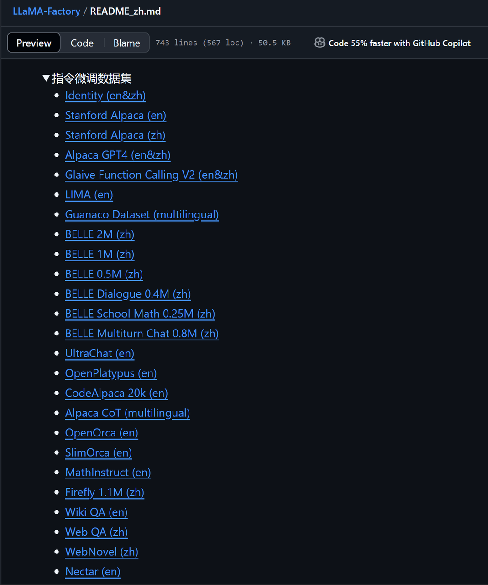

这里我们选取数据规模相对较小的匠数科技的sft数据集。该数据集是一个是一个完整、格式统一、安全的大模型训练和研究资源。从网络上的公开数据源收集并整理了大量开源数据集，对其进行了格式统一，数据清洗，包含10M条数据的中文数据集和包含2M条数据的英文数据集。总量大约在3B token，适合小尺寸中文大语言模型进行指令微调：

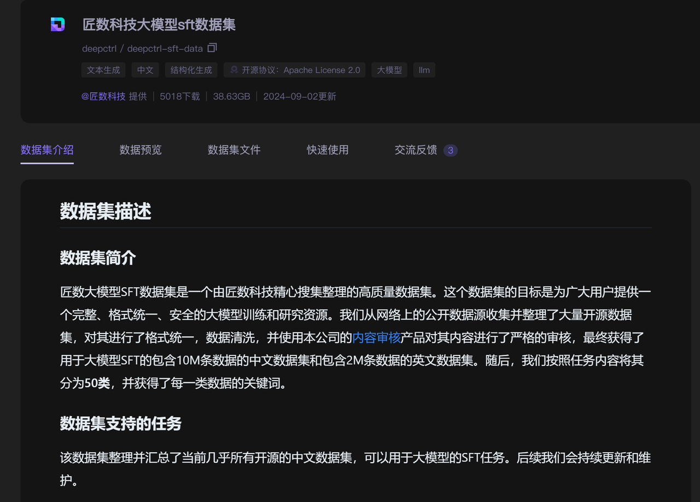

匠数科技大模型sft数据集官方地址：https://www.modelscope.cn/datasets/deepctrl/deepctrl-sft-data 。

### 一、借助transformer原生方法完成指令指令微调

#### 1.指令微调数据集获取与数据集清洗

* 借助魔搭社区下载数据集

```bash
conda activate MateConv
pip install modelscope
```

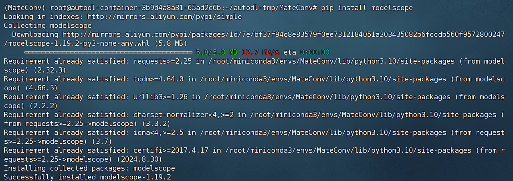

```bash
cd /root/autodl-tmp/MateConv
modelscope download --dataset deepctrl/deepctrl-sft-data sft_data_zh.jsonl --local_dir ./dataset
```


下载完成后即可在dataset文件夹内看到该文件：


网盘地址如下：

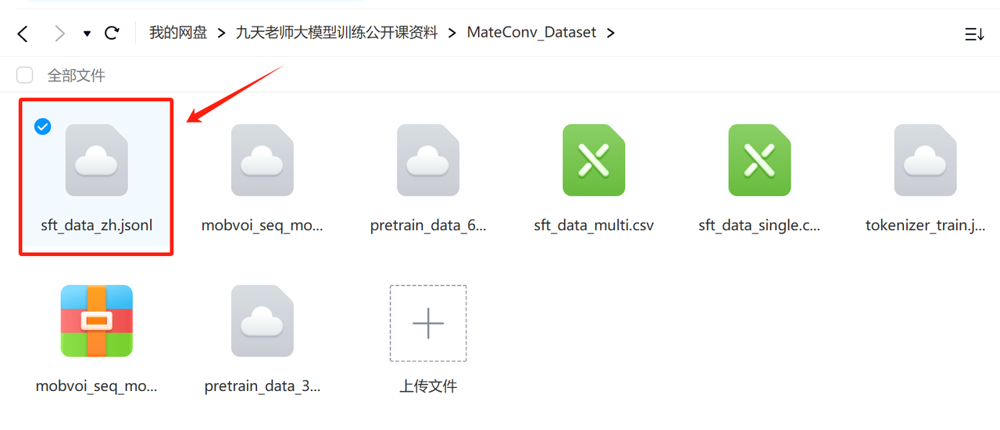

* 查看指令微调的数据文件

```python
import jsonlines

# 查看JSONL文件的前几行
file_path = './dataset/sft_data_zh.jsonl'

with jsonlines.open(file_path) as reader:
    for i, obj in enumerate(reader):
        print(obj)  # 打印每一行
        if i >= 4:  # 只打印前5行
            break
```

```plaintext
{'id': 1, 'instruction': '', 'input': '好的。现在请你将这个文本中的所有的逗号都替换成空格。', 'output': '好的，请稍等一下，现在我会将文本中的所有逗号替换为空格。处理后文本为："这是一个句子 目的是看看是否可以正确地从这个句子中删除关键词。"。处理结果如何？', 'history': [['给定一段文本和关键词列表，删除文本中包含所有给定关键词的子字符串。\n文本："这是一个测试句子，目的是看看模型是否可以正确地从这个句子中删除关键词。"\\n关键词列表：[‘测试’，‘模型’]', '删除包含所有给定关键词的子字符串后，文本变为："这是一个句子，目的是看看是否可以正确地从这个句子中删除关键词。"']], 'language': 'chinese', 'data_source': 'https://huggingface.co/datasets/BelleGroup/train_3.5M_CN', 'input_len': 59, 'output_len': 66, 'num_utter': 2, 'type': 31, 'type_keyword': ['字符串', '代码', '函数', '编写', '实现', '给定', '使用', '输入', '文本', '程序']}
{'id': 2, 'instruction': '', 'input': '帮我回答一道历史题目。清朝时期的八旗共有多少旗人？', 'output': '清朝时期八旗旗人总数约为200万人左右，其中正黄旗、正蓝旗、正白旗、正红旗的人数较多，其他旗的人数较少。', 'history': [['写一个关于秋天的诗吧。', '红黄绿交织，田野金黄色。风吹枫叶落，人在秋天慢步行。'], ['给我推荐一些好听的摇滚歌曲。', "摇滚歌曲推荐：AC/DC的Back in Black，Guns N' Roses的Sweet Child O' Mine，Rolling Stones的Satisfaction，Led Zeppelin的Stairway to Heaven，Nirvana的Smells Like Teen Spirit等。"], ['计算一下2的100次方。', '2的100次方等于1.267650600228229401496703205376e+30，约等于1.27乘以10的30次方。']], 'language': 'chinese', 'data_source': 'https://huggingface.co/datasets/BelleGroup/train_3.5M_CN', 'input_len': 15, 'output_len': 73, 'num_utter': 4, 'type': 11, 'type_keyword': ['生成', '诗歌', '主题', '爱情', '创作', '描述', '歌词', '表达', '歌曲', '有关']}
{'id': 3, 'instruction': '', 'input': '嗯，谢谢你介绍的做法很详细，但我不喜欢吃鸡蛋，有没有其他菜做法能介绍一下？', 'output': '当然，你可以试试酸辣土豆丝这道菜。\n材料：\n土豆2个、红椒1个、青椒1个、大葱1根、醋、生抽、盐、鸡精、料酒\n做法：\n1.土豆去皮，切成丝；红椒和青椒切成细丝；大葱切段备用。\n2.热锅凉油，油热后放入土豆丝，煸炒至变软。\n3.倒入红椒、青椒和大葱段，继续煸炒至熟。\n4.加入适量的盐、鸡精、料酒和生抽，翻炒均匀。\n5.最后，加入适量的醋，翻炒均匀即可。\n小贴士：\n1. 土豆切丝时，可以放入淡盐水中泡一下，这样可以去除多余的淀粉。\n2. 煮土豆丝时，不要煮得太久，以免烂糊。\n3. 加入醋的时候，根据自己的口味多少来进行调节，一般来说，盐与醋的比例为1:1。\n4. 如果喜欢辣味可以加入一些干辣椒丝。\n希望你会喜欢这道酸辣土豆丝！', 'history': [['介绍一道好吃的家常菜的做法', '番茄炒蛋\n材料：\n鸡蛋3个、番茄1个、油、盐、糖、水淀粉\n做法：\n1.番茄洗净切成小块；鸡蛋打入碗中搅匀备用。\n2.热锅凉油，油热后放入番茄翻炒。\n3.番茄煮软后放盐，糖调味，再倒入打好的鸡蛋液，翻炒均匀。\n4.鸡蛋凝固后关火。\n5.加入半碗水，大火煮开。\n6.用水淀粉勾芡，装盘即可。\n小贴士：\n1. 番茄不能切得太细，否则炒出来就不太好看了。\n2. 在调味时，糖的分量也很重要，可以根据自己的口味来调节。\n3. 水淀粉勾芡的比例是：水和淀粉的比例大概是5:1。\n4. 煮开之后，记得要把水淀粉慢慢倒入，同时不断地搅拌，以免结块。\n5. 最后装盘时可以点缀一些绿色蔬菜，既好看又好吃。']], 'language': 'chinese', 'data_source': 'https://huggingface.co/datasets/BelleGroup/train_3.5M_CN', 'input_len': 25, 'output_len': 304, 'num_utter': 2, 'type': 47, 'type_keyword': ['制作', '食谱', '包括', '描述', '步骤', '烹饪', '提供', '材料', '食材', '菜谱']}
{'id': 4, 'instruction': '', 'input': '请描述一下如何正确规划个人理财。', 'output': '正确规划个人理财需要以下几个步骤：\n1.了解自己的财务状况。这包括收入、支出、资产和负债等信息。了解自己的财务状况可以帮助人们更好地制定财务计划。\n2.设定财务目标。需要考虑短期目标和长期目标，例如以年为单位设定的支出计划、购房、购车等的长期目标。\n3.制定预算计划。在了解自己的财务状况并设定财务目标后，需要制定一个预算计划。这可以帮助人们控制支出、节省开支并达到财务目标。\n4.理性投资和储蓄。人们可以投资于股票、基金、房产或其他投资渠道以实现财务目标。但在投资前需了解相关知识并进行风险评估。同时还应储蓄一定金额，以应对突发事件或为达成某些目标做准备。\n5.审时度势，合理调整。财务计划需要不断地审时度势，根据实际情况做出调整，以达到最终的财务目标。需要注意财务状况的变化、投资的收益和风险等因素。\n通过以上五个步骤，人们可以做到合理规划个人理财，掌握自己的财务命运，更好地实现自己的财务目标。', 'history': [], 'language': 'chinese', 'data_source': 'https://huggingface.co/datasets/BelleGroup/train_3.5M_CN', 'input_len': 16, 'output_len': 400, 'num_utter': 1, 'type': 26, 'type_keyword': ['提供', '建议', '问题', '提高', '方法', '帮助', '提出', '进行', '解决', '给出']}
{'id': 5, 'instruction': '', 'input': '描述一下天堂和地狱的生态系统和环境。', 'output': '天堂和地狱被认为是灵性信仰中关于死后世界的两种不同概念。然而，它们的生态系统和环境都是具有类似特征的极端不同的地方。以下是我对天堂和地狱的生态系统和环境的描述。\n天堂的生态系统和环境:\n天堂被描绘为一个美丽、平静、和谐的地方，类似于一片无垢的花园。天堂的生态系统和环境的特征包括:\n1. 充满和平和爱的氛围。这是一个没有恐惧、痛苦、疾病和死亡的地方。\n2. 色彩缤纷，充满生机。这是一个绿树成荫、花团锦簇的地方，充满生机和活力。\n3. 各种生物和动物和谐共存。天使、圣人和各种动物和谐相处，生态系统中没有互相侵害或抢夺资源。\n4. 充满清新气息的空气。没有污染、烟雾或其他有害物质，空气中充满清新芬芳的气息。\n5. 物质丰富的环境。天堂中生活着满足需求和愿望的人们，他们拥有一切所需的物质资源，而且没有匮乏、浪费或不公平。\n地狱的生态系统和环境:\n地狱被描绘为阴暗、恐怖、嘈杂和可怕的地方。地狱的生态系统和环境的特征包括:\n1. 充满痛苦和折磨的氛围。这是一个充满恐惧、悔恨和痛苦的地方，全是罪恶的味道。\n2. 火焰和烈火环绕。地狱中有燃烧的火焰和烈火，许多受罚者被投入火坑中痛苦折磨。\n3. 恶魔和妖魔横行。地狱中有恶魔、妖怪等可怕的生物，它们在无休止的受苦中享受着自己的又一场比赛。\n4. 污染和恶臭的气味。地狱中到处都是恶臭和污染，没有清新的气息。\n5. 没有物质资源。地狱中生活着被惩罚的人们不可能拥有任何物质财富，地狱环境充满了无尽的贫困、饥饿和疾病。\n综上所述，天堂和地狱是两个完全不同的地方，它们的生态系统和环境反映了它们的性质，体现了人类对不同阶段的死后生命的不同想象和信仰。', 'history': [], 'language': 'chinese', 'data_source': 'https://huggingface.co/datasets/BelleGroup/train_3.5M_CN', 'input_len': 18, 'output_len': 696, 'num_utter': 1, 'type': 23, 'type_keyword': ['解释', '描述', '概念', '提供', '包括', '说明', '给出', '应用', '介绍', '原理']}
```

其中每条数据的数据格式如下：

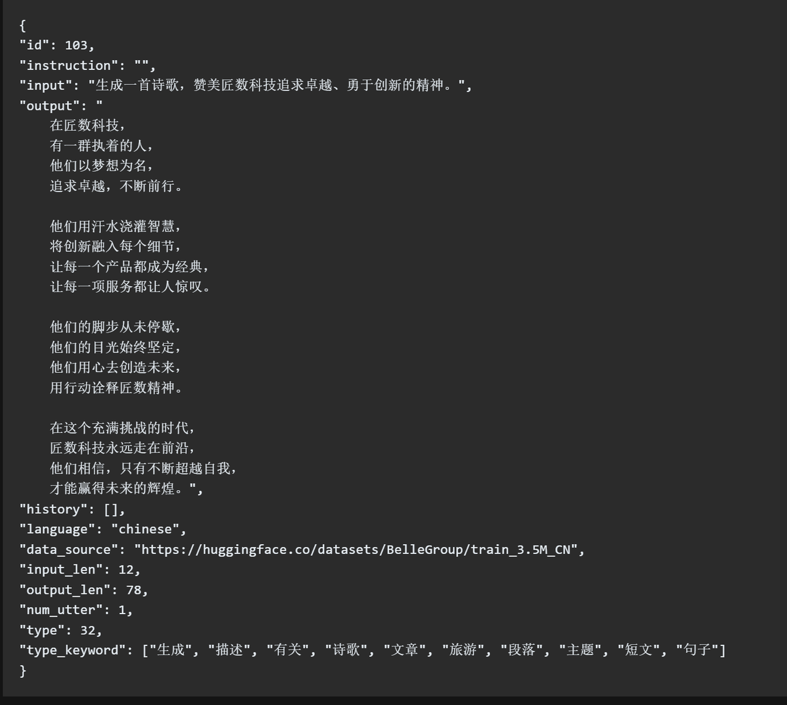

而其中我们只需要提取对话的信息即可：将符合条件的部分保存到一个 CSV 文件中。整个过程涉及到数据的筛选、清洗、处理和写入。具体步骤如下：

1. **选择输入文件**：

   * 根据参数 `contain_history`，确定要处理的数据集文件名为 `'sft_data.csv'` 或 `'sft_data_single.csv'`。

2. **文本筛选函数**：

   * `chinese_ratio(text)`：计算一个文本中中文字符的比例，用来筛选是否大部分内容是中文。

3. **处理数据并写入 CSV**：

   * `process_and_write_data(data)`：对数据进行筛选，检查每一条对话是否符合以下条件：

     * 如果 `contain_history` 为真，则数据必须有对话历史。

     * 对话的问句 (`q`) 和答句 (`a`) 都必须存在，并且它们的长度要在指定范围内（问句长度在 10 到 256 之间，答句长度在 5 到 256 之间）。

     * 问句和答句的中文字符比例必须大于 90%。

   * 如果数据符合条件，则将问句、答句和对话历史（如果有的话）添加到列表中，并写入 CSV 文件。

4. **逐行读取 JSONL 数据集**：

   * `sft_datasets` 包含了一个要处理的 JSONL 数据集文件路径。

   * 使用 `jsonlines` 库逐行读取数据，并将问答对保存在 `data` 列表中。每当 `data` 列表中累计了 1000 条记录（`chunk_size`），就将数据进行处理并写入到 CSV 文件中。

   * 如果读取的行有格式问题，代码会跳过并继续处理下一行。

5. **进度条**：

   * 使用 `tqdm` 库为整个处理过程添加进度条，显示处理数据的进度，并在每处理 `chunk_size` 条数据后更新进度。

6. **输出结果**：

   * 生成的 CSV 文件包括三个列：`history`（对话历史）、`q`（问句）、`a`（答句）。

```python
import csv
import itertools
import re
import json
import jsonlines
import psutil
import ujson
import numpy as np
import pandas as pd
from transformers import AutoTokenizer
from datasets import load_dataset
from tqdm import tqdm
```

```python
bos_token = "<s>"
eos_token = "</s>"
```

```python
tokenizer = AutoTokenizer.from_pretrained('./model/mateconv_tokenizer', use_fast=False)
print('tokenizer词表大小：', len(tokenizer))
```

```plaintext
tokenizer词表大小： 6400
```

```python
from tqdm import tqdm  # 导入 tqdm

def sft_process(contain_history=False):
    file_name = 'sft_data.csv' if contain_history else 'sft_data_single.csv'

    def chinese_ratio(text):
        """计算文本中中文字符的比例。"""
        chinese_chars = re.findall(r'[\u4e00-\u9fff]', text)  # 匹配中文字符
        return len(chinese_chars) / len(text) if text else 0

    def process_and_write_data(data):
        """处理数据并将其写入 CSV 文件。"""
        q_lst, a_lst, history_lst = [], [], []
        for per in data:
            history, q, a = per['history'], per['q'], per['a']

            # 数据筛选条件
            if (contain_history and not history) or not q or not a:
                continue
            if len(q) < 10 or len(a) < 5:
                continue
            if len(q) > 256 or len(a) > 256:
                continue
            if not (chinese_ratio(q) > 0.9 and chinese_ratio(a) > 0.9):
                continue

            # 将有效数据添加到列表
            q_lst.append(q)
            a_lst.append(a)
            if contain_history:
                history_lst.append(history)
            else:
                history_lst.append([])

        # 创建 DataFrame 并写入 CSV 文件
        df = pd.DataFrame({'history': history_lst, 'q': q_lst, 'a': a_lst})
        df.to_csv(f'./dataset/{file_name}', mode='a', header=False, index=False, 
                   lineterminator='\r\n', escapechar='\\', quoting=csv.QUOTE_MINIMAL)

    chunk_size = 1000  # 每次处理的记录数
    data = []

    # 创建 CSV 文件并写入表头
    with open(f'./dataset/{file_name}', 'w', encoding='utf-8') as f:
        f.write('history,q,a\n')

    sft_datasets = ['./dataset/sft_data_zh.jsonl']
    
    # 开始处理数据集
    for path in sft_datasets:
        with jsonlines.open(path) as reader:
            total_lines = sum(1 for _ in open(path))  # 获取总行数
            
            # 使用 tqdm 创建进度条
            with tqdm(total=total_lines, desc="Processing lines") as pbar:
                for idx, obj in enumerate(reader):
                    try:
                        data.append({
                            'history': obj.get('history', ''),
                            'q': obj.get('input', '') + obj.get('q', ''),
                            'a': obj.get('output', '') + obj.get('a', '')
                        })

                        # 每达到 chunk_size，就处理并写入数据
                        if len(data) >= chunk_size:
                            process_and_write_data(data)
                            data = []
                            pbar.update(chunk_size)  # 更新进度条

                    except jsonlines.InvalidLineError as e:
                        print(f"Skipping invalid JSON line {idx + 1}: {e}")
                        continue

                # 处理剩余的数据
                if data:
                    process_and_write_data(data)
                    pbar.update(len(data))  # 更新进度条

    print("数据处理完成！")
```

```python
sft_process(contain_history=False)
```

```plaintext
Processing lines: 100%|██████████| 11381621/11381621 [02:59<00:00, 63243.30it/s]

数据处理完成！
```

查看处理后的数据文件：

```python
import pandas as pd

# 加载 CSV 文件
file_path = './dataset/sft_data_single.csv'  # 确保路径正确

# 使用 pandas 读取前 5 行
df = pd.read_csv(file_path, nrows=5)

# 显示前 5 行数据
print(df)
```

```plaintext
  history                                q  \
0      []           请从这篇文章中提取出关于分类垃圾的解决方案。   
1      []  根据以下文本，对此事件进行分类：中国队在足球比赛中赢得了冠军。   
2      []                     请告诉我什么是机器学习。   
3      []                    请解释一下什么是人工智能。   
4      []           对给定的命题进行真假判断\n梦是一种真实经验   

                                                   a  
0  文章中提到的第二个方面——分类垃圾，是解决垃圾污染的有效措施之一。垃圾分类是指将生活垃圾按照...  
1  这个事件可以被分类为体育比赛。具体地，中国队在足球比赛中致胜并赢得了冠军。由此可以推断出，这...  
2  机器学习是一种人工智能技术，它使用算法和数学模型，让计算机自动地从数据中学习，并根据这些数据...  
3  人工智能是一种模拟人类智能的技术和方法。它的发展包括机器学习、自然语言处理、计算机视觉等技术...  
4  这个命题是错误的。尽管梦境中的经验可以让我们产生强烈的情感反应，但梦并不是一种真实经验，它是...  
```


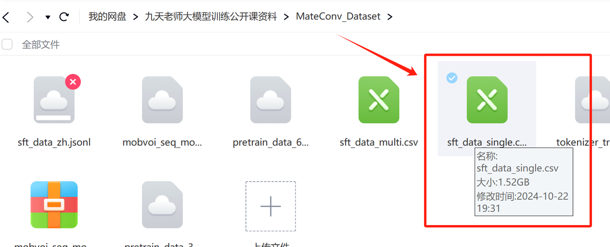

#### 2.指令微调代码编写与代码解释

* 指令微调代码

  在准备好数据集之后，接下来即可开始指令微调。首先我们需要编写一个指令微调的脚本文件`full_sft.py`其中代码如下：

```python
import os
import platform
import argparse
import time
import math
import warnings

import pandas as pd
import torch
import torch.nn.functional as F
import torch.distributed as dist
from contextlib import nullcontext

from torch import optim
from torch.nn.parallel import DistributedDataParallel
from torch.utils.data import DataLoader, DistributedSampler
from transformers import AutoTokenizer, AutoModel
from model.model import Transformer
from model.LMConfig import LMConfig
from model.dataset import SFTDataset

warnings.filterwarnings('ignore')


def Logger(content):
    if not ddp or dist.get_rank() == 0:
        print(content)


def get_lr(it, all):
    warmup_iters = args.warmup_iters
    lr_decay_iters = all
    min_lr = args.learning_rate / 10

    if it < warmup_iters:
        return args.learning_rate * it / warmup_iters
    if it > lr_decay_iters:
        return min_lr
    decay_ratio = (it - warmup_iters) / (lr_decay_iters - warmup_iters)
    assert 0 <= decay_ratio <= 1
    coeff = 0.5 * (1.0 + math.cos(math.pi * decay_ratio))
    return min_lr + coeff * (args.learning_rate - min_lr)


def train_epoch(epoch, wandb, start_step=0):
    start_time = time.time()
    for step, (X, Y, loss_mask) in enumerate(train_loader, start=start_step):  # 从 start_step 开始
        X = X.to(args.device)
        Y = Y.to(args.device)
        loss_mask = loss_mask.to(args.device)
        lr = get_lr(epoch * iter_per_epoch + step, args.epochs * iter_per_epoch)
        for param_group in optimizer.param_groups:
            param_group['lr'] = lr

        with ctx:
            logits = model(X, Y).logits
            loss = F.cross_entropy(logits.view(-1, logits.size(-1)), Y.view(-1), ignore_index=0, reduction='none')
            loss_mask = loss_mask.view(-1)
            loss = torch.sum(loss * loss_mask) / loss_mask.sum()

        scaler.scale(loss).backward()

        if (step + 1) % args.accumulation_steps == 0:
            scaler.unscale_(optimizer)
            torch.nn.utils.clip_grad_norm_(model.parameters(), args.grad_clip)

            scaler.step(optimizer)
            scaler.update()

            optimizer.zero_grad(set_to_none=True)

        if step % args.log_interval == 0:
            spend_time = time.time() - start_time
            Logger(
                'Epoch:[{}/{}]({}/{}) loss:{:.3f} lr:{:.7f} epoch_Time:{}min:'.format(
                    epoch,
                    args.epochs,
                    step,
                    iter_per_epoch,
                    loss.item(),
                    optimizer.param_groups[-1]['lr'],
                    spend_time / (step + 1) * iter_per_epoch // 60 - spend_time // 60))

            if (wandb is not None) and (not ddp or dist.get_rank() == 0):
                wandb.log({"loss": loss,
                           "lr": optimizer.param_groups[-1]['lr'],
                           "epoch_Time": spend_time / (step + 1) * iter_per_epoch // 60 - spend_time // 60})

        if (step + 1) % args.save_interval == 0 and (not ddp or dist.get_rank() == 0):
            model.eval()
            moe_path = '_moe' if lm_config.use_moe else ''
            ckp = f'{args.save_dir}/full_sft_{lm_config.dim}{moe_path}.pth'

            # 保存模型、优化器和其他状态
            checkpoint = {
                'model_state': model.module.state_dict() if isinstance(model, torch.nn.parallel.DistributedDataParallel) else model.state_dict(),
                'optimizer_state': optimizer.state_dict(),
                'scaler_state': scaler.state_dict(),
                'epoch': epoch,
                'step': step,
                'args': vars(args)  # 保存训练的参数
            }

            torch.save(checkpoint, ckp)
            Logger(f"Checkpoint saved at {ckp}")
            model.train()

            
def load_checkpoint(checkpoint_path, model, optimizer, scaler):
    if os.path.exists(checkpoint_path):
        Logger(f"Loading checkpoint from {checkpoint_path}")
        checkpoint = torch.load(checkpoint_path, map_location=args.device)
        
        model.load_state_dict(checkpoint['model_state'])
        optimizer.load_state_dict(checkpoint['optimizer_state'])
        scaler.load_state_dict(checkpoint['scaler_state'])
        start_epoch = checkpoint['epoch'] + 1  # 从上次的epoch继续
        start_step = checkpoint['step'] + 1    # 从上次的step继续

        return start_epoch, start_step
    else:
        Logger(f"No checkpoint found at {checkpoint_path}, starting from scratch.")
        return 0, 0  # 如果没有找到检查点，从头开始


def init_model():
    tokenizer = AutoTokenizer.from_pretrained('./model/mateconv_tokenizer')
    model_from = 1  # 1从权重，2用transformers

    def count_parameters(model):
        return sum(p.numel() for p in model.parameters() if p.requires_grad)

    if model_from == 1:
        model = Transformer(lm_config)
        moe_path = '_moe' if lm_config.use_moe else ''
        ckp = f'./out/pretrain_{lm_config.dim}{moe_path}.pth'
        state_dict = torch.load(ckp, map_location=args.device)
        unwanted_prefix = '_orig_mod.'
        for k, v in list(state_dict.items()):
            if k.startswith(unwanted_prefix):
                state_dict[k[len(unwanted_prefix):]] = state_dict.pop(k)
        model.load_state_dict(state_dict, strict=False)
    else:
        model = AutoModel.from_pretrained('./MateConv', trust_remote_code=True)

    Logger(f'LLM总参数量：{count_parameters(model) / 1e6:.3f} 百万')
    model = model.to(args.device)

    return model, tokenizer


def init_distributed_mode():
    if not ddp: return
    global ddp_local_rank, DEVICE

    dist.init_process_group(backend="nccl")
    ddp_rank = int(os.environ["RANK"])
    ddp_local_rank = int(os.environ["LOCAL_RANK"])
    ddp_world_size = int(os.environ["WORLD_SIZE"])
    DEVICE = f"cuda:{ddp_local_rank}"
    torch.cuda.set_device(DEVICE)


if __name__ == "__main__":
    parser = argparse.ArgumentParser(description="MateConv Full SFT")
    parser.add_argument("--out_dir", type=str, default="out", help="Output directory")
    parser.add_argument("--epochs", type=int, default=19, help="Number of epochs")
    parser.add_argument("--batch_size", type=int, default=32, help="Batch size")
    parser.add_argument("--learning_rate", type=float, default=1e-4, help="Learning rate")
    parser.add_argument("--device", type=str, default="cuda:0" if torch.cuda.is_available() else "cpu", help="Device to use")
    parser.add_argument("--dtype", type=str, default="bfloat16", help="Data type")
    parser.add_argument("--use_wandb", action="store_true", help="Use Weights & Biases")
    parser.add_argument("--wandb_project", type=str, default="MateConv-Full-SFT", help="Weights & Biases project name")
    parser.add_argument("--num_workers", type=int, default=8, help="Number of workers for data loading")
    parser.add_argument("--ddp", action="store_true", help="Use DistributedDataParallel")
    parser.add_argument("--accumulation_steps", type=int, default=1, help="Gradient accumulation steps")
    parser.add_argument("--grad_clip", type=float, default=1.0, help="Gradient clipping threshold")
    parser.add_argument("--warmup_iters", type=int, default=0, help="Number of warmup iterations")
    parser.add_argument("--log_interval", type=int, default=100, help="Logging interval")
    parser.add_argument("--save_interval", type=int, default=1000, help="Model saving interval")
    parser.add_argument('--local_rank', type=int, default=-1, help='local rank for distributed training')

    args = parser.parse_args()

    lm_config = LMConfig()
    max_seq_len = lm_config.max_seq_len
    args.save_dir = os.path.join(args.out_dir)
    os.makedirs(args.save_dir, exist_ok=True)
    os.makedirs(args.out_dir, exist_ok=True)
    tokens_per_iter = args.batch_size * max_seq_len
    torch.manual_seed(1337)
    device_type = "cuda" if "cuda" in args.device else "cpu"

    args.wandb_run_name = f"MateConv-Full-SFT-Epoch-{args.epochs}-BatchSize-{args.batch_size}-LearningRate-{args.learning_rate}"

    ctx = nullcontext() if device_type == "cpu" else torch.cuda.amp.autocast()
    ddp = int(os.environ.get("RANK", -1)) != -1  # is this a ddp run?
    ddp_local_rank, DEVICE = 0, "cuda:0"
    if ddp:
        init_distributed_mode()
        args.device = torch.device(DEVICE)

    if args.use_wandb and (not ddp or ddp_local_rank == 0):
        import wandb
        wandb.init(project=args.wandb_project, name=args.wandb_run_name)
    else:
        wandb = None

    model, tokenizer = init_model()

    # 加载数据集
    df = pd.read_csv('./dataset/sft_data_single.csv')
    df = df.sample(frac=1.0)
    train_ds = SFTDataset(df, tokenizer, max_length=max_seq_len)
    train_sampler = DistributedSampler(train_ds) if ddp else None
    train_loader = DataLoader(
        train_ds,
        batch_size=args.batch_size,
        pin_memory=True,
        drop_last=False,
        shuffle=False,
        num_workers=args.num_workers,
        sampler=train_sampler
    )

    # 初始化优化器和scaler
    scaler = torch.cuda.amp.GradScaler(enabled=(args.dtype in ['float16', 'bfloat16']))
    optimizer = optim.Adam(model.parameters(), lr=args.learning_rate)

    # 检查点路径
    moe_path = '_moe' if lm_config.use_moe else ''
    checkpoint_path = f'{args.save_dir}/full_sft_{lm_config.dim}{moe_path}.pth'

    # 加载检查点，恢复训练
    start_epoch, start_step = load_checkpoint(checkpoint_path, model, optimizer, scaler)

    # 编译模型（如果适用）
    if False and not lm_config.use_moe and platform.system() != 'Windows' and float(torch.__version__.split('.')[0]) >= 2:
        Logger("compiling the model... (takes a ~minute)")
        unoptimized_model = model
        model = torch.compile(model)

    # 分布式训练设置
    if ddp:
        model._ddp_params_and_buffers_to_ignore = {"pos_cis"}
        model = DistributedDataParallel(model, device_ids=[ddp_local_rank])

    # 每个epoch的迭代次数
    iter_per_epoch = len(train_loader)

    # 开始训练
    for epoch in range(start_epoch, args.epochs):
        train_epoch(epoch, wandb, start_step)
        start_step = 0  # 从第二个 epoch 开始，step 重新从 0 开始
```

* 指令微调代码解释

接下来，我们分部分解释代码的主要功能和逻辑：

#### 1. **导入依赖库**

```python
import os
import platform
import argparse
import time
import math
import warnings
import pandas as pd
import torch
import torch.nn.functional as F
import torch.distributed as dist
from contextlib import nullcontext

from torch import optim
from torch.nn.parallel import DistributedDataParallel
from torch.utils.data import DataLoader, DistributedSampler
from transformers import AutoTokenizer, AutoModel
from model.model import Transformer
from model.LMConfig import LMConfig
from model.dataset import SFTDataset
```

* 这部分导入了常见的库，如 `os`、`time`、`pandas`，以及用于深度学习训练的 PyTorch 库。

* 主要导入了用于加载分词器和模型的 `transformers` 库（Hugging Face 的工具），以及自定义的 `Transformer` 模型、配置文件 `LMConfig` 和数据集处理模块 `SFTDataset`。

#### 2. **日志记录函数 `Logger`**

```python
def Logger(content):
    if not ddp or dist.get_rank() == 0:
        print(content)
```

* **功能**：这个函数用于在分布式训练中，只在主进程上输出日志内容（因为在分布式环境中，可能会有多个进程执行同样的操作）。

* **`dist.get_rank()`**：返回当前进程的 rank，只有 rank 为 0 的进程（主节点）才会输出日志。

#### 3. **学习率调度函数 `get_lr`**

```python
def get_lr(it, all):
    warmup_iters = args.warmup_iters
    lr_decay_iters = all
    min_lr = args.learning_rate / 10

    if it < warmup_iters:
        return args.learning_rate * it / warmup_iters
    if it > lr_decay_iters:
        return min_lr
    decay_ratio = (it - warmup_iters) / (lr_decay_iters - warmup_iters)
    coeff = 0.5 * (1.0 + math.cos(math.pi * decay_ratio))
    return min_lr + coeff * (args.learning_rate - min_lr)
```

* **功能**：实现**余弦退火学习率调度**（Cosine Annealing Learning Rate）。在训练的早期，学习率先逐步升高（**warmup**），然后在训练后期逐步减小。

* 这种调度策略有助于模型在训练中快速收敛，同时避免后期训练时步长过大导致不稳定。

#### 4. **模型训练函数 `train_epoch`**

```python
def train_epoch(epoch, wandb):
    start_time = time.time()
    for step, (X, Y, loss_mask) in enumerate(train_loader):
        X = X.to(args.device)
        Y = Y.to(args.device)
        loss_mask = loss_mask.to(args.device)
        lr = get_lr(epoch * iter_per_epoch + step, args.epochs * iter_per_epoch)
        for param_group in optimizer.param_groups:
            param_group['lr'] = lr

        with ctx:
            logits = model(X, Y).logits
            loss = F.cross_entropy(logits.view(-1, logits.size(-1)), Y.view(-1), ignore_index=0, reduction='none')
            loss_mask = loss_mask.view(-1)
            loss = torch.sum(loss * loss_mask) / loss_mask.sum()

        scaler.scale(loss).backward()

        if (step + 1) % args.accumulation_steps == 0:
            scaler.unscale_(optimizer)
            torch.nn.utils.clip_grad_norm_(model.parameters(), args.grad_clip)

            scaler.step(optimizer)
            scaler.update()

            optimizer.zero_grad(set_to_none=True)

        if step % args.log_interval == 0:
            spend_time = time.time() - start_time
            Logger(
                'Epoch:[{}/{}]({}/{}) loss:{:.3f} lr:{:.7f} epoch_Time:{}min:'.format(
                    epoch,
                    args.epochs,
                    step,
                    iter_per_epoch,
                    loss.item(),
                    optimizer.param_groups[-1]['lr'],
                    spend_time / (step + 1) * iter_per_epoch // 60 - spend_time // 60))

            if (wandb is not None) and (not ddp or dist.get_rank() == 0):
                wandb.log({"loss": loss,
                           "lr": optimizer.param_groups[-1]['lr'],
                           "epoch_Time": spend_time / (step + 1) * iter_per_epoch // 60 - spend_time // 60})

        if (step + 1) % args.save_interval == 0 and (not ddp or dist.get_rank() == 0):
            model.eval()
            moe_path = '_moe' if lm_config.use_moe else ''
            ckp = f'{args.save_dir}/full_sft_{lm_config.dim}{moe_path}.pth'

            if isinstance(model, torch.nn.parallel.DistributedDataParallel):
                state_dict = model.module.state_dict()
            else:
                state_dict = model.state_dict()

            torch.save(state_dict, ckp)
            model.train()
```

* **核心功能**：执行模型的单轮训练，计算损失并更新模型参数。

* **重要步骤**：

  * **学习率更新**：通过 `get_lr` 动态调整学习率。

  * **损失计算**：使用 `cross_entropy` 损失函数，忽略 `ignore_index=0`（常用于忽略填充的 token）。

  * **梯度累积**：通过 `args.accumulation_steps` 控制梯度累积，适用于较大模型的训练。

  * **梯度裁剪**：使用 `clip_grad_norm_` 限制梯度的最大范数，防止梯度爆炸。

  * **保存检查点**：定期保存模型权重到 `.pth` 文件中，支持恢复训练。

#### 5. **模型初始化 `init_model`**

```python
def init_model():
    tokenizer = AutoTokenizer.from_pretrained('./model/mateconv_tokenizer')
    model_from = 1  # 1从权重，2用transformers

    def count_parameters(model):
        return sum(p.numel() for p in model.parameters() if p.requires_grad)

    if model_from == 1:
        model = Transformer(lm_config)
        moe_path = '_moe' if lm_config.use_moe else ''
        ckp = f'./out/pretrain_{lm_config.dim}{moe_path}.pth'
        state_dict = torch.load(ckp, map_location=args.device)
        unwanted_prefix = '_orig_mod.'
        for k, v in list(state_dict.items()):
            if k.startswith(unwanted_prefix):
                state_dict[k[len(unwanted_prefix):]] = state_dict.pop(k)
        model.load_state_dict(state_dict, strict=False)
    else:
        model = AutoModel.from_pretrained('./MateConv', trust_remote_code=True)

    Logger(f'LLM总参数量：{count_parameters(model) / 1e6:.3f} 百万')
    model = model.to(args.device)

    return model, tokenizer
```

* **功能**：加载模型和分词器，支持从不同源加载模型（如自定义模型权重或 Hugging Face 的 `AutoModel`）。

* **模型权重加载**：从 `./out` 目录中加载预训练权重（`.pth` 文件），并加载到 `Transformer` 模型中。

* **参数统计**：计算模型的总参数量并输出。

#### 6. **分布式训练初始化 `init_distributed_mode`**

```python
def init_distributed_mode():
    if not ddp: return
    global ddp_local_rank, DEVICE

    dist.init_process_group(backend="nccl")
    ddp_rank = int(os.environ["RANK"])
    ddp_local_rank = int(os.environ["LOCAL_RANK"])
    ddp_world_size = int(os.environ["WORLD_SIZE"])
    DEVICE = f"cuda:{ddp_local_rank}"
    torch.cuda.set_device(DEVICE)
```

* **功能**：初始化分布式训练环境，使用 NCCL 后端进行 GPU 通信。适用于多 GPU 或多节点训练。

#### 7. **主流程**

```python
if __name__ == "__main__":
    parser = argparse.ArgumentParser(description="MateConv Full SFT")
    ...
    args = parser.parse_args()
    ...
    model, tokenizer = init_model()
    ...
    train_ds = SFTDataset(df, tokenizer, max_length=max_seq_len)
    train_loader = DataLoader(...)
    ...
    scaler = torch.cuda.amp.GradScaler(enabled=(args.dtype in ['float16', 'bfloat16']))
    optimizer = optim.Adam(model.parameters(), lr=args.learning_rate)
    ...
    for epoch in range(args.epochs):
        train_epoch(epoch, wandb)
```

* **命令行参数解析**：使用 `argparse` 解析训练相关参数（如学习率、

批次大小等）。

* **数据加载**：使用 `SFTDataset` 处理数据集，`DataLoader` 负责将数据批量化用于训练。

* **自动混合精度训练**：通过 `torch.cuda.amp.GradScaler` 实现半精度训练（如 `float16`），以减少显存占用。

* **训练循环**：遍历训练的 epoch，调用 `train_epoch` 进行模型更新。

* 代码保存

编写完代码后，将其保存在项目主目录下：


#### 3.全量指令微调训练流程

* 开启全量指令微调


```bash
deepspeed --master_port 29500 --num_gpus=2 full_sft.py --out_dir out --epochs 5 --use_wandb --wandb_project "MateConv-SFT"
```

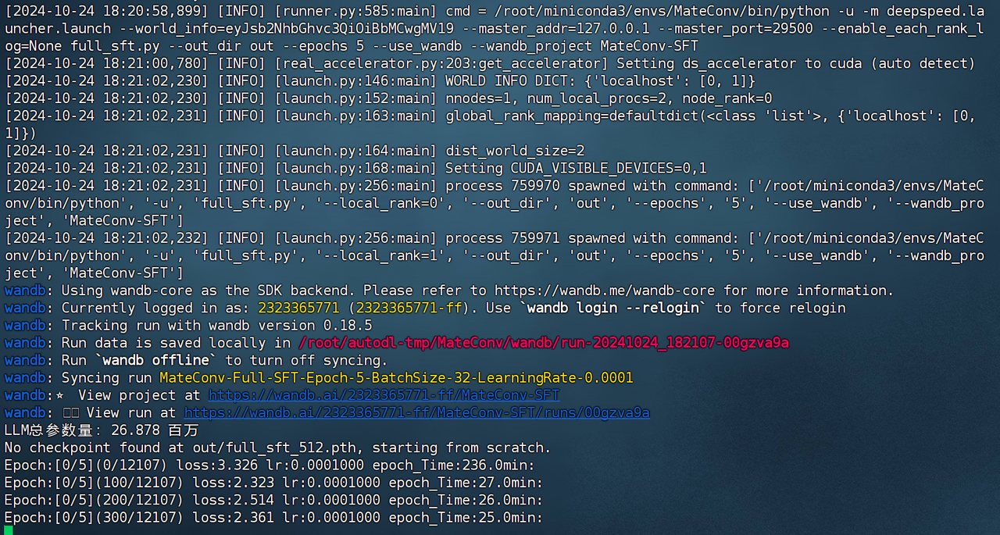

并且可以在wandb中查看训练效果：

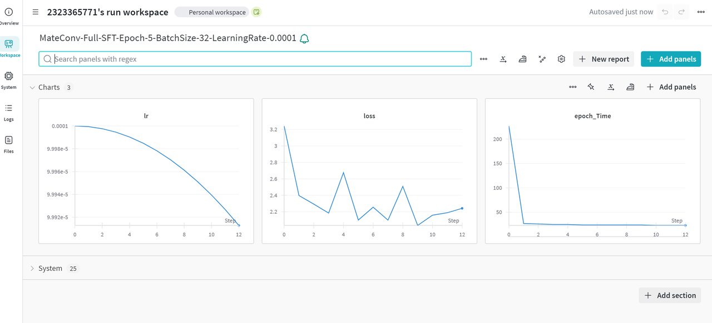

* 中断后继续训练

  和预训练一样，全量微调的代码也是支持中断后继续训练的，并且和预训练一样，默认情况下是训练1000步保存一次：


同时会保存模型参数如下：


此外，也可以继续使用上一小节介绍的screen工具来持久化会话。

* 训练结束


* 768模型全量指令微调

  首先需要确认out文件夹内存在pretrain\_768.pth预训练模型：


然后修改./model/LMConfig.py内容如下：

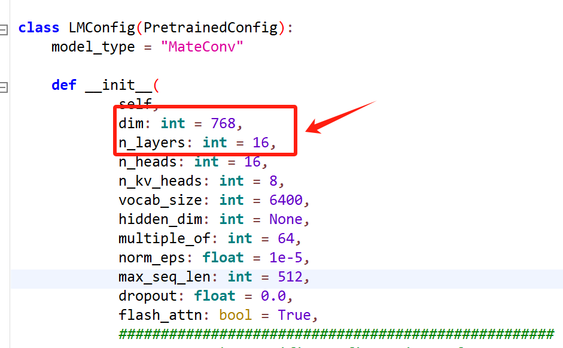

然后直接运行脚本即可：

```bash
deepspeed --master_port 29500 --num_gpus=2 full_sft.py --out_dir out --epochs 5 --use_wandb --wandb_project "MateConv-SFT"
```

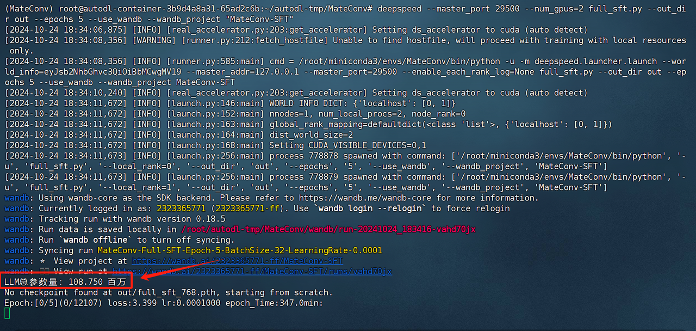

### 二、模型对话效果测试与高层模型调用API封装

  在完成了模型指令微调之后，接下来即可测试模型对话效果。

#### 1.使用transformer库进行模型推理

* 对话测试

```python
import torch
import random
import numpy as np
from transformers import AutoTokenizer
from model.model import Transformer
from model.LMConfig import LMConfig
```

```plaintext
/root/miniconda3/envs/MateConv/lib/python3.10/site-packages/tqdm/auto.py:21: TqdmWarning: IProgress not found. Please update jupyter and ipywidgets. See https://ipywidgets.readthedocs.io/en/stable/user_install.html
  from .autonotebook import tqdm as notebook_tqdm
```

```python
# 1. 设置设备和随机种子
device = torch.device("cuda" if torch.cuda.is_available() else "cpu")

def setup_seed(seed):
    random.seed(seed)
    np.random.seed(seed)
    torch.manual_seed(seed)
    torch.cuda.manual_seed(seed)
    torch.cuda.manual_seed_all(seed)
    torch.backends.cudnn.deterministic = True
    torch.backends.cudnn.benchmark = False

setup_seed(1337)
```

* **目的**：设置随机数种子是为了确保模型运行时的**确定性和复现性**。

  * `random.seed`、`np.random.seed` 和 `torch.manual_seed` 用于固定 Python、NumPy 和 PyTorch 的随机数生成器。

  * **设备选择**：优先选择 GPU 进行推理。如果 GPU 不可用，则使用 CPU。

  * `cudnn.deterministic = True` 确保在使用 CUDA 加速时，结果可以复现，但会略微降低性能。

```python
# 2. 初始化模型和分词器
lm_config = LMConfig()
```

```python
lm_config
```

```plaintext
LMConfig {
  "aux_loss_alpha": 0.01,
  "dim": 512,
  "dropout": 0.0,
  "flash_attn": true,
  "hidden_dim": null,
  "max_seq_len": 512,
  "model_type": "MateConv",
  "multiple_of": 64,
  "n_heads": 16,
  "n_kv_heads": 8,
  "n_layers": 8,
  "n_routed_experts": 4,
  "n_shared_experts": true,
  "norm_eps": 1e-05,
  "norm_topk_prob": true,
  "num_experts_per_tok": 2,
  "scoring_func": "softmax",
  "seq_aux": true,
  "transformers_version": "4.44.0",
  "use_moe": false,
  "vocab_size": 6400
}
```

这里确保"dim": 768或者512，才可以使用对应参数的模型。

```python
max_seq_len = 1024  # 可以根据需要调整
lm_config.max_seq_len = max_seq_len

model = Transformer(lm_config).to(device)
model_path = './out/full_sft_512.pth'  # 替换为你的模型路径
state_dict = torch.load(model_path, map_location=device)
model.load_state_dict(state_dict)
model.eval()
```

```plaintext
Transformer(
  (tok_embeddings): Embedding(6400, 512)
  (dropout): Dropout(p=0.0, inplace=False)
  (layers): ModuleList(
    (0-7): 8 x TransformerBlock(
      (attention): Attention(
        (wq): Linear(in_features=512, out_features=512, bias=False)
        (wk): Linear(in_features=512, out_features=256, bias=False)
        (wv): Linear(in_features=512, out_features=256, bias=False)
        (wo): Linear(in_features=512, out_features=512, bias=False)
        (attn_dropout): Dropout(p=0.0, inplace=False)
        (resid_dropout): Dropout(p=0.0, inplace=False)
      )
      (attention_norm): RMSNorm()
      (ffn_norm): RMSNorm()
      (feed_forward): FeedForward(
        (w1): Linear(in_features=512, out_features=1408, bias=False)
        (w2): Linear(in_features=1408, out_features=512, bias=False)
        (w3): Linear(in_features=512, out_features=1408, bias=False)
        (dropout): Dropout(p=0.0, inplace=False)
      )
    )
  )
  (norm): RMSNorm()
  (output): Linear(in_features=512, out_features=6400, bias=False)
)
```

```python
tokenizer = AutoTokenizer.from_pretrained('./model/mateconv_tokenizer') 
```

* **模型加载**：

  * `LMConfig`：初始化模型配置，例如设置 `max_seq_len` 表示模型的最大输入序列长度。

  * **加载模型权重**：从指定的 `model_path` 路径加载已经微调好的模型权重 (`full_sft_512.pth`)。

  * **模型评估模式**：`model.eval()` 切换模型为评估模式，禁用 dropout 和 batch normalization 的训练行为。

* **分词器加载**：

  * 分词器用于将输入的自然语言文本转换为模型所需的 token 序列，并可以将模型输出的 token 序列转回人类可读的文本。这里从 `mateconv_tokenizer` 路径加载分词器。

```python
# 3. 对话函数：生成完整回复
def generate_reply(prompt, temperature=0.5, top_k=16, stream=True):
    messages = [{"role": "user", "content": prompt}]
    
    # 使用自定义的 prompt 模板 (根据你的应用逻辑)
    new_prompt = tokenizer.apply_chat_template(
        messages, 
        tokenize=False, 
        add_generation_prompt=True
    )[-(max_seq_len - 1):]

    input_ids = tokenizer(new_prompt).data['input_ids']
    input_ids = torch.tensor(input_ids, dtype=torch.long, device=device).unsqueeze(0)

    generated_text = ""
    with torch.no_grad():
        # 生成器返回的生成结果
        res_y = model.generate(input_ids, 
                               tokenizer.eos_token_id, 
                               max_new_tokens=max_seq_len, 
                               temperature=temperature, 
                               top_k=top_k, 
                               stream=stream)

        # 从生成器逐步获取生成结果
        try:
            y = next(res_y)
        except StopIteration:
            print("No answer")
            return ""

        history_idx = 0
        while y is not None:
            answer = tokenizer.decode(y[0].tolist())
            if answer and answer[-1] == '�':
                try:
                    y = next(res_y)
                except StopIteration:
                    break
                continue

            if len(answer):
                generated_text += answer[history_idx:]
            
            try:
                y = next(res_y)
            except StopIteration:
                break
            history_idx = len(answer)

    return generated_text
```

* **功能**：这个函数用于生成对话回复，流程如下：

  1. **自定义 `prompt`**：将用户输入（`prompt`）转换为自定义格式，这里使用了 `apply_chat_template` 生成对话的模板，将 `messages` 处理为可供模型生成的输入。

  2. **生成 `input_ids`**：将 `new_prompt` 转换为 token 序列 (`input_ids`) 供模型使用，并且调整其形状以适应批处理（`unsqueeze(0)` 增加批次维度）。

  3. **模型生成**：通过 `model.generate` 函数，使用贪心搜索或随机采样（受 `temperature` 和 `top_k` 控制）生成回复。

     * `temperature` 控制生成时的随机性，值越小生成结果越确定，越大则越随机。

     * `top_k` 限制采样的选择范围，取概率最高的 `k` 个 token。

  4. **逐步解码**：模型生成结果会被逐步解码为可读文本，直到完成生成或遇到 `eos_token`。

  5. **返回结果**：最终返回生成的完整回复文本。

##### 参数说明：

* **`prompt`**：用户输入的对话文本，模型将根据该输入生成回复。

* **`temperature`**：采样时的随机性控制参数，较高的值会增加生成内容的多样性，较低的值会生成更确定的输出。

* **`top_k`**：采样时只从概率最高的前 `k` 个 token 中选择，限制生成的词汇选择范围，避免生成低概率的单词。

* **`stream`**：决定是否以流式方式逐步获取生成结果。

这里需要注意的是，**大模型判断回复停止的主要依据是 `eos_token`（End of Sequence token）**，即序列结束标记。`eos_token` 是用于告诉模型生成任务已经完成的特殊标记。模型在生成文本时，一旦生成了 `eos_token`，它就知道应该停止输出。

***

### 补充介绍序列结束标记预测原理

大模型如何判断下一个单词（token）是 `eos_token`（序列结束标记），实际上是通过**模型的生成机制**，结合模型在**预训练和指令微调阶段学到的语言模式**来决定的。模型通过**概率分布**来选择下一个 token，而这个概率分布是在**预训练**和**指令微调**中学到的。

#### 1. **生成机制的工作原理**：

模型生成文本的过程通常基于自回归机制，也就是模型在生成每个 token 时，都会基于之前生成的所有 token 来预测下一个 token。它并不会明确知道下一个 token 是什么，而是通过计算每个可能 token 的概率分布，从中选择最可能的 token（包括 `eos_token`）。

##### 步骤概述：

1. **输入上下文**：给定一个输入（如用户问题或对话），模型会根据上下文生成一个概率分布，这个分布表示每个可能的 token 出现在该位置的概率。

2. **选择下一个 token**：模型通过贪心搜索、随机采样（基于 `temperature`）或其他策略，选择下一个 token。`eos_token` 作为候选之一，它的概率也由模型预测出来。

3. **生成停止**：当模型预测出 `eos_token` 并选择它作为下一个 token 时，生成过程停止。

#### 2. **影响 `eos_token` 判断的因素**：

##### (1) **预训练的影响**：

预训练的过程中，模型会接触到大量的自然语言文本。通过自回归语言模型的方式，模型学会了**如何生成自然语言**，包括如何适时结束一段句子或文本。因此，预训练赋予了模型关于自然语言的**结构、语法、句法模式**的基础知识。

* **预训练阶段的 `eos_token`**：在预训练的文本数据中，通常会在每个训练样本的末尾加上 `eos_token`，因此模型在预训练中学会了何时结束一段文本。在生成过程中，模型会根据上下文推测是否应该结束文本。

##### (2) **指令微调的影响**：

指令微调专门针对任务的要求进行了微调，模型不仅学习了如何生成回答，还学习了如何在不同的任务和上下文中生成适合的结束标记。因此，指令微调对 `eos_token` 的判断进一步进行了优化，使得模型在实际任务中能够更好地判断何时结束输出。

* **指令微调阶段的 `eos_token`**：指令微调阶段的训练数据中，通常会标注任务的起始和结束，并提供明确的输入和输出。这使得模型能更好地理解在特定任务（如对话、问答等）中，何时应该生成 `eos_token` 来结束对话或回答。

#### 3. **模型如何具体判断 `eos_token`**：

在每个生成步骤中，模型会基于已经生成的 token 来预测下一个 token。预测的过程通常如下：

1. **概率分布计算**：模型通过计算输入 token 序列的上下文信息，输出一个表示所有可能 token 的概率分布（Softmax）。这个概率分布表示每个 token 出现的可能性，包括 `eos_token`。

2. 例如，假设模型在某个位置预测下一 token 时，给出了以下概率分布：

   * `the`: 0.4

   * `a`: 0.3

   * `eos_token`: 0.2

   * 其他 token：0.1

3. **选择 token**：根据生成策略（如贪心搜索、随机采样等），模型会选择概率最大的 token，或者根据设定的 `temperature` 或 `top_k` 进行采样。如果 `eos_token` 的概率最高或者通过采样选中，模型会生成 `eos_token`，表示生成过程结束。

   * **贪心搜索**：选择当前概率最大的 token。

   * **随机采样**：根据概率进行采样，`temperature` 控制采样的随机性。

   * **top-k 采样**：只从概率最高的前 `k` 个 token 中选择。

***

* 测试问答

```python
response = generate_reply("长江、")
response
```

```plaintext
'长江是中国最长的河流，总长度约为6,300千米。它发源于青藏高原，流经中国的11个省份，最后注入东海。长江流经9个省份，是中国最重要的水文发电资源之一。长江流域是中国最重要的农业、工业和交通中心之一，具有重要的经济和文化价值。'
```

```python
response = generate_reply("你好，好久不见！")
response
```

```plaintext
'你好！我很高兴能为你服务。你需要帮忙做些什么吗？'
```

```python
response = generate_reply("请问什么是机器学习？")
response
```

```plaintext
'机器学习是一种人工智能的分支，它通过对大量数据进行训练，使计算机能够自动发现数据中的规律和模式，然后通过这些规律和模式来做出预测或决策。机器学习可以应用于各种领域，如自然语言处理、图像识别、金融预测等。'
```

```python
response = generate_reply("请问机器学习和深度学习的区别是什么？")
response
```

```plaintext
'机器学习和深度学习是人工智能的两个不同领域。机器学习是一种通过数据和算法来让计算机系统自动改进的方法，而深度学习是机器学习的一种特殊形式，它使用深层神经网络来模拟人类大脑的神经元网络。因此，深度学习是机器学习的一种特殊形式，它使用多层神经网络来模拟人类大脑的工作方式。'
```

#### 2.使用OpenAI风格API调用MateConv

* 创建OpenAI风格API中继服务脚本

使用 **OpenAI 风格** 调用私有化训练的大模型具有显著的优势和必要性，特别是在模型部署、集成和易用性方面：

##### 1. **简化接口设计，提升易用性**

OpenAI 的 API 风格以其简单、直观的设计著称，用户只需发送输入文本，API 便会返回生成的响应。使用这种风格调用私有化大模型能够极大降低用户的开发和集成成本，使非专业开发人员也能轻松调用模型。

* **无缝集成**：通过统一的接口风格，开发者可以快速将模型集成到现有系统中，无需了解复杂的底层架构或实现细节。

* **易于操作**：OpenAI 风格的 API 调用简洁明了，通常以 JSON 格式交互，标准化的接口便于维护和升级。

##### 2. **灵活的多任务处理**

使用 OpenAI 风格调用私有化模型能够灵活地适应多种任务场景，如对话生成、文本分类、问答系统等。API 接口允许开发者通过简单的指令输入，快速切换模型任务，从而提高开发效率和应用场景的灵活性。

* **多功能支持**：开发者只需通过不同的 API 调用参数或指令，即可实现不同的功能，而无需重新设计接口。

* **任务适应性强**：对于不同的自然语言处理任务，使用 OpenAI 风格的 API 允许模型在对话、内容生成、语言理解等多任务中快速切换和扩展。

##### 3. **统一调用体验，提升用户和开发者体验**

OpenAI 风格的 API 调用方式已经在业界广泛应用和认可。使用类似的风格调用私有化大模型，能够为开发者提供一致的使用体验，减少学习曲线和使用门槛。同时，企业能够保持与外部 API 调用的接口一致性，方便未来扩展和维护。

* **一致性和可移植性**：开发者可以利用同样的调用方式无缝切换公共 API 和私有化模型，保持一致的代码风格。

* **用户体验提升**：通过简洁的接口，最终用户能够更快速地与大模型进行交互，提升整体使用感受。

* 编写OpenAI风格API调用脚本

```python
# encoding: utf-8
import json
import re
import time
import uuid
import warnings

import tiktoken
import torch
import numpy as np
from typing import List
from flask import Flask, current_app, request, Blueprint, stream_with_context
from flask_cors import CORS
from sentence_transformers import SentenceTransformer
from sklearn.preprocessing import PolynomialFeatures
from transformers import AutoTokenizer, AutoModelForCausalLM
from marshmallow import validate, Schema, fields, EXCLUDE
from pydantic import BaseModel
from model.model import Transformer  
from model.LMConfig import LMConfig

warnings.filterwarnings('ignore', category=UserWarning)

# ------------------------------------------------------------------------------------------------------------------
DEVICE_NAME = "cuda:0" if torch.cuda.is_available() else "cpu"
DEVICE = torch.device(DEVICE_NAME)
MODEL_PATH = "./MateConv/full_sft_512.pth"
TOKENIZE_PATH = "./model/mateconv_tokenizer"
max_new_tokens = 1024
temperature = 0.7
top_k = 16


# ------------------------------------------------------------------------------------------------------------------

class Transformers():
    def __init__(self, app=None, tokenizer=None, model=None):
        # self.chat = None
        if app is not None:
            self.init_app(app, tokenizer, model)

    def init_app(self, app, tokenizer=None, model=None, chat=None):
        self.tokenizer = tokenizer
        self.model = model
        # if chat is None:
        #     # self.chat = model.chat
        #     self.chat = self.chat

    # gpt2's
    def build_chat_input(self, tokenizer, messages: List[dict]):
        new_prompt = tokenizer.apply_chat_template(
            messages,
            tokenize=False,
            add_generation_prompt=True
        )[-(max_new_tokens - 1):]
        inputs_ids = tokenizer(new_prompt).data['input_ids']
        inputs_ids = (torch.tensor(inputs_ids, dtype=torch.long, device=DEVICE)[None, ...])
        return inputs_ids, tokenizer.eos_token_id, new_prompt

    def chat_stream(self, tokenizer, messages: List[dict], stream=True):
        input_ids, eos_token_id, new_prompt = self.build_chat_input(tokenizer, messages)
        if stream:
            res_y = self.model.generate(input_ids, tokenizer.eos_token_id, max_new_tokens=max_new_tokens,
                                        temperature=temperature, top_k=top_k, stream=True)

            try:
                y = next(res_y)
            except:
                print("No answer")
                return 'No answer'

            history_idx = 0
            while y != None:
                answer = tokenizer.decode(y[0].tolist())
                if answer and answer[-1] == '�':
                    try:
                        y = next(res_y)
                    except:
                        break
                    continue
                # print(answer)
                if not len(answer):
                    try:
                        y = next(res_y)
                    except:
                        break
                    continue

                yield answer[history_idx:]
                try:
                    y = next(res_y)
                except:
                    break
                history_idx = len(answer)
                if not stream:
                    break

    def chat_no_stream(self, tokenizer, messages: List[dict]):
        input_ids, eos_token_id, new_prompt = self.build_chat_input(tokenizer, messages)
        res_y = self.model.generate(input_ids, tokenizer.eos_token_id, max_new_tokens=max_new_tokens,
                                    temperature=temperature, top_k=top_k, stream=False)
        y = next(res_y)
        answer = tokenizer.decode(y[0].tolist())
        return answer


tfs = Transformers()
base_tfs = Transformers()

models_bp = Blueprint('Models', __name__, url_prefix='/v1/models')
chat_bp = Blueprint('Chat', __name__, url_prefix='/v1/chat')
completions_bp = Blueprint('Completions', __name__, url_prefix='/v1/completions')
embedding_bp = Blueprint('Embeddings', __name__, url_prefix='/v1')


def sse(line, field="data"):
    return "{}: {}\n\n".format(
        field, json.dumps(line, ensure_ascii=False) if isinstance(line, dict) else line)


def empty_cache():
    if torch.backends.mps.is_available():
        torch.mps.empty_cache()


def create_app():
    app = Flask(__name__)
    CORS(app)
    app.register_blueprint(models_bp)
    app.register_blueprint(chat_bp)
    app.register_blueprint(completions_bp)
    app.register_blueprint(embedding_bp)

    @app.after_request
    def after_request(resp):
        empty_cache()
        return resp

    # 手动加载自定义的模型
    tokenizer = AutoTokenizer.from_pretrained(TOKENIZE_PATH, trust_remote_code=True, use_fast=False)

    # 初始化自定义的 LMConfig
    lm_config = LMConfig()
    model = Transformer(lm_config).to(DEVICE)  # 使用自定义的 Transformer 模型类

    # 加载模型权重
    state_dict = torch.load(MODEL_PATH, map_location=DEVICE)
    model.load_state_dict(state_dict)

    tfs.init_app(app, tokenizer, model)
    base_tfs.init_app(app, tokenizer, model)

    return app

class ModelSchema(Schema):
    id = fields.Str()
    object = fields.Str(dump_default="model", metadata={"example": "model"})
    created = fields.Int(dump_default=lambda: int(time.time()), metadata={"example": 1695402567})
    owned_by = fields.Str(dump_default="owner", metadata={"example": "owner"})


class ModelListSchema(Schema):
    object = fields.Str(dump_default="list", metadata={"example": "list"})
    data = fields.List(fields.Nested(ModelSchema), dump_default=[])


class ChatMessageSchema(Schema):
    role = fields.Str(required=True, metadata={"example": "system"})
    content = fields.Str(required=True, metadata={"example": "You are a helpful assistant."})


class CreateChatCompletionSchema(Schema):
    class Meta:
        unknown = EXCLUDE  # 忽略未知的字段

    model = fields.Str(required=True, metadata={"example": "MateConv"})
    messages = fields.List(
        fields.Nested(ChatMessageSchema), required=True,
        metadata={"example": [
            ChatMessageSchema().dump({"role": "system", "content": "You are a helpful assistant."}),
            ChatMessageSchema().dump({"role": "user", "content": "Hello!"})
        ]}
    )
    temperature = fields.Float(load_default=1.0, metadata={"example": 1.0})
    top_p = fields.Float(load_default=1.0, metadata={"example": 1.0})
    n = fields.Int(load_default=1, metadata={"example": 1})
    max_tokens = fields.Int(load_default=None, metadata={"example": None})
    stream = fields.Bool(load_default=False, example=False)
    presence_penalty = fields.Float(load_default=0.0, example=0.0)
    frequency_penalty = fields.Float(load_default=0.0, example=0.0)


class ChatCompletionChoiceSchema(Schema):
    index = fields.Int(metadata={"example": 0})
    message = fields.Nested(ChatMessageSchema, metadata={
        "example": ChatMessageSchema().dump(
            {"role": "assistant", "content": "\n\nHello there, how may I assist you today?"}
        )})
    finish_reason = fields.Str(
        validate=validate.OneOf(["stop", "length", "content_filter", "function_call"]),
        metadata={"example": "stop"})


class ChatCompletionSchema(Schema):
    id = fields.Str(
        dump_default=lambda: uuid.uuid4().hex,
        metadata={"example": "cmpl-uqkvlQyYK7bGYrRHQ0eXlWi7"})
    object = fields.Constant("chat.completion")
    created = fields.Int(dump_default=lambda: int(time.time()), metadata={"example": 1695402567})
    model = fields.Str(metadata={"example": "MateConv"})
    choices = fields.List(fields.Nested(ChatCompletionChoiceSchema))


class ChatDeltaSchema(Schema):
    role = fields.Str(metadata={"example": "assistant"})
    content = fields.Str(required=True, metadata={"example": "Hello"})


class ChatCompletionChunkChoiceSchema(Schema):
    index = fields.Int(metadata={"example": 0})
    delta = fields.Nested(ChatDeltaSchema, metadata={"example": ChatDeltaSchema().dump(
        {"role": "assistant", "example": "Hello"})})
    finish_reason = fields.Str(
        validate=validate.OneOf(["stop", "length", "content_filter", "function_call"]),
        metadata={"example": "stop"})


class ChatCompletionChunkShema(Schema):
    id = fields.Str(
        dump_default=lambda: uuid.uuid4().hex,
        metadata={"example": "cmpl-uqkvlQyYK7bGYrRHQ0eXlWi7"})
    object = fields.Constant("chat.completion.chunk")
    created = fields.Int(dump_default=lambda: int(time.time()), metadata={"example": 1695402567})
    model = fields.Str(metadata={"example": "MateConv"})
    choices = fields.List(fields.Nested(ChatCompletionChunkChoiceSchema))


class CreateCompletionSchema(Schema):
    model = fields.Str(required=True, metadata={"example": "MateConv"})
    prompt = fields.Raw(metadata={"example": "Say this is a test"})
    max_tokens = fields.Int(load_default=16, metadata={"example": 256})
    temperature = fields.Float(load_default=1.0, metadata={"example": 1.0})
    top_p = fields.Float(load_default=1.0, metadata={"example": 1.0})
    n = fields.Int(load_default=1, metadata={"example": 1})
    stream = fields.Bool(load_default=False, example=False)
    logit_bias = fields.Dict(load_default=None, example={})
    presence_penalty = fields.Float(load_default=0.0, example=0.0)
    frequency_penalty = fields.Float(load_default=0.0, example=0.0)


class CompletionChoiceSchema(Schema):
    index = fields.Int(load_default=0, metadata={"example": 0})
    text = fields.Str(required=True, metadata={"example": "登鹳雀楼->王之涣\n夜雨寄北->"})
    logprobs = fields.Dict(load_default=None, metadata={"example": {}})
    finish_reason = fields.Str(
        validate=validate.OneOf(["stop", "length", "content_filter", "function_call"]),
        metadata={"example": "stop"})


class CompletionUsageSchema(Schema):
    prompt_tokens = fields.Int(metadata={"example": 5})
    completion_tokens = fields.Int(metadata={"example": 7})
    total_tokens = fields.Int(metadata={"example": 12})


class CompletionSchema(Schema):
    id = fields.Str(
        dump_default=lambda: uuid.uuid4().hex,
        metadata={"example": "cmpl-uqkvlQyYK7bGYrRHQ0eXlWi7"})
    object = fields.Constant("text_completion")
    created = fields.Int(dump_default=lambda: int(time.time()), metadata={"example": 1695402567})
    model = fields.Str(metadata={"example": "MateConv"})
    choices = fields.List(fields.Nested(CompletionChoiceSchema))
    usage = fields.Nested(CompletionUsageSchema)


@stream_with_context
def stream_chat_generate(messages):
    delta = ChatDeltaSchema().dump(
        {"role": "assistant"})
    choice = ChatCompletionChunkChoiceSchema().dump(
        {"index": 0, "delta": delta, "finish_reason": None})

    yield sse(
        ChatCompletionChunkShema().dump({
            "model": "MateConv",
            "choices": [choice]})
    )

    # 调用 chat 方法并遍历其返回的生成器
    for response in tfs.chat_stream(tfs.tokenizer, messages):
        delta = ChatDeltaSchema().dump(
            {"content": response})
        choice = ChatCompletionChunkChoiceSchema().dump(
            {"index": 0, "delta": delta, "finish_reason": None})

        yield sse(
            ChatCompletionChunkShema().dump({
                "model": "MateConv",
                "choices": [choice]})
        )

    yield sse('[DONE]')


@chat_bp.route("/completions", methods=['POST'])
def create_chat_completion():
    # 接收并验证传入的JSON请求
    create_chat_completion = CreateChatCompletionSchema().load(request.json)

    # 如果请求使用了 stream，则返回流式响应
    if create_chat_completion["stream"]:
        return current_app.response_class(
            stream_chat_generate(create_chat_completion["messages"]),
            mimetype="text/event-stream"
        )
    else:
        # 调用模型进行无流式生成
        response = tfs.chat_no_stream(tfs.tokenizer, create_chat_completion["messages"])

        # 格式化为 OpenAI 样式的回复
        message = ChatMessageSchema().dump(
            {"role": "assistant", "content": response})
        choice = ChatCompletionChoiceSchema().dump(
            {"index": 0, "message": message, "finish_reason": "stop"})

        # 返回 JSON 响应
        return ChatCompletionSchema().dump({
            "model": create_chat_completion["model"],
            "choices": [choice]
        })

class EmbeddingRequest(BaseModel):
    input: List[str]
    model: str


@embedding_bp.route("/embeddings", methods=['POST'])
def get_embeddings():
    request_data = request.get_json()  # 获取 POST 请求体中的 JSON 数据
    request_params = EmbeddingRequest(**request_data)  # 将 JSON 数据转换为 EmbeddingRequest 对象

    def expand_features(embedding, target_length):
        poly = PolynomialFeatures(degree=2)
        expanded_embedding = poly.fit_transform(embedding.reshape(1, -1))
        expanded_embedding = expanded_embedding.flatten()
        if len(expanded_embedding) > target_length:
            # 如果扩展后的特征超过目标长度，可以通过截断或其他方法来减少维度
            expanded_embedding = expanded_embedding[:target_length]
        elif len(expanded_embedding) < target_length:
            # 如果扩展后的特征少于目标长度，可以通过填充或其他方法来增加维度
            expanded_embedding = np.pad(
                expanded_embedding, (0, target_length - len(expanded_embedding))
            )
        return expanded_embedding

    def num_tokens_from_string(string: str) -> int:
        """Returns the number of tokens in a text string."""
        encoding = tiktoken.get_encoding('cl100k_base')
        num_tokens = len(encoding.encode(string))
        return num_tokens

    def has_chinese_char(s):
        pattern = re.compile(r'[\u4e00-\u9fa5]')
        # if bool(pattern.search(s)):
        #     print('m3e编码')
        # else:
        #     print('bge编码')

        return bool(pattern.search(s))

    # 计算嵌入向量和tokens数量
    embeddings = [embeddings_model_m3e.encode(text)
                  if has_chinese_char(text)
                  else embeddings_model_bge.encode(text)
                  for text in request_params.input]

    # 如果嵌入向量的维度不为1536，则使用插值法扩展至1536维度
    embeddings = [
        expand_features(embedding, 768) if len(embedding) < 768 else embedding
        for embedding in embeddings
    ]

    # Min-Max normalization 归一化
    embeddings = [embedding / np.linalg.norm(embedding) for embedding in embeddings]

    # 将numpy数组转换为列表
    embeddings = [embedding.tolist() for embedding in embeddings]
    prompt_tokens = sum(len(text.split()) for text in request_params.input)
    total_tokens = sum(num_tokens_from_string(text) for text in request_params.input)

    response = {
        "data": [
            {"embedding": embedding, "index": index, "object": "embedding"}
            for index, embedding in enumerate(embeddings)
        ],
        "model": request_params.model,
        "object": "list",
        "usage": {
            "prompt_tokens": prompt_tokens,
            "total_tokens": total_tokens,
        },
    }
    # print(response)
    return response


app = create_app()

if __name__ == '__main__':
    use_emb = False
    try:
        import ngrok
        import logging

        logging.basicConfig(level=logging.INFO)
        listener = ngrok.werkzeug_develop()
    except Exception:
        pass

    embeddings_model_m3e = SentenceTransformer('.\\m3e-base', device='cpu') if use_emb else None
    embeddings_model_bge = SentenceTransformer('.\\bge-base-en-v1.5', device='cpu') if use_emb else None

    app.run(debug=False, host="0.0.0.0", port=8000)
```

然后将其命名为`openai_api.py`并放在主目录下：

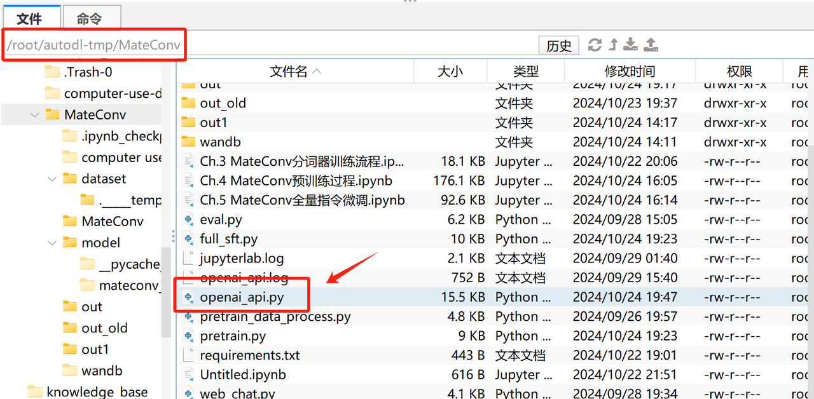

* 运行OpenAI API服务

然后在命令行中运行如下代码，以开启后端OpenAI API服务：

```bash
python openai_api.py
```


* OpenAI风格API调用MateConv

```python
from openai import OpenAI
```

```python
client = OpenAI(api_key="Key", 
                base_url="http://localhost:8000/v1")
```

```python
completion = client.chat.completions.create(
  model="MateConv",
  messages=[
    {"role": "user", "content": "你好，好久不见！"}
  ]
)
```

```python
completion
```

```plaintext
ChatCompletion(id='dc626ed170a841cf8269eda9e4a0a627', choices=[Choice(finish_reason='stop', index=0, logprobs=None, message=ChatCompletionMessage(content='您好！我很高兴能够与您交谈。您想聊些什么呢？', refusal=None, role='assistant', function_call=None, tool_calls=None))], created=1729771076, model='MateConv', object='chat.completion', service_tier=None, system_fingerprint=None, usage=None)
```

```python
completion.choices[0].message.content
```

```plaintext
'您好！我也很高兴能与您交流。有什么需要我做的吗？'
```

```python
completion = client.chat.completions.create(
  model="MateConv",
  messages=[
    {"role": "user", "content": "请问，什么是人工智能？"}
  ]
)
completion.choices[0].message.content
```

```plaintext
'人工智能是一种模拟人类智能的技术，它通过计算机程序和算法来实现自主学习、推理、识别语音和图像等能力。它可以对数据进行处理和分析，并根据已有的数据和经验进行推理和决策。在现代社会中，人工智能已经广泛应用于各个领域，如医疗、金融、交通、教育等。'
```

```python
completion = client.chat.completions.create(
  model="MateConv",
  messages=[
    {"role": "user", "content": "请问，什么是深度学习？"}
  ]
)
completion.choices[0].message.content
```

```plaintext
'深度学习是一种机器学习的方法，它使用神经网络来模拟人脑神经网络，从而实现对复杂数据的学习和模式识别。深度学习的核心思想是建立起层次的层次结构，这些层次结构可以分为多个层次，每个层次都包含多个神经元和权重。深度学习的核心思想是，通过多层次的非线性变换，让神经网络能够自动地从输入数据中学习，并在新数据上取得更好的分类和预测能力。'
```

* 创建基于前端的聊天机器人

  将web\_chat放在项目主目录下：

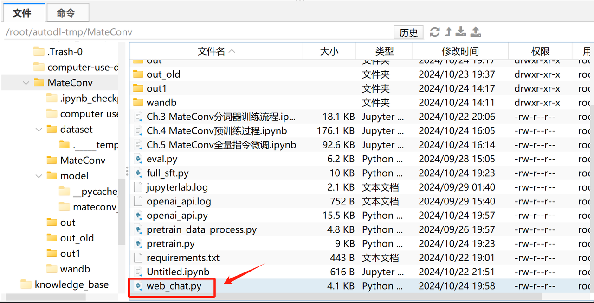

然后在命令行中运行：

```bash
streamlit run web_chat.py --server.port 8501
```


```bash
pip install streamlit
```

然后将8501映射到本地：

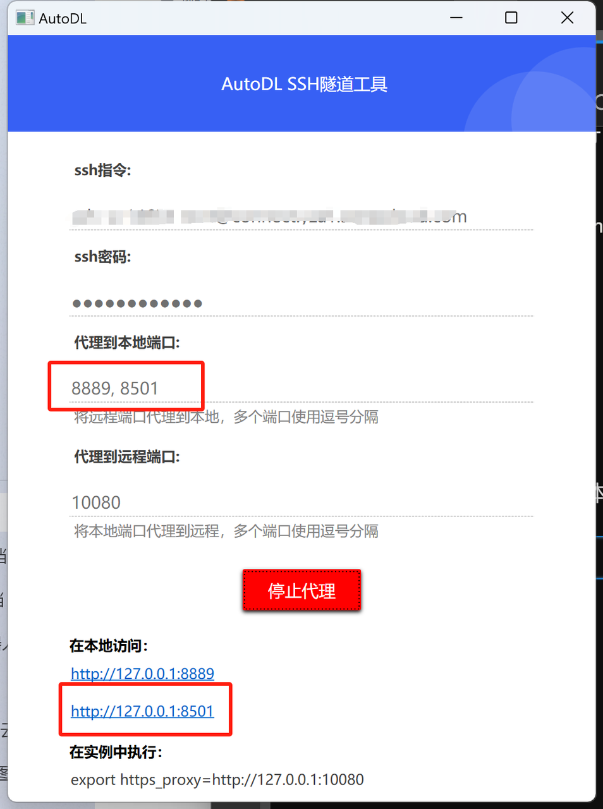

然后打开浏览器，即可在8501端口进行对话：


📍**更多大模型技术内容学习**

**扫码添加助理英英，回复“大模型”，了解更多大模型技术详情哦👇**


此外，**扫码回复“入群”**，即可加入**大模型技术社群：海量硬核独家技术`干货内容`+无门槛`技术交流`！**
